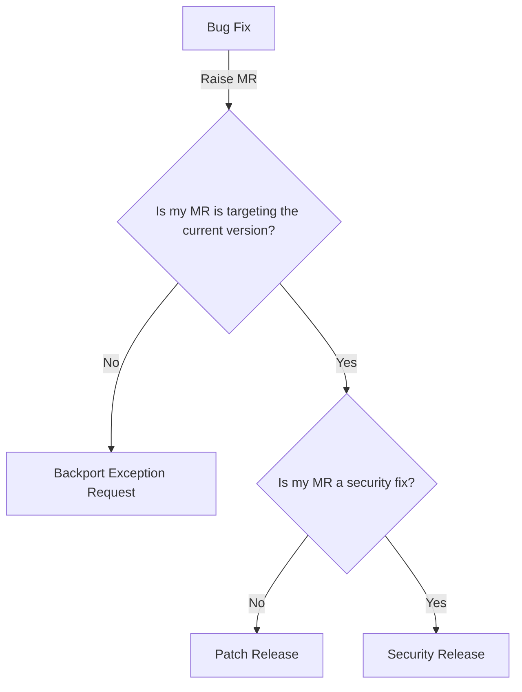

## Backports overview

This section seeks to remove confusion around backports at GitLab. Please raise an MR to this page or reach out to the [Delivery Group](/handbook/engineering/infrastructure/team/delivery) if you have questions. Also remember to check the [Backports FAQ](/handbook/engineering/releases/backports/#backports-faq)

### What kind of release do I need for my backport?

This flowchart can be used to guide you on what process you need. The ends of the flowchart are clickable links.

### Backport principles

- Backports are delivered according to the [Maintenance Policy](https://docs.gitlab.com/ee/policy/maintenance.html) and backport exceptions out of that policy are delivered on a best-effort basis and not guaranteed
- Release Managers have the final say on backports that are not covered by the maintenance policy
- Release Managers will schedule releases containing backports in a way that means customers are not given excessive amounts of upgrades

### Backport Process Overview

This section provides an overview of the end-to-end process.

Backporting is a multi-step process. Here we outline the basic steps to develop and deploy a backport: The list of steps below is indicative of the typical tasks involved in a backport, but is not all-inclusive and does not cover all eventualities.

1. Engineer identifies the issue within the software version that requires a patch or update.
1. Engineer determines what patches, updates or modifications are available to address this issue in later versions of the same software.
1. Engineer adapts the fix to be compatible with the older code version as required.
1. Engineer raises MRs required to add fix(es)
1. Engineer + Quality conduct robust testing to ensure that the backported code or backport package maintains full functionality within the system.
1. Engineer addresses any unwanted side effects identified in the previous step. Repeat as many times as necessary
1. Release Manager tags a new release containing the fixes
1. Release Manager creates an official release
1. Release Manager publishes the release under a new tagged version.

Backporting can be a very involved process requiring many cycles of back and forth for teams and individuals involved in the process.

### How do I know if my backport is covered by the maintenance policy?

You can check the [Maintenance Policy](https://docs.gitlab.com/ee/policy/maintenance.html) to see what is covered

### What if my backport is not covered by the maintenance policy?

If your backport is not covered by the maintenance policy then it is not guaranteed. However, we realize that there is sometimes a need to backport a fix to more than one stable release, depending on the severity of the bug. Backports that are outside of the maintenance policy are performed at the sole discretion of the [Release Managers](/handbook/engineering/infrastructure/team/delivery/#delivery-domain-ownership-between-delivery-teams) .

You can request a backport by:

1. Raising an MR to the stable branches that you want to backport to
1. Ensuring that the pipelines are green and no new issues are introduced
1. Raising a [backport request](https://gitlab.com/gitlab-org/release/tasks/-/issues/new?issuable_template=Backporting-request) in the [release/tasks](https://gitlab.com/gitlab-org/release/tasks) repository
1. PM DRI shares business impact analysis and justification for exception on backport request
1. Release Managers will accept or reject the backport request based on criteria including
    1. Estimated severity of the bug
    1. Estimated priority of the bug
    1. Potentially incurring data loss and/or security breach.
    1. Potentially affecting one or more strategic accounts due to a proven inability by the user to upgrade to the current stable version.
    1. Impact to other planned release tasks
1. Wait for confirmation and approval from the RMs
1. Communicate to your stakeholders if/when the release is available on our [releases blog](https://about.gitlab.com/releases/categories/releases/)

Please note that this is done on a case by case basis and not covered by any of our Maintenance Policies or releases.

## Backports FAQ

### What is a Backport?

Backporting is when a software fix or update is taken from a recent software version and applied to an older version of the same software.

This process can be as straightforward as updating several lines of code; it can also involve a major overhaul that is spread across multiple areas of the software requiring tight coordination. In the latter case, applying a backport may be impractical as compared to upgrading to the latest version of the software.

At GitLab, we backport security fixes and bug fixes according to the [Maintenance Policy](https://docs.gitlab.com/ee/policy/maintenance.html).

### Is that the same as a Patch Release?

No it’s not. Backporting is a catch-all term for any activity that applies updates or patches from a newer version of software to an older version. At GitLab we have a specific [Patch Release process](/handbook/engineering/releases/#patch-releases-overview) that is applied according to the [Maintenance Policy](https://docs.gitlab.com/ee/policy/maintenance.html). This is one of the release methods we use to ship self-managed, along with the security release and regular monthly release. There is a separate [exception process](https://docs.gitlab.com/ee/policy/maintenance.html#backporting-to-older-releases) for backports that are outside the scope of our maintenance policy and these are delivered on a best effort basis and not guaranteed.

### How do I get a backport for my bugfix/security issues?

If your backport is a bug fix and covered by the maintenance policy, please follow the [Patch Release Process](/handbook/engineering/releases/#patch-release-process).

If your backport is a security fix and covered by the maintenance policy, please follow the [Security Release Process](https://docs.gitlab.com/ee/policy/maintenance.html#security-releases).

For anything outside of the maintenance policy, please follow [the exception process](/handbook/engineering/releases/backports/#what-if-my-backport-is-not-covered-by-the-maintenance-policy)

### What should Product Managers consider when approving a backport?

Backports require multiple engineers to apply a fix through multiple versions and are time intensive. When reviewing a backport requrest, product managers should consult our [backport policy](https://docs.gitlab.com/ee/policy/maintenance.html#backporting-to-older-releases) to ensure that the backport proposal meets the criteria. Product managers should ensure that the severity, priority, customer impact and the potential risks associated with not backporting are properly documented before approval.

### Common Backporting Issues and Considerations

#### Additional Release Manager and User Capacity

Backports can be intensive and require many interactions between different groups to get right an deliver successfully. It is likely that a significant amount of time must be set aside to complete this process.

#### Long-term Support and Maintenance Costs

Backports can be an effective way to address security flaws and vulnerabilities in older versions of software. However, each backport introduces a fair amount of complexity within the system architecture and can be costly to maintain.

For example, Python 2.7.18 was the final official release of Python 2. In order to remain current with security patches and continue enjoying all of the new developments Python has to offer, organizations needed to upgrade to Python 3 or start freezing requirements and commit to legacy long-term support.

#### Backporting Side Effects

Each backport can create many unwanted side effects within the application environment. Just as an upstream software application affects all downstream applications, so too does a backport applied to the core software.

#### Additional Security Implications and Vulnerabilities

Backporting is a common technique to address a known bug within the IT environment. At the same time, relying on a legacy codebase introduces other potentially significant security implications for organizations. Relying on old or legacy code could result in introducing weaknesses or vulnerabilities in your environment. These issues affect not only the main application but also all dependent libraries and forked applications to public repositories. It is important to consider how each backport fits within the organization’s overall security strategy, as well as the IT architecture.
