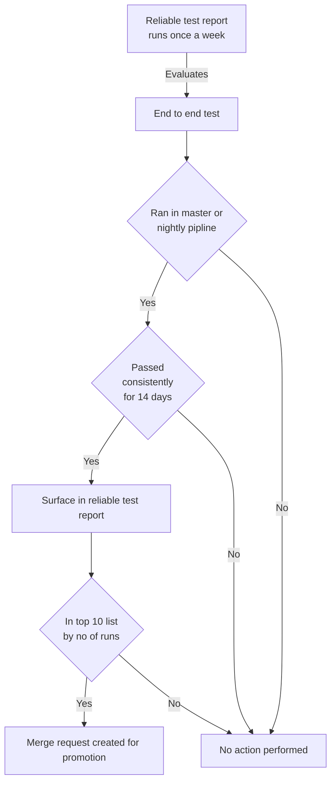
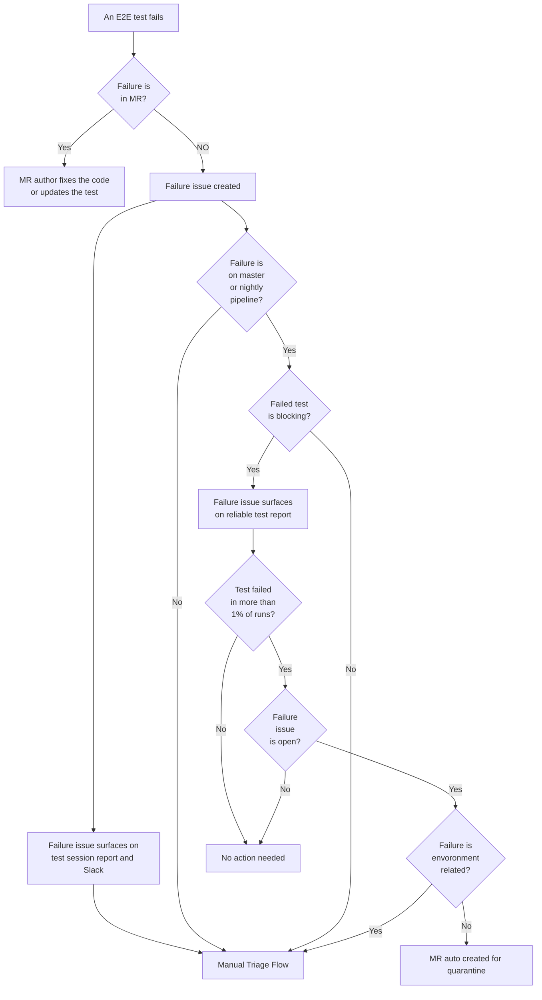

---

title: "Blocking end-to-end tests"
description: "This page describes the process and technical documentation around blocking end-to-end tests at GitLab.
Blocking tests are executed as a showstopper step in the release pipelines. Blocking tests are executed as a blocking step in MRs but not the deployments."
---

## Overview

GitLab's end-to-end tests for API and UI, located in `qa/qa/specs/features/`, can be promoted to:

- **Smoke Tests**: Essential for the release process, they are executed and can stop deployments from going further.
- **Blocking Tests**: Key to maintaining code quality in MRs, blocking on failure and mandatory passing for MR approval.

In the longer term, the `:blocking` bucket will be sunset. All the tests will be run as a blocking step in the MRs and
only smoke tests will be run during the release process.

### Defining a Blocking Test

- A `:blocking` test consistently succeeds in the master or nightly pipeline for at least 14 days.
- A blocking test is for MR quality control and not included in deployment pipelines.

## Promotion Processes

### To Blocking Suite

Tests are selected for promotion by a weekly automated script that uses the data produced by reliable test report. The automated script
is run once a week by a schedule named "Weekly reliable, unreliable E2E spec report" in the [quality/toolbox project](https://gitlab.com/gitlab-org/quality/toolbox/-/pipeline_schedules).

- Criteria: 14 consecutive days of success and top 10 in run frequency in master or nightly pipelines
- The process involves generating MRs for the top-performing tests and assigning them for review by counterpart SET for
  the DevOps stage of the test as a DRI.
- A test should ideally not be promoted manually without it being identified in the reliable test report. However, if a
  test has been identified in the reliable test report did not make it to the top 10 number of runs, it can be promoted
  by manually creating an MR.

The flow of promotion to blocking as a decision tree:

### Weekly Reliable Spec Report

This report plays a crucial role in managing the health of the test suite, highlighting:

- Specs passing consistently for 14 days in different pipelines. These tests are promoted to blocking.
- Blocking specs that failed in last 14 days. These tests are quarantined.

## Managing Test Failures

The flow of test failures as a decision tree:

### What happens when a blocking test fails?

Blocking test failures require immediate attention:

- **In MRs**: The author is responsible for addressing any bugs or updating the test.
- **In master or nightly pipeline**: Consistent failures trigger automatic quarantine.

Once a test is quarantined, the counterpart SET will be mentioned in a comment on the failure issue which will already be assigned to them.
It is the responsibility of the counterpart SET to either delegate the issue or fix and de-quarantine the test themselves.

If a test needs to be quarantined sooner than the next reliable test report run,
the [fast quarantine](/handbook/engineering/infrastructure/test-platform/debugging-qa-test-failures/#fast-quarantine)
process must be followed.

The `:blocking` tag cannot be removed from a test. Such a test can only be quarantined and de-quarantined.

## Execution Command

- **Blocking Tests**: `bin/qa Test::Instance::All http://localhost:3000 -- --tag blocking`

## Execution Schedule and Environments

- Executed in MRs and master in `gdk-qa-blocking` jobs for ongoing quality assurance.
- Also executed in `gdk-qa-blocking-ff-inverse` jobs in MRs that include feature flag changes to validate the tests in both feature flag states.

## Future Iterations

- Make reliable orchestrated tests block
- Automate the process of de-quarantining the tests that have been consistently
  passing. ([Issue link](https://gitlab.com/gitlab-org/quality/quality-engineering/team-tasks/-/issues/1918#phase-3-automate-de-quarantining-update-process-and-docs-okr))
  MR. ([Issue link](https://gitlab.com/gitlab-org/quality/quality-engineering/team-tasks/-/issues/2516))
- Once most of the tests have been promoted to the blocking, sunset the `:blocking` tag and make all tests block MRs. At
  this stage, any left over tests that weren't promoted should be
  quarantined. ([Issue link](https://gitlab.com/gitlab-org/quality/quality-engineering/team-tasks/-/issues/2498))
