---

title: "Cadence"
description: "Everything in a company happens in a certain cadence. The period of each cadence differs. Learn about the cadences we have at GitLab."
---

## Overview

Everything in a company happens in a certain cadence.
The period of each cadence differs.
The timescale between periods are about 4x, varying from 3x to 5x.
Below are the cadences we have at GitLab:

1. [30 years](#30-years) (3x 10 years)
1. [10 years](#10-years) (3.3x 3-years)
1. [3 years](#3-years) (3x year)
1. [Year](#year) (4x quarter)
1. [Quarter](#quarter) (3x month)
1. [Month](#month) (4.3x week)
1. [Week](#week)

Items on this page are grouped into a cadence based on the underlying period of time that the item pertains to, not based on when the item is updated. For example, our [strategy](/handbook/company/strategy/#three-year-strategy) looks three years out but is reviewed [annually by E-Group](/handbook/company/offsite/#offsite-topic-calendar) and may be updated more frequently if the need arises.

A overview of key company dates for FY25 can be found [here](https://docs.google.com/spreadsheets/d/11n44QyIVLD2rZwOnjLHlN1CvfmsVfFdyDfCK8qCLGM4/edit?usp=sharing)

### Cadence Examples

How elements of our cadence fit together over time:

1. [Our Mission](/handbook/company/mission) is to make it so that **everyone can contribute** by using our product, to our product, and to our company.
1. [Our Vision](/handbook/company/vision) is what we want the product to evolve into in the next 10 years, **AllOps** - a single application for DevSecOps, ModelOps, and a Servicedesk.
1. [Our Strategy](/handbook/company/strategy/) is what we'll focus on over the next 3 years in order to make progress towards our vision. Our strategy is to be the leading **DevSecOps Platform** by focusing on our three strategic pillars: Customer Results, Maturing the Platform, and Growing Careers.
1. [Our Yearlies](/handbook/company/yearlies/) are annual goals to make progress to our three year strategy. We have 3 goals per strategic pillar, for **9 goals** in total.
1. [Our OKRs](/handbook/company/okrs) are **quarterly objectives** to make progress towards the yearly goals. They have a hierarchy in them with which they flow from the CEO level to the level of teams.

How other elements relate to our cadence:

1. [Top Cross-Functional Initiatives](/handbook/company/top-cross-functional-initiatives/) typically last a year and should be closely aligned to the yearlies.
1. [Key Performance Indicators (KPIs)](/handbook/company/kpis/) are measures of performance for important things we do as a company all the time. If you want to change a KPI in a quarter this typically will be an OKR.
1. [Our Values](/handbook/values/) are the principles we follow in pursuing the items on this Cadence page but are not part of any cadence.

### Cadence Flow

Below is one example of how the cadence items in [cadence flow](#cadence-flow) fit together to illustrate how we will accomplish our longer term goals by successfully completing our shorter term goals.

1. One part of our [mission](/handbook/company/mission) is everyone can [contribute to GitLab, the application](/handbook/company/mission/#contribute-to-gitlab-application). By making innovation more accessible, we increase **user contributions to the product**, which creates results for a larger audience, which, in turn, allows more users to contribute to our product. This virtuous cycle drives a high rate of innovation for our product and allows more people to innovate and contribute.
1. One component necessary to achieve our [AllOps vision](/handbook/company/vision/) is improving [GitLab ServiceDesk](https://docs.gitlab.com/ee/user/project/service_desk/), which helps connect external parties to the software development process, allowing more people to contribute. ServiceDesk is needed to provide a complete **Value Stream Delivery overview**, which should help more people manage the flow of innovation from [idea to customers](https://about.gitlab.com/solutions/value-stream-management/#:~:text=new%20innovation%20from-,idea%20to%20customers,-.), which should lead to more teams and companies relying on GitLab as their AllOps solution.
1. One pillar of our [three year strategy](/handbook/company/strategy/#three-year-strategy) is [Customer Results](/handbook/company/strategy/#1-customer-results), which includes **Proving Value** with items like [Value Stream Analytics](https://about.gitlab.com/stages-devops-lifecycle/value-stream-analytics) to help a broader user base [like managers and executives](https://about.gitlab.com/direction/plan/value_stream_management/#who-are-we-focusing-on) deliver value and innovation. Proving value to a broader user base moves us closer to providing a complete Value Stream Delivery overview, creating progress towards our AllOps vision.
1. One of [our FY24 Yearlies](/handbook/company/yearlies/) is to `increase NetARR from Ultimate up-tiers` which we'll accomplish in part by providing more value to business users with features like [**Value Stream Dashboards for Executives**](https://gitlab.com/groups/gitlab-org/-/epics/9317). These features help extend [Value Stream Management](https://about.gitlab.com/solutions/value-stream-management/) and, by extension, create progress for our Customer Results strategic pillar.
1. One [FY24Q1 CEO objective](/handbook/company/okrs/fy24-q1/) is to `increase adoption through customer results to increase operating income` with a sub-key result of launching **Value Stream Dashboards** MVC 1 Beta in FY24-Q1.

Successfully achieving our KR of a beta value stream means progress against our Yearly value stream dashboard goal, strategic goal of extending value stream management to more users, vision of an AllOps solution, and mission of everyone contributing. While the KR is a single building block, our successful completion within the quarter leads to progress against our longer term goals.

## Update cadence

We have a cadence for reviewing our elements. Specifically, each element is reviewed at the cadence of the element that is the next level down. For example, we revisit our 3 year strategy every year. This maps to when we do annual Yearlies. And, we revisit our Yearlies every quarter. This is the timeframe for creating OKRs.

These reviews ensure that elements reflect current priorities and do not get stale. While we have set review times, we don't need to wait for an update cycle to capture changes that we have decided to make.

1. [30 year Mission](/handbook/company/mission): reviewed every 10 years
1. [10 year Vision](/handbook/company/vision): reviewed every 3 years
1. [3 year Strategy](/handbook/company/strategy/): reviewed every year
1. [Annual Yearlies](/handbook/company/yearlies/): reviewed every quarter. Review usually happens during the [E-Group Offsite](/handbook/company/offsite/)
1. [Quarterly OKRs](/handbook/company/okrs): reviewed every month

## 30 years

- [Our mission](/handbook/company/mission/)
- [Our purpose](/handbook/company/purpose/)
- [Lifespan of the average company](https://www.bbc.com/news/business-16611040), 10 years to get into the S&P500, then 15 in it, and 5 of decline for a total of 30
- [Lifespan of Amazon](https://www.forbes.com/sites/richardkestenbaum/2018/11/16/amazon-is-not-too-big-to-fail-bezos/#65fba0621626) "Amazon is not too big to fail...In fact, I predict one day Amazon will fail. Amazon will go bankrupt. If you look at large companies, their lifespans tend to be 30-plus years, not a hundred-plus years."
- [Generation is also 30 years](https://www.ncbi.nlm.nih.gov/pubmed/10677323)

## 10 years

- [Vision](/handbook/company/vision/)
- [Product vision](https://about.gitlab.com/direction/#vision)
- [Commitment of DZ](https://about.gitlab.com/blog/2021/11/10/a-special-farewell-from-gitlab-dmitriy-zaporozhets/)
- [Time needed for category creation](https://about.gitlab.com/blog/2023/08/30/origin-of-devsecops-platform-category/)

## 3 years

1. [Strategy](/handbook/company/strategy/)
1. [3-year product direction strategy](https://about.gitlab.com/direction/#3-year-strategy)
1. [Long range outlook](/handbook/finance/financial-planning-and-analysis/#long-range-outlook-lro)
1. [Restricted stock unit vesting](/handbook/total-rewards/stock-options/#vesting) after cliff of six months is passed
1. Average retention of team members is around 3 years

## Year

1. [Yearlies](/handbook/company/yearlies/) for setting annual company goals
1. [Annual plan](/handbook/finance/financial-planning-and-analysis/#plan)
1. [4 quarter rolling forecast](/handbook/finance/financial-planning-and-analysis/#quarterly-forecast-rolling-four-quarters)
1. Most of [Direction](https://about.gitlab.com/direction/)
1. [Fiscal Year Product Investment Themes](https://about.gitlab.com/direction/#fiscal-year-product-investment-themes)

## Quarter

1. [OKRs](/handbook/company/okrs/)
1. [Board meeting](/handbook/board-meetings/#board-meeting-process)
1. Sales targets (in [Clari](/handbook/business-technology/tech-stack/#clari))
1. [E-group offsite](/handbook/company/offsite/)
1. [GitLab Assembly](/handbook/company/gitlab-all-company-meetings/)
1. [Quarterly Kickoff](/handbook/ceo/office-of-the-ceo/#quarterly-kickoff)
1. [Earnings activities](/handbook/finance/investor-relations/)
1. [Key Reviews](/handbook/company/key-review/)
1. [Group Conversations](/handbook/company/group-conversations/)

## Month

1. [Release](https://about.gitlab.com/releases/)
1. [Retrospective](/handbook/communication/#kickoffs)
1. [Most KPIs](/handbook/company/kpis/)
1. [Monthly touchpoint meetings](/handbook/company/offsite/#monthly-touch-point-meetings)

## Week

1. [1-1 cadence with reports](/handbook/leadership/1-1/)
1. [E-Group Weekly](/handbook/company/e-group-weekly/)

## Gantt Chart

Below is a visual example of our cadence and is subject to change based on company and team schedules. Dates are approximate.

```mermaid
gantt
    title Year Overview
    dateFormat MM-DD
    axisFormat %b

    section Fiscal Year at a Glance
    FY starts                   :milestone, m1, 02-01, 1d
    Q1 Quarter Kickoff          :02-20, 1d
    GitLab Assembly             :03-15, 1d
    End of Q1                   :milestone, m2,04-30, 1d
    Q2 Quarter Kickoff          :05-15, 1d
    GitLab Assembly             :06-15, 1d
    End of Q2                   :milestone, m3,07-31, 1d
    Q3 Quarter Kickoff          :08-15, 1d
    GitLab Assembly             :09-15, 1d
    End of Q3                   :milestone, m4,10-31, 1d
    Q4 Quarter Kickoff          :11-15, 1d
    GitLab Assembly             :12-15, 1d
    End of Q4                   :milestone, m5,01-31, 1d

    section Finance Activities
    Start Q4 Earnings Prep      :01-26, 1d
    Long Range Outlook planning exercise :04-15, 90d
    Start Q1 Earnings Prep      :04-25, 1d
    Start Q2 Earnings Prep      :07-25, 1d
    Annual Plan Prep            :09-15, 135d
    Start Q3 Earnings Prep      :10-25, 1d

    section E Group Offsite
    January                     :01-05, 4d
    April                       :04-04, 4d
    June                        :06-04, 4d
    October                     :10-04, 4d

    section Board Meeting
    Prep led by CFO             :02-14, 21d
    March                       :03-18, 1d
    Prep led by CFO             :05-14, 21d
    June                        :06-17, 1d
    Prep led by CFO             :08-14, 21d
    September                   :09-15, 1d
    Prep led by CFO             :11-14, 21d
    December                    :12-14, 1d

    section Monthly Releases
    Release                     :milestone, m12,01-22, 1d
    Release                     :milestone, m1,02-22, 1d
    Release                     :milestone, m2,03-22, 1d
    Release                     :milestone, m3,04-22, 1d
    Major Release               :milestone, m4,05-22, 1d
    Release                     :milestone, m5,06-22, 1d
    Release                     :milestone, m6,07-22, 1d
    Release                     :milestone, m7,08-22, 1d
    Release                     :milestone, m8,09-22, 1d
    Release                     :milestone, m9,10-22, 1d
    Release                     :milestone, m10,11-22, 1d
    Release                     :milestone, m11,12-22, 1d

    section OKR
    OKR prep                    :01-01, 31d
    next FQ starts              :02-01, 1d
    OKR prep                    :03-15, 46d
    next FQ starts              :05-01, 1d
    OKR prep                    :06-15, 46d
    next FQ starts              :08-01, 1d
    OKR prep                    :08-15, 46d
    next FQ starts              :10-01, 1d
    OKR prep                    :12-15, 16d

    section Sales Key Dates
    SKO                         :02-13, 4d
    Q1 QBRs                     :02-04 5d
    Q2 QBRs                     :05-05, 5d
    Q3 QBRs                     :08-04, 5d
    Q4 QBRs                     :11-03, 5d

    section Compensation Review Cycle
    Audit Annual Compensation Review :02-01
    Canada Benefits Implementation :02-01
    Job Family Alignment         :03-01
    Compensation Philosophy Training :04-01
    Benefits Survey Released  :06-01
    Benefits Survey Results Analyzed :07-01
    Catch-up Compensation Review Manager Review :08-01
    Catch-up Compensation Review  :09-01
    Compensation Training         :10-01
    Performance Factor Review            :11-01
    Annual Comp Review Inputs Evaluated/Proposed to Compensation Group for next FY :12-01

    section People Dates
    DIB Survey                      :05-02, 14d
    Code of Conduct Acknowledgement :04-01, 30d
    360s                            :07-25, 60d
    Engagement Survey(estimated)    :05-16, 14d

    section Annual Mandated Compliance Reports
    California Pay Data Report      :01-03, 24d
    EEO-1 Report                    :01-03, 32d
    AAP                             :01-03, 116d
    Australia WGEA                  :03-13, 80d
    VETS-4212                       :05-01, 25d

    section Dates when Team Members are more likely to be OOO
    Popular Spring Break Periods    :03-04, 30d
    Easter Holidays                 :03-30, 9d
    Popular Summer Travel Periods   :07-01, 62d
    American Thanksgiving           :11-20, 9d
    Christmas and New Year Celebrations          :12-23, 9d
```

{}
