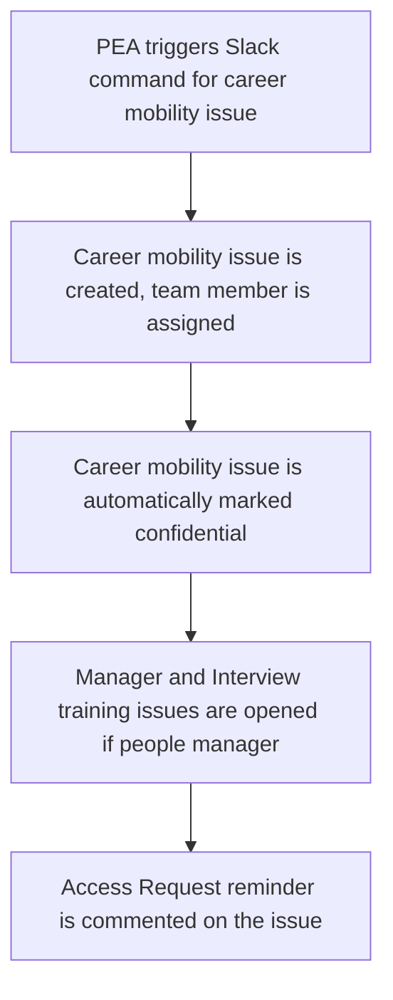

The People Group Engineering team aims to reduce as much manual work as possible. One of the areas we have done this, is everything related to the employment automation flow.

## Career Mobility

Note: this section only discusses items in the offboarding where People Engineering was involved. You can read more about promotions and transfers at GitLab on [this handbook page]()

## Timeline Flow

## Career Mobility issue creation

Once a People Connect Team member runs the career mobility command through Slack, this triggers a pipeline in the `employment` project, which will run the job `transition`, and reply with a link to the newly created Career Mobility issue.

The issue will be automatically assigned to the following people:

- People Connect Team member who ran the command
- the team member
- the previous manager of the team member
- the new manager of the team member
- the People Business Partner for the team member's department or division

This issue is then added to the [team member's epic](/handbook/people-group/engineering/employment-issues#epics).

## Make confidential

Sometimes, issues are created by humans instead of a bot, in this case they can forget to mark the issue as confidential. We run a daily pipeline to mark issues as confidential in the `training` project. This includes manager and interview training issues as the `employment` project is internal to GitLab team members anyway.

## Manager and Interview training issues

This is the same as the manager an interview training issues we create for onboarding. Except that for onboarding we only create it after day 7 and for career mobility we create it at the same time as the career mobility issue.

Read [here](/handbook/people-group/engineering/onboarding#manager-and-interview-training-issues)

## Access request reminders

A job is scheduled to run once per day to look for career mobility issues that have been opened for 5 days. If the team member for whom a career mobility issue was opened has not been mentioned in any access requests since their career mobility issue was opened, an note is created on the career mobility issue to remind the participants to create the necessary access requests.
