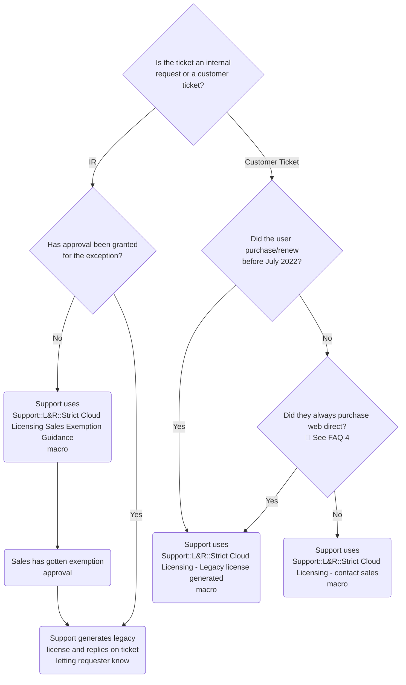

## Cloud Licensing Overview

[Cloud Licensing](https://about.gitlab.com/pricing/licensing-faq/cloud-licensing/) allows GitLab customers to activate paid subscription features on self-managed instances using an activation code, rather than managing license files and manually uploading them into their instance. By activating through Cloud Licensing, a customer's GitLab instance will periodically synchronize [Subscription Data](https://docs.gitlab.com/subscriptions/self_managed/#subscription-data-that-gitlab-receives) with GitLab.

In order to further encourage Cloud Licensing, the Strict Cloud Licensing project will include several iterations to encourage customers to use Cloud License activation codes rather than a Legacy License file to activate their self-managed instances. The following [GitLab internal licensing terms page](https://internal.gitlab.com/handbook/product/fulfillment/definitions/#licensing-terms) provides a technical definition of the current three types of licenses (Cloud Licensing, Offline and Legacy) associated with Cloud Licensing.

## Strict Cloud Licensing

**Effective July 7, 2022:** Cloud Licensing will be enabled by default for all new and renewal customers, as detailed in the [Strict Cloud Licensing roll out plan](https://gitlab.com/gitlab-org/gitlab/-/issues/351682) (except OSS, EDU or Start-Up products). Customers will no longer have the ability to download a license file from the Customers Portal. In addition, Offline licenses will now be available to allow customers with air-gapped or offline instances to receive the benefits of Cloud Licensing. In order to receive a Legacy License or Offline License, customers will need to follow the below outlined process.

### Strict Cloud Licensing Process

NOTE: This only applies to standard and resold customers.

## Cloud Licensing Exemptions

### Pre-Sale Exemption (Sales)

Customers who cannot activate with Cloud Licensing will need to obtain either an Offline Cloud License or a Legacy License. If this process is handled correctly at time of sale, no Support involvement is required.

By default, the `TurnOnCloudLicensing__c` flag in SFDC will be set to `Yes` on every quote during the sales cycle. If the Sales Rep wants to opt the customer out, they should update the quote field `[Cloud Lic] Add Cloud Licensing Opt Out` to either `Legacy License File` or `Offline License`. This in turn updates the value of `TurnOnCloudLicensing` to `No` or `Offline` respectively. Once the quote is submitted, Sales VP approval is required via the standard SFDC approval process. Once approved, the quote is synced to Zuora, which in turn creates and activates the subscription. In this scenario, the customer will receive their activation email with their license file attached and will also have the ability to download the license file from the [GitLab Customers portal](https://customers.gitlab.com/customers/sign_in).

### Post-Sale Exemptions (Support)

The Pre-Sale Exemption process is intended to be the **only means** of opt out, and should be used for all customers. However, there may be times where the account manager missed the opt-out during the sale, and the customer has now incorrectly received a Cloud License activation code they cannot use.

If a customer requires a Legacy License or an Offline License **post-sale**, the sales account manager must obtain Sales VP approval for a Cloud Licensing exemption. When approval is obtained and documented in SFDC **for each opportunity**, the account manager must then open a [Support Internal Request](https://support-super-form-gitlab-com-support-support-op-651f22e90ce6d7.gitlab.io/) **for each opportunity**. On the form, select either `GitLab Support Internal Request for Global customers` or `GitLab Support Internal Request for US Federal customers` and then `Self-Managed License Related (for paid customers only)` > `Cloud Licensing exemption`. Full instructions for the account manager [can be found in Highspot](https://gitlab.highspot.com/items/629a82af9092e7ac989947ca?lfrm=srp.0) (visible to Sales team only).

If the customer's subscription or trial/temp license has expired, and they require access during the approval process, the account manager must [open an Internal Request with Support](https://support-super-form-gitlab-com-support-support-op-651f22e90ce6d7.gitlab.io/). Use either the **GitLab Support Internal Requests for Global customers** or **GitLab Support Internal Requests for Federal customers** request option and then select **Extend an (almost) expired subscription** in the **Self Managed** section. The support engineer should [provide the customer with a trial license](/handbook/support/license-and-renewals/workflows/self-managed/trials/) until post-sales opt-out approval is received and handled in the related Internal Request.

#### How to process a Cloud Licensing exemption internal request

1. Click on the `Chattr with approval` link then:
    1. Verify the following:
        - The chatter is on a Salesforce **Opportunity** page.
        - The Opportunity is marked as `Closed-Won` (see [FAQ #5](#5-what-if-the-exemption-is-on-an-opportunity-that-is-not-closed-won) if it is not).
        - The chatter thread includes an **Approval** message.
        - The exemption approval is provided by a **VP**. Hover on the approver's name to see their title.
    1. If any of the above requirements are not met, let the requester know what should be corrected and then close the Internal Request. Otherwise proceed to step 2.
1. While on the Opportunity page, [find the related subscription details](#find-the-related-subscription-details)
1. Using the `Sold To Email`, search for the customer account in CustomersDot [Customers](https://customers.gitlab.com/admin/customer) page.
1. Click on the bookmark icon to navigate to the account's `Zuora Subscriptions` tab.
1. Confirm the subscription that should be updated by verifying the `Subscription Name` from step 2.
1. Go back to the IR ticket and note the `GitLab Version` value:
    - If the version < 15.0, set the `Cloud Licensing` flag value to `No`.
    - If the version >= 15.0, set the `Cloud Licensing` flag value to `Offline`.
1. Click `Update`.
1. Click the `Impersonate` tab.
1. Click `Copy license key to clipboard`. Using this method will ensure all license details are auto-populated correctly.
    - If you see `An error occurred...` message, try to click the `Copy license key to clipboard` once more.
    - If it fails again, check the logs for the issue or ask for assistance.
1. Click the `Back` button on your browser to stop impersonating the customer account.
1. Navigate to the [Licenses](https://customers.gitlab.com/admin/license) page.
1. Locate the new generated license:
    - The license should be one of the first licenses at the top.
    - If it is not, search for the license using the `Sold To Email` from step 2.
1. [Resend the license](/handbook/support/license-and-renewals/workflows/self-managed/sending_license_to_different_email)
because the automatically generated license does not trigger license email notification.
1. Reply to the IR ticket with a link to the license and mark the ticket as `Solved`.

##### Note

The matrix below defines the impact of setting the `Cloud Licensing` flag value to `Yes`, `Offline` or `No` on the eligibility of three license types.

| Cloud Licensing Flag value | Cloud License | Offline Cloud | Legacy License |
| ------ | ------ | ------ | ------  |
| Yes | Eligible | Not Eligible | Eligible |
| Offline | Eligible | Eligible | Not Eligible |
| No  | Eligible | Eligible | Eligible |

#### Find the related subscription details

There are a few ways to locate the subscription in a closed-won opportunity.
Refer to the alternative methods below for guidance on different cases.

##### Customer Subscription (CS-0000000000)

1. Scroll down on the Opportunity page to the `Subscription Information` section.
1. Click on the `Customer Subscription` value which has the format `CS-0000000000` to go to **Customer Subscription** page.
1. Click the `Current Zuora Subscription` value to go to the **Subscription** page.
1. Note the `Sold To Email` and the `Subscription Name` from the **Subscription** page.

##### Quote

1. Scroll down on the Opportunity page to the `Quotes` section.
1. Locate the most relevant Quote which has the `Status` as `Sent to Z-Billing`.
    - If **all** quotes have the `Status` as `New`, this indicates a web-direct purchase. For cases with **multiple** quotes that all have `Status` as `New`, use the quote that has been marked as `Primary`.
1. Open the quote.
    - If you encounter a `Content cannot be displayed...` error, try using the [Customer Subscription (CS-0000000000)](#customer-subscription-cs-0000000000) process instead or ask for assistance.
1. Note the Sold To contact's email:
    1. Scroll down to `Sold to Contact` in the quote details.
    1. Hover on the name which opens a contact modal then right click on the email and copy the email address
1. Note the Subscription Name:
    - Check the `Subscription Name` in the quote which is at the 4th row of the top section.
    - If it is empty, or does not show up in CustomersDot, find the subscription by locating the customer account using the Sold To contact's email and verifying the subscription seat count matches the quote you opened.

### Support FAQ

#### 1. Which license type should I provide for an approved opt out?

Knowing whether to provide an Offline or Legacy License will depend on the customer's specific scenario and what they request, but the following may be helpful:

- Offline licenses are preferred by GitLab over Legacy Licenses as they allow the customer to more easily provide usage data. These work best for customers who cannot use a Cloud License because their instance is air-gapped or not connected to the internet. However, in order to use an Offline Cloud License, the customer must be on 15.0 or higher.
- Legacy licenses can be sent when a customer is unwilling or unable to upgrade to GitLab version 14.1 or higher, or is concerned about sharing Subscription Data.

#### 2. Which workflow applies for reseller purchases?

For example: if a customer purchased after 2022-07-07 and needs a Legacy License, should we send them to their Account Manager to go through the exemption process, or do we treat them the same as web-direct and give them a Legacy License file, no questions asked?

Reseller customers should be directed to sales using the same exemption process as for sales-assisted purchases.

#### 3. Can multiple license types be active for one subscription?

For example: a customer would like to use a Legacy License on a dev instance after activating their production instance with a Cloud License activation code.

We can generate a legacy license in this situation, but only after an exemption has been approved. **Do not apply the exemption to the currently CL-enabled subscription.** Instead, generate a legacy license duplicate of the existing license.

Please see [this comment thread](https://gitlab.com/gitlab-org/fulfillment-meta/-/issues/610#note_1052615060) for greater context on this workaround.

#### 4. How do I tell if a purchase was web direct?

Check the `Created By` value of either (1) the invoices for the specific purchase in the customer's Zuora account (<https://www.zuora.com/apps/CustomerAccount.do?method=view&id=><ACCOUNT_ID>) or (2) the Subscription's Change History (<https://www.zuora.com/platform/subscriptions/><SUBSCRIPTION_ID>):

- Web direct: If it is the **Fulfillment API User** (`svc_zuora_fulfillment_int@gitlab.com` or `ruben_APIproduction@gitlab.com`).
- Not web direct: If it either the **SalesForce API User** (`svc_ZuoraSFDC_integration@gitlab.com`) or a GitLab team member's email (mostly it would be a Billing team member).

"New Business" web direct purchase opportunities in SFDC will often be created as `ACCOUNT-NAME - Web Direct`.  The **Initial Source** field will also be filled as "Web Direct".

- **Note:** A sales-assisted renewal or add-on may still reflect **Initial Source** as "web direct", so you can further confirm:

Web direct purchases also create a Quote in the customer's SalesForce account. However, the **Status** of the Quote is almost always `New`.

- For Sales assisted and reseller purchases, you can confirm the details of the successful purchase by checking the Quote in the customer's SalesForce account with its **Status** set to `Sent to Z-Billing`.

#### 5. What if the exemption is on an Opportunity that is NOT Closed-Won?

Cloud Licensing is **required** on a Closed-Won Opportunity because Support follows the Quote that has its `Status` as `Sent to Z-Billing` to confirm the license details that has been exempted.

- If the provided Opportunity is in an open stage, you can let the requester know they should use the [pre-sale opt out process](https://docs.google.com/presentation/d/1gbdHGCLTc0yis0VFyBBZkriMomNo8audr0u8XXTY2iI/edit#slide=id.g137e73c15b5_0_298) and then close the Internal Request as invalid.
- If the provided Opportunity is Closed Lost, you can let the requester know the Opportunity must be Closed Won and then close the Internal Request as invalid.

### How does Cloud Licensing impact customers who have purchased multi-year GitLab subscriptions?

- If an existing or new customer purchases a multi-year subscription and has Cloud Licensing enabled then the Cloud Activation Code they receive will be valid for the entirety of the subscription period.
- If an existing customer has already activated a subscription with an Activation Code then the customer will not have do anything, the license for the subscription will automatically update during the sync process.
- If an existing customer has not yet enabled/activated Cloud Licensing (TurnOnCloudLicensing set to Null) they can activate their instance with an Activation Code at any time
  - If an existing customer who previously was undecided (i.e. `Turn On Cloud Licensing` is set to `Null`) or opted out of Cloud Licensing (i.e. `Turn On Cloud Licensing` is set to `No` or `Offline`) wants to switch to Cloud Licensing, they will need to contact support. Support can generate and send the activation code in CustomerDot Admin as detailed in [post sales exemption support](#post-sale-exemptions-support).
  - Upon activation, the customer will receive a Cloud Activation Code which will be valid for the entirety subscription term

## Additional Resources

For more information on Cloud Licensing, please refer to the following resources:

1. [Cloud Licensing Internal Handbook Page](https://internal.gitlab.com/handbook/product/fulfillment/cloudlicensing/cloud-licensing/)
1. [Offline Cloud Licensing Internal Handbook Page](https://internal.gitlab.com/handbook/product/fulfillment/cloudlicensing/offline-cloud-licensing/)
1. [Cloud Licensing Field Team FAQ](https://docs.google.com/document/d/1C8kQlxvK2LFBsb3N6cvS8wXkqOw5cnAvuqy_4miUbYQ/edit)

Have a question that hasn't been answered in the documentation? Add it to our [Cloud Licensing AMA doc](https://docs.google.com/document/d/1f3RzLobMn2OaHNztXVU4Sr1qwsd2IQ-a6oKVctprggY/edit#) (internal only)!
