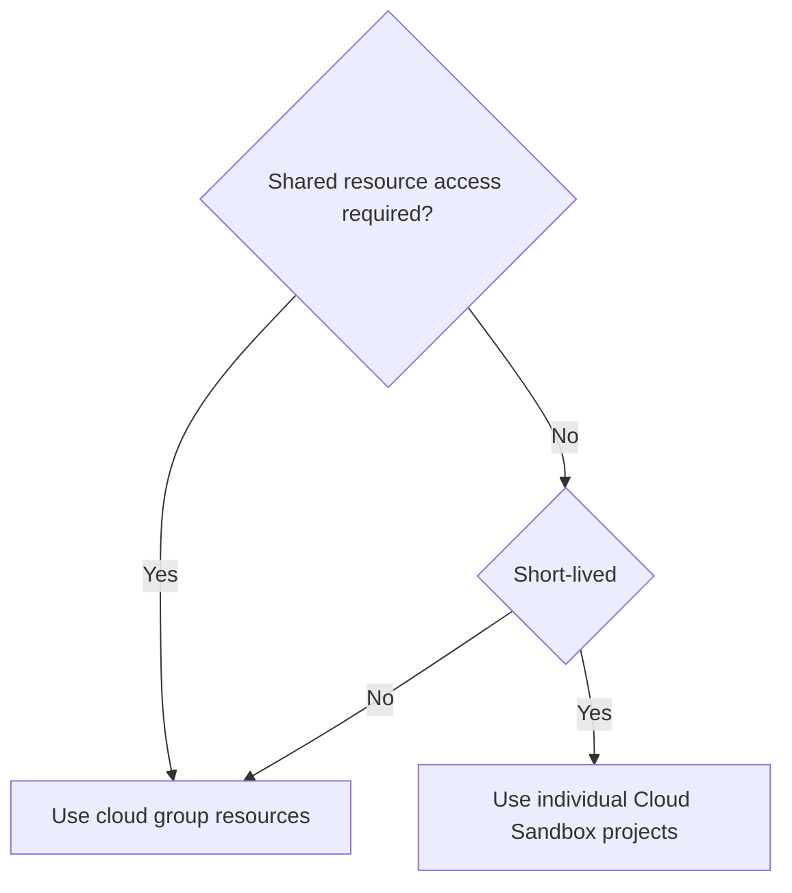

This page outlines cloud resources and workflows used by the Developer Relations team at GitLab. It provides guidance on managing and allocating resources effectively, ensuring that team members can leverage cloud infrastructure for community apps, demo projects, and contributor success tools while maintaining best practices for both long-term production environments and short-lived individual resources.

## Cloud Resources

### Google Cloud Resources

The Google Cloud project `group-community-a29572` is used for:

| Name | Type | Scope | Team | Resources | Notes |
|------|-------|------|------|-----------|-------|
| Community App (UTM, URL Shortener) | Service | Production | Developer Advocacy | EC2 VM, Cloud Run (router, QR code), SQL (API) | [handbook](/handbook/marketing/developer-relations/community-apps/) |
| Demo projects | Demos | Testing/Staging | Developer Advocacy | GKE clusters, VMs, DNS  | [handbook](/handbook/marketing/developer-relations/developer-advocacy/projects/#project-resources) |
| Contributors Success | Storage/Traffic | Production | Contributors Success | Storage | [GDK-in-a-box virtual images](https://gitlab.com/gitlab-org/gitlab-development-kit/-/blob/main/doc/gdk_in_a_box.md) |

When provisioned, you can access the project in the [Google Cloud Console](https://console.cloud.google.com/). Quick access:

1. [Compute Overview](https://console.cloud.google.com/compute/overview)
1. [Kubernetes Engine](https://console.cloud.google.com/kubernetes/list/overview)
1. [Cloud Run](https://console.cloud.google.com/run)
1. [SQL](https://console.cloud.google.com/sql/instances)
1. [Cloud Storage](https://console.cloud.google.com/storage/browser)
1. [IAM & Admin](https://console.cloud.google.com/iam-admin/iam)

Technical owners: @johncoghlan @dnsmichi

## Workflow

1. All Developer Relations team members can manage resources in Google Cloud in the [community-group project](https://console.cloud.google.com/kubernetes/list/overview?hl=en&project=group-community-a29572) using the `Editor` role.
   - This access is not provisioned by default. Create an [access request](/handbook/it/end-user-services/onboarding-access-requests/access-requests/) to add/remove team members (example: [group update AR](https://gitlab.com/gitlab-com/team-member-epics/access-requests/-/issues/13320)).
1. Google Cloud/AWS also allows to [register domains that are not trademarked](https://internal.gitlab.com/handbook/it/it-self-service/it-guides/domains-dns/#non-trademark-domain-names) (internal) and use the domains for demo setups.

### Demo environments

For customer facing demo environments, review the existing resources before creating new environments:

1. [Demo systems handbook](/handbook/customer-success/demo-systems/): [GitLab Learn Labs](https://gitlab.com/gitlab-learn-labs).
1. [Developer Advocacy content handbook](/handbook/marketing/developer-relations/developer-advocacy/content/): Product tours, click-through demos, workshops, etc.

### Long-term production environments

For demos that require debugging the deployments, prefer shared resources, for example in Google Cloud.

1. Document access in the 1Password vault if not available through SSO login.
1. Shutdown resources when not needed (for example, idle Kubernetes clusters).

### Individual short-lived resources

For individual short-lived tutorials or demo setups for a blog post, prefer the [Cloud Sandbox Realm](/handbook/company/infrastructure-standards/realms/sandbox/#how-to-get-started) for AWS or GCP. This provides automated shutdown, generated domains for easier access, etc.

### Decision workflow

