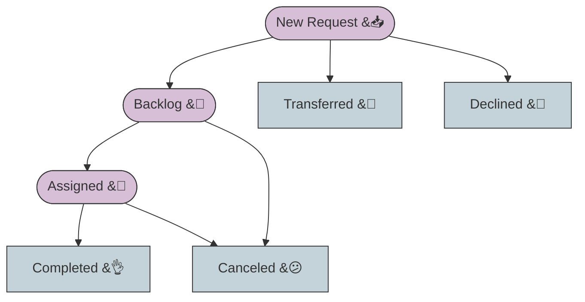
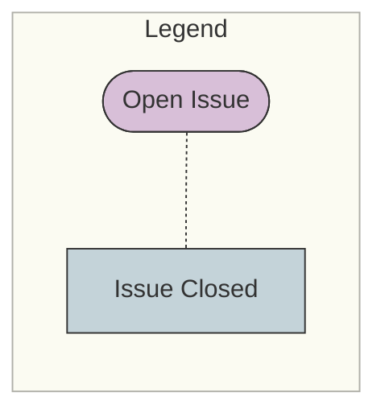
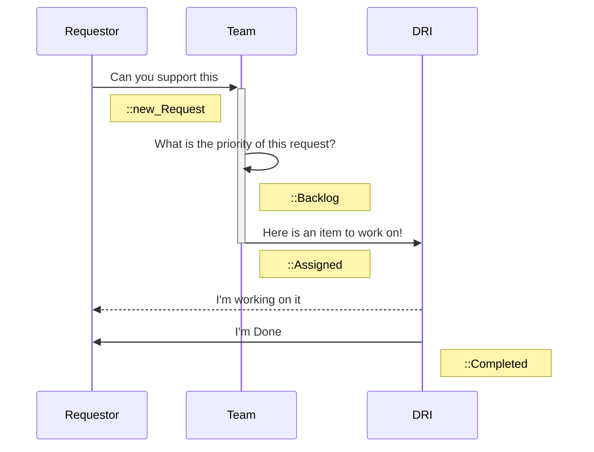



## Background

Teams and individuals are often asked / requested to work on multiple efforts, across the company.  For example,

- An event, needs booth branding or messaging
- A campaign, needs positioning/messaging and perhaps a gated white-paper
- A new whitepaper or infographic needs design input
- A campaign, needs a customer case study
- A team wants an analyst inquiry

While it is possible to use `issue assignments` or `labels` to track simple tasks and assignments, in an organization of scale, there are challenges.

1. Any individual can be `assigned` to an issue.  There no a built in mechanism to manage or moderate `assignment` of a person to work on an issue.

2. If `labels` are used to indicate a team is responsible for contributing to an issue, there is no current mechanism or process to manage adding a team `label` to an issue.

These two limitations make planning and managing a team's commitments to tasks and work a challenge.

## Solution - Commitment management

Use a project issue and workflow to consistently capture **requests** and manage **commitments**.   Effectively a simple and efficient `request-issue` that enables a request to be made, and a process to answer the request.

### Commitment Management overview

1. Simple `request` issue (defined by an `issue template`)
1. A simple set of predefined workflow steps (using GitLab scoped `::` labels)
1. The team/leadership that receives the `request` manages the process and takes action

### The typical actions/responses to a request

- a. **Backlog** - the request is acknowledged, but not actively worked right know
- b. **Assigned** - the request is accepted and someone from the team is DRI for the worked
- c. **Transferred** - the request has been shifted to a different team
- d. **Declined** - the request is not accepted
- e. **Canceled** - the request was canceled
- f. **Completed** - the request is done and delivered

#### The typical workflow for a request

### Labels define the process

There are two key labels that allow a team to define and manage the process:

1. A **project label** that tags all issues in the process for example
`sm_request` - is the **Product and Solution Marketing** label for **all** requests.   Need to explore the potential of these being common group level labels (shared across projects).

2. A set of scoped labels that define the workflow.  Here is the list of labels from the Product and Solution Marketing workflow:

- `sm_req::New`
- `sm_req::Backlog`
- `sm_req::Assigned`
- `sm_req::Completed`
- `sm_req::Declined`
- `sm_req::Transferred`
- `sm_req::Canceled`

Typically - you would replace the **"sm_"** with the team initials.

*Important Note:  Managing a process like this based on labels, can create overhead in keeping everything in the right status. Expecting everyone to memorize all labels and right steps might be a challenge. It is possible to **automate rules/policies** that will either **automatically close issues, add a label**, etc.*  [Learn how to automate label hygiene](/handbook/marketing/brand-and-product-marketing/product-and-solution-marketing/getting-started/105/)

### An Issue Template Starts the process

Using an [issue template](https://docs.gitlab.com/ee/user/project/description_templates.html) helps to consistently define the process and make it easy to get started.

- Issue Templates can also be **directly linked to via a URL** which makes it easy for a person requesting help to quickly open an issue template.

For example this URL will open a [Product and Solution Marketing Request](https://gitlab.com/gitlab-com/marketing/product-marketing/issues/new?issuable_template=A-SM-Support-Request):

- `https://gitlab.com/gitlab-com/marketing/product-marketing/issues/new?issuable_template=A-SM-Support-Request`
The key is the end of the URL `new?issuable_template=A-SM-Support-Request` which tells GitLab to open a specific template!

The issue template, both describes the information that is needed to understand and prioritize the work, but also includes [Quick Actions](https://docs.gitlab.com/ee/user/project/quick_actions.html) to assign specific labels.   At the bottom of the strategic marketing template there are the following quick actions to add labels:

`/label ~"sm_request" ~"Product and Solution Marketing" ~"sm_req::new_request" ~"mktg-status::plan"`

### How Commitment Management Works

1. A person leading a project, campaign, event, or whatever needs help from a team.
1. They open a request issue and provide the background
1. A **DAILY** Process - The team (leaders or the team in general) **triages the `New Requests`** and decides how to respond.  (`backlog`,`assigned`, `transferred`, `declined`)
1. When the request is actually assigned to a team member, the label `req::assigned` is applied **and** the individual is assigned to the request issue.
1. The assigned individual does the work. (*Either in the request issue, or in the project where the request originated - depending on what makes the most sense.*)
1. When the work is done, the issue is labeled `req::completed`
(the SM Triage Bot automatically closes completed issues)

## Guidelines

### To manage commitment, use a commitment tracking issue

**Just adding a label or tagging another person is NOT the same as a commitment!**

1. Create a commitment tracking process (scoped labels, issue template, and team processes)
2. Apply the process to capture and manage the team's work.  As a principle - if there isn't an **accepted and assigned** request issue, then there isn't a commitment.
3. Manage requests, build and curate a backlog, assign and deliver work.
