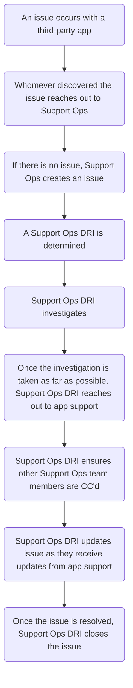

Our Zendesk instances use many third-party applications to help agents in their
day-to-day tasks. Sometimes, we encounter issues specific to these the
third-party applications that cannot be fully resolved by Support Ops. In such
scenarios, the Support Ops team will need to contact the application's support
system.

## Process

1. The agent or a Support Ops team member will create an issue in the
   [Support Ops Project](https://gitlab.com/gitlab-com/support/support-ops/support-ops-project).
1. The Support Ops DRI will then triage and investigate the issue at hand,
   which may include collecting items such as HAR files, Browser versions, and
   plugins.
1. The Support Ops DRI will open a ticket with the third-party app's support
   system, providing detailed information.
   - Always make sure to CC other Support Ops team members, especially a
     Support Ops Manager
1. The Support Ops DRI will update all the responses received from the
   third-party app's support team in the issue till the issue is fixed.

## Flowchart

