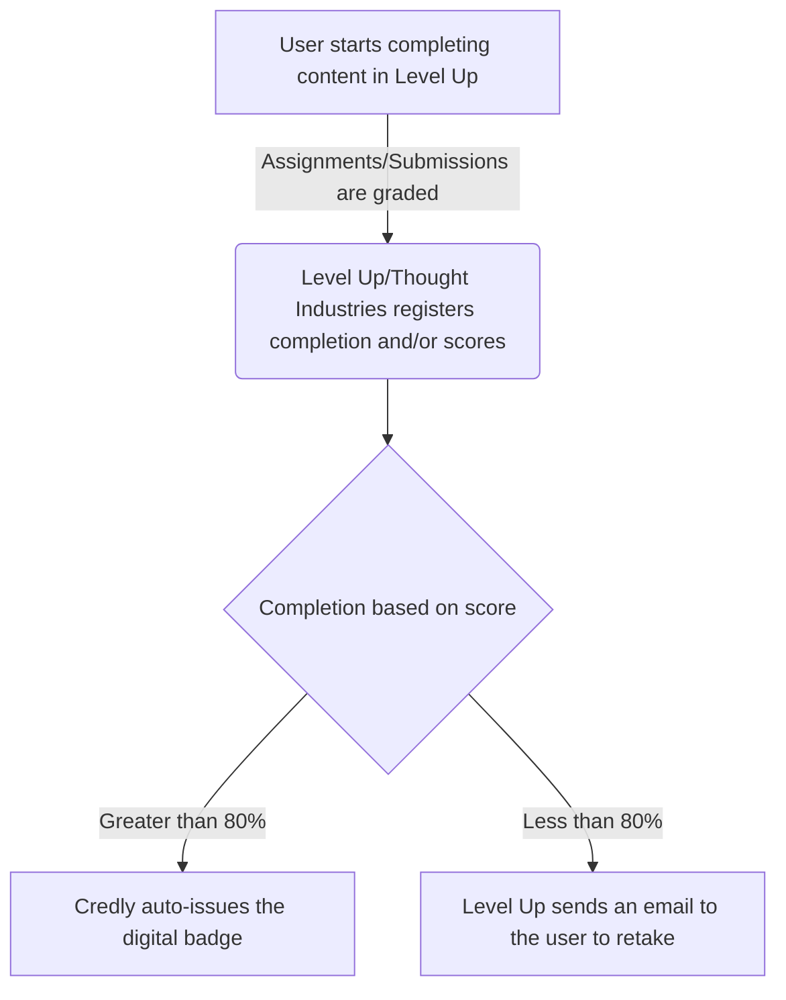
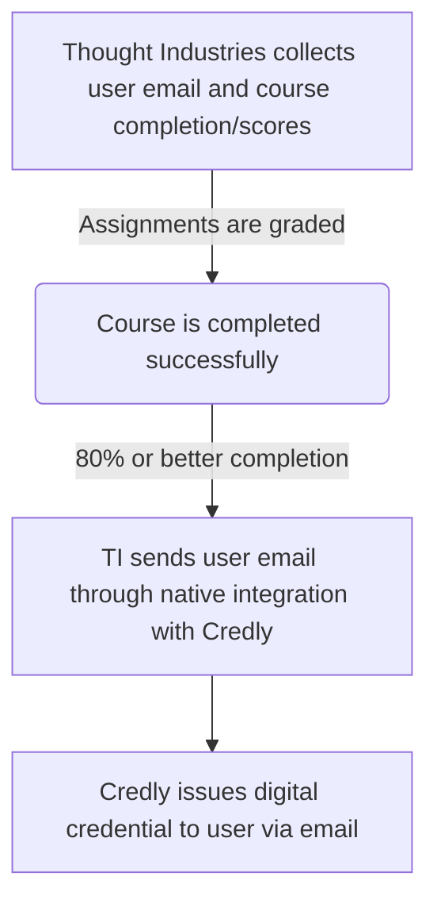

The Tech Stack single source of truth is the [Tech Stack YAML](https://gitlab.com/gitlab-com/www-gitlab-com/-/blob/master/data/tech_stack.yml) and contains more detail about this app.

{}

### Implementation

The Implementation of this system took place in May/June of 2022 as all digital badges were switched from our previous system Badgr to Credly.

### System Diagram

The Credly digital credentialing system is a SaaS app and is integrated with the [Thought Industries LMS](https://gitlab.com/gitlab-com/www-gitlab-com/-/blob/master/data/tech_stack.yml).

### Data Model

The Data Model is as follows:

### Integrations

The Credly digital credentialing system is a SaaS app and is integrated with the [Thought Industries LMS](https://gitlab.com/gitlab-com/www-gitlab-com/-/blob/master/data/tech_stack.yml).

### Key Reports / Dashboards

All Dashboards and Reports are a part of the system itself. No separate Sisense reports are available or planned.

### Support Guides and Step by Step Articles

The [Credly Support page](https://credlyissuer.zendesk.com/hc/en-us) offers a docs website with full articles on processes and step by step guides on using the system.
