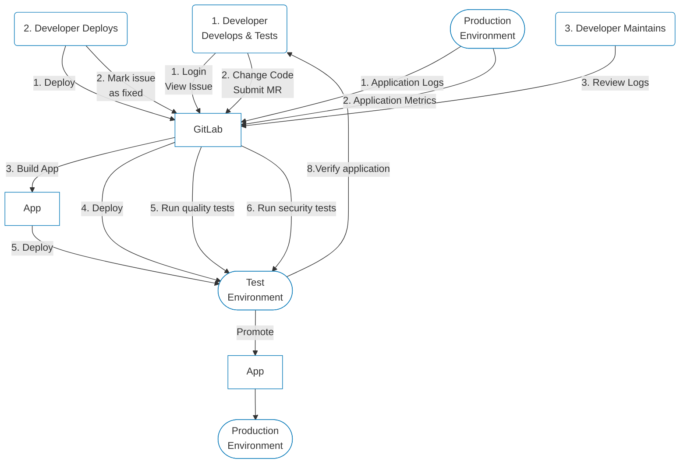

How does having one application vs many applications impact workflow?

The data flows below are based on the experience of one enterprise customer who switched from multiple DevOps tools to GitLab.

The source data can be found in this [spreadsheet](https://docs.google.com/spreadsheets/d/1yui5UYY46HQ-KcwTCZ-8OXXQylBpxvEYk_QZW3qabAk/edit#gid=0).

## GitLab

## Multiple DevOps Tools

