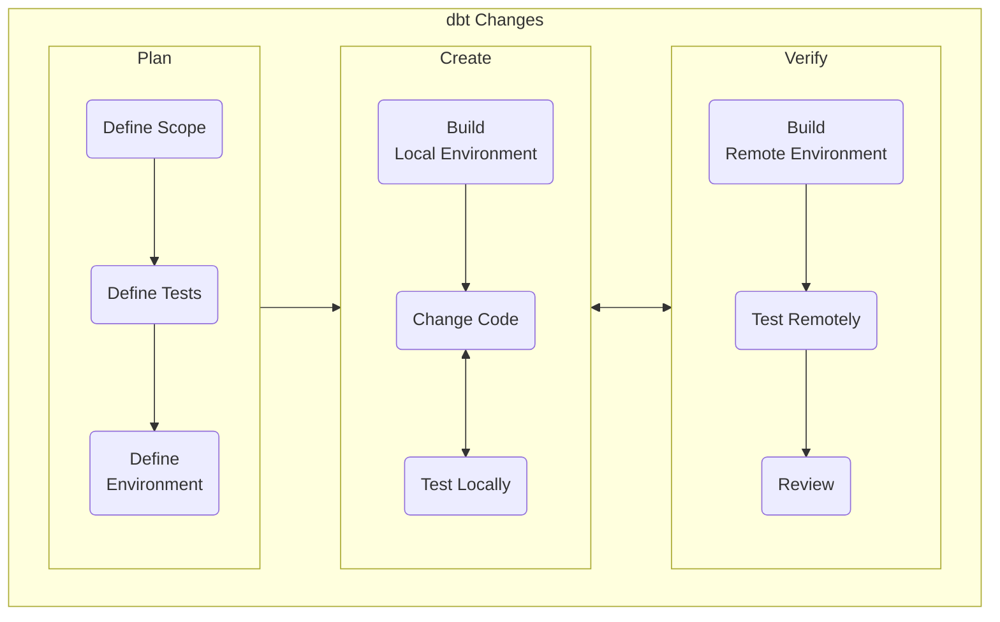
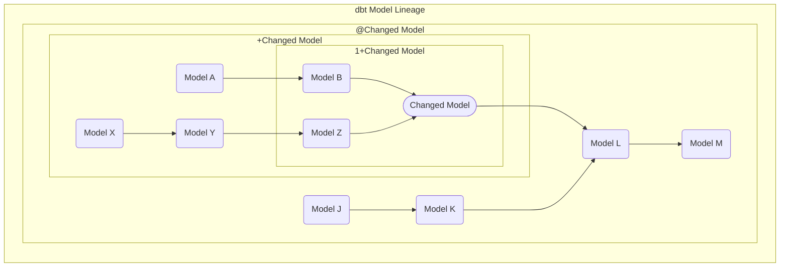

---

## dbt Change Workflow Summary

To facilitate high quality and confidence in changes to dbt models and documentation, the following workflow has been established. Following this workflow provides developers and reviewers with the information needed to successfully complete their tasks. It leans on the DevOps framework as well as Test-Driven Development principles to give developers and reviewers information and structure to the dbt change process.



1. Plan - This stage defines how development and reviews will take place. The output of this stage is a Merge Request filled out with a plan to guide subsequent stages.

    1. Define Scope - This step describes the changes that will be made. Details can be deferred to an issue or epic.

    1. Define Tests - This step defines how the change will be checked.

    1. Define Environment - This step defines the models that will be used to develop and check the changes.

1. Create - This stage is where code changes take place. The code changes are then validated using tests defined during the Plan stage. The output of this stage is a set of developer-verified code changes, as defined by the plan.

    1. Build Local Environment - Using the environment defined in the plan, tables are loaded in the developer's local database.

    1. Change Code - Using the planned scope, changes are made to the code.

    1. Test Locally - Using the tests defined during planning, the changes are verified and validated.

1. Verify - This stage is where the completed changes are validated in a deployment-like environment and reviewed by other qualified developers.  The output of this stage is code changes and test results that have been reviewed and approved.

    1. Build Remote Environment - Using the environment defined in the plan, tables are loaded in a remote database.

    1. Test Remotely - Using the tests defined during planning, the changes are verified and validated.

    1. Review - The results of the remote testing are compared against the scope and tests defined in the plan to assure quality of the suggested code changes.

## Determining Degree of Testing and Review

As this workflow is given as a general process, depending on the complexity of the changes being made and the location of where the changes are may result in a higher or lower degree of testing and review at any given step.  The degree of testing and review should be determined during planning by the developer so that the correct amount of effort is placed into each step.

The first step in determining the degree of testing and review is identifying the location of the changes which will proved a minimum degree of testing and review.  From there the type, volume, and impact of the change will need to be considered to determine the final degree of testing and review.

### Location Testing and Review Categories

- High
  - The Enterprise Dimensional Model (PROD.COMMON_*)
  - Key Performance Indicator Reporting (e.g. mart_arr)
- Medium
  - Legacy models
  - Source models
  - Preparation models
- Low
  - Workspace Models (e.g. PROD.WORKSPACE_SALES.*)

### Changes Testing and Review Categories

- High
  - Integrating new source data into existing models
  - Changing a model that is referenced by many other models
- Medium
  - Adding models for a new data source
- Low
  - Changing a column name
  - Updating documentation

## dbt Change Workflow Details

### Define Scope

The scope serves as context for the changes to be made, and it aids the developer and the reviewers in understanding the intent of the change.  Changes to table and view models, and their documentation, are considered typical. Any other changes may require special testing or processing, and should be identified during the planning process. The list below identifies known atypical changes and the changes or exceptions related to those types of changes:

- changes to macros
  - Requires that models that use the macro be tested even if the models are not directly changed.
- changes to incremental models
  - Requires that the model be configured for schema changes or full refreshed after the changes are merged.  Note that performing a manual full refresh may collide with orchestrated executions of dbt and as such a manual refresh should only be performed after the orchestrated execution of the models.
- changes to seeds
  - Requires that the loading of the seed file be explicitly, using a full refresh, performed as part of the testing.
- changes to snapshots
  - Requires that changes are all tested in the remote environment.
- changes to project configuration
  - Requires that a model be tested to ensure that the project compiles.
- changes to documentation only
  - Requires that a model be tested to ensure that the project compiles.
- changes to workspace models
  - Only requires base level component testing

### Define Tests

Before changes are made to the code, the tests needed to check that the changes have the intended impact are to be developed first.  This follows software development principles of Test Driven Development and will aid the developer in outlining what changes need to be made and how those changes will be evaluated as successful.  To aid in communication, tests can be categorized into several types:

- Component Tests
- Integration Tests
- System Tests
- Acceptance Tests

#### Component Tests

Component tests check that the each model changed correctly builds independently of other models. At a minimum, any model with a change needs to be executed after the changes are made to ensure that the code compiles and executes without error, this is the most basic component test.  Other expected component tests when building tables in the database include testing for uniqueness within the table and nulls in specified columns. Other component tests may include: testing the addition or removal of a column, testing the change to or addition of filters, or testing the addition or removal of business logic. A description of the types of component tests that will performed on the changed models is a required part of the Plan stage, however a detailed list of every component test that will be used is not needed.

#### Integration Tests

Integration tests check that a changed model does not negatively impact the operation of any other model. Any model that depends on a changed model should be built and component tests executed as part of the integration testing of a changed model. However, when the expected sequential build time of all of the dependent models is excessively long, more than and hour of run time, then a subset of the dependent models can be selected. When selecting a subset of models, the longest or most critical path should be selected while minimizing the sequential build time. Additionally, if the changes are net new, such as adding a new column, then integration tests can be omitted with the following exceptions:

- A downstream model is configured to be incremental and not configured to append_new_column or sync_all_columns when the schema changes

All incremental downstream models of a change model that would need to be refreshed to prevent an error at run time can be found using the following dbt command:

```console
dbt list -s <changed model>+,config.materialized:incremental --output name --resource-type model --exclude config.on_schema_change:sync_all_columns config.on_schema_change:append_new_columns
```

All downstream models of a changed model can be found using the following dbt command:

```console
dbt list -s <changed model>+ --output name --resource-type model
```

#### System Tests

System tests check the output of changed models against the output of existing models.  Basic system tests may include comparing row counts of the changed and current version of the model.

A basic system test to compare the output of the development table with the production table might look like this:

```sql

WITH compare AS (
  SELECT *
  FROM database.schema.table

  MINUS

  SELECT *
  FROM <branch_name>_database.schema.table
)

SELECT COUNT(*) from compare

```

#### Acceptance Tests

Acceptance tests can be defined by Stakeholders or Subject Matter Experts and will be aimed at validating that the changes are meeting the needs of the users of the resultant models.

### Define Environment

To correctly construct and test the models that will be changed, or models affected by the changes, many models may be necessary. These models can be classified as environment models or build models, and a full list of all models needed is required for the Plan stage.

#### Environment Models

Environment models are those needed to build or test the models changed or affected by the changes. Once these models have been created within the appropriate environment, via a clone or construction, they do not need to be updated during the development process. A dbt list command that will include all of the environment models is a required part of the Plan stage.

Example commands:

- [`1+<changed model>`](https://docs.getdbt.com/reference/node-selection/graph-operators#the-n-plus-operator) Includes changed model and the models that come immediately before the changed model.
  - Recommended for simple or direct changes with low to no integration testing.
- [`+<change model>`](https://docs.getdbt.com/reference/node-selection/graph-operators#the-plus-operator) Includes the changed model and the models that come before the changed model.
  - Recommended when making significant changes to a full chain of models with low amounts of integration testing.
- [`@<changed model>`](https://docs.getdbt.com/reference/node-selection/graph-operators#the-at-operator) Includes the changed model, all of the models that come before the changed model, all of the models that come after the changed model, and all of the models that come before the models that come after the changed model.
  - Recommended for used with extensive integration testing as it will ensure that the relevant models are available to reference during testing.



#### Build Models

Models that will be reconstructed as part of building or testing changes are classified as build models. These models contain the code changes or are models affected by the code changes and will need to be re-created multiple times during the development process.

### Prepare Local Environment

Using the environment defined during the planning, construct the local development environment using the following steps:

1. Clean local database tables by dropping all schemas found with in the `<user_name>_PREP` and `<user_name>_PROD`.  This will ensure that the data used for testing is only the data added recently.  This can be done through the Snowsight UI or using a SQL command and query details can be found in the [Snowflake Dev Clean Up](https://gitlab.com/gitlab-data/runbooks/-/blob/main/Snowflake/snowflake_dev_clean_up.md) runbook.
1. Using the environment models command, [clone](/handbook/enterprise-data/platform/dbt-guide/#cloning-into-local-user-db) tables necessary for development and testing.  This ensures that the data is up to date, and cloning the tables is more efficient than rebuilding the tables from the source data.
    - The clone job will not clone under the following conditions. Any models meeting those conditions must be included in the subsequent build steps:
      - The table is new
      - The table has a new name
      - The table is an external table
      - The table is a partition other than the current partition
1. If the build models require more 10 minutes to build on an XL warehouse then the environment models directly used for the build models should be [sampled](/handbook/enterprise-data/platform/dbt-guide/#sample-data-in-development). Sampling the data will improved the build time and increase the iterations that can be performed during development.

### Change Code

The Change Code step is where any draft changes are translated into language and format used in the code repository.  The process starts with documentation, keeping with the spirit of Handbook First, and iterates through the Test Change Locally step until the changes pass the tests added in the documentation and the target changes are effected.  As part of this step the [SQL style](/handbook/enterprise-data/platform/sql-style-guide/) guide and [linter](/handbook/enterprise-data/platform/sql-style-guide/#sqlfluff) must be used so that there is a consistent form and feel to all of the SQL used in the dbt code base.

### Test Changes Locally

Test all components, integrations, and system tests locally to ensure that the changes have been implemented as planned. Any test failure requires an iteration cycle with the change code step until all tests pass. If the data was sampled, the sampling does not need to be removed for this stage of testing and is left to the discretion of the developer to determine if testing on the full data is needed.  Using the `build` command, instead of separate `run` and `test` commands, during development will efficiently run inbuilt component and integration tests and is recommend best practice.

### Prepare Remote Environment

To ensure an isolated environment, documentation of results, and to improve collaboration during reviews, all tests must be run in a remote environment. Using the environment defined during planning, construct the remote environment using the provided CI Jobs.

1. Using the environment models command, [clone](/handbook/enterprise-data/platform/ci-jobs/#%EF%B8%8Fclone_model_dbt_select) tables necessary for development and testing.
    - If the environment models command only contains models with direct changes and their ancestors, then the [`run_changed_models_sql`](/handbook/enterprise-data/platform/ci-jobs/#%EF%B8%8Frun_changed_%EF%B8%8Fclone_model_dbt_select) CI job can be used.
    - The clone job will not clone under the following conditions. Any models meeting those conditions must be included in the subsequent build steps:
      - The table is new
      - The table has a new name
      - The table is an external table
      - The table is a partition other than the current partition

### Test Changes Remotely

Test all components, integrations, and system tests remotely to ensure that the changes have been implemented as planned. Any test failure requires an iteration cycle with the Change Code step until all tests pass.

1. Using the build models command from the defined environment build the changed models.  This will build the changed models and perform any tests that have been included with the changes.
   - This can be performed with one of the [`specify_model`](/handbook/enterprise-data/platform/ci-jobs/#specify_model) CI Jobs.  If the build command only contains models with direct changes then one of the [`run_changed_models_sql`](/handbook/enterprise-data/platform/ci-jobs/#%EF%B8%8Frun_changed_models_sql) CI jobs can be used.
   - If the changed models are incremental models, the models run more than one hour on a full refresh, and a full refresh does not need to be explicitly tested then the full refresh overridden should be used by adding the `REFRESH =` [variable](/handbook/enterprise-data/platform/ci-jobs/#%EF%B8%8F-dbt-run).
1. Use the [run_grants](/handbook/enterprise-data/platform/ci-jobs/#run_grants) CI job, to grant permissions to yourself and run any remaining components, integrations, and system tests on the build models, adding the results of the tests to the MR.
    - If the table is new then the grant_clones job will not be able to grant access the table. In this case documentation of local tests are required for verification and validation.

### Reviews

All need to be reviewed for accuracy of the code changes and there effects as well as compliance to our standards and practices.  While not every review will be needed for every change and individuals can perform multiple reviews simultaneously, a Code Owner Review and a Maintainer Review will always be required for each change.

- Accuracy and Effects
  - Stakeholder Review
  - Subject Matter Expert Review
  - Code Owner Review
- Compliance
  - Maintainer Review

### Example

An example of how this workflow can be used can be seen in MR [8476](https://gitlab.com/gitlab-data/analytics/-/merge_requests/8476) where columns were renamed for a single table.

#### Plan

##### Scope

Update the output column names to match the end user needs.

##### Tests

In addition to testing for uniqueness the column names will be checked to ensure that they match the requested column name.

##### Environment

The planned changes need the following models to properly build and test the changes:

- pump_disaster_relief_fund
- employee_directory

Environment

```console
dbt list 1+pump_disaster_relief_fund
```

Build

```console
dbt list pump_disaster_relief_fund
```

#### Create

##### Build Local Environment

The following command was used to build the local environment

```console
make DBT_MODELS="1+pump_disaster_relief_fund" clone-dbt-select-local-user
```

Resulting in the `"PEMPEY_PREP"."SENSITIVE"."EMPLOYEE_DIRECTORY"` and `"PEMPEY_PROD"."PUMPS_SENSITIVE"."PUMP_DISASTER_RELIEF_FUND"` being created

##### Change Code

While making the changes the following command was used to build and test the changes

```console
dbt build -s pump_disaster_relief_fund
```

Resulting in the `PEMPEY_PROD.pumps_sensitive.pump_disaster_relief_fund` being build and the `dbt_utils_unique_combination_of_columns_pump_disaster_relief_fund_Employeenumber__Action__True` test begin executed.

##### Test Locally

In addition to the built in tests the following queries were used to test the changes.

<details>

<summary>SQL</summary>

```sql
SET query_id = (
  SELECT QUERY_ID
  FROM snowflake.account_usage.query_history
  WHERE true
  and QUERY_TEXT = 'SHOW COLUMNS IN pempey_prod.pumps_sensitive.pump_disaster_relief_fund'
  AND start_time > current_date()
  ORDER BY START_TIME DESC
  LIMIT 1
);

SELECT $query_id
--

SELECT count(*) = 6
FROM TABLE (RESULT_SCAN($query_id)) --
WHERE true
AND "column_name" IN ('Fund','Firstname','Lastname','Employeenumber','Email','Action')


-- Integration Test

-- None

-- System Test

WITH compare AS (
  SELECT *
  FROM prod.pumps_sensitive.pump_disaster_relief_fund

  MINUS

  SELECT *
  FROM pempey_prod.pumps_sensitive.pump_disaster_relief_fund
)

SELECT count(*) from compare

```

</details>

#### Verify

##### Build Remote Environment

The `clone_model_dbt_select` job was used with the `DBT_MODELS = 1+pump_disaster_relief_fund` variables to build the environment.

##### Test Remotely

1. First the `specify_model` job was used with the `DBT_MODELS = pump_disaster_relief_fund` variables to build and test the changes.
1. Second the `grant_clones` job was used with the `GRANT_TO_ROLE = PEMPEY` variable to grant query access to the changes.
1. Third the following queries were executed and the results added to the MR:

<details markdown="1">

<summary>SQL</summary>

```sql

SET query_id = (
  SELECT QUERY_ID
  FROM snowflake.account_usage.query_history
  WHERE true
  and QUERY_TEXT = 'SHOW COLUMNS IN 17086-ADJUST-COLUMN-NAMES-FOR-E4E-RELIEF-FILE_PROD.pumps_sensitive.pump_disaster_relief_fund'
  AND start_time > current_date()
  ORDER BY START_TIME DESC
  LIMIT 1
);

SELECT $query_id
--

SELECT count(*) = 6
FROM TABLE (RESULT_SCAN($query_id)) --
WHERE true
AND "column_name" IN ('Fund','Firstname','Lastname','Employeenumber','Email','Action')


-- Integration Test

-- None

-- System Test

WITH compare AS (
  SELECT *
  FROM prod.pumps_sensitive.pump_disaster_relief_fund

  MINUS

  SELECT *
  FROM 17086-ADJUST-COLUMN-NAMES-FOR-E4E-RELIEF-FILE_PROD.pumps_sensitive.pump_disaster_relief_fund
)

SELECT count(*) from compare

```

</details>

#### Review

One of the code owners was assigned as a reviewer.  The code owner was also a maintainer and performed both reviews finally merging the changes.
