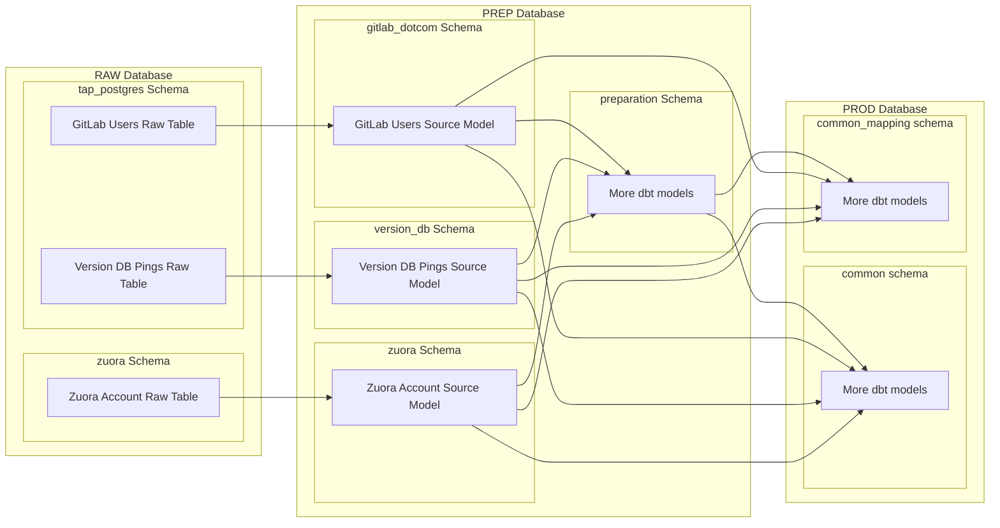
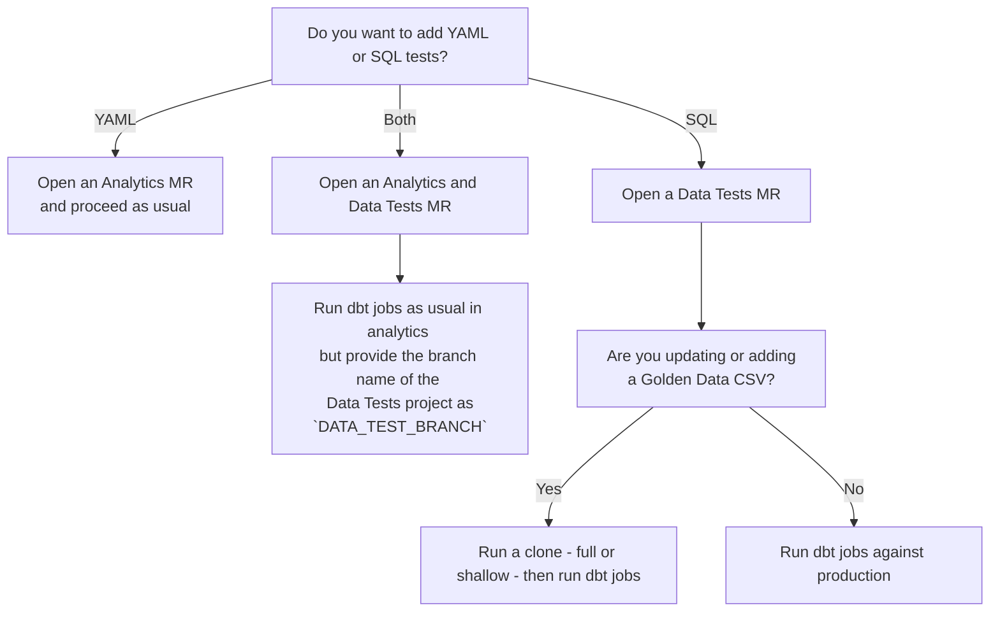

## Quick Links

- [Primary Project](https://gitlab.com/gitlab-data/analytics/)
- [dbt docs](https://dbt.gitlabdata.com/)

## What and why

dbt, short for [data build tool](https://www.getdbt.com/), is an [open source project](https://github.com/dbt-labs/dbt-core) for managing data transformations in a data warehouse. Once data is loaded into a warehouse, dbt enables teams to manage all data transformations required for driving analytics. It also comes with built in testing and documentation so we can have a high level of confidence in the tables we're generating and analyzing.

The following links will give you an excellent overview of what dbt is:

- [What, exactly, is dbt?](https://www.getdbt.com/blog/what-exactly-is-dbt) - This is a less technical overview for understanding the tool
- [What is dbt?](https://docs.getdbt.com/docs/introduction) - This is a bit more technical and comes straight from the docs

But why do we use dbt? There are several reasons.

First is that it is an open source tool with a vibrant community.
Choosing an open source tool enables us to collaborate with the larger data community and solve problems faster than had we gone with a proprietary solution.

Second, it was built with version control in mind.
For GitLab, this is essential since we use the product for building and running the company.

Third, it speaks the language of analysts - SQL.
This increases the number of people that can contribute since SQL is becoming such a critical part of many people's jobs.

Finally, it enables teams to move faster by integrating [testing and documentation](https://docs.getdbt.com/docs/build/sql-models#testing-and-documenting-models) from the start.

For even more information about the basics of dbt, see our [data analyst onboarding issue template](https://gitlab.com/gitlab-data/analytics/blob/master/.gitlab/issue_templates/Team%3A%20Data%20Onboarding.md)

At times, we rely on dbt packages for some data transformation.
[Package management](https://docs.getdbt.com/docs/build/packages) is built-in to dbt.
A full list of packages available are on the [dbt Hub site](https://hub.getdbt.com).

## Running dbt

If you're interested in using dbt, the [dbt documentation has a great tutorial](https://docs.getdbt.com/docs/get-started-dbt) on getting setup to work on data from a fictional business called Jaffle Shop.

If you wish to use dbt and contribute to the data team project, you'll need to gain access to our Snowflake instance, which can be done via an [access request](/handbook/it/end-user-services/onboarding-access-requests/access-requests/).

### Local environment

We use user-dedicated development databases and [virtual environments](/handbook/enterprise-data/platform/dbt-guide/#venv-workflow) via [make](https://www.gnu.org/software/make/manual/make.html) recipes in order to facilitate a 'local' development environment for GitLab team members contributing to our dbt project(s)

#### 'Local' User-Dedicated Development Databases

When needed for team members we create local development databases corresponding to the snowflake user with `_PREP` and `_PROD` suffixes, corresponding to the `PREP` and `PROD` databases in snowflake. These will be targeted by our main dbt project when run within the local environment so that contributors can develop and test changes to our dbt project. More detail on our development process within our dbt project can be found on the [dbt Change Workflow page](/handbook/enterprise-data/how-we-work/dbt-change-workflow/).

Any data built within these development databases should be considered ephemeral as they're only to be used for local development. To ensure the optimal use of dbt, as well as appropriate security and compliace, these databases should be cleaned by the owning user regularly. [This Runbook](https://gitlab.com/gitlab-data/runbooks/-/blob/main/Snowflake/snowflake_dev_clean_up.md) can be used to make that process quick and easy, and it's suggested to be run at the end or beginning of each development cycle. Additionaly, in order to ensure compliance with our data retention policies and procedures we will automatically drop all tables in development environments after **80 days** without alteration. This retention period is set within the dbt project with the `dev_db_object_expiration` variable and tables are deleted each weekend.

Note: Development databases are dropped as soon as the corresponding Team Member is deprovisioned access to Snowflake (i.e. in case of offboarding or [inactive usage](/handbook/enterprise-data/data-governance/data-management/#snowflake-1). There is not [backup]/handbook/enterprise-data/platform/#backups) process for development databases.

#### Configuration

- Ensure you have access to our Snowflake instance and dedicated development databases for your snowflake user
- Ensure you have [Make](https://en.wikipedia.org/wiki/Make_(software)) installed (should be installed on new Macs and with XCode)
- Create a folder in your home directory called `.dbt`
- In the `~/.dbt/` folder there should be a `profiles.yml`file that looks like this [sample profile](https://gitlab.com/gitlab-data/analytics/blob/master/admin/sample_profiles.yml)
- The smallest possible warehouse should be stored as an environment variable. Our dbt jobs use `SNOWFLAKE_TRANSFORM_WAREHOUSE` as the variable name to identify the warehouse. The environment variable can be set in the `.bashrc` or `.zshrc` file as follows:
  - `export SNOWFLAKE_TRANSFORM_WAREHOUSE="DEV_XS"`
  - In cases where more compute is required, this variable can be overwritten at run. We will cover how to do this in the [next section](/handbook/enterprise-data/platform/dbt-guide/#choosing-the-right-snowflake-warehouse-when-running-dbt).
- Clone the [analytics project](https://gitlab.com/gitlab-data/analytics/)
- If running on Linux:
  - Ensure you have [Rancher Desktop Installed](https://rancherdesktop.io/)

Note that many of these steps are done in the [onboarding script](https://gitlab.com/gitlab-data/analytics/-/blob/master/admin/onboarding_script.zsh) we recommend new analysts run.

#### Choosing the right Snowflake warehouse when running dbt

Our Snowflake instance contains [warehouses of multiple sizes](https://docs.snowflake.com/en/user-guide/warehouses-overview), which allow for dbt developers to allocate
differing levels of compute resources to the queries they run. The larger a warehouse is and the longer it runs, the more the query costs. For example, it costs [8 times](https://docs.snowflake.com/en/user-guide/warehouses-overview#warehouse-size) more to run a Large warehouse for an hour than it costs to run an X-Small warehouse for an hour.

If you have access to multiple warehouses, you can
create an entry for each warehouse in your `profiles.yml` file. Having done this, you will be able to specify which warehouse should run when you call `dbt run`. This should be done
carefully; using a larger warehouse increases performance but will greatly increase cost! Err on the side of using smaller warehouses. If you find that the smaller warehouse's
performance is not adequate, investigate the cause before you try again with a larger warehouse. Running an inefficient model against a larger warehouse not only increases cost during development, it also increases cost every time the model runs in production, resulting in unintentional ongoing increase in Snowflake costs.

#### Example

Imagine that you are a Data Team member who needs to make a change to a dbt model. You have access to both an X-Small warehouse and a Large warehouse, and your `profiles.yml` file
is set up like so:

```yaml
gitlab-snowflake:
  target: dev
  outputs:
    dev:
      type: snowflake
      threads: 8
      account: gitlab
      user: {username}
      role: {rolename}
      database: {databasename}
      warehouse: DEV_XS
      schema: preparation
      authenticator: externalbrowser
    dev_l:
      type: snowflake
      threads: 16
      account: gitlab
      user: {username}
      role: {rolename}
      database: {databasename}
      warehouse: DEV_L
      schema: preparation
      authenticator: externalbrowser
```

You open up your terminal and code editor, create a new branch, make an adjustment to a dbt model, and save your changes. You are ready to run dbt locally to test your changes,
so you enter in the following command: `dbt run --models @{model_name}`. dbt starts building the models, and by default it builds them using the `ANALYST_XS` warehouse. After a
while, the build fails due to a timeout error. Apparently the model tree you are building includes some large or complex models. In order for the queries to complete, you'll need to
use a larger warehouse. You want to retry the build, but this time you want dbt to use the `ANALYST_L` warehouse instead of `ANALYST_XS`. So you enter in
`dbt run --models @{model_name} --target dev_l`, which tells dbt to use the warehouse you specified in the `dev_l` target in your `profiles.yml` file. After a few minutes, the build
completes and you start checking your work.

#### Venv Workflow {#Venv-workflow}

Recommended workflow for anyone running a Mac system.

#### Using dbt

- Ensure you have the `DBT_PROFILE_PATH` environment variable set. This should be set if you've used the [onboarding_script.zsh](https://gitlab.com/gitlab-data/analytics/-/blob/master/admin/onboarding_script.zsh) (recommened to use this as this latest and updated regularly), but if not, you can set it in your `.bashrc` or `.zshrc` by adding `export DBT_PROFILE_PATH="/<your_root_dir/.dbt/"` to the file or simply running the same command in your local terminal session
- Ensure that you have updated your `.dbt/profiles.yml` with your specific user configuration
- Ensure your SSH configuration is setup according to the [GitLab directions](https://gitlab.com/help/ssh/README). Your keys should be in `~/.ssh/` and the keys should have been generated with no password.
  - You will also need access to [this project](https://gitlab.com/gitlab-data/data-tests) to run `dbt deps` for our main project.
- **NB**: Ensure your default browser is set to chrome. The built-in SSO login only works with chrome
- **NB**: Ensure you are in the folder where your `/analytics` repo is located. If you installed everything properly `jump analytics` will land you where it is needed in order to run `dbt` commands successfully.
- **NB**: Before running dbt for the first time run `make prepare-dbt`. This will ensure you have venv installed.
  - This will run a [series of commands](https://gitlab.com/gitlab-data/analytics/-/blob/master/Makefile#L111-114) including downloading and running a `poetry` install script.
  - If you get a certificate error like this `urllib.error.URLError: <urlopen error [SSL: CERTIFICATE_VERIFY_FAILED] certificate verify failed: unable to get local issuer certificate (_ssl.c:1124)>`, follow these [StackOverflow instructions](https://stackoverflow.com/questions/50236117/scraping-ssl-certificate-verify-failed-error-for-http-en-wikipedia-org/53310545#53310545).
- To start a `dbt` container and run commands from a shell inside it, use `make run-dbt`. This command will install or update the dependencies required for running dbt.
- To start a `dbt` container without the dependency update use `make run-dbt-no-deps`. This command assumes you already have the dbt dependencies installed. When using this command, if you make changes in any of the dependency packages (e.g. data-tests), you will need to run either `dbt deps` (from within the shell) or `make run-dbt` again for these changes to show up in your repository.
- This will automatically import everything `dbt` needs to run, including your local `profiles.yml` and repo files
- To see the docs for your current branch, run `make run-dbt-docs` and then visit `localhost:8081` in a web-browser. Note that this requires the `docs` profile to be configured in your `profiles.yml`

#### Why do we use a virtual environment for local dbt development?

We use virtual environments for local dbt development because it ensures that each developer is running exactly the same dbt version with exactly the same dependencies. This minimizes the risk that developers will have different development experiences due to different software versions, and makes it easy to upgrade everyone's software simultaneously. Additionally, because our staging and production environments are containerized, this approach ensures that the same piece of code will execute as predictably as possible across all of our environments.

#### Build Changes Locally

To clone and build all of the changed models in the local development space the same `build_changes` process can be used that is used in the [CI Job](/handbook/enterprise-data/platform/ci-jobs/#build_changes).  The primary difference is that instead of a `WAREHOUSE` variable the developer can pass a `TARGET` variable to use a target configured with a different warehouse size.  To run the process, run the `make build-changes` command from within the virtual environment.

```console
 ~/repos/analytics/transform/snowflake-dbt
╰─$ make build-changes DOWNSTREAM="+1" FULL_REFRESH="True" TARGET="dev_xl" VARS="key":"value" EXCLUDE="test_model"
```

[Video Introduction](https://youtu.be/0WiljW6Bihw)

#### SQLFluff linter

We use SQLFluff to enforce [SQL style guide](/handbook/enterprise-data/platform/sql-style-guide/) on our code. In addition to the methods for executing the linter found in the documentation, when in the dbt virtual environment the `make lint-models` can be used.  By default the `lint-models` process will lint all changed sql files, but the `MODEL` variable can be used to lint a specif sql file and the `FIX` variable can be used to run the linters fix command that will make changes to the sql file.

```console
~/repos/analytics/transform/snowflake-dbt
╰─$ make lint-models
sqlfluff lint models/workspaces/workspace_data/mock/data_type_mock_table.sql

~/repos/analytics/transform/snowflake-dbt
╰─$ make lint-models FIX="True" MODEL="dim_date"
sqlfluff fix ./models/common/dimensions_shared/dim_date.sql
```

[Video Introduction](https://youtu.be/MwVJHf7XvrI)

#### SAFE Check Locally

To test for SAFE coverage in model the same `safe_model_script` process can be used that is used in the [CI Job](/handbook/enterprise-data/platform/ci-jobs/#safe_model_script).  To run the process, run the `make safe-check` command from within the virtual environment.

```console
 ~/repos/analytics/transform/snowflake-dbt
╰─$ make safe-check
```

#### Cloning models locally

This command enables zero copy cloning using dbt selections syntax to clone entire lineages. This is far faster and more cost-effective than running the models using dbt but do not run any dbt validations. As such, all dbt users are encouraged to use this command to set up your environment.

**Prerequisites:**

- Ensure you have dbt setup and are able to run models
- These local commands run using the SnowFlake user configured in `/.dbt/profiles.yml`, and will skip any table which your user does not have permissions to.
- These commands run using the same logic as the dbt CI pipelines, using the `DBT_MODELS` as a variable to select a given lineage.
- You need to be in the `/analytics` directory to run these commands.

**Usage:**

To use the new `clone-dbt-select-local-user-noscript` command, you have to specify a `DBT_MODELS` variable. For example, to clone only the `dim_subscription` model, you would execute the following command:

```console
make DBT_MODELS="dim_subscription" clone-dbt-select-local-user-noscript
```

This will clone the dbt model from the `prod` branch into your local user database (i.e., `{user_name}_PROD`). You can use dbt selectors: @, +, etc to select the entire lineage that you want to copy over your local database.

**Tips:**

- If you encounter an error as below:

  ```console
  Compilation Error
    dbt found 7 package(s) specified in packages.yml, but only 0 package(s)
    installed in dbt_packages. Run "dbt deps" to install package dependencies.
  ```

- Run `make dbt-deps` from the root of the analytics folder and retry the command.

**Transition Note:**

We are actively transitioning to the new `clone-dbt-select-local-user-noscript` command. The old `clone-dbt-select-local-user` command will still be available for a limited time, but we encourage you to start using the new command as soon as possible.

##### Cloning into local user DB (python scripts - pre-`dbt clone`)

- This clones the given dbt model lineage into the active branch DB (ie. `{user_name}_PROD`)
  - `make DBT_MODELS="<dbt_selector>" clone-dbt-select-local-user`
  - eg. `make DBT_MODELS="+dim_subscription" clone-dbt-select-local-user`

##### Cloning into branch DB

- This clones the given dbt model lineage into the active branch DB (ie. `{branch_name}_PROD`), this is equivalent to running the CI pipelines clone step.
- It does not work on Master.
  - `make DBT_MODELS="<dbt_selector>" clone-dbt-select-local-branch`
  - eg. `make DBT_MODELS="+dim_subscription" clone-dbt-select-local-branch`

### Docker Workflow {#docker-workflow}

The below is the recommended workflow primarily for users running Linux as the venv workflow has fewer prerequisites and is considerably faster.

To abstract away some of the complexity around handling `dbt` and its dependencies locally, the main [analytics project](https://gitlab.com/gitlab-data/analytics/) supports using `dbt` from within a `Docker` container.
We build the container from the [`data-image`](https://gitlab.com/gitlab-data/data-image) project.
There are commands within the `Makefile` to facilitate this, and if at any time you have questions about the various `make` commands and what they do, use `make help` to get a list of the commands and what each of them does.

Before your initial run (and whenever the containers get updated) make sure to run the following commands:

1. `make update-containers`
1. `make cleanup`

These commands will ensure you get the newest versions of the containers and generally clean up your local `Docker` environment.

#### Using dbt

- Ensure you have the `DBT_PROFILE_PATH` environment variable set. This should be set if you've used the [onboarding_script.zsh](https://gitlab.com/gitlab-data/analytics/-/blob/master/admin/onboarding_script.zsh) (recommened to use this as this latest and updated regularly) or   [onboarding_script.sh](https://gitlab.com/gitlab-data/analytics/blob/master/admin/onboarding_script.sh), but if not, you can set it in your `.bashrc` or `.zshrc` by adding `export DBT_PROFILE_PATH="/<your_root_dir/.dbt/"` to the file or simply running the same command in your local terminal session
- Ensure that you have updated your `.dbt/profiles.yml` with your specific user configuration
- Ensure your SSH configuration is setup according to the [GitLab directions](https://gitlab.com/help/ssh/README). Your keys should be in `~/.ssh/` and the keys should have been generated with no password.
  - You will also need access to [this project](https://gitlab.com/gitlab-data/data-tests) to run `dbt deps` for our main project.
- To start a `dbt` container and run commands from a shell inside of it, use `make dbt-image`
- This will automatically import everything `dbt` needs to run, including your local `profiles.yml` and repo files
  - You may see some WARNINGS about missing variables (`GIT_BRANCH`, `KUBECONFIG`, `GOOGLE_APPLICATION_CREDENTIALS`, etc.). Unless you are developing on Airflow this is ok and expected.
- To see the docs for your current branch, run `make dbt-docs` and then visit `localhost:8081` in a web-browser. Note that this requires the `docs` profile to be configured in your `profiles.yml`
- Once inside of the `dbt` container, run any `dbt` commands as you normally would
- Changes that are made to any files in the repo will automatically be updated within the container. There is no need to restart the container when you change a file through your editor!

#### Command line cheat sheet

This is a simplified version of the [primary command reference](https://docs.getdbt.com/reference/dbt-commands).

dbt specific:

- [`dbt clean`](https://docs.getdbt.com/reference/commands/clean) - this will remove the `/dbt_modules` (populated when you run deps) and `/target` folder (populated when models are run)
- [`dbt run`](https://docs.getdbt.com/reference/commands/run) - regular run
- Model selection syntax ([source](https://docs.getdbt.com/reference/node-selection/syntax)). Specifying models can save you a lot of time by only running/testing the models that you think are relevant. However, there is a risk that you'll forget to specify an important upstream dependency so it's a good idea to understand the syntax thoroughly:
  - `dbt run --models modelname` - will only run `modelname`
  - `dbt run --models +modelname` - will run `modelname` and all parents
  - `dbt run --models modelname+` - will run `modelname` and all children
  - `dbt run --models +modelname+` - will run `modelname`, and all parents and children
  - `dbt run --models @modelname` - will run `modelname`, all parents, all children, AND all parents of all children
  - `dbt run --exclude modelname` - will run all models except `modelname`
  - Note that all of these work with folder selection syntax too:
    - `dbt run --models folder` - will run all models in a folder
    - `dbt run --models folder.subfolder` - will run all models in the subfolder
    - `dbt run --models +folder.subfolder` - will run all models in the subfolder and all parents
- `dbt run --full-refresh` - will refresh incremental models
- [`dbt test`](https://docs.getdbt.com/reference/commands/test) - will run custom data tests and schema tests; TIP: `dbt test` takes the same `--model` and `--exclude` syntax referenced for `dbt run`
- [`dbt seed`](https://docs.getdbt.com/reference/commands/seed) - will load csv files specified in the `data-paths` [directory](https://gitlab.com/gitlab-data/analytics/-/tree/master/transform/snowflake-dbt/data) into the data warehouse. Also see the [seeds section of this guide](/handbook/enterprise-data/platform/dbt-guide/#seeds)
- [`dbt compile`](https://docs.getdbt.com/reference/commands/compile) - compiles the templated code within the model(s) and outputs the result in the `target/` folder.
    This isn't a command you will need to run regularly as dbt will compile the models automatically when you to 'dbt run'.
    One common use-case is the compiled code can be run in Snowflake directly for debugging a model.

    Works only if you've run the [onboarding script](https://gitlab.com/gitlab-data/analytics/-/blob/master/admin/onboarding_script.sh):
- `dbt_run_changed` - a function we've added to your computer that only runs models that have changed (this is accessible from within the docker container)
- `cycle_logs` - a function we've added to your computer to clear out the dbt logs (not accessible from within the docker container)
- `make dbt-docs` - a command that will spin up a local container to serve you the `dbt` docs in a web-browser, found at `localhost:8081`

### VSCode extension: dbt Power User

[dbt Power User](https://marketplace.visualstudio.com/items?itemName=innoverio.vscode-dbt-power-user) makes VScode seamlessly work with dbt. The guide below will allow you to install dbt Power User if you followed the [Venv workflow](/handbook/enterprise-data/platform/dbt-guide/#Venv-workflow).

Before we start, there are some settings to adjust in your VScode:

- Go in Code > Settings > Settings…
  - Search for 'Python info visibility' > Set this setting as 'Always'
  - In a terminal, run `make run-dbt` as described in the [Using dbt](/handbook/enterprise-data/platform/dbt-guide/#using-dbt) section. Once it ran and the new shell spawned, run `echo $VIRTUAL_ENV`. Copy that value.
    - Search for 'venv path' in VScode settings.
    - Set this setting to the path that you copied last step, which should look like `/Users/<username>/Library/Caches/pypoetry/virtualenvs/` if you followed a standard installation. Remove the last part of the path `analytics-*******-py3.10` at the time of writing.
- Open VScode in /analytics (File > Open Folder... or Workspace...)
- You now see a python interpreter selector at the bottom right of VScode, click on it
  - In the popup field, you should now see the analytics venv(s) shown as type `poetry`, and the one used for dbt. Select it.
- Install extension `dbt-power-user`
- Follow only step `How to setup the extension > Associate your .sql files the jinja-sql language` [here](https://marketplace.visualstudio.com/items?itemName=innoverio.vscode-dbt-power-user)

- In VScode, go back to the File view and find the `analytics/.vscode/settings.json` file that was created when you opened `/analytics` with vscode (create `.vscode/settings.json` if you cannot find it). This file will define the settings of VScode when opened in `/analytics`

  Add this in your `settings.json` file:

  ```console
  {
  "terminal.integrated.env.osx": {
  "SHELL":"/bin/zsh",
  "DBT_PROFILES_DIR": "../../../.dbt/",
  "DATA_TEST_BRANCH":"main",
  "SNOWFLAKE_PROD_DATABASE":"PROD",
  "SNOWFLAKE_PREP_DATABASE":"PREP",
  "SNOWFLAKE_SNAPSHOT_DATABASE":"SNOWFLAKE",
  "SNOWFLAKE_LOAD_DATABASE":"RAW",
  "SNOWFLAKE_STATIC_DATABASE":"STATIC",
  "SNOWFLAKE_PREP_SCHEMA":"preparation",
  "SNOWFLAKE_TRANSFORM_WAREHOUSE":"ANALYST_XS",
  "SALT":"pizza",
  "SALT_IP":"pie",
  "SALT_NAME":"pepperoni",
  "SALT_EMAIL":"cheese",
  "SALT_PASSWORD":"416C736F4E6F745365637265FFFFFFAB"
  },
  "dbt.queryLimit": 500
  }
  ```

  Note: If the code base is updated with new values for these environment variables, you will have to update them in your `settings.json` according to the values of variables located in the `Makefile` at the root of the analytics repository.

- Edit `DBT_PROFILES_DIR` so that it points to your `~/.dbt/` folder (it seems that path must be relative and pointing to your `~/.dbt` folder, from the `/analytics` folder)
- Restart VScode and re-open the analytics workspace
- Check that dbt-power-user is running by navigating through models with Command+click (dbt needs some time to init).
Ignore any warnings about dbt not up to date.
- Open a random model, right click in the sql code, Click `run dbt model` and check for output.

  If you are getting an error of the type:

  ```console
  dbt.exceptions.RuntimeException: Runtime Error
    Database error while listing schemas in database ""PROD_PROD""
    Database Error
      002043 (02000): SQL compilation error:
      Object does not exist, or operation cannot be performed.
  ```

- then change the target profile used by dbt: navigate to dbt-power-user extension settings (Extensions > dbt-power-user > cog > Extension settings) and edit the setting called `Dbt: Run Model Command Additional Params` (same for build)

  {}
  When running/building/testing a model from VS code UI, the terminal window popping is only a log output. Cmd+C does not stop the job(s), nor clicking the Trash icon in VS code. If you want to stop a job started via VScode, go through the Snowflake UI and your job list and kill the job(s) from there.
  {}

### Configuration for contributing to dbt project

If you're interested in contributing to dbt, here's our recommended way of setting up your local environment to make it easy.

- Fork the [dbt project](https://github.com/dbt-labs/dbt-core) via the GitHub UI to your personal namespace
- Clone the project locally
- Create a virtual environment (venv) for dbt following these commands

  ```bash
  cd ~
  mkdir .venv # This should be in your root "~" directory
  python -m venv .venv/dbt
  source ~/.venv/dbt/bin/activate
  pip install dbt
  ```

- Consider adding `alias dbt!="source ~/.venv/dbt/bin/activate"` to your `.bashrc` or `.zshrc` to make it easy to start the virtual environment
- Navigate to the dbt project in the same terminal window - you should see `(dbt)` at the start of the command prompt
- Run `pip install -r editable_requirements.txt`. This will ensure when you run dbt locally in your venv you're using the code on your machine.
- Run `which dbt` to ensure it's pointing to the venv
- Develop code locally, commit your changes as you would, and push up to your namespace on GitHub

When you're ready to submit your code for an MR, ensure you've [signed their CLA](https://github.com/dbt-labs/dbt-core/blob/dev/0.15.1/CONTRIBUTING.md#signing-the-cla).

## Style and Usage Guide

### Model Structure

As we transition to a more Kimball-style warehouse, we are improving how we organize models in the warehouse and in our project structure.
The following sections will all be top-level directories under the `models` directory, which is a dbt default.
This structure is inspired by how dbt Labs [structures their projects](https://docs.getdbt.com/best-practices/how-we-structure/1-guide-overview).

{}
Prior to our focus on Kimball dimensional modeling, we took inspiration from the BEAM\* approach to modeling introduced in ["Agile Data Warehouse Design" by Corr and Stagnitto](https://books.google.com/books/about/Agile_Data_Warehouse_Design.html?id=TRWFmnv8jP0C&source=kp_book_description).
Many of the existing models still follow that pattern.
The information in this section is from previous iterations of the handbook.

- The goal of a (final) `_xf` dbt model should be a `BEAM*` table, which means it follows the business event analysis & model structure and answers the who, what, where, when, how many, why, and how question combinations that measure the business.
- `base models`- the only dbt models that reference the source table; base models have minimal transformational logic (usually limited to filtering out rows with data integrity issues or actively flagged not for analysis and renaming columns for easier analysis); can be found in the `legacy` schema; is used in `ref` statements by `end-user models`
- `end-user models` - dbt models used for analysis. The final version of a model will likely be indicated with an `_xf` suffix when it's goal is to be a `BEAM*` table. It should follow the business event analysis & model structure and answer the who, what, where, when, how many, why, and how question combinations that measure the business. End user models are found in the `legacy` schema.

Look at the [Use This Not That](https://docs.google.com/spreadsheets/d/1yr-J4ztkyl9vmJ6Euj58gczDLTIss7xIher5SV-1VDY/edit?usp=sharing) mapping to determine which new Kimball model replaces the legacy model.
{}

{}
In FY21-Q4 the `prod` and `prep` databases were introduced to replace the `analytics` database. These 2 new databases will fully replace the `analytics` database.

Local development was also switched from custom schemas to custom databases.
{}

#### Sources

All raw data will still be in the `RAW` database in Snowflake.
These raw tables are referred to as `source tables` or `raw tables`.
They are typically stored in a schema that indicates its original data source, e.g. `netsuite`

Sources are defined in dbt using a `sources.yml` file.

- We use a variable to reference the database in dbt sources, so that if we're testing changes in a Snowflake clone, the reference can be programmatically set
- When working with source tables with names that don't meet our usual convention or have unclear meanings, use identifiers to override source table names when the original is messy or confusing. ([Docs on using identifiers](https://docs.getdbt.com/reference/resource-properties/identifier))

  ```yaml
  # Good
  tables:
    - name: bizible_attribution_touchpoint
      identifier: bizible2__bizible_attribution_touchpoint__c

  # Bad
  tables:
    - name: bizible2__bizible_attribution_touchpoint__c
  ```

##### Source models

We are enforcing a very thin source layer on top of all raw data.
This directory is where the majority of source-specific transformations will be stored.
These are "base" models that pull directly from the raw data and do the prep work required to make facts and dimensions and should do *only* the following:

- Rename fields to user-friendly names
- Cast columns to appropriate types
- Minimal transformations that are 100% guaranteed to be useful for the foreseeable future. An example of this is parsing out the Salesforce ID from a field known to have messy data.
- Placement in a logically named schema

Even in cases where the underlying raw data is perfectly cast and named, there should still exist a source model which enforces the formatting.
This is for the convenience of end users so they only have one place to look and it makes permissioning cleaner in situations where this perfect data is sensitive.

The following should not be done in a source model:

- Removing data
- Joining to other tables
- Transformations that fundamentally alter the meaning of a column

For all intents and purposes, the source models should be considered the "raw" data for the vast majority of users.

Key points to remember:

- These models will be written to a logically named schema in the `prep` database based on the data source type. For example:
  - Zuora data stored in `raw.zuora` would have source models in `prep.zuora`
  - GitLab.com data with tables stored in `raw.tap_postgres.gitlab_db_*` would have source models in `prep.gitlab_dotcom`
  - Customers.gitlab.com data with tables stored in `raw.tap_postgres.customers_db_*` would have source models in `prep.customers_db`
- These models should be organized by source - this will usually map to a schema in the raw database
- The name of source models should end with `_source`
- Only source models should select from source/raw tables
- Source models should not select from the `raw` database directly. Instead, they should reference sources with jinja, e.g. `FROM {{ source('workday', 'job_info') }}`
- Only a single source model should be able to select from a given source table
- Source models should be placed in the `/models/sources/<data_source/` directory
- Source models should perform all necessary data type casting, using the `::` syntax when casting (You accomplish the same thing with fewer characters, and it presents as cleaner).
  - Ideally, source models should cast every column. Explicit is better than implicit. Test your assumptions
- Source models should perform all field naming to force field names to conform to standard field naming conventions
- Source fields that use reserved words must be renamed in source models
- Source models for particularly large data should always end with an ORDER BY statement on a logical field (usually a relevant timestamp). This essentially defines the cluster key for the warehouse and will help to take advantage of [Snowflake's micro-partitioning](https://docs.snowflake.net/manuals/user-guide/tables-clustering-micropartitions.html).

For a visual of how the source models relate to the raw tables and how they can act as a clean layer for all downstream modeling, see the following chart:



#### Sensitive Data

In some cases, there are columns whose raw values should not be exposed. This includes things like customer emails and names. There are legitimate reasons to need this data however, and the following is how we secure this data while still making it available to those with a legitimate need to know.

##### Static Masking

For a given model using static masking, the source format is followed as above. There is no hashing of columns in the source model. This should be treated the same as the raw data in terms of security and access.

Sensitive columns are documented in the `schema.yml` file using the `meta` key and setting `sensitive` equal to `true`. An example is as follows.

```yaml
  - name: sfdc_contact_source
    description: Source model for SFDC Contacts
    columns:
         - name: contact_id
           tests:
              - not_null
              - unique
         - name: contact_email
           meta:
              sensitive: true
         - name: contact_name
           meta:
              sensitive: true
```

Two separate models are then created from the source model: a sensitive and non-sensitive model.

The non-sensitive model uses a dbt macro called [`hash_sensitive_columns`](https://dbt.gitlabdata.com/#!/macro/macro.gitlab_snowflake.hash_sensitive_columns) which takes the source table and hashes all of the columns with `sensitive: true` in the `meta` field. There is no specific join key specified since all columns are hashed in the same way. Another column can be added in this model as a join key outside of the macro, if needed. The [`sfdc_contact`](https://dbt.gitlabdata.com/#!/model/model.gitlab_snowflake.sfdc_contact) model is a good example of this. 2 columns are hashed but an additional primary key of `contact_id` is specified.

In the sensitive model, the dbt macro [`nohash_sensitive_columns`](https://dbt.gitlabdata.com/#!/macro/macro.gitlab_snowflake.nohash_sensitive_columns) is used to create a join key. The macro takes the source table and a column as the join key and it returns the hashed column as the join key and the remaining columns unhashed. The [`sfdc_contact_pii`](https://dbt.gitlabdata.com/#!/model/model.gitlab_snowflake.sfdc_contact_pii) model is a good example of the macro in use.

All hashing includes a [salt](https://en.wikipedia.org/wiki/Salt_(cryptography)) as well. These are specified via environment variables. There are different salts depending on the type of data. These are defined in the [`get_salt` macro](https://dbt.gitlabdata.com/#!/macro/macro.gitlab_snowflake.get_salt) and are also set when using the dbt container for local development.

In general, team members should not be permitted to see the salt used in the query string within the Snowflake UI.  In table models this goal is met by using the [Snowflake built-in `ENCRYPT` function](https://docs.snowflake.com/en/sql-reference/functions/encrypt). For models materialized into views, the `ENCRYPT` function seems to not work. Instead, a workaround using secure views is utilized.  A secure view limits DDL viewing to the owner only, thus limiting visibility of the hash.  To create a secure view, set `secure` equal to true in the [model configuration](/handbook/enterprise-data/platform/dbt-guide/#model-configuration). A view that utilizes the hashing functionality as described, but is not configured as a secure view, will likely not be queryable.

##### Dynamic Masking

When the sensitive data needs to be known by some users but not all then dynamic masking can be applied.

Sensitive columns to be masked dynamically are documented in the `schema.yml` file using the `meta` key and setting `masking_policy` equal to one of the Data Masking Roles found in the `roles.yml` file. An example is as follows.

```yaml
  - name: sfdc_contact_source
    description: Source model for SFDC Contacts
    columns:
         - name: contact_id
           tests:
              - not_null
              - unique
         - name: contact_email
           meta:
              masking_policy: general_data_masking
         - name: contact_name
           meta:
              masking_policy: general_data_masking
```

A `post-hook` running the macro `mask_model` will need to be configured for any model that will need dynamic masking applied.

The `mask_model` macro will first retrieve all of the columns of the given model that have a `masking_policy` identified. That information is passed to an other macro, `apply_masking_policy`, witch orchestrates the creation and application of Snowflake [masking policies](https://docs.snowflake.com/en/sql-reference/sql/create-masking-policy#create-masking-policy) for the given columns.

The first step of the `apply_masking_policy` is to get the data type of the columns to be masked as the polices are data type dependant.  This is done with a query to the data base `information_schema` table with the following query:

```sql
SELECT
  t.table_catalog,
  t.table_schema,
  t.table_name,
  t.table_type,
  c.column_name,
  c.data_type
FROM "{{ database }}".information_schema.tables t
INNER JOIN "{{ database }}".information_schema.columns c
  ON c.table_schema = t.table_schema
  AND c.table_name = t.table_name
WHERE t.table_catalog =  '{{ database.upper() }}'
  AND t.table_type IN ('BASE TABLE', 'VIEW')
  AND t.table_schema = '{{ schema.upper() }}'
  AND t.table_name = '{{ alias.upper() }}'
ORDER BY t.table_schema,
  t.table_name;
```

Where the `database`, `schema`, and `alias` are passed to the macro at the time it is called.

With the qualified column name and the data type, masking policies are created for a given database, schema, and data type for the specified masking policy.  And once the policies have been created they are applied to the identified columns.

It should be noted that permissions are based on an allow list of roles. Meaning permission has to be granted to see the unmasked data at query time:

```sql
CREATE OR REPLACE MASKING POLICY "{{ database }}".{{ schema }}.{{ policy }}_{{ data_type }} AS (val {{ data_type }})
  RETURNS {{ data_type }} ->
      CASE
        WHEN CURRENT_ROLE() IN ('transformer','loader') THEN val  -- Set for specific roles that should always have access
        WHEN IS_ROLE_IN_SESSION('{{ policy }}') THEN val -- Set for the user to inherit access bases on there roles
        ELSE {{ mask }}
      END;
```

Only one policy can be applied to a column so users that need access will have to have the permissions granted using the applied masking role.

#### Staging

Prior to our implementation of Kimball modeling, most all of our models would have fallen into Staging category.

This directory is where the majority of business-specific transformations will be stored. This layer of modeling is considerably more complex than creating source models, and the models are highly tailored to the analytical needs of business.
This includes:

- Filtering irrelevant records
- Choosing columns required for analytics
- Renaming columns to represent abstract business concepts
- Joining to other tables
- Executing business logic
- Modelling of fct_*and dim_* tables following Kimball methodology

#### Workspaces

We provide a space in the dbt project for code that is team specific and not meant to adhere to all of the coding and style guides. This is in an effort to help teams iterate faster using solutions that don't need to be more robust.

Within the project there is a `/models/workspaces/` folder where teams can create a folder of the style `workspace_<team>` to store their code. This code will not be reviewed by the Data Team for style. The only concern given prior to merge is whether it runs and if there are egregious inefficiencies in the code that could impact production runs.

To add a new space:

- Create an issue in the [`analytics`](https://gitlab.com/gitlab-data/analytics/) project and open a new merge request
- Create a new folder in [`/models/workspaces/`](https://gitlab.com/gitlab-data/analytics/-/tree/master/transform/snowflake-dbt/models/workspaces/) e.g. `workspace_security`
- Add an entry to the [`dbt_project.yml`](https://gitlab.com/gitlab-data/analytics/-/blob/master/transform/snowflake-dbt/dbt_project.yml#L340) file for the new workspace. Include the schema it should write to:

  ```yaml
  # ------------------
  # Workspaces
  # ------------------
  workspaces:
    +tags: ["workspace"]

    workspace_security: # This maps to the folder in `/models/workspaces/`
      +schema: workspace_security # This is the schema in the `prod` database
  ```

- Add your `.sql` files to the folder
- Add any entries to the [CODEOWNERS file](https://gitlab.com/gitlab-data/analytics/-/blob/master/CODEOWNERS)
- Use the [dbt Workspace Changes](https://gitlab.com/gitlab-data/analytics/-/blob/master/.gitlab/merge_request_templates/dbt%20Workspace%20Changes.md) MR template and follow the instructions there to submit the MR for review and final merge

Newly added code will take up to 24 hours to appear in the data warehouse.

The Data Team reservers the right to reject code that will dramatically slow the production dbt run. If this happens, we will consider building a separate dbt execution job just for the workspaces.

### General

- Model names should be as obvious as possible and should use full words where possible, e.g. `accounts` instead of `accts`. Avoid using [aliases](https://docs.getdbt.com/docs/build/custom-aliases) unless absolutely necessary. Table names in the warehouse should match the dbt model names to maintain clarity, consistency, and ease of debugging. If an alias is required, document the rationale clearly in the model's description.

- Documenting and testing new data models is a part of the process of creating them. A new dbt model is not complete without tests and documentation.

- Follow the naming convention of `analysis type, data source (in alpha order, if multiple), thing, aggregation`

  ```sql
  -- Good
  retention_sfdc_zuora_customer_count.sql

  -- Bad
  retention.sql
  ```

- All `{{ ref('...') }}` statements should be placed in CTEs at the top of the file. (Think of these as import statements.)
  - This does not imply all CTE's that have a `{{ ref('...') }}` should be `SELECT *` only. It is ok to do additional manipulations in a CTE with a `ref` if it makes sense for the model.
  - If only a small number of fields are required from a model containing many columns then it can be performant to list them in the CTE, otherwise it is better to use `SELECT *`. To do this, the `simple_cte` macro can be used.

- If you want to separate out some complex SQL into a separate model, you absolutely should to keep things DRY and easier to understand. The config setting `materialized='ephemeral'` is one option which essentially treats the model like a CTE.

#### Model Configuration

There are multiple ways to provide configuration definitions for models.
The [dbt docs for configuring models](https://docs.getdbt.com/reference/model-configs) provide a concise explanation of the ways to configure models.

Our guidelines for configuring models:

- The default materialization is `view`
- The default schema is `prep.preparation`.
- Disabling any model should always be done in the `dbt_project.yml` via the `+enabled: false` declaration
- Configs should be applied in the smallest number of locations:
  - If <50% of models in a directory require the same configuration, then configure the individual models
  - If >=50% of models in a directory require the same configuration, strongly consider setting a default in the `dbt_project.yml`, but think about whether that setting is a sensible default for any new models in the directory

##### Versions

Model versions within dbt allow for a controlled transition between model changes that may break or significantly impact downstream uses.  When versions are defined for a model all enabled versions will be produced in the target database and schema.  This allows users of the model to access the versions side by side so that any breaking changes can be addressed while still delivering reports and analysis using an earlier version.  This is most effective when columns are removed or significant refactor of several models is taking place over multiple development cycles.

###### Defining Model Versions

Model versions are implemented by creating a new model file with the same name as the target model but with an added version suffix, and by defining version properties in the relevant `schema.yml` file. More details can be found in the [dbt documentation](https://docs.getdbt.com/docs/collaborate/govern/model-versions) for model versions.

```yml
# dim_date.sql
# dim_date_v2.sql

models:
  name: dim_date
  ...
  versions:
    - v: 1
      defined_in: dim_date.sql # Only needed if there is no suffix on the model file.
    - v: 2
  latest_version: 1

```

###### Referencing Model Versions

With the provided model definitions, two models will be created when the model is included in a selection, such as `dbt run --models dim_date`; `database.schema.dim_date_v1` and `database.schema.dim_date_v2`.  Additionally, with the `create_latest_version_view` post-hook, a view will be created of the latest version; `database.schema.dim_date`. This view allows users to always be on the latest version of a model without needing to know what that version is.

Within dbt, if a specific version of a model needs to be used to build an other model, it can be defined in the `ref` function:

```jinja
{{ ref('dim_date', v=2) }}
```

If a version is not defined in the `ref` function then the latest version of the model will be used.

##### Depends On

In normal usage, dbt knows the proper order to run all models based on the usage of the `{{ ref('...') }}` syntax. There are cases though where dbt doesn't know when a model should be run. A specific example is when we use the [`schema_union_all`](https://dbt.gitlabdata.com/#!/macro/macro.gitlab_snowflake.schema_union_all) or [`schema_union_limit`](https://dbt.gitlabdata.com/#!/macro/macro.gitlab_snowflake.schema_union_limit) macros. In this case, dbt thinks the model can run first because no explicit references are made at compilation time. To address this, a comment can be added in the file, after the configuration setting, to indicate which model it depends on:

```sql
{{config({
    "materialized":"view"
  })
}}

-- depends_on: {{ ref('snowplow_sessions') }}

{{ schema_union_all('snowplow_', 'snowplow_sessions') }}
```

dbt will see the `ref` and build this model after the specified model.

#### Database and Schema Name Generation

In dbt, it is possible to generate custom database and schema names. This is used extensively in our project to control where a model is materialized and it changes depending on production or development use cases.

##### Databases

The default behavior is documented in the ["Using databases" section of the dbt documentation](https://docs.getdbt.com/docs/build/custom-databases). A macro called `generate_database_name` determines the schema to write to.

We override the behavior of this macro with our own [`generate_database_name` definition](https://gitlab.com/gitlab-data/analytics/-/blob/master/transform/snowflake-dbt/macros/utils/generate_database_name.sql). This macro takes the configuration (target name and schema) supplied in the `profiles.yml` as well as the schema configuration provided in the model config to determine what the final schema should be.

##### Schemas

The default behavior is documented in the ["Using custom schemas" section of the dbt documentation](https://docs.getdbt.com/docs/build/custom-schemas). A macro called `generate_schema_name` determines the schema to write to.

We override the behavior of this macro with our own [`generate_schema_name` definition](https://gitlab.com/gitlab-data/analytics/-/blob/master/transform/snowflake-dbt/macros/utils/generate_schema_name.sql). This macro takes the configuration (target name and schema) supplied in the `profiles.yml` as well as the schema configuration provided in the model config to determine what the final schema should be.

##### Development behavior

In FY21-Q4, we switched to having development databases instead of schemas. This means that the schemas that are used in production match what is used in development, but the database location is different. dbt users should have their own scratch databases defined, such as `TMURPHY_PROD` and `TMURPHY_PREP`, where models are written to.

This switch is controlled by the target name defined in the `profiles.yml` file. Local development should never have `prod` or `ci` as the target.

#### Macros

##### Naming conventions

- File name must match the macro name

##### Structure

- Macros should be documented in either the `macros.yml` file or in a macros.md file in descriptions are long
- Use the [arguments property](https://docs.getdbt.com/reference/macro-properties) in `macros.yml` to describe the input variables

##### dbt-utils

In our dbt project we make use of the [dbt-utils package](https://github.com/dbt-labs/dbt-utils). This adds several macros that are commonly useful. Important ones to take note of:

- [group_by](https://github.com/dbt-labs/dbt-utils?tab=readme-ov-file#group_by-source) - This macro build a group by statement for fields 1...N
- [star](https://github.com/dbt-labs/dbt-utils?tab=readme-ov-file#star-source) - This macro pulls all the columns from a table excluding the columns listed in the except argument
- [surrogate_key](https://github.com/dbt-labs/dbt-utils?tab=readme-ov-file#generate_surrogate_key-source) - This macro takes a list of field names and returns a hash of the values to generate a unique key

### Seeds {#seeds}

Seeds are a way to load data from csv files into our data warehouse ([dbt documentation](https://docs.getdbt.com/docs/build/seeds)).
Because these csv files are located in our dbt repository, they are version controlled and code reviewable.
This method is appropriate for loading static data which changes infrequently.
A csv file that's up to ~1k lines long and less than a few kilobytes is probably a good candidate for use with the `dbt seed` command.
A seed file should be placed in the project folder that corresponds to the functional team that has ownership of the information found therein.  This folder structure also corresponds to a schema in the `PREP` database so that the data can be easily used in further development.

### Organizing columns

When writing a base model, columns should have some logical ordering to them.
We encourage these 4 basic groupings:

- Primary data
- Foreign keys
- Logical data - This group can be subdivided further if needed
- Metadata

Primary data is the key information describing the table. The primary key should be in this group along with other relevant unique attributes such as name.

Foreign keys should be all the columns which point to another table.

Logical data is for additional data dimensions that describe the object in reference. For a Salesforce opportunity this would be the opportunity owner or contract value. Further logical groupings are encouraged if they make sense. For example, having a group of all the variations of contract value would make sense.

Within any group, the columns should be alphabetized on the alias name.

An exception to the grouping recommendation is when we control the extraction via a defined manifest file. A perfect example of this is our [gitlab.com manifest](https://gitlab.com/gitlab-data/analytics/blob/master/extract%2Fpostgres_pipeline%2Fmanifests%2Fgitlab_com_db_manifest.yaml) which defines which columns we extract from our application database. The base models for these tables can be ordered identically to the manifest as it's easier to compare diffs and ensure accuracy between files.

- Ordered alphabetically by alias within groups

  ```sql
  -- Good

  SELECT
    id                    AS account_id,
    name                  AS account_name,

    -- Foreign Keys
    ownerid               AS owner_id,
    pid                   AS parent_account_id,
    zid                   AS zuora_id,

    -- Logical Info
    opportunity_owner__c  AS opportunity_owner,
    account_owner__c      AS opportunity_owner_manager,
    owner_team_o__c       AS opportunity_owner_team,

    -- metadata
    isdeleted             AS is_deleted,
    lastactivitydate      AS last_activity_date
  FROM table
  ```

- Ordered alphabetically by alias without groups

  ```sql
  -- Less Good

  SELECT
    id                    AS account_id,
    name                  AS account_name,
    isdeleted             AS is_deleted,
    lastactivitydate      AS last_activity_date,
    opportunity_owner__c  AS opportunity_owner,
    account_owner__c      AS opportunity_owner_manager,
    owner_team_o__c       AS opportunity_owner_team,
    ownerid               AS owner_id,
    pid                   AS parent_account_id,
    zid                   AS zuora_id
  FROM table
  ```

- Ordered alphabetically by original name

  ```sql
  -- Bad

  SELECT
    account_owner__c      AS opportunity_owner_manager,
    id                    AS account_id,
    isdeleted             AS is_deleted,
    lastactivitydate      AS last_activity_date
    name                  AS account_name,
    opportunity_owner__c  AS opportunity_owner,
    owner_team_o__c       AS opportunity_owner_team,
    ownerid               AS owner_id,
    pid                   AS parent_account_id,
    zid                   AS zuora_id
  FROM table
  ```

### Tags

[Tags in dbt](https://docs.getdbt.com/reference/resource-configs/tags) are a way to label different parts of a project. These tags can then be utilized when selecting sets of models, snapshots, or seeds to run.

Tags can be added in YAML files or in the config settings of any model. Review the [`dbt_project.yml`](https://gitlab.com/gitlab-data/analytics/-/blob/master/transform/snowflake-dbt/dbt_project.yml) file for several examples of how tags are used. Specific examples of adding tags for the [Trusted Data Framework](/handbook/enterprise-data/platform/dbt-guide/#tagging) are shown below.

Within the `analytics` and `data-tests` projects we enforce a Single Source of Truth for all tags. We use the [Valid Tags CSV](https://gitlab.com/gitlab-data/analytics/-/blob/master/transform/snowflake-dbt/data/valid_tags.csv) to document which tags are used. Within merge requets, there is a validation step within every dbt CI job that will check this csv against all tags used in the project and fail the job if there is a mismatch. In the future, we aim to include more metadata about tags within this csv file.

Be aware that tags applied at any level do not apply to any tests. Tags for tests have to be explicitly applied for every test within the `schema.yml` file.

### Warehouse Size

[Configuring the warehouse size](https://docs.getdbt.com/reference/resource-configs/snowflake-configs#configuring-virtual-warehouses) within the model can be a way to ensure needed performance on a model.  This is intended to be performed on a model by model bases and for models with known performance needs; for example, the model contains a large recursive CTE that will fail if not run on a LARGE or bigger warehouse.

This configuration can be done using the `generate_warehouse_name` macro within the model configuration and is designed to work with both production, `TRANSFORMER`, and development `DEV` warehouses.  To configure the warehouse size, you need to pass the desired size to the macro where the correct warehouse name will be generated. This will only work for currently existing warehouses.

```jinja
{{
  config(
    snowflake_warehouse = generate_warehouse_name('XL')
  )
}}
```

### Sample Data in Development

To streamline local development on local models, a way to sample, or use a subset of the data, is made available to the developers. This tool will allow developers the option of using sample data, or full data depending on what the situation calls for, allowing them to iterate quickly on the structure of models using sample data and then switch to full data when validation is needed. Using this in conjunction with local cloning of tables should improve the developer cycle time.

When selecting the tool to use, the developer should consider speed gained from the tool and the consequence of leaving the sampling in the code. A Random Sample is easy to add to the code, but if left in the code base, it puts the quality of the production data at risk, whereas a Sample Table will take longer to set up, but has no risk to the production data.

#### Random Sample

With the macro [`sample_table`](https://dbt.gitlabdata.com/#!/macro/macro.gitlab_snowflake.sample_table) the developer will be able to select a random percent of the target table.  This macro takes a percentage value which represent the amount of the target table to be returned.  While the sample is random it is also deterministic, meaning that if the target table has not changed each query will return the same rows.  If this macro is left in the code it will be executed in production and ci environments so it should be removed before merging in to the main code branch.

Example Use:

```sql

SELECT *
FROM {{ ref('dim_date') }} {{ sample_table(3) }}

-- Resolve to:
SELECT *
FROM dev_prod.common.dim_date SAMPLE SYSTEM (3) SEED (16)


```

#### Sample Table

With a sample table the developer creates a table that represents a sub set of the data in the target table that existing models will use instead of the original table.  This requires configuring the desired samples and performing operations to create the sample tables.  When configuring the sample the sample clause can use the `sample_table` macro or any filtering statement that can be used after the `FROM` statement such as `LIMIT`, `WHERE`, or `QUALIFY`. These sample tables will only be used in non production and ci environments and will not appear in the model lineage.

Workflow steps:

- Clone the target sample tables
  - Using a command such as [`clone-dbt-select-local-user`](/handbook/enterprise-data/platform/dbt-guide/#cloning-into-local-user-db) ensure that there is a full data table to sample from.
- Configure the sample for each table to be created
  - Samples are configured in the `samples` macro in the `samples_yml` variable

    ```yml

    samples:
      - name: dim_date
        clause: "{{ sample_table(3) }}"

    # Or

    samples:
      - name: dim_date
        clause: "WHERE date_actual >= DATEADD('day', -30, CURRENT_DATE())"

    ```

- Construct the sample tables
  - Using the `run-operation` command execute the `create_sample_tables` macro

    ```console
    dbt run-operation create_sample_tables
    ```

- Develop and iterate as needed
- Final test run using the full data
  - Override the `local_data` variable to be `full-data` as part of the dbt execution

    ```console
    dbt run -s dim_date --vars 'local_data: full_data'
    ```

- Remove sample configuration
  - Remove the list of samples from the `samples_yml` before merging the code changes

Example Use:

```sql
-- Sample configuration
/*
samples:
  - name: dim_date
    clause: "WHERE date_actual >= DATEADD('day', -30, CURRENT_DATE())"
*/

-- dbt run-operation create_sample_tables executes the following command
CREATE OR REPLACE TRANSIENT TABLE dev_prod.common.dim_date__sample AS SELECT * FROM dev_prod.common.dim_date WHERE date_actual >= DATEADD('day', -30, CURRENT_DATE());

-- In model ref function will retrieve the sample table
SELECT *
FROM {{ ref('dim_date') }}

-- Resolves to:
SELECT *
FROM dev_prod.common.dim_date__sample


```

#### How Sampling Macros Work

For more details on how the macros used in sampling function see the following documentaion:

- [create_sample_tables](https://dbt.gitlabdata.com/#!/macro/macro.gitlab_snowflake.create_sample_tables)
- [generate_sample_table_sql](https://dbt.gitlabdata.com/#!/macro/macro.gitlab_snowflake.generate_sample_table_sql)
- [get_sample_relation](https://dbt.gitlabdata.com/#!/macro/macro.gitlab_snowflake.get_sample_relation)
- [is_table_sampled](https://dbt.gitlabdata.com/#!/macro/macro.gitlab_snowflake.is_table_sampled)
- [sample_table](https://dbt.gitlabdata.com/#!/macro/macro.gitlab_snowflake.sample_table)
- [samples](https://dbt.gitlabdata.com/#!/macro/macro.gitlab_snowflake.samples)
- [ref](https://dbt.gitlabdata.com/#!/macro/macro.gitlab_snowflake.ref)

### Trusted Data Framework

See the [Trusted Data Framework](/handbook/enterprise-data/how-we-work/data-development) section of our Platform page for a deeper dive into the philosophy behind the Trusted Data Framework.

#### Schema To Golden Data Coverage

We implement 12 categories of Trusted Data Framework (TDF) monitors and tests (monitors are created in and executed by [Monte-Carlo](/handbook/enterprise-data/platform/monte-carlo/), tests are created with and executed by dbt):

1. `Freshness monitors` Monitor for unusual delays in table and field updates
1. `Schema monitors` Monitor fields that are added, removed or changed
1. `Volume monitors` Monitor for unusual changes in table size based on the numbers of rows
1. `Field health Monitor` Monitor fields for dips or spikes in stats like % null, % unique, and more. Our ML sets the thresholds.
1. `SQL rule monitor` Write a SQL statement to check for any expressable condition across 1 or more tables in your data.
1. `JSON schema monitor` Monitor for schema changes in JSON data added to a table field.
1. `Dimension tracking` Monitor for changes in the distribution of values within a low-cardinality table field.
1. [Schema tests](/handbook/enterprise-data/platform/dbt-guide/#schema-tests) to validate the integrity of a schema
1. [Column Value tests](/handbook/enterprise-data/platform/dbt-guide/#column-value-tests) to determine if the data value in a column matches pre-defined thresholds or literals
1. [Rowcount tests](/handbook/enterprise-data/platform/dbt-guide/#rowcount-tests) to determine if the number of rows in a table over a pre-defined period of time match pre-defined thresholds or literals
1. [Custom SQL tests](/handbook/enterprise-data/platform/dbt-guide/#custom-sql) any valid SQL that doesn't conform to the above categories

Our tests are stored in 2 primary places - either in a YAML file within our [main project](https://gitlab.com/gitlab-data/analytics) or within our [Data Tests](https://gitlab.com/gitlab-data/data-tests) project.

Schema and Column Value tests will usually be in the main project. These will be in `schema.yml` and `sources.yml` files in the same directory as the models they represent.

Rowcount, and any other custom SQL tests will always be in the [Data Tests](https://gitlab.com/gitlab-data/data-tests) project. This is a private project for internal GitLab use only.

##### Tagging

Tagging the tests is an important step in adding new tests. Labeling the test with a [dbt tag](https://docs.getdbt.com/reference/resource-configs/tags) is how we parse and identify tests when building trusted data dashboards. There are 2 ways to tag tests depending on their type.

The first is by adding tags in the YAML definition. This can be done at the highest level of the YAML definition for source tests, or on the column level for model tests.

```yaml
## Source Labeling in sources.yml
version: 2

sources:
  - name: zuora
    tags: ["tdf","zuora"]

## Model Labeing in schema.yml
version: 2

models:
  - name: zuora_accounting_period_source
    description: Source layer for Zuora Accounting Periods for cleaning and renaming
    columns:
      - name: accounting_period_id
        tags: ["tdf","zuora"]
        tests:
          - not_null
          - unique
```

Each of these examples will apply the tags to all tests nested in the underlying hierarchy.

The second way of adding tags is via the `config` declaration at the top of a test file:

```sql
{{ config({
    "tags": ["tdf","zuora"]
    })
}}

WITH test AS (...)
```

##### General Guidance

- Every model should be tested in a `schema.yml` file
- At minimum, unique fields, not nullable fields, and foreign key constraints should be tested (if applicable)
- The output of dbt test should be pasted into MRs
- Any failing tests should be fixed or explained prior to requesting a review

#### Schema Tests

Schema tests are designed to validate the existence of known tables, columns, and other schema structures. Schema tests help identify planned and accidental schema changes.

All Schema Tests result in a PASS or FAIL status.

##### Schema Test Example

Purpose: This test validates critical tables exist in the Zuora Data Pipeline.

We've implemented schema tests as a [dbt macro](https://docs.getdbt.com/docs/build/jinja-macros). This means that instead of writing SQL, a user can add the test by simply calling the macro. This is controlled by the [`raw_table_existence`](https://dbt.gitlabdata.com/#!/macro/macro.gitlab_snowflake.raw_table_existence) macro.

```sql
-- File: https://gitlab.com/gitlab-data/analytics/-/blob/master/transform/snowflake-dbt/tests/sources/zuora/existence/zuora_raw_source_table_existence.sql
{{ config({
    "tags": ["tdf","zuora"]
    })
}}

{{ raw_table_existence(
    'zuora_stitch',
    ['account', 'subscription', 'rateplancharge']
) }}
```

#### Column Value Tests

Column Value Tests determine if the data value in a column is within a pre-defined threshold or matches a known literal. Column Value Tests are the most common type of TDF test because they have a wide range of applications. Column Value tests are useful in the following scenarios:

- change management: pre-release and post-release testing
- ensuring sums/totals for important historical data meets previously reported results
- ensuring known "approved" data always exists

Column value tests can be added as both YAML and SQL. dbt natively has tests to assert that a column is not null, has unique values, only contains certain values, or that all values in a column are represented in another model (referential integrity).

We also use the [dbt-utils](https://github.com/dbt-labs/dbt-utils) package to add even more testing capabilities.

All Column Value Tests result in a PASS or FAIL status.

##### Column Value Test Example 1

Purpose: This test validates the account ID field in Zuora. This field is always 32 characters long and only has numbers and lowercase letters.

Because we use dbt, we have documentation for all of our source tables and most of our downstream modeled data. With in the yaml documentation files, we're able to add tests to individual columns.

```yaml
# File: https://gitlab.com/gitlab-data/analytics/-/blob/master/transform/snowflake-dbt/models/sources/zuora/sources.yml
    - name: account
    description: '{{ doc("zuora_account_source") }}'
    columns:
        - name: id
        description: Primary Key for Accounts
        tags: ["tdf","zuora"]
        tests:
            - dbt_utils.expression_is_true:
                expression: "id REGEXP '[0-9a-z]{32}'"
```

#### Rowcount Tests

The Rowcount test is a specialized type of Column Value test and is broken out because of its importance and utility. Rowcount tests determine if the number of rows in a table over a period of time meet expected pre-defined results. If data volumes change rapidly for legitimate reasons, rowcount tests will need to be updated appropriately.

##### Rowcount Test Example 1

Purpose: This test validates we always had 18,849 Zuora subscription records created in 2019.

This test is implemented as a [dbt macro](https://docs.getdbt.com/docs/build/jinja-macros). This means that instead of writing SQL, a user can add the test by simply calling the macro. This is controlled by the [`source_rowcount`](https://dbt.gitlabdata.com/#!/macro/macro.gitlab_snowflake.source_rowcount) macro.

```sql
-- https://gitlab.com/gitlab-data/data-tests/-/blob/main/tests/sources/zuora/rowcount/zuora_subscription_source_rowcount_2019.sql
{{ config({
    "tags": ["tdf","zuora"]
    })
}}

{{ source_rowcount(
    'zuora',
    'subscription',
    18489,
    "autorenew = 'TRUE' and createddate > '2019-01-01' and createddate < '2020-01-01'"
) }}

```

##### Rowcount Test Example 2

Purpose: We have a fast-growing business and should always have at least 50 and at most 200 new Subscriptions loaded from the previous day. This is controlled by the [`model_new_records_per_day`](https://dbt.gitlabdata.com/#!/macro/macro.gitlab_snowflake.model_new_rows_per_day) macro.

```sql
-- https://gitlab.com/gitlab-data/data-tests/-/blob/main/tests/sources/zuora/rowcount/zuora_subscription_source_model_new_records_per_day.sql
{{ config({
    "tags": ["tdf","zuora"],
    "severity": "warn",
    })
}}

{{ model_new_rows_per_day(
    'zuora_subscription_source',
    'created_date',
    50,
    200,
    "date_trunc('day',created_date) >= '2020-01-01'"
) }}

```

#### Custom SQL

You may have a test in mind that doesn't fit into any of the above categories. You can also write arbitrary SQL as a test. The key point to keep in mind is that the test is *passing* if no rows are returned. If any rows are returned from the query, then the test would fail.

An example of this from the dbt docs:

```sql
{{ config({
    "tags": ["tdf","fct_payments"]
    })
}}

-- Refunds have a negative amount, so the total amount should always be >= 0.
-- Therefore return records where this isn't true to make the test fail
SELECT
    order_id,
    sum(amount) AS total_amount
FROM {{ ref('fct_payments' )}}
GROUP BY 1
HAVING total_amount < 0
```

Any valid SQL can be written here and any dbt models or source tables can be referenced.

#### Merge Request Workflow

There are a few scenarios to think about when adding or updating tests.

The first scenario is modifying or adding a test in a YAML file within our main project. This follows our standard MR workflow and nothing is different. Run the [CI jobs](/handbook/enterprise-data/platform/ci-jobs) as you normally would.

The second scenario is adding any test or golden data records within the `data-tests` project against tables that are being updated or added via an MR in the `analytics` project. This is the most common scenario. In this case, no pipelines need to be executed in the `data-tests` project MR. The regular dbt pipelines in the `analytics` MR can be run and the only change is the branch name of the `data-tests` project needs to be passed to the job via the `DATA_TEST_BRANCH` environment variable.

The third scenario is when tests are being added to the `data-tests` project, but no golden data CSV files are being updated or added, AND there is no corresponding MR in the `analytics` project. In this scenario, you will see some CI jobs that will run your tests against production data. This is useful for ensuring minor changes (such as syntax, tags, etc.) work.

The fourth scenario is when golden data CSV files are being added or updated and there is no corresponding `analytics` MR. In this case, we do not want to test against production as the golden data files are inserted into the database as tables. In this scenario, you will see additional CI jobs. There are some to create a clone of the warehouse, some to run dbt models stored in the `analytics` project against the clone, and some to run the tests against the clone.

This flowchart should give a rough guide of what to do. Follow the instructions in the relevant MR template in the project for more detailed instructions.



In the case where you have a merge request in `data-tests` and one in `analytics`, the `analytics` [MR should be set as a dependency](https://docs.gitlab.com/ee/user/project/merge_requests/dependencies.html) of the `data-tests` MR. This means that the `analytics` MR must be merged prior the `data-tests` MR being merged.

#### Running the newly introduced dbt tests in the data-tests project

Steps to follow in order to run the tests you implemented in the data-tests project from your machine, while developing them:

1. Push your changes to the remote branch you are working on the data-tests project
2. Go to your `analytics` project locally, create a new branch (`git checkout -b <branch_name>`) with the same name as the one at `data-tests` & modify the `Makefile` to edit the `DATA_TEST_BRANCH` to match your branch name on the `data-test` project
3. From the `analytics` project run `make run-dbt`
4. You should see some logs, which also show the revision data-tests was installed from, where you should see your branch
5. From where you currently are (which should be the `snowflake-dbt` directory) run the corresponding command for testing your own model

#### Example

To run the `zuora_revenue_revenue_contract_line_source` rowcount tests, we can use the following command, which should work without any issues:

`dbt --partial-parse test --models zuora_revenue_revenue_contract_line_source`

> :warning:  Please note, whenever you make changes to the underlying tests in the data-tests project, you need to push those changes to the remote and re-run steps 3-5,  to start a dbt container with the latest changes from your branch.

##### Data extraction (RAW data layer)

Data extraction is loading data from the source system to Snowflake data warehouse in the RAW data layer.

##### Data transformation (Prod data layer)

Data transformation is downstream transformation via dbt for Dimensions, Facts, Marts and reports models.

### Snapshots {#snapshots}

dbt snapshots are [SCD Type 2](https://en.wikipedia.org/wiki/Slowly_changing_dimension#Type_2:_add_new_row) tables, built on top of mutable (SCD Type 1) source tables that record changes to the source table over time.

This single snapshot table, due to its SCD Type 2 nature, captures the entire history of changes in the source table.

For more on snapshots, including examples, go to [dbt docs](https://docs.getdbt.com/docs/build/snapshots).

Take note of how we [talk about and define snapshots](/handbook/enterprise-data/platform/#snapshots-definition).

#### Create snapshot tables with `dbt snapshot`

Snapshot definitions are stored in the [snapshots folder](https://gitlab.com/gitlab-data/analytics/tree/master/transform/snowflake-dbt/snapshots) of our dbt project.

We have organized the different snapshots by data source for easy discovery.

The following is an example of how we implement a snapshot:

```sql


    {{
        config(
          unique_key='id',
          strategy='timestamp',
          updated_at='systemmodstamp',
        )
    }}

    SELECT *
    FROM {{ source('salesforce', 'opportunity') }}


```

#### Snapshot best practices

- **Database and Schema Configuration**: Configure the database and schema in `dbt_project.yml`. Use an environmental variable for the database and set the schema to `snapshots`. This ensures consistency and simplifies deployment across environments.
- **Follow Naming Conventions**: The table name in the data warehouse should follow the `{source_table_name}_snapshots` naming convention.
- **Avoid Transformations**: Perform minimal transformations in snapshot models aside from deduplication. Cleaning and transformation logic should be handled downstream to maintain snapshot simplicity.
- **Prefer Timestamp Strategy**: Unless a reliable `updated_at` field is unavailable, prefer the `timestamp` strategy over `check`. However, note that in Salesforce, the `SystemModstamp` field does not capture changes to formula fields. For SFDC snapshots, it’s better to use the `check` strategy and validate all columns to ensure no updates are missed. Refer to the dbt documentation for more details on [snapshot strategies](https://docs.getdbt.com/reference/resource-configs/strategy).
- **Enable `invalidate_hard_deletes`**: Use the `invalidate_hard_deletes` option for snapshots where it’s critical to track and exclude deleted records. With this setting enabled, records deleted from the source are assigned a valid end timestamp (`dbt_valid_to`) instead of leaving it NULL.

#### Snapshot Model Types

A dbt Snapshot model is designed to capture changes to records for a single table over time, providing a historical view of the data. The table being snapshotted can originate from a source table or an existing table already used for analysis. Snapshots are defined using the  configuration in a snapshot file, which specifies how changes are tracked and stored.

**dbt Snapshot Model Strategy**

The `strategy` to determine when a new snaphot record is written can be configured 2 different ways:

- `timestamp` uses an updated_at column to determine if a row has changed since the last snapshot was taken
- `check` uses a list of columns to determine if any of the columns have changed since the last time the snapshot was taken.

The `record version` is determined by the `dbt_valid_from` and `dbt_valid_to` columns.  These `TIMESTAMP` columns are created automatically by dbt and utilized by the snapshot model to determine the timeframe of each snapshotted row.

- When a new snapshot record is written, `dbt_valid_from` is assigned the current date and time, and `dbt_valid_to` is set to NULL to indicate that this is the most recent snapshot row. With `invalidate_hard_deletes` enabled, records that are deleted from the source will have their last `dbt_valid_to` updated to reflect the timestamp when they were removed instead of NULL.
- For the previous version of the record, `dbt_valid_to` is updated to match the `dbt_valid_from` timestamp of the new record, marking the end of the previous record's validity.

dbt Snapshots, by default, are loaded incrementally. Records that have changed are picked up each time the snapshot operation runs.

**Snapshot Model Type Features**

Snapshot models are categorized based on the features and techniques used when working with snapshot data. Here are the main types of snapshot models:

- **dbt Snapshot**: The foundational snapshot model created in RAW over a single table. This model captures the state of the source data over time but is not intended for direct analysis.
- **Over snapshot**: A model built directly on top of the dbt Snapshot model, adding additional logic or transformations for downstream analysis.
- **Spined dates**: A model that integrates one or more snapshot models with a date spine, allowing for time-based analysis or alignment with other datasets.
- **History rebuild**: A model that uses snapshot data to recreate historical states with the same logic as an SCD (Slowly Changing Dimension). These models allow for rebuilding history if columns or business logic change.

**Snapshot Model Type Examples:**

- Here are examples of snapshot models with the variation of features that help determine the type:

| dbt Snapshot | Over Snapshot | Spined Dates | History ReBuild | Example                                                                                           |
|--------------|---------------|--------------|-----------------|---------------------------------------------------------------------------------------------------|
| X            |               |              |                 | [dim_subscription_snapshot](https://gitlab-data.gitlab.io/analytics/#!/snapshot/snapshot.gitlab_snowflake.dim_subscription_snapshot) |
| X            |               |              |                 | [dim_user_snapshot](https://gitlab-data.gitlab.io/analytics/#!/snapshot/snapshot.gitlab_snowflake.dim_user_snapshot)                 |
|              | X             |              |                 | [dim_namespace_hist](https://gitlab-data.gitlab.io/analytics/#!/model/model.gitlab_snowflake.dim_namespace_hist)                     |
|              | X             |              |                 | [dim_user_hist](https://gitlab-data.gitlab.io/analytics/#!/model/model.gitlab_snowflake.dim_user_hist)                               |
|              | X             | X            |                 | [dim_subscription_snapshot_model](https://gitlab-data.gitlab.io/analytics/#!/model/model.gitlab_snowflake.dim_subscription_snapshot_model) |
|              | X             | X            | X               | [dim_subscription_snapshot_bottom_up](https://gitlab-data.gitlab.io/analytics/#!/model/model.gitlab_snowflake.dim_subscription_snapshot_bottom_up) |
|              | X             | X            | X               | [dim_user_snapshot_bottom_up](https://gitlab-data.gitlab.io/analytics/#!/model/model.gitlab_snowflake.dim_user_snapshot_bottom_up)   |

#### Testing Snapshots

Testing can be performed locally by setting `SNOWFLAKE_SNAPSHOT_DATABASE` to the name of your personal `<USERROLE>_PREP` database in your `zshrc` file during the testing period. This configuration allows you to test new snapshots, and when combined with cloning, enables testing changes to existing snapshots.

#### Snapshots and GDPR

Sometimes the data team receives requests to delete personal data from the Snowflake Data Warehouse, because of GDPR. To address these deletions, we use `dbt` macros. A macro scans all applicable data that needs to be removed, this also applies to snapshot tables. These maros could be used manually following this [issue template](https://gitlab.com/gitlab-data/analytics/-/blob/master/.gitlab/issue_templates/Data:%20GDPR%20Deletion.md?ref_type=heads) and are also scheduled to be run in Airflow following this [runbook](https://gitlab.com/gitlab-data/runbooks/-/blob/main/gdpr_deletions/gdpr_deletions.md?ref_type=heads) and [handbook page](/handbook/enterprise-data/platform/gdpr-deletions/).

There are 2 flavours:

1. The GDPR deletion request applies to all GitLab sources, and therefore all tables in the data warehouse need to be checked and updated. [Macro](https://dbt.gitlabdata.com/#!/macro/macro.gitlab_snowflake.gdpr_delete). Use this macro if the issue that requesting a GDPR deletion states `Deletion Request (Full)` (in either the title or issue description).
2. The GDPR deletion request applies to only GitLab.com related sources and therefore only GitLab.com related tables in the data warehouse need to be checked and updated. [Macro](https://dbt.gitlabdata.com/#!/macro/macro.gitlab_snowflake.gdpr_delete_gitlab_dotcom). Use this macro only if the issue that requesting a GDPR deletion states `Deletion Request (GitLab.com Only` (in either the title or issue description).

Specific to the second flavour, check when creating a new snapshot model or rename an existing snapshot model, if the `dbt` macro covers the models involved. Check if the filtering in the macro applies to the applicable snapshot tables in case of a GDPR deletions request for GitLab.com only related sources.

#### Make snapshots table available in prod database

We create source models based on snapshots, and we recommend using `ref` instead of `source` for referencing them. Using `ref` ensures that dbt manages dependencies effectively, allowing the DAG to track relationships between models. This ensures the correct build order during dbt runs. By contrast, `source` is more static and bypasses dbt's dependency tracking.

#### Building models on top of snapshots

Models built on top of snapshots are designed for historical analysis. These models incorporate snapshot data and can include logic to join multiple snapshots or derive new metrics. By combining snapshots and applying business rules, they provide a comprehensive historical view of data. A key feature of these models is **date spining**, which allows for easy analysis of record values for any day in history by generating rows for all dates between `dbt_valid_from` and `dbt_valid_to`. These models are often configured as `incremental` since the underlying dbt snapshots are append-only and not modified. If the structure or logic of a published snapshot model changes, a full refresh may be required.

In date spining, a snapshot model is joined with a date table using the `dbt_valid_from` and `dbt_valid_to` fields. This process generates a table with one record for each day, representing the state of records active on a specific day (referred to as the `snapshot_date`).

If you are using date spining to generate record for each day, consider materializing the model as [incremental](https://docs.getdbt.com/docs/build/incremental-models).

### Testing Downstream Impact

To manually review the downstream impacts a change to a model may have use the asset and field level lineage in [MonteCarlo](https://getmontecarlo.com/).

### Dropping dbt Models

To drop dbt models, remove the relevant files in your local IDE, commit the changes, and push them as part of a merge request to run in the CI pipelines.

Note that Snowflake tables in Production are not automatically removed and must be handled separately by the Data Platform team.

The MR author should create a follow-up issue and assign it to the Data Platform team to complete the table removal.

In some cases, tables may need to be retained for historical purposes even after the dbt models are removed, which means they will no longer be updated but remain in place for reference.

Here is an [Example MR](https://gitlab.com/gitlab-data/analytics/-/merge_requests/6990) that shows Models being deprecated with some of the tables being retained in the database.

## Model Efficiency

A model's efficiency is a measure of how well the model uses the Snowflake resources to produce the model. At this time, it is not a measure of the queries used as we have not found a way to procedurally and reliably quantify the actions taken within a query.  The efficiency score of a model can be determined for each model invocation and is a based on three numbers determined from the queries executed by the model.  The component numbers are intended to provide an insight into where to investigate when the overall number does not meet the intend targets.  These scores can be aggregated to show the overall efficiency of a grouping of models, such as a run or day.

### Method

For each model the queries executed are first filtered and aggregated. Only the specific query types of `CREATE_VIEW, INSERT, DELETE, CREATE_TABLE_AS_SELECT, MERGE, CREATE_VIEW, SELECT, EXTERNAL_TABLE_REFRESH` are considered and the query properties of `bytes_scanned, bytes_spilled_to_remote_storage, bytes_spilled_to_local_storage, partitions_total, partitions_scanned` are aggregated for calculation. Once aggregated the following metrics are calculated:

#### Local Storage Efficiency

`\\[E_l = min\{\frac{s-S_l}s,0\}\\]`

- Where \\(S_l\\) is the model Bytes Spilled to Local Storage
- Where \\(E_l\\) is the model Local Storage Efficiency
- Where \\(s\\) is the model Bytes Scanned

The metric is calculated as the model bytes scanned less the model bytes spilled to local storage divided by the model bytes scanned and limited to values between 0 and 1.  This calculation allows for a number that is independent of other models but still comparable to other models.

#### Remote Storage Efficiency

`\\[E_r = min\{\frac{s-S_r}s,0\}\\]`

- Where `\\(S_r\\)` is the model Bytes Spilled to Remote Storage
- Where `\\(E_r\\)` is the model Remote Storage Efficiency
- Where `\\(s\\)` is the model Bytes Scanned

The metric is calculated as the model bytes scanned less the model bytes spilled to remote storage divided by the model bytes scanned and limited to values between 0 and 1. This calculation allows for a number that is independent of other models but still comparable to other models.

#### Partition Scan Efficiency

`\\[E_p = if\ p\ >\ 1\ then\ min\{\frac{p-S_p}p,0\}\ else\ 1\\]`

- Where `\\(S_p\\)` is the model Partitions Scanned
- Where `\\(E_p\\)` is the model Partition Scan Efficiency
- Where `\\(p\\)` is the model Total Partitions

If there is more than one model partition then the metric is calculated as the model total partitions less the model partitions scanned divided by the model total partitions and limited to values between zero and one, otherwise the metric value is set to one.  This calculation allows for a number that is independent of other models but still comparable to other models.  It is expected that most models will not be able to achieve a partitions scan efficiency value of one as some number of partitions will always need to be scanned, but efforts should be made to improve the metric as much as possible.

#### Efficiency Score

`\\[E = [(E_l * w_l) + (E_r * w_r) + (E_p * w_p)]*100\\]`

- Where `\\(E\\)` is the model Efficiency Score
- Where `\\(E_p\\)` is the model Partition Scan Efficiency
- Where `\\(E_r\\)` is the model Remote Storage Efficiency
- Where `\\(E_l\\)` is the model Local Storage Efficiency
- Where `\\(w_p\\)` is the model Partition Scan Efficiency weight
- Where `\\(w_r\\)` is the model Remote Storage Efficiency weight
- Where `\\(w_l\\)` is the model Local Storage Efficiency weight

The compound score is calculated as the weighted average of the `Local Storage Efficiency`, `Remote Storage Efficiency`, and `Partition Scan Efficiency` metrics. The metric weights are determined arbitrarily by the needs and focus of the business.

### Usage

Model efficiency can be looked at for an individual model or for a collection of models.  When looking at a collection of models, it is recommended that efficiency metrics and scores be weighted, for example by the total bytes scanned, across the models in the collection.  When the metrics and score are below target values, each metric can indicate an area of exploration to improve the efficiency: `Local Storage Efficiency` and `Remote Storage Efficiency` indicate insufficient memory for the bytes processed by the model and low `Partition Scan Efficiency` indicates that the model may not be set up to prune partitions as part of the needed table scans.

### Reporting

To report on the overall efficiency of dbt models for the organization the latest invocation of each model is used and weighted by the total bytes scanned.  This method provides a view over time of the changes to the aggregate efficiency of all of the models and represents a lagging indicator of the effect of changes to models and new models added to the collection.  Each metric and score are available in the reporting so that the cause of changes can be drilled into and areas of improvement can be identified.

## Model Performance

Performance should be balanced between model execution times, which directly affect Snowflake Credit spend, and developer time, which impacts how long a developer is waiting during development, troubleshooting, and bug fixes. Generally, model execution should strike a balance between running as fast as possible and with as little cost as possible. This can be a difficult balance as some of the methods to improve run time also increase the cost, however there are methods and techniques that can be used to achieve both improved run time and decreased cost. As the number and complexity of models grow, general model run time performance criteria is needed. The overall performance goals for the data warehouse are that:

- All models should individually execute in less than 60 minutes.
- All models should be run on the smallest warehouse allowable

### Categorization

To provide a basis for communication and criteria for applying methods of improvements, categorizations for model and table size have been developed as follows:

#### Model Run Time

Defined as the total run time of all queries associated with the execution of a model.  [Categorization Details](https://gitlab.com/gitlab-data/analytics/-/issues/13941#note_1107497369)

| Categorization | Execution Seconds > | Execution Seconds >= |
|----------------|---------------------|----------------------|
| XS             | 0                   | 60                   |
| S              | 60                  | 300                  |
| M              | 300                 | 900                  |
| L              | 900                 | 1800                 |
| XL             | 1800                | 3600                 |
| XL+            | 3600                |                      |

#### Model Size

Defined as the rows and bytes of the table produced by the model.  [Categorization Details](https://gitlab.com/gitlab-data/analytics/-/issues/13941#note_1107271393)

| Categorization | Rows >        | Rows <=       | GB >  | GB <= |
|----------------|---------------|---------------|-------|-------|
| XS             | 0             | 1,000,000     | 0     | 1     |
| S              | 1,000,000     | 10,000,000    | 1     | 10    |
| M              | 10,000,000    | 100,000,000   | 10    | 100   |
| L              | 100,000,000   | 1,000,000,000 | 100   | 1,000 |
| XL             | 1,000,000,000 |               | 1,000 |       |

#### Model Efficiency

Defined as the total bytes spilled compared to the total bytes written of all the queries of a model.  [Categorization Details](https://gitlab.com/gitlab-data/analytics/-/issues/13941#note_1107564876)

| Categorization | GB Spilled Local  | GB Spilled Remote |
|----------------|-------------------|-------------------|
| Good           | 0                 | 0                 |
| Acceptable     | <= 5 * GB Written | 0                 |
| Poor           | > 5 * GB Written  | 0                 |
| Very Poor      |                   | > 0               |

### Methods

When looking for opportunities to improve model performance, the overall impact of the effort should be kept in mind. For example, spending a lot of effort on a model with a run time classification of S and model efficiency classification of Poor is not likely to yield a significant improvement on overall dbt invocations. The methods provided in this section are meant to be a guide for performance improvements, they are not a strict set of rules that can be enforced without thought to their implication.

#### Model Materialization

The way a model is materialized will directly impact how long the model runs during execution. Some materializations will improve a model's performance, but decrease the performance of downstream models and queries while others will improve performance at the cost of increased complexity. When possible, quantifiable criteria are used to guide the materialization recommendations, but it is more likely that the developer will have to use their best judgement to select the materialization.

- View models should be used when the transformations are light or the impact of the transformations are minor on the performance of downstream models.
- Ephemeral models should be used when a transformation is simple and needs to be used across multiple other models.
- Table models should be used when there is complex query logic that negatively impacts downstream queries if it were to be performed with each query.
- Incremental models should be used when the table is a size M or larger, the model run time is a size L or larger, and existing source data changes very little day to day.
  - Incremental models should be set to never full refresh if the table a XL size or larger, the source data does not update old records, and there is low risk of the schema of the source data changing.
  - Incremental models can use a temporary table or a view for the incremental load and may have different performance.  Each option should be evaluated when creating a new incremental model. Further details can be found [here](https://docs.getdbt.com/reference/resource-configs/snowflake-configs#temporary-tables).

#### Query Optimization

Query optimization involves looking at the way the query executes and making changes that will allow the model to run more efficiently. General guidance for optimizing query performance is as follows:

- Reduce spilling to local and remote storage by reducing the columns and rows that are used in the query
- Ensure that the order `JOIN` clauses are operating on as few rows as feasible
- Minimize fan out of rows and cartesian results in `JOIN` clauses

#### Test Optimization

By default uniqueness and `not_null` should be tested on all primary keys, however tests should be able to complete in a reasonable time. If a long-running test is detected there are some strategies that can be used to remove the test or improve performance.

- Is the test checking for uniqueness on a model which already has a QUALIFY statement on that field? In this case uniqueness is built into the model and does not need to be tested although care should be taken that further changes do not alter this.
- Is the test checking for uniqueness on an incremental model which already has that field defined as the `unique_key`? Any attempt to insert a duplicate key will result in a processing error so testing may not be required.
- If the table is very large then the lookback period can be specified in the test config, for example:

```yaml
data_tests:
  - unique:
      config:
        where: "created_at >= DATEADD('day',-3,CURRENT_DATE())"
```

#### Clustering

The application of clustering, and automatic reclustering, will be very dependent on the situation and would typically be placed on the source tables in the lineage of the model where a performance increase is desired. Clustering should be considered in the following circumstances:

- Partition pruning is poor in the model build query.
- There are specific and consistent columns used for filtering and joining in queries against the source table.

#### Adjusting the Warehouse size

Adjusting the warehouse size for improved performance is not straight forward as there are many factors that go into how a query will perform.  Warehouse size adjustment may be considered under the following circumstances:

- Increasing Warehouse Size
  - The model efficiency is regularly categorized as poor or very poor.
- Decreasing Warehouse Size
  - The model efficiency is good and the model run time is XS.

#### Other potential methods

- Search Optimization
  - https://community.snowflake.com/s/article/Search-Optimization-When-How-To-Use

#### System Level Optimization

There are a number of other potential system level optimizations that can be considered to improve overall performance.

- Invocation Threads
- Max Concurrent Query level
- Auto Scaling Policy
- Warehouse Max Clusters

### Guidance for Checking Model Performance

#### Retrieve Model Performance Statistics

Using the [model_build_performance](https://gitlab.com/gitlab-data/runbooks/-/blob/main/dbt_performance/model_build_performance.md) runbook retrieve the model performance statistics.

#### Check model Run Time

If the model run time is less than `L` then the effort needed to improve the model is not likely to yield significant returns at this time and the model can be left as it is.

#### Check the Model Efficiency

A Model Efficiency worse than Acceptable, represents significant spillage thus reducing the performance because of the Remote and Local disk reads.

- Reduce the amount of data needed to be stored in memory during the query execution.
  - Reduce number of Columns used
  - Reduce number of Rows used
  - Check Filter order
  - Check Join order
  - Check for Redundant Joins

#### Check for incremental viability

Not all models need to be incremental due to the increased design complexity.

- If the model loads new data regularly, but most of the data does not change it may be a good candidate for an incremental model.
- If the source data can be filtered in a way to return new or changed records, such as an `updated_date` field, it may be a good candidate for an incremental model.
- If the model represents the `current state` of data that changes it is *`not`* a good candidate for an incremental model.
- If the model is based on a snapshot model, it is *`not`* a good candidate for an incremental model.

#### Check never full refresh viability

- Event stream data that does not change is a prime candidate for never full refreshing.
- Check data source [guidelines from the handbook](/handbook/enterprise-data/platform/infrastructure/#data-source-and-data-lineage-information-used-to-determine-full-refresh-policy).

#### Check Warehouse Size viability

Increasing the warehouse size will not always mean an increase in performance and an improvement in cost.

- If refactoring has not improved the Model Efficiency, an increase to the Warehouse Size may be warranted.
- If Model Efficiency is Good but the model is reaching the timeout limit for the warehouse then an increase to the Warehouse Size may be warranted.

The [Snowflake warehouse sizing](/handbook/enterprise-data/platform/pipelines/snowflake-warehouse-optimization/) handbook page has guidelines on properly sizing dbt models.

## Upgrading dbt

See the [runbook](https://gitlab.com/gitlab-data/runbooks/-/blob/main/infrastructure/upgrading_dbt_version.md) for instructions on how to independently and asyncronously upgrade dbt.

### Staying up to date

Our policy is that we should always be on a version of [`dbt-core`](https://docs.getdbt.com/docs/dbt-versions/core) that does have critical support. Check the linked schedule to see planned releases and support windows. For minor releases that are released while we are still on a version with critical support, we will evaluate on a quarterly basis to determine whether the minor release warrants an update.

When a major release happens, we should upgrade to the new major version before the second minor release on the new major version. So for example, we should be on v2.0.0 *before* v.2.2.0 is released. The extra time allowance is in place to account for breaking changes between major versions.

### Scheduling a dbt upgrade

dbt upgrades should take place on a Tuesday of a week in which there are no major worldwide holidays or [Family and Friends days](/handbook/company/family-and-friends-day/). This is to enable enough time for team members to correct any breaking changes that weren't caught in testing without having to work through the weekend. In a worst case scenario, the upgrade can be rolled back on Wednesday so that normal operations can resume for the remainder of the week.

## Specifying warehouse size on dbt model level

New `product` and `non-product` models will use a default 'L' warehouse size going forward.

Context: In order to decrease the runtime of the production dbt DAG, the `product` and `non-product` models have been consolidated into one Airflow task, [MR](https://gitlab.com/gitlab-data/analytics/-/merge_requests/11305). This means that the new default warehouse size will be 'L', and that if an 'XL' needs to be used, it needs to be specified on the dbt model level.

To specify the warehouse on the dbt model level (thus overriding the default warehouse), you need to add a config block to the model:

```sql
{{ config(
    snowflake_warehouse=generate_warehouse_name('XL')
) }}
```

[dim_note.sql](https://gitlab.com/gitlab-data/analytics/-/blob/master/transform/snowflake-dbt/models/common/dimensions_local/product_and_engineering/dim_note.sql) is an example model you can refer to.

For more info on choosing the correct warehouse, please see the 'Check Warehouse Size viability' section of this page.
