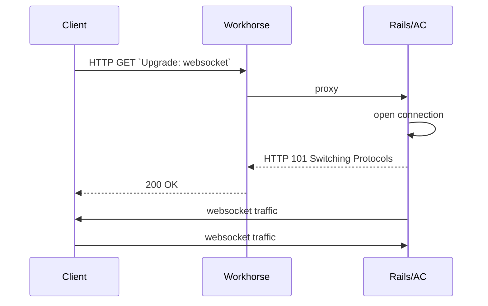

## Introduction

This document captures the design decisions behind the current implementation of real-time features in GitLab. It is adapted from the description and discussion within issues in [this epic](https://gitlab.com/groups/gitlab-org/-/epics/3056).

## The Problem

We want to implement real-time issue boards but the current way of doing real-time (polling with ETag caching) would not work well with it. We'd have to track a lot of things in an issue board (lists changing, issues within lists changing, etc..) and polling for each of those isn't feasible due the number of requests that would be required and the resultant load on server nodes and the database. It is possible to use just one polling endpoint, but it just makes the code harder to understand.

Polling is also not very real-time unless polling intervals can be dropped substantially.

Even pages that successfully use multiple polling requests; such as the MR page for title and description, notes, widgets, and so on, would benefit from faster updates.

<!--
We decided to explore Pub/Sub messaging systems because it would make these simpler. On a page, we could subscribe to multiple channels / events and they would go through one connection.

This could also potentially take some load off Redis and our web servers when we eliminate those polling requests. We'd have extra load going to the websocket server and Redis for Pub/Sub but I think that's more efficient so we'd still see a gain overall.
-->

## Objectives

The objective is to implement a real-time solution that satisfies the following criteria:

- Enables low-latency, bidirectional communication between client and server;
- Deployable on self-managed instances of all sizes and GitLab.com at scale;
- Optional and degrades gracefully;
- Safely isolated from critical infrastructure;
- Reuses existing code and established technology (i.e. is a [boring solution](/handbook/values/#boring-solutions)) where possible; and
- Facilitates an iterative approach, starting with a small, low-risk feature.

This objective is an iterative step in the long-term plan to implement real-time collaboration.

## Solution Proposed

We will roll out the use of WebSockets by starting with a small, relatively low-risk feature. When we've identified and solved the problems of maintaining WebSocket connections at scale and captured the lessons of designing a feature for persistent connections, we'll produce documentation that will allow other developers to work on real-time features.

The initial feature is [viewing assignees on issues in real-time](https://gitlab.com/gitlab-org/gitlab/-/issues/17589) and the chosen technology is Action Cable.

### How it works

For the simplest deployments, [enabling Action Cable](https://docs.gitlab.com/omnibus/settings/actioncable.html) enables the first feature by default.

The feature can also be toggled using two feature flags:

| | |
| --- | --- |
| `real_time_issue_sidebar` | Attempts to establish a WebSocket connection when viewing an issue and responds to update signals |
| `broadcast_issue_updates` | Broadcasts a signal when an issue is updated |

Sometimes, the nodes serving Web requests aren't the same ones serving WebSocket connections (see "How to implement it on premise") so don't have Action Cable enabled. The feature flags can be used to enable the feature explicitly.

This diagram shows the current steps involved in establishing an open WebSocket connection for bidirectional communication. This is subject to change as work progresses.

1. The client sends a connection upgrade request to `/-/cable`;
1. Workhorse proxies this to the correct backend (set using the `cableBackend` option, defaulting to `authBackend`);
1. The backend responds with 101 Switching Protocols and upgrades the request;
1. The client subscribes to the channel(s) it's interested in (`IssuesChannel`, specifying `project_path` and `iid`);
1. The server confirms subscription and publishes a signal when an update is made to the issue; and
1. The client responds by **requesting up-to-date state via GraphQL**†.

†: This step is especially subject to change as we consider using GraphQL Subscriptions instead.

### How it solves the problem

### Prototype model / Testing plan

The feature is currently available for internal team-members to demo on the dev.gitlab.org instance. This is a [single-instance deployment of CE](/handbook/engineering/infrastructure-platforms/gitlab-delivery/distribution/maintenance/dev-gitlab-org/#devgitlaborg).

[Performance testing Action Cable with Puma](https://gitlab.com/gitlab-org/quality/performance/-/issues/256) determined no impact on resource usage but only tested while idle. In the absence of simulated workloads, the recommendation was to [roll the feature out gradually](https://gitlab.com/gitlab-org/quality/performance/-/issues/256#note_444323391).

An end-to-end test for real-time assignees was added in [this MR](https://gitlab.com/gitlab-org/gitlab/-/merge_requests/44214).

### How to implement it on premise

Instance administrators have a number of options for using Action Cable. The simplest way is to serve WebSocket connections from existing nodes, and this is enabled by default since [14.5](https://gitlab.com/gitlab-org/gitlab/-/merge_requests/71953).

While extensive testing and experience supporting WebSockets at scale on large deployments internally indicate [this is probably not necessary](https://gitlab.com/gitlab-org/quality/performance/-/issues/256), administrators of larger deployments may wish to proxy WebSocket connections to a separate set of nodes to protect their main Web nodes from saturation. This can be done by splitting WebSocket traffic at the load balancer or ingress stage, typically based on path. This is the method used for gitlab.com.

Only embedded mode is supported for Action Cable. Even when splitting traffic, all nodes are running full GitLab Web processes with Action Cable enabled. See the decision to support only embedded mode [here](https://gitlab.com/gitlab-org/gitlab/-/issues/214061).

It's important to note that Action Cable channels (similar to controllers) can do anything that can be done in the web context; such as using models or reading from the cache, so it is important that these processes are treated like existing web processes. They should have the same configuration and should be able to connect to the DB, Redis cache, shared state, sidekiq, etc. Although we probably would just be doing permission checks in the initial implementation, it could be a source of weird bugs in the future if these dependencies aren't setup properly.

### How to implement it on .com

1. Infrastructure supporting WebSocket connections will run in Kubernetes;
1. WebSocket traffic is [split by path](https://gitlab.com/gitlab-org/charts/gitlab/-/issues/2334) to a separate, independently scalable deployment; and
1. Pods servicing WebSocket connections run ordinary `webservice` processes with Action Cable enabled.

Initially, nodes serving Web requests did not have Action Cable enabled on gitlab.com. The feature had to be controlled using the feature flags `:real_time_issue_sidebar` and `:broadcast_issue_updates` and these were used to roll-out in a controlled way. This setup was simplified so that nodes have Action Cable enabled, regardless of whether they serve WebSocket requests or Web requests. This allows the nodes serving Web requests to know that Action Cable is available without relying on a feature flag.

### Monitoring

- Prometheus metrics on thread pool size and active connections are sampled by the [ActionCableSampler](https://gitlab.com/gitlab-org/gitlab/-/blob/master/lib/gitlab/metrics/samplers/action_cable_sampler.rb).
- Additional metrics implemented in [gitlab-org/gitlab#296845](https://gitlab.com/gitlab-org/gitlab/-/issues/296845) will allow instance administrators, including on GitLab.com, to capture useful metrics suitable for building a standard service dashboard; such as message counts and sizes.
- GitLab.com has (internal) dashboards for [WebSocket SLIs](https://dashboards.gitlab.net/d/websockets-main/websockets-overview?orgId=1), Kubernetes [containers](https://dashboards.gitlab.net/d/websockets-kube-containers/websockets-kube-containers-detail?orgId=1) and the overall [deployment](https://dashboards.gitlab.net/d/websockets-kube-deployments/websockets-kube-deployment-detail?orgId=1).

### Possible Costs

Based on the rollout of the first real-time feature, the current esimated cost per connection at peak is $0.02 (USD) per month.

This figure is derived by dividing total cost of WebSocket nodes by the number of concurrent connections at peak, visible on [this chart](https://dashboards.gitlab.net/d/websockets-main/websockets-overview?viewPanel=1357460996&orgId=1&from=now-24h&to=now) (internal). It does not take into account load on downstream services, such as the primary database or Redis. It is most likely an over-estimation and expected to decrease as connections are added, as the current nodes can support more connections.

### Alternatives Considered

Action Cable was the first choice because it is included with Rails. Scalability is a known concern but if it becomes a problem Anycable implements the same API. We could switch to that in the future with minimal to no changes in the application code.

1. Long-polling / Server-sent Events (SSE)

   Both long-polling and SSE have the problem detailed above with having to poll / request multiple endpoints. Also, even if we do this, we'd have to implement some custom backend logic similar to our current ETag caching that checks Redis or something similar. It's not worth it when ActionCable provides the full stack.

   The [message_bus](https://github.com/discourse/message_bus) gem implements multiple subscriptions in one polling endpoint. But since we're planning to do real-time collaboration which would need lower latencies and bi-directional communication, it's better to just go with websockets directly.

1. Go / Erlang / Elixir websocket servers

   It is known that these languages are better than Ruby at concurrency but without booting our Rails app / Ruby libraries, we can't reuse the code we already have; for example, permissions checks. These are complex and very easy to get wrong so we definitely don't want to re-implement this. We could do a separate API call to our Rails backend but more on that below.

1. Anycable

   Anycable has websocket servers in Go / Erlang and it solves the problem of not having Rails context by using gRPC. The downside is that we'd have to spin up another gRPC server which boots our Rails app. This complicates our infrastructure setup and would take longer to setup everything that's needed. This option was discussed in [this issue](https://gitlab.com/gitlab-org/gitlab/issues/21249).

   Since it is easy to switch to this later on if needed, we decided to defer this and start with Action Cable.

1. Other Ruby websocket servers (Faye)

   Gitter uses this and we looked into this briefly but we didn't really have a strong reason to choose this over Action Cable.

### Documentation

- [Omnibus settings](https://docs.gitlab.com/omnibus/settings/actioncable.html)
- [Real-time issue sidebar user documentation](https://docs.gitlab.com/ee/user/project/issues/managing_issues.html#real-time-sidebar)
- [Developer Documentation](https://docs.gitlab.com/ee/development/real_time.html)
- [Performance testing](https://gitlab.com/gitlab-org/quality/performance/-/issues/256)
- [Readiness review for GitLab.com](https://gitlab.com/groups/gitlab-com/gl-infra/-/epics/355)
