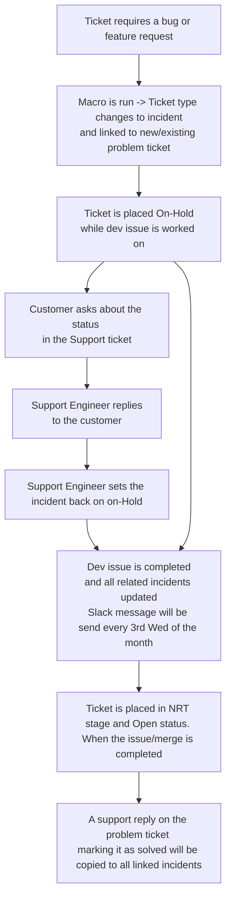

## What is Dev Pulse?

Dev Pulse is the name for a set of scripts and Zendesk setups we utilize to
actively monitor issues and merge requests for bug resolution or feature request implementation.

Through all its components, Dev Pulse allows a Zendesk ticket to stay in the
`On-hold` status while waiting on an issue or merge request to reach a specific state.

When the specific state is reached, the tickets within Zendesk using Dev Pulse
are updated to indicate there has been a state change on the issue or merge
request they were waiting on.

Implementation details about Dev Pulse can be found in the [documentation](/handbook/security/customer-support-operations/docs/zendesk/dev-pulse).

## How does it work?

## Using it

1. Add the link to the bug issue or MR in the Zendesk ticket field
   `Waiting on issue or merge request`. Make sure to remove any extra parameters
   from the URL (anything after the IID of the issue or MR)

1. Take the following steps depending if you have an issue or MR:

- Bug Issue or related MR
Apply the macro `General::Waiting on bug resolution`

- Feature request issue or related MR
Apply the macro `General::Waiting on feature request resolution`

- [Request for Help (RFH) issue](../workflows/how-to-get-help.md)
Apply the macro `General::Waiting on RFH`

1. The macro will set your ticket status to `On-hold`, just submit the update to start the process.

### What views are available for Dev Pulse

#### Bug or feature request tickets

Tickets waiting on bug/feature request resolution      

#### Links to bugs or feature requests

Parent problem tickets

#### RFH tickets

Tickets waiting on a request for help

## Viewing and reporting on this

- [Explore dashboard](https://gitlab.zendesk.com/explore/dashboard/8A40804AF5438788D3839999DC2751523E962D04C5CD07AC4040B4108BB90B4F)

### Can I bulk update all tickets associated with the same MR or issue?

Yes, A parent problem ticket is created for each issue or merge request to 
group all related support tickets that are dependent on the same bug 
or feature request.

When the parent problem ticket is updated, all linked tickets 
(i.e., those awaiting resolution of the same issue or MR) will also be updated.

To ensure this process works as intended, follow these steps:

1. Type out the public comment you wish for all the attached tickets to use
1. Click `Submit as Solved` at the bottom-right of the ticket page
1. Read through the popup modal that appears
1. Click `Solve this ticket and xxx linked incident(s)` to submit the update

### What do I do if I want to stop using this on a ticket already using it?

As this requires a very specific set of steps, please request this be done by
the Support Readiness team by posting in the
[#support_operations](https://gitlab.enterprise.slack.com/archives/C018ZGZAMPD)
Slack channel.

### What do I do if the related issue or MR was marked as a duplicate or moved?

When this happens, you certainly don't want to mass update the customers just to
say the issue/MR was not actually resolved. Instead, we should update the
issue/MR link being used and start monitoring that new one.

As this requires a very specific set of steps, please request this be done by
the Support Readiness team by posting in the
[#support_operations](https://gitlab.enterprise.slack.com/archives/C018ZGZAMPD)
Slack channel.

### How to re-initiate the process on a ticket

If you need to restart the process, follow the above instructions for
your type of situation again. The macro and setup will accommodate for
it.
