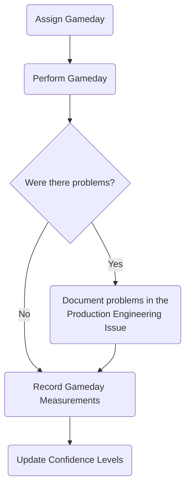

## Purpose

There are many reasons to test and practice our disaster recovery process for GitLab.com.

1. Ensure our processes work as expected.
1. Keep up with changes that could break or complicate our recovery processes.
1. Increase confidence and knowledge of these processes for those who participate in the on-call rotation.
1. Satisfy compliance requirements around validation of disaster recovery scenarios.

## Overview

These practices are often referred to as `DR gamedays` or just `gamedays`.
Currently, our DR gamedays focus on zonal recovery scenarios, and each one focuses on a specific component.
During a real zonal failure, these gamedays should be capable of being executed in parallel to save time.

### Gameday Assignment

Each quarter, each`Phase 1` component gameday process is assigned to a participating team.
This allocation should help us test each process once a quarter.

1. The Ops team will create issues in the [Production Engineering](https://gitlab.com/gitlab-com/gl-infra/production-engineering) issue tracker.
1. This issue is assigned to the next team in order to perform the practice.

### Performing the Gameday

1. Create a gameday change issue using the appropriate template.
1. Review the process and consult the Ops team if any part of the process is unclear.
1. Schedule the gameday, seeking out proper review and approvals for the change.
1. Execute the gameday.
It is recommended to work with a reviewer during the process to record problems, timing, and approving merge requests during the process.

### Reporting Gameday Process Issues

Compile any feedback from the gameday and update the Production Engineering issue.
The Ops team member who created the issues will be the directly responsible individual tasked with incorporating the feedback into future practices.

### Recording Gameday Results

Open merge requests to update the timing and execution information from the gameday.

[DR Practice Measurements](https://gitlab.com/gitlab-com/runbooks/-/blob/master/docs/disaster-recovery/recovery-measurements.md)

### Updating Confidence Levels

As services change, and processes are improved, the ops team is tasked with managing the confidence level measurements.
