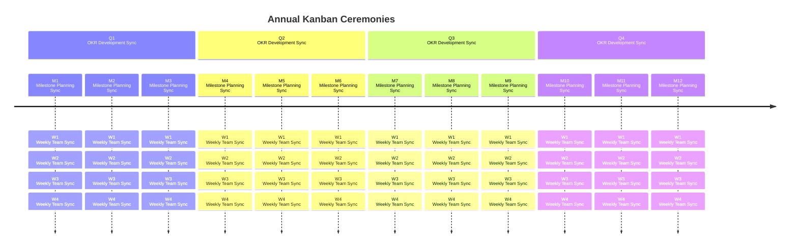
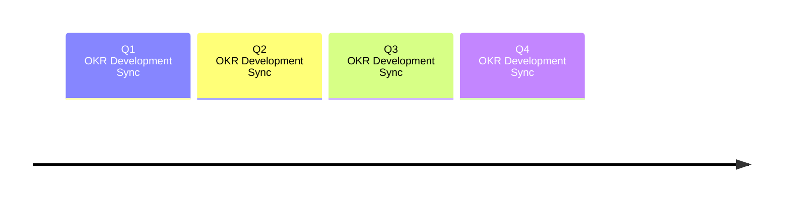
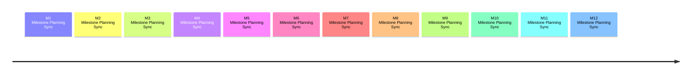

## Dynamic Analysis

The Dynamic Analysis group at GitLab is charged with developing solutions which perform [Dynamic Analysis Software Testing (DAST)](https://about.gitlab.com/direction/application_security_testing/dynamic-analysis/dast/) and Fuzzing. Our work is a mix of open and closed source code.

### Mission

To support the success of GitLab by developing highly usable, hiqh quality tools for customers to build more secure software. The Dynamic Analysis group at GitLab is charged with developing solutions which perform API Security Testing, Dynamic Analysis Software Testing (DAST) and Fuzzing.

### Top Priorities (FY25)

**Theme: Increase adoption**

- **Unify DAST offerings** - Reduce confusion by removing proxy-based DAST and maturing browser-based DAST by adding active checks and improving performance

- **API Discovery** - API discovery will analyze applications to produce an OpenAPI document describing the web APIs expected behavior. This schema document is then used by API Security testing (formerly called DAST API) to perform security scans.  Automating this will close the gap for customers whose applications include web APIs that haven't been documented and aren't being tested today.

- **API Security Checks refresh** - Comprehensively review and update API Security Testing checks (rules).  By ensuring we address both the OWASP API Security Top 10:2023 and the OWASP Top 10:2021 (web applications), our customers will be confident in our ability to detect critical risks.

- **DAST Performance** - Deduplicate scanning similar pages to reduce DAST scan times without reducing security coverage. Long scan times are a major barrier that discourages customers from incorporating DAST scans into DevSecOps processes.

### Customer outcomes We are Driving

The Dynamic Analysis team builds features for our API Security, DAST, and Fuzzing categories.  These features enable our Ultimate customers to incorporate security testing earlier in the development lifecycle for their web applications and APIs. By identifying vulnerabilities earlier in the SDLC, we enable customers to more efficiently reduce the security risks in their web apps and APIs.

Our features identify vulnerabilities in different ways than GitLab's other security analyzers do, and each tool should be used in tandem with other security analyzers such as SAST, SCA (dependency scanning), and secret detection to provide full coverage.

API Security, DAST, and Fuzzing are Ultimate features. Increasing adoption of these features helps improve customer retention, and helps drive revenue for GitLab Ultimate.

### Important DAST Repositories

| Repo | Purpose |
| ---- | ------- |
| [DAST](https://gitlab.com/gitlab-org/security-products/dast) | The DAST Analyzer which is deployed as a docker image. |
| [Browserker](https://gitlab.com/gitlab-org/security-products/analyzers/browserker) | Private - GitLab's DAST browser-based analyzer. |
| [DAST CWE Checks](https://gitlab.com/gitlab-org/security-products/dast-cwe-checks) | Private - DAST browser-based analyzer vulnerability definitions. |
| [DAST Chromium](https://gitlab.com/gitlab-org/security-products/dast-chromium) | Private - DAST browser-based analyzer dependencies, such as the Chromium browser. |

### Important Fuzzing repositories

| Repo | Purpose |
| ---- | ------- |
| [API Security](https://gitlab.com/gitlab-org/security-products/analyzers/api-fuzzing-src) | Private - The API Security tool performs API Fuzzing and API DAST scans. |
| [GitLab Protocol Fuzzer (CE)](https://gitlab.com/gitlab-org/security-products/protocol-fuzzer-ce) | GitLab's Protocol Fuzzer (Community Edition), previously Peach Protocol Fuzzer. |
| [GitLab Protocol Fuzzer (EE)](https://gitlab.com/gitlab-org/security-products/protocol-fuzzer-ee) | Private - GitLab's Protocol Fuzzer (Enterprise Edition), previously Peach Protocol Fuzzer, includes licensed components. |
| [API Fuzzing E2E Tests](https://gitlab.com/gitlab-org/security-products/tests/api-fuzzing-e2e) | Private - API End to End Tests. |
| [GitLab Cov Fuzz](https://gitlab.com/gitlab-org/security-products/analyzers/gitlab-cov-fuzz-src) | Private - GitLab's coverage fuzzing orchestration that integrates fuzzing engines/results with GitLab CI and GitLab Security Dashboard. |
| [HAR Recorder](https://gitlab.com/gitlab-org/security-products/har-recorder) | A utility to record HAR files based on web traffic. |

#### Open Source Fuzzers

| Repo | Purpose |
| ---- | ------- |
| [JSfuzz](https://gitlab.com/gitlab-org/security-products/demos/coverage-fuzzing) | Javascript Fuzzer. |
| [Pythonfuzz](https://gitlab.com/gitlab-org/security-products/demos/coverage-fuzzing) | Python Fuzzer. |
| [Javafuzz](https://gitlab.com/gitlab-org/security-products/demos/coverage-fuzzing) | Java Fuzzer. |
| [Coverage Fuzzing Examples](https://gitlab.com/gitlab-org/security-products/demos/coverage-fuzzing) | Coverage fuzzing examples in 7+ languages/Fuzzers. |

## How to Contact Us

- Slack channel: #g_ast-dynamic-analysis, #f_ast-api-security, #f_ast-fuzz-testing
- Slack alias: @secure_dynamic_analysis_be
- Google groups: dynamic-analysis-be@gitlab.com
- GitLab mention: @gitlab-org/secure/dynamic-analysis-be

### Support Requests

The Dynamic Analysis engineering team provides support to GitLab Support Engineers [following the process outlined in the Sec Section support project](https://gitlab.com/gitlab-com/sec-sub-department/section-sec-request-for-help/).

### Other Contact

The DAST team also monitors #s_application-security-testing and #sec-section. Both these channels are for wider AST topics, however are a good place to start if you are not sure which group in AST to contact.

## How We Work



The Dynamic Analysis group works according to Kanban principles, with the addition of ceremonies quarterly for OKR development, monthly for release planning, and weekly for syncing on epic and issue reacting, triaging, refinement, impediment resolution. By having the team operate and think at each of these cadences, it can effectively set high-level hierarchical goals, ensure product priorities are planned, and prevent epics and issue work from stalling or falling through the cracks.

### Hallway Monitor Bot

For all quarterly, monhtly, and weekly Kanban ceremonies, the [Hallway Monitor Bot](https://gitlab.com/gitlab-org/secure/tools/gitlab-bot-hall-monitor) is our guiding star, allowing the team to pontificate and plan at all cadences, ensuring we get ahead of future work. The bot will schedule quarterly OKR review meetings, monthly release planning and retro meetings, and will update or weekly sync guide with the latest team member assigned to the temporary reaction rotation role. We should strive to automate as many of our business process as possible, and the Hallway Monitor Bot [Configuration](https://gitlab.com/gitlab-org/secure/tools/gitlab-bot-hall-monitor/-/blob/main/deploy/gitlab-bot-hall-monitor.yaml?ref_type=heads) and [Templates](https://gitlab.com/gitlab-org/secure/tools/gitlab-bot-hall-monitor/-/tree/main/deploy/templates?ref_type=heads) allow for many of your automation ideas. Please help contribute to the bot to help keep our team as efficient as possible.

### Quarterly OKR Development



Four weeks before the end of a fiscal quarter, our bot will automatically create an OKR planning issue for the group and schedule a calendar event.

The group will get together two weeks before the next quarter begins to create and review [all OKRs for which the team will ultimately be responsible](https://gitlab.com/gitlab-com/gitlab-OKRs/-/issues/?sort=created_date&state=opened&label_name%5B%5D=group%3A%3Adynamic%20analysis&first_page_size=20). This includes reviewing all ancestor OKRs for the stage and up, creating or updating any new or existing OKRs with additional details, and assigning DRIs to each OKR to assist with health updates.

#### Important Links

- [List of Team Objectives & Key Results](https://gitlab.com/gitlab-com/gitlab-OKRs/-/issues/?sort=created_date&state=opened&label_name%5B%5D=group%3A%3Adynamic%20analysis&first_page_size=20)
- List of Stage Objectives & Key Results (Coming Soon)
- List of CEO Objectives & Key Results (Coming Soon)

#### Quarterly Outputs

- Polished OKRs for the group with assigned DRIs
  - Links to any associated epics or issues

### Milestone Release Planning



Two weeks before a release milestone is kicked off, our [Hallway Monitor Bot](#hallway-monitor-bot) will automatically create a monthly release planning issue for the group and schedule a calendar event. This issue serves as the Kanban backlog for the milestone, aligning PM priorities with the EM and all of the ICs. The issue is divided into three sections:

- **Work to Release** - all work that we are committing to release during this milestone
- **Work to Start/Continue** - new work being brought in or existing work rolling over from a previous milestone
- **Work to Blueprint** - work that needs high-level planning and breakdown this milestone before development work in the next milestone

On the date of a release milestone kick-off, we will review the list of [Dynamic Analysis Group direction priorities](https://about.gitlab.com/direction/application_security_testing/dynamic-analysis/#priorities) with product and ensure all of the priorities for the current milestone are reflected in the monthly release planning issue in the "Work to Release" and "Work to Start/Continue" sections. Medium to large sized bodies of work identified for the next milestone by our PM should be added to the "Work to Blueprint" section for high-level blueprinting and breakdown of the work for pick-up in the next milestone.

Product sets all of our high-level priorities, and in addition to the above, another output from this kick-off meeting can be an MR update to direction page with an updated mapping of each priority to a group issue/epic and/or targeted milestone. This process allows for the EM and ICs to give direct feedback to our PM for how we'd like to organize the work and which milestone we think we can get to future roadmap items.

All product priority-based issues will exist alongside our comprehensive [list of all Dynamic Analysis Group issues](https://gitlab.com/groups/gitlab-org/-/issues/?sort=created_date&state=opened&label_name%5B%5D=group%3A%3Adynamic%20analysis&label_name%5B%5D=Category%3ADAST&first_page_size=20). All product priority-based epics will exist alongside our comprehensive [list of all Dynamic Analysis Group epics](https://gitlab.com/groups/gitlab-org/-/epics?state=opened&page=1&sort=start_date_desc&label_name%5B%5D=group::dynamic+analysis&label_name%5B%5D=Category:DAST).

To complete this mapping, product priority-based issues or epics should be created in `gitlab-org/gitlab` or `gitlab-org` (respectively) with the same title of the priority and the following labels. The `type::feature` label is what distinguishes a product priority from other group epic work.

```text
/label ~"section::sec"
/label ~"devops::application security testing"
/label ~"group::dynamic analysis"
/label ~"type::feature"
```

#### Milestone Retrospectives

After the completion of any milestone, the planning issue for that milestone is used to capture team retros in the comments. Before the next milestone planning kickoff meeting, each team member should answer the following questions in a comment on that issue:

- 👍 what went well this release?
- 👎 what didn't go well this release?
- 📈 what can we improve going forward?
- 🌟 what praise do you have for the group?

#### Important Links

- [Dynamic Analysis Group Direction Priorities](https://about.gitlab.com/direction/application_security_testing/dynamic-analysis/#priorities)
- [List of all Dynamic Analysis Milestone Planning Issues & Retros](https://gitlab.com/gitlab-org/gitlab/-/issues/?sort=created_date&state=all&label_name%5B%5D=group%3A%3Adynamic%20analysis&label_name%5B%5D=type%3A%3Aignore&search=%20%F0%9F%93%90&first_page_size=20)

#### Milestone Outputs

- MR to update the group direction with all priorities and targeted releases
  - Links to polished epics or issues for each product priority
    - Flush out as many child epics and issues tagged to milestones as possible (or a single blueprinting issue)
- Team retrospective comments will be reviewed inside of the previous milestone's planning issue

### Weekly Huddles & Reaction Coordination

#### Monday's Developers Huddle

Every Monday, a calendar event with an attached agenda exists for a synchronous development group meeting. This meeting is **engineering focused** and includes all engineers on the team and the engineering manager. The purpose of this meeting is to discuss development efforts, strategies, tooling, active MRs, and to guide each other's coding and review efforts. Additionally, the team will discuss all of the active blueprinting items defined in the current [milestone planning issue](#milestone-release-planning), using this time to discuss implementation plans, spikes, and architectural decisions; all in hope of establishing epics and issues for work in the next milestone.

#### Tuesday's General Huddle

Every Tuesday, a calendar event with an attached agenda exists for a synchronous general group meeting. This meeting is **product focused** and includes all engineers on the team, the engineering manager, and the product manager. The purpose of this meeting is to discuss product efforts, timelines, and serves as a direct two-way feedback mechanism between product and the engineering team. We will review the current [milestone planning issue](#milestone-release-planning) as our transient backlog and ensure that we are staying focused on these priorities. The group will also rotate to a new Reaction Coordinator, discuss any unresolved and significant/product impediments blocking the team, and host general discussions valuable to a synchronous team meetup with our product manager.

## Reaction rotation

On top of our development roadmap, engineering teams need to perform tasks related to vulnerability management, support, maintenance, community contributions.

The [rotation schedule](https://gitlab.com/groups/gitlab-org/secure/-/epics/7) follows the development cycle, which means using the start/end dates from the GitLab [product milestones](/handbook/product/product-processes/milestones/). When creating the schedule, the Engineering Manager should aim to minimize the number of back-to-back rotations that engineers do.

### Request For Help (RFH) Resolution Guide

This guide outlines the standard procedure for handling and resolving Request For Help (RFH) issues. Following these guidelines ensures consistent customer service and proper issue management.

Engineers participating in reaction coordination must make sure there GitLab handles are included in the RFH template so they are notified when a new RFH is opened.

When a new RFH is opened the reaction coordinator will be assigned and starts the investigation. If the reaction coordinator rolls off reaction coordination before the RFH is completed, the RFH should be handed off to an incoming reaction coordinator.

**At least once, each milestone**, the Reaction Coordinator is responsible for triaging existing RFH issues.

1. Has an engineer engaged with the RFH? If not, assign RFH to one of the reaction coordination engineers to work on.
1. Is the RFH a candidate to be closed? If so, close the RFH issue with any needed notes.
1. Check zendesk for latest customer response.

#### When to Close an RFH

RFH issues can take a long time to resolve with numerous back and forth communications between engineering, support, and the customer. Sometimes customers will stop responding if they get past the issue, a workaround works, or they decide to stop investing in the support case. To limit the amount of issue maintenance that is required, RFH issues should be closed when there are no more steps to be performed or when the last step is a confirmation from the customer. When the last step is a confirmation from the customer close the issue with a message similar to:

`Closing this issue out as a fix/workaround has been provided. Please feel free to re-open this issue if provided solution doesn't work or the customer has additional questions/concerns.`

This prevents engineers from having to circle back and close out issues if the customer never responds.
It also helps keep our KPIs looking good (how many RFHs are open, how long to resolve).

An RFH issue can be closed under the following circumstances:

1. Confirmed resolution
    - The customer has confirmed the issue has been resolved

1. High confidence workaround or resolution
    - Engineer provides a high confidence workaround or resolution
    - Engineer closes issue with a note to reopen if the workaround or resolution doesn't work

1. Feature request backlog
    - The RFH is for a feature that cannot be prioritized immediately
    - An issue has been created in the backlog
    - The backlog issue has been linked to the original RFH
    - A note has been added to the RFH pointing to the linked issue
    - Engineer closes issue

1. Immediate Implementation
    - The issue has been worked on immediately
    - Changes have been merged and are ready for customer testing
    - Engineer closes issue with a note to reopen if the workaround or resolution doesn't work

1. No Customer Response
    - The RFH has received a response from support
    - There has been no customer reply for a prolonged period (15 days)
    - Engineer closes issue with a note to reopen if the customer responds

#### Best Practices

- Acknowledge receipt of new RFH issues promptly
- Set clear expectations about resolution timeframes
- Link related issues or documentation when applicable
- Provide detailed explanations when closing issues to ensure knowledge transfer

#### Issue Status Monitoring

Regular review of open RFH issues should be conducted to ensure no issues remain unaddressed for extended periods.

### Vulnerability Management

1. Triage vulnerabilities reported on the projects we maintain and help resolving them depending on their priority. (See [Security vulnerabilities triaging process](#security-vulnerabilities-triaging-process))
1. Check for `SLA::Breached` issues.
1. Check for security [automation failures](/handbook/engineering/development/sec/secure/#automation-failures)
1. Check for new security releases of our dependencies and ensure we use them:
   1. Upstream scanners (see [Updating an upstream scanner](/handbook/engineering/development/sec/secure/composition-analysis/#updating-an-upstream-scanner))
   1. Container base images
   1. Application dependencies
   1. Programming language
1. Refine scheduled security issues.
1. Consider creating or updating any automation or tooling (related to security, maintainership or support!)

### Security vulnerabilities triaging process

We are responsible for triaging vulnerabilities reported on 2 sets of projects: the projects maintained by GitLab and the upstream scanner software we might depend on. Though, we have different processes that apply depending on the situation.

See the [Application Security Testing sub-department vulnerability management process](/handbook/engineering/development/sec/secure/#vulnerability-management-process).

#### Security Policy

We prioritize findings by their CVSS severities and [SLAs](../../../../../security/product-security/vulnerability-management/sla/). Start with `Critical` and `High` but also look for issues that are connected to [vulnerabilities](https://gitlab.com/gitlab-org/gitlab/-/issues/?sort=created_date&state=opened&label_name%5B%5D=type%3A%3Abug&label_name%5B%5D=bug%3A%3Avulnerability&label_name%5B%5D=group%3A%3Adynamic%20analysis&label_name%5B%5D=SLA%3A%3ANear%20Breach&first_page_size=100) and have an `SLA::Near Breach` label. These vulnerabilities might have a lower CVSS score but letting them reach SLA breach will count as 'past due' security issues and affect FedRAMP compliance.

Ensure security issues (for FedRAMP compliance or platform security) are created or updated, either manually or through automation. Follow up with creation of [Deviation Requests](/handbook/security/security-assurance/security-compliance/poam-deviation-request-procedure/) if necessary.

Please utilize all the time you have set aside. If you complete all the ones at Critical and High, please continue to triage - we want to address all findings but we are working in a risk based order.

#### SLA::Breached issues

Sometimes we might have `SLA::Breached` issues that need to be handled ASAP. You can view the number of those issues in the [Tableau dashboard](https://10az.online.tableau.com/#/site/gitlab/views/TopEngineeringMetrics_16989570521080/TopEngineeringMetricsDashboard?:iid=1) (Note: This does not require SAFE access). `SLA::Breached` issue may appear for many reasons including:

- A medium or low vulnerability that is not handled because it never got priority. Please notice that a low vulnerability might lead to a `severity::1` issue since it might get its score from different sources.
- Issues that are never closed even if the relevant vulnerability is resolved or dismissed.

If SLAs are breached, and if an SLA exception request is not already created then create an [SLA exception request](../../../../../security/product-security/vulnerability-management/sla-exceptions/) based on the [circumstance](../../../../../security/product-security/vulnerability-management/sla-exceptions/#when-is-an-sla-exception-request-appropriate).
You can search for `SLA::Breached` issues in the issue tracker using the following label filters:

- [Severity 1](https://gitlab.com/gitlab-org/gitlab/-/issues/?sort=created_date&state=opened&label_name%5B%5D=type%3A%3Abug&label_name%5B%5D=bug%3A%3Avulnerability&label_name%5B%5D=SLA%3A%3ABreached&label_name%5B%5D=group%3A%3Adynamicn%20analysis&label_name%5B%5D=severity%3A%3A1&not%5Blabel_name%5D%5B%5D=Vulnerability%3A%3AVendor%20Base%20Container%3A%3AWill%20Not%20Be%20Fixed&not%5Blabel_name%5D%5B%5D=Vulnerability%3A%3AVendor%20Package%3A%3AWill%20Not%20Be%20Fixed&not%5Blabel_name%5D%5B%5D=Vulnerability%3A%3AVendor%20Base%20Container%3A%3AFix%20Unavailable&not%5Blabel_name%5D%5B%5D=Vulnerability%3A%3AVendor%20Package%3A%3AFix%20Unavailable&not%5Blabel_name%5D%5B%5D=FedRAMP%3A%3ADR%20Status%3A%3AOpen&not%5Blabel_name%5D%5B%5D=FedRAMP%3A%3ADR%20Status%3A%3AVuln%20Remediated&first_page_size=100)
- [Severity 2](https://gitlab.com/gitlab-org/gitlab/-/issues/?sort=created_date&state=opened&label_name%5B%5D=type%3A%3Abug&label_name%5B%5D=bug%3A%3Avulnerability&label_name%5B%5D=SLA%3A%3ABreached&label_name%5B%5D=group%3A%3Adynamic%20analysis&label_name%5B%5D=severity%3A%3A2&not%5Blabel_name%5D%5B%5D=Vulnerability%3A%3AVendor%20Base%20Container%3A%3AWill%20Not%20Be%20Fixed&not%5Blabel_name%5D%5B%5D=Vulnerability%3A%3AVendor%20Package%3A%3AWill%20Not%20Be%20Fixed&not%5Blabel_name%5D%5B%5D=Vulnerability%3A%3AVendor%20Base%20Container%3A%3AFix%20Unavailable&not%5Blabel_name%5D%5B%5D=Vulnerability%3A%3AVendor%20Package%3A%3AFix%20Unavailable&not%5Blabel_name%5D%5B%5D=FedRAMP%3A%3ADR%20Status%3A%3AOpen&not%5Blabel_name%5D%5B%5D=FedRAMP%3A%3ADR%20Status%3A%3AVuln%20Remediated&first_page_size=100)
- [Severity 3](https://gitlab.com/gitlab-org/gitlab/-/issues/?sort=created_date&state=opened&label_name%5B%5D=type%3A%3Abug&label_name%5B%5D=bug%3A%3Avulnerability&label_name%5B%5D=SLA%3A%3ABreached&label_name%5B%5D=group%3A%3Adynamic%20analysis&label_name%5B%5D=severity%3A%3A3&not%5Blabel_name%5D%5B%5D=Vulnerability%3A%3AVendor%20Base%20Container%3A%3AWill%20Not%20Be%20Fixed&not%5Blabel_name%5D%5B%5D=Vulnerability%3A%3AVendor%20Package%3A%3AWill%20Not%20Be%20Fixed&not%5Blabel_name%5D%5B%5D=Vulnerability%3A%3AVendor%20Base%20Container%3A%3AFix%20Unavailable&not%5Blabel_name%5D%5B%5D=Vulnerability%3A%3AVendor%20Package%3A%3AFix%20Unavailable&not%5Blabel_name%5D%5B%5D=FedRAMP%3A%3ADR%20Status%3A%3AOpen&not%5Blabel_name%5D%5B%5D=FedRAMP%3A%3ADR%20Status%3A%3AVuln%20Remediated&first_page_size=100)
- [Severity 4](https://gitlab.com/gitlab-org/gitlab/-/issues/?sort=created_date&state=opened&label_name%5B%5D=type%3A%3Abug&label_name%5B%5D=bug%3A%3Avulnerability&label_name%5B%5D=SLA%3A%3ABreached&label_name%5B%5D=group%3A%3Adynamic%20analysis&label_name%5B%5D=severity%3A%3A4&not%5Blabel_name%5D%5B%5D=Vulnerability%3A%3AVendor%20Base%20Container%3A%3AWill%20Not%20Be%20Fixed&not%5Blabel_name%5D%5B%5D=Vulnerability%3A%3AVendor%20Package%3A%3AWill%20Not%20Be%20Fixed&not%5Blabel_name%5D%5B%5D=Vulnerability%3A%3AVendor%20Base%20Container%3A%3AFix%20Unavailable&not%5Blabel_name%5D%5B%5D=Vulnerability%3A%3AVendor%20Package%3A%3AFix%20Unavailable&not%5Blabel_name%5D%5B%5D=FedRAMP%3A%3ADR%20Status%3A%3AOpen&not%5Blabel_name%5D%5B%5D=FedRAMP%3A%3ADR%20Status%3A%3AVuln%20Remediated&first_page_size=100)

#### Triaging vulnerabilities

We use the Vulnerability Report with filters to focus on items matching [our policy](#security-policy) and reported on the relevant projects.

1. [Analyzers Vulnerability Report](https://gitlab.com/groups/gitlab-org/security-products/analyzers/-/security/vulnerabilities/?state=CONFIRMED,DETECTED&activity=ALL&severity=CRITICAL,HIGH&projectId=19617580,21351796,40229908,57788406,5964710)

For each item, investigate and either [dismiss](#dismissing-a-vulnerability) or [confirm](#confirming-a-vulnerability) it. I
> Refer to [Vulnerability status definitions](https://docs.gitlab.com/ee/user/application_security/vulnerabilities/#vulnerability-status-values) in case you are unsure of what each of them mean.

##### Triaging vulnerabilities

We use the Vulnerability Report with filters to focus on items matching [our policy](#security-policy) and reported on the relevant projects.

#### Dismissing a vulnerability

When there is no doubt a vulnerability is a false-positive, it can be "Dismissed" unless it related to a FedRAMP image (fips).
Select the "Dismiss" option from the vulnerability status options.
Finally, make sure to comment on the vulnerability status change notification to explain why.

#### Confirming a vulnerability

If the vulnerability impacts a dependency:

1. Evaluate if the dependency (software library, system library, base image, etc.) can be upgraded *or* removed.
1. Set the vulnerability status to "Confirmed".
1. Release a new version of the analyzer with the dependency upgrade/removal and follow the process on [resolving a vulnerability](#resolving-a-vulnerability).
1. If the dependency cannot be updated or removed then [SLA exception](../../../../../security/product-security/vulnerability-management/sla-exceptions/#sla-exception-procedures) can be requested to extend SLA based on the [circumstance](../../../../../security/product-security/vulnerability-management/sla-exceptions/#when-is-an-sla-exception-request-appropriate).

#### Resolving a vulnerability

Upon remediating a vulnerability, it will [automatically be moved to "Resolved"](https://gitlab.com/gitlab-org/security-products/analyzers/analyzers-security-policy-project/-/merge_requests/8) status by the next scan.

##### Responsibilities - Support

1. Monitor slack channels for questions, support requests, and alerts. While other team members may respond to these requests, the engineer assigned to the reaction rotation is expected to handle them primarily.
If a support engineer requests assistance via Slack and it requires investigation or debugging, they should be directed to raise an issue in [a dedicated project](https://gitlab.com/gitlab-com/request-for-help).
    - [#g_ast-dynamic-analysis](https://gitlab.enterprise.slack.com/archives/CKWJP0ZS7)
1. Monitor [Section Sec Request For Help](https://gitlab.com/gitlab-com/request-for-help/-/issues/?sort=created_date&state=opened&label_name%5B%5D=Help%20group%3A%3Adynamic%20analysis&first_page_size=20) project for support requests.
1. Try to resolve issues as much as possible, if you discover that the problem applies to more than one customer - open a public issue and link it. Tag EM/PM.

These items must be triaged continuously throughout the milestone which means they must be checked multiple times a week.

### Daily Look Left & Right Before Dev

On any day, each team member should look left and right on our [Dynamic Analysis delivery board](https://gitlab.com/groups/gitlab-org/-/boards/5719921?label_name%5B%5D=group%3A%3Adynamic%20analysis) before they start developing any new work from the `workflow::ready for development` column, helping to move one issue forward from both directions (2 total). The team follows the workflow states and activities articulated in GitLab's [Product Development Flow](/handbook/product-development-flow/). Looking left involves grabbing an issue from either the `workflow::refinement` or the `workflow::ready for development` columns, whichever has more items, and completing it. Looking right involves grabbing an issue from either the `workflow::in review` or the `workflow::verification` columns, whichever has more items, and completing it. After both issues have been moved to a new column, the team member can start ready work from the `workflow::ready for development`.

The `Look Left & Right Before Dev` strategy ensures that work items aren't getting stuck on our board, that every team member gets a chance to plan, breakdown, and refine issues, and that code reviews and staging/production vefification activities are spread equally across the team. If there is no work to the left, new work can be brought in from our milestone backlog, as defined in our current [Milestone Release Planning](#milestone-release-planning) issue. New work may also be added to the first two columns at any time from sales and support request for help issue, high-priority bugs, and security-related issues.

#### Blueprinting & Design Docs

When there are too few or no work items in the `workflow::refinement` or the `workflow::ready for development` columns, check the current [Milestone Release Planning](#milestone-release-planning) issue for "Work to Blueprint" issues. Assign yourself as a DRI, and assist in scheduling the necessary meetings with the team to review and help blueprint this work for the next milestone. Attempt to create as many child epics and issues as placeholders for eventual planning, breakdown, and refinement. This is a great time for the team to discuss high-level architectural directions, implementation plans, and needs for accomplishing these priorities throughout the next month. All blueprint issues created should receive the following milestone and labels:

```text
/milestone {from mapping}
/label ~"section::sec"
/label ~"devops::application security testing"
/label ~"group::dynamic analysis"
/label `~workflow::planning breakdown`
```

If a bluepriting effort is beyond the scope of the Dyanmic Analysis group, affecting multiple teams, consider adding it as a design document using [this process](/handbook/engineering/architecture/workflow/#design-documents). A list of all architecture design documents at GitLab can be found [here](https://docs.gitlab.com/ee/architecture/).

#### Issue breakdown

Team members are empowered to create new issues, attach them to relevant epics, and collaborate with product management to determine if they are included in current scope.

##### Breakdown principles

Issues are broken down according to the [INVEST mnemonic](https://en.wikipedia.org/wiki/INVEST_(mnemonic)).

- **Independent**, the issue should have minimal to no dependencies so it can be played in isolation of other issues.
- **Negotiable**, the issue should be structured such that the PM can prioritize or deprioritize it with minimal effect on the overall feature.
- **Valuable**, the issue should provide value when released to production.
- **Estimable**, the issue should make clear what is in scope and out of scope so that engineers can provide an estimate.
- **Small**, the issue must fit inside one milestone, ideally, design to delivery should take less than two weeks.
- **Testable**, the issue must be able to be tested. If it can't be tested, it can't be guaranteed to work in future.

##### Vertically Split

Issues should be split vertically rather than horizontally. Splitting vertically means the whole system will do something noticeably different; splitting horizontally results in trying to realize the fullest possible change in an individual component.

For example, imagine there is an epic to a CRUD feature to a site. Issues could be split up and played in the following order:

1. Read. This is independent, negotiable, estimable, small and testable. It is also valuable because in production an engineer could manually create the data to be read by users.
1. Create. This is independent, estimable, and small. It is testable because the Read functionality has already been built. It is valuable because engineers don't need to manually create data anymore, and it is negotiable because a PM may decide that engineers manually creating data is good enough.
1. Delete. Same as above, and it is valuable because engineers wouldn't need to manually delete records in production.
1. Update. Same as above, and it is often deprioritized by PMs because Create and Delete is often good enough.

#### Repeated Tasks

There are several maintenance tasks that need to be completed each milestone. Each iteration, an issue is opened and assigned to an engineer on a rotating basis. Those rotating tasks are:

- Review upstream changes, and open an issue to upgrade DAST if the upstream changes provide important improvements
- Review the [security dashboard](https://gitlab.com/gitlab-org/security-products/dast/-/security/vulnerability_report) for DAST and address all critical and high issues. Review the dashboards for upstream projects, [ZAP](https://gitlab.com/gitlab-org/security-products/dependencies/zaproxy) and [ZAP Extensions](https://gitlab.com/gitlab-org/security-products/dependencies/zap-extensions)

## DAST Technologies

The DAST analyzer we build relies heavily on OWASP's [ZAP](https://github.com/zaproxy/zaproxy) open source software and [ZAP Extensions](https://github.com/zaproxy/zap-extensions). This means the accuracy and quality of the DAST analyzer is impacted by the quality of the underlying OSS.

We [monitor the underlying tools](https://gitlab.com/gitlab-org/security-products/dependencies/zaproxy/-/security/dashboard) for changes and for vulnerabilities.

ZAProxy and ZAP Extensions do not have significant test coverage and therefore changes in those tools could impact DAST in unexpected ways. Since our expectation is that customers run
DAST in a CI environment and stability and security is of utmost importance, we do not necessarily ship the latest ZAP build. We actively review the ZAP changelog and evaluate whether
new updates deliver value to our customers and their use cases. We may ship a [pre-release build of ZAP or a versioned build](https://github.com/zaproxy/zaproxy/releases)
if we determine it contains valuable updates for customers and it passes our CI pipelines.

An assigned backend engineer reviews upstream updates at least monthly to identify new bug fixes or features.
Those changes are presented to the Product Manager for prioritization into DAST.

### New DAST Technologies

The DAST analyzer is migrating towards using exclusively a browser-based DAST tool that is being built by GitLab. The tool has internally been referrred to as Browserker. Browser based DAST was released as GA in 15.7. The browser-based DAST is being delivered iteratively, with each new iteration taking over some parts of analysis previously done by ZAP, with the eventual goal of deprecating ZAP completely.

## Fuzzing Technologies

- The API Security product is built using mostly C# with some small amounts of Python. Our engineers use Windows VMs for development.
- The coverage guided fuzzing team works primarily in Go, but is also responsible for maintaining the open source fuzzers in JSFuzz, Pythonfuzz, and Javafuzz. The team also maintains the fuzzing examples in which we aim to cover all major programming languages.

### Our Approach to Fuzzing

- Fuzzing has one of the largest adoption hurdles of all the AST products. Coverage fuzzing requires customers to write test harnesses, compile applications with special settings and generates highly technical output.

Web API Fuzzing requires generating files that allow the Web API fuzzing tool to know what parts of the application to fuzz.

Our goals is to simplify and reduce as many of the steps that a customer needs to do to get started. We want to focus our efforts on creating samples, defaults, and intelligence that will simplify fuzzing onboarding.

### Community Contributions

The Dynamic Analysis welcomes community contributions. Community Contributors-- please make sure to add the label "group::dynamic analysis" to any Merge Requests or Issues to ensure the Dynamic Analysis team sees your contribution.

Community contributions should get prompt feedback from one of the DAST engineers. All engineers on the DAST team are responsible for working with community contributions. If a team member does not have time to review a community contribution, please tag the Engineering Manager, so that they can assign the community contribution to another team member.

## Dashboards


  



  



  



  


### Targets

For our Merge Request types, we have an initial soft target ratio of 60% features, 30% maintenance, and 10% bugs based on the [cross-functional prioritization process](/handbook/product/product-processes/#cross-functional-prioritization).  This is not a hard target and we expect to see variation in this ratio as we mature and our focus evolves.
