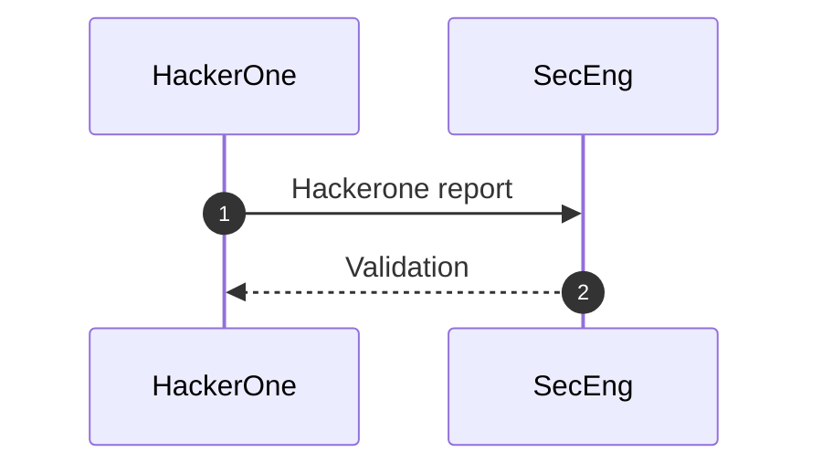
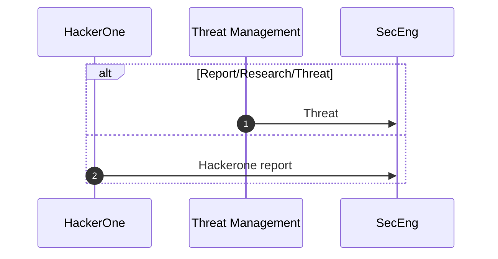

## Overview

This page outlines the Security Division ecosystem, by describing the different processes of our departments.
These processes, represented with diagrams, highlight the data flows between our teams but also with external actors like the Product or the Engineering divisions.

## Objectives

This page describe how to maintain the Security Division ecosystem.

## Scope of the Security Ecosystem

Every process where Security is involved should be documented in this page. Each Security Department is represented and responsible for their own diagrams.

## Process

Diagrams are maintained by the team or department responsible for the process described. The ecosystems should be available in each departments subfolders, so that the [`CODEOWNERS`](https://gitlab.com/gitlab-com/www-gitlab-com/-/blob/master/.gitlab/CODEOWNERS) file is leveraged to require the right approvers. A dedicated page is recommanded for each department, and even each sub-department.

Diagrams referring to non [SAFE](/handbook/legal/safe-framework/) content can be kept in the [internal handbook](https://internal.gitlab.com/handbook/security/).

The Security Division Ecosystem should be maintained and updated as processes are updated to keep it as the single source of truth for these processes.
The Security Leadership will review the ecosystem diagrams prior to every offsite.

### Tooling

In order to maintain consistency across all diagrams and this ecosystem in general, we use the [Mermaid native integration](/handbook/tools-and-tips/#using-mermaid) in GitLab and in this Handbook.

Diagrams were created during the FY24-Q2 Security Leadership Offsite and are available in the [Security Google Drive](https://drive.google.com/drive/u/0/folders/1uekt058WCzwIQjH_d06hjR3RUvR2aVS6) (only available for team members of the Security Division) until they are migrated in the handbook.

While sequence diagrams links are [not yet supported](https://github.com/mermaid-js/mermaid/issues/1279), it can be useful to add links above or below ecosystem diagrams to runbooks or other documentation.

### Guidelines

The Mermaid DSL for sequence diagrams already define how participants and interactions are declared. Use the following guidelines and recomm

#### Sequences numbers

Use [sequence numbers](https://mermaid.js.org/syntax/sequenceDiagram.html) (`autonumber`) to get a sequence number attached to each arrow. This helps the reading of the sequences and let us reference a part of the diagram if necessary.

Example:

#### Alternative paths

You can use alternative paths (`alt`) to express "or" conditions.

Example:

## Resources

- [Mermaid sequence diagrams documentation](https://mermaid.js.org/syntax/sequenceDiagram.html)
- [FY24-Q2 Offsite: Ecosystem diagrams](https://gitlab.com/gitlab-com/gl-security/security-department-meta/-/issues/1645#top) issue related to the creation of this page.
