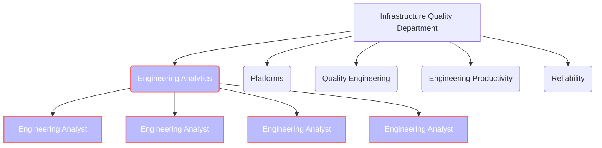

## Vision

Engineering Analytics enables Engineering at GitLab to understand how quickly we are building and evolving our product to meet our customers' needs, and to decide what are the most appropriate balances between cost and effort in building our product.

## Mission

Engineering Analytics is responsible for building and evolving analytics capabilities and creating insights for Engineering to understand how well we are building our product. In this case, "wellness" is measured in terms of efficiency, as well as cost.

Areas of focus and core competencies for Engineering Analytics include:

- Own creation, implementation, optimization, and standardization of the KPIs and metrics for the Engineering Division and its departments.
- Collaborate across Engineering departments to find common themes in KPIs and other metrics, and determine the best ways to represent metrics with these shared or common themes.
- Create new metrics, data analyses, and data visualizations to provide additional clarity for existing operational metrics for Engineering, built on top of the data infrastructure provided by GitLab’s Data Team's.
- Propose strategic improvements to Engineering leadership by analyzing trends and behavior in Engineering's KPIs and metrics.

## Internal Team Responsibilities

In addition to the areas of focus and core competencies listed above, the Engineering Analytics team is continually improving and evolving, in order to keep up with the improvement and evolution of Engineering at GitLab. Areas of focus for the evolution of the team include:

- Collaborate regularly and frequently with Engineering teams in order to understand how various teams' work aligns with the key objectives for each Department
- Collaborate regularly with GitLab's Data Team to ensure that the internal data platform for GitLab continues to meet the needs of Engineering and Engineering Analytics
- Improve our internal team processes so that the Engineering Analytics team can scale along with the rest of Engineering
- Improve documentation of our team's processes and the outcomes we drive in the Handbook

## OKRs

Every quarter, the team commits to [Objectives and Key Results (OKRs)](/handbook/company/okrs/). The below shows current and previous quarter OKRs, it updates as the quarter progresses. Starting February 2023, Engineering Analytics uses GitLab to track progress towards quarterly OKRs.

Here is an [overview](https://gitlab.com/gitlab-com/gitlab-OKRs/-/issues/?sort=created_date&state=opened&type%5B%5D=objective&label_name%5B%5D=Engineering%20Analytics&first_page_size=100) of our current OKRs.

## Team Structure

This team is a function under the Quality Department operating as a team of Engineering Analysts, led by a leader of Engineering Analytics, who in turn reports to the leader of the Quality Department.

## On-boarding

Please open a new issue in [our team project](https://gitlab.com/gitlab-com/quality/engineering-analytics/-/issues/new) using the `on-boarding.md` template.

## Key Reviews

Key Reviews are meetings a department has with other GitLab team members to discuss any progress or updates related to KPIs & OKRs with the rest of the organization. More information can be found on the [Key Review Handbook Page](/handbook/company/key-review/)

In Engineering our key reviews are handbook driven. Each department's KPIs are defined in www-gitlab-com repo under data/performance-indicators, & metrics are in handbook with URL structure like engineering/department/performance-indicators. For example, Infrastructure's [full URL](/handbook/engineering/infrastructure/performance-indicators) is https://about.gitlab.com/handbook/engineering/infrastructure/performance-indicators.

### Performance Indicator DRI

The Performance Indicator [DRI](/handbook/people-group/directly-responsible-individuals/) is an optional attribute in the PI page `.yml` file that specifies an individual as the DRI for a particular KPI/PI.

The DRI is responsible for updating the health & health reasons for the metric. In cases where the health is at problem or attention level, the actions being taken to fix the metric should be specified. The DRI is also responsible for verifying the data & if needed talking with an analyst to make sure the metric is ready for the key review.

The DRI is a delegation of responsibility for the things listed above from the respective department head, although the department head is still generally responsible for all of their PIs.

If no DRI is listed, the default DRI would be the department head.

### Roles & Responsibilities

#### Head of Engineering (CTO)

This position is responsible for defining the division level PIs that are shared across departments or solely at Engineering Division level. They are also responsible for working with department heads on setting targets for these.

#### Department Heads

Department Heads in Engineering are generally responsible for their overall PI page & making sure they have what they need for the metrics before & after the key meetings.

#### Engineering Analysts

Our main role as engineering analysts is to support department heads or DRI in creating or updating their metrics so that they can use them in the key meetings.
Your stable counterpart may also ask to delegate a set of metrics from their department to you so in that case you would also be the DRI for those metrics & assume the responsibilities listed above in DRI section

## How We Work

While this team operates as a single team reporting to one manager, we emphasize on ensuring the prioritization and needs of Engineering Leaders via stable counterparts.

### Counterpart Assignments

The team structure will leverage [stable counterpart](/handbook/leadership/#stable-counterparts) assignees to ensure proper allocation and attention needed to service all Engineering Departments and Leaders and still promote cross-functional collaboration and ownership of an area.

We assign the stable counterpart by Engineering Division’s sub-departments. This is identified by the Engineering Department name assigned to an Engineering Analyst.

| Eng Department | Analyst                                                             | PI Page                                                                                              |
|----------------|---------------------------------------------------------------------|------------------------------------------------------------------------------------------------------|
| Engineering    | Engineering Analytics Team                                          | [Eng PI Page](/handbook/engineering/performance-indicators)             |
| Development    | [Lily](https://gitlab.com/lmai1), [Dani](https://gitlab.com/ddeng1) | [Dev PI Page](/handbook/engineering/development/performance-indicators) |
| Infrastructure | [Clément](https://gitlab.com/clem.lr)                               | [Infra PI Page](/handbook/engineering/infrastructure/performance-indicators) |
| Quality        | [Raul](https://gitlab.com/raulrendon)                               | [Quality PI Page](/handbook/engineering/quality/performance-indicators)      |
| Security       | [Dani](https://gitlab.com/ddeng1)                                   | [Security PI Page](/handbook/security/performance-indicators)                |
| Support        | [Lily](https://gitlab.com/lmai1)                                    | [Support PI Page](/handbook/support/performance-indicators)                  |
| Finance        | [Clément](https://gitlab.com/clem.lr)                               | [Finance PI Page](/handbook/finance/finance-team-performance-indicators/)              |
| Incubation     | [Lily](https://gitlab.com/lmai1)                                    | [Incubation Page](/handbook/engineering/development/incubation/performance-indicators/)  |

Engineering analysts assigned to one area are experts in that area and may not have the knowledge depth in other areas. As such contributing cross-domain expertise will only be limited to Sisense charting and not beyond this data layer.

### Meetings and Scheduled Calls

Aside from the below listed scheduled meetings, the team will also have scheduled 1:1s with other team members and their stable counterpart assignement's department head at a cadence of their choosing to discuss any topics that were not covered in normal status updates or other meetings.

#### Engineering Key Reviews

Each Engineering department has a monthly or bi-monthly [key review](/handbook/company/key-review/) where e-group goes over the department's metrics and can ask the department heads any general questions regarding the department's progress towards its goals. Analysts are expected to go to their stable counterpart's key meeting & participate if needed, & are encouraged to attend other department key reviews as time permits.

- If stable counterpart department head has delegated you as DRI for a particular metric, provide updates during meeting for those metrics.
- Support department heads in metric preparation ahead of reviews
- Capture follow-up asks related to metrics from key review

#### Recurring sync with stable counterparts

Engineering Analysts will hold recurring 1-1 with their assigned VP of an Engineering Department to:

- Review work prioritization
- Capture strategic asks
- Ensure completion of follow up for Key Reviews

#### Bi-Weekly review with GitLab’s Data Team

This team will have standing bi-weekly sync with the Data team to:

- Drive data dependencies to resolution
- Propose initiatives to improve our data accuracy and hygiene

### Issue Boards

- [Engineering Analytics board](https://gitlab.com/gitlab-org/quality/engineering-analytics/team-tasks/-/boards/2650515?group_by=epic)
- [FinOps issue board](https://gitlab.com/gitlab-org/quality/engineering-analytics/finops-analysis/-/boards/5046766?group_by=epic)

### Issue Weighting

These weights are used to estimate analyst time needed to fulfill a request by 1 engineering analyst. This is used when estimating total capacity of work that can be done by the team. If more than 2 weeks needed (>8 weight), then issue needs to be broken down into multiple issues.

| Label Weight | 1 Analyst Time Estimate | Work Example |
| ----------- | ----------- |
| 1 | 1 full day | basic handbook updates, changing basic parameters in Sisense charts|
| 3 | 1/2 week | Creating new Performance Indicator from Data that already exists in data warehouse|
| 5 | 1 week | Creating new dashboard with granular details around existing metric|
| 8 | 2 weeks | introducing new metric based from data source that doesn't currently exist in data warehouse|

### Communicating Priority & Status

#### Status

The Engineering Analytics team uses scoped status labels to track different stages of issues on the board. This is also used to clearly communicate to stakeholders the status of each requests.

| Status | Description |
| ----------- | ----------- |
| `~"eng-analytics::triaging"` | Issue has been ackowledged and we are working through scoping how much work is required to complete the request |
| `~"eng-analytics::scoped"` | Request has been clarified & amount of work required to fulfill request has been identified.|
| `~"eng-analytics::in-progress"` | Issue is actively being worked on |
| `~"eng-analytics::waiting"` | Team is waiting for dependency to complete work to continue progress, or work has been de-prioritized. Issue will also have blocking dependency linked. |
| `~"eng-analytics::in-review"` | Issue has been completed & work is under review by stakeholder|

### Priority

Work is prioritized using table below. Work type is stacked ranked within each priority.

| Priority | Work | Remark |
| -------- | ---- | ---- |
| `~"priority::1"` | Urgent Key Review requests   [Free User Efficiency Rapid Action](https://gitlab.com/groups/gitlab-com-top-initiatives/free-saas-user-efficiency/-/epics/7)   Passedthrough OKRs   Hiring & Onboarding | |
| `~"priority::2"` | Non passthrough OKRs   Walk-up request from Engineering | We have capacity to take this on, OKRs will be prioritized first. |
| `~"priority::3"` | New Data Sources   Walk-up request outside of Engineering | We do not have capacity to take this on at the moment |
| `~"priority::4"` | Nice to have Improvements |  We do not have capacity to take this on at the moment |

### How to Engage with Us

Please reach out to us by opening an issue on the [Engineering Analytics board](https://gitlab.com/gitlab-org/quality/engineering-analytics/team-tasks/-/boards/2650515?group_by=epic) or contacting us in the [g_engineering_analytics](https://gitlab.slack.com/archives/C01UTSNFS3G) slack channel.

#### Creating an Issue

To ensure that the issue gets visibility by our team, when creating an issue on the [Engineering Analytics board](https://gitlab.com/gitlab-org/quality/engineering-analytics/team-tasks/-/boards/2650515?group_by=epic), please add the `~"Engineering Metrics"` label in addition to one of the below labels and ping the [analyst](/handbook/engineering/quality/engineering-analytics/#counterpart-assignments) assigned to that department.

- `~"Eng Metrics::Eng Division"`
- `~"Eng Metrics::Development Department"`
- `~"Eng Metrics::Infrastructure Department"`
- `~"Eng Metrics::Quality Department"`
- `~"Eng Metrics::Support Department"`
- `~"Eng Metrics::Incubation Engineering"`
- `~"Eng Metrics::General"`

#### Slack Channels

| Channel | Purpose |
| ----------- | ----------- |
| [g_engineering_analytics](https://gitlab.slack.com/archives/C01UTSNFS3G) | Channel to discuss team-related work, or for other people to see what's going on with the team & ask any questions related to the team|
| [eng-data-kpi](https://gitlab.slack.com/archives/C0166JCH85U) | Important Announcements related to Engineering Performance Indicators, & forum for external questions to team. |
| [infrafin](https://gitlab.slack.com/archives/C013TFXAVAL) | For questions related specifically GitLab.com hosting cost or other general questions that overlap with infrastructure & finance |
| [development_metrics](https://gitlab.slack.com/archives/C01236LHF1A) | For questions regarding Development Department metrics |

## Performance Indicators

### Engineering Analytics Team Handbook MR Rate

The handbook is essential to working remote successfully, to keeping up our transparency, and to recruiting successfully. Our processes are constantly evolving and we need a way to make sure the handbook is being updated at a regular cadence. This is measured by Merge Requests that update the handbook contents related to the performance indicator pages, our team page, and engineering metrics pages.



