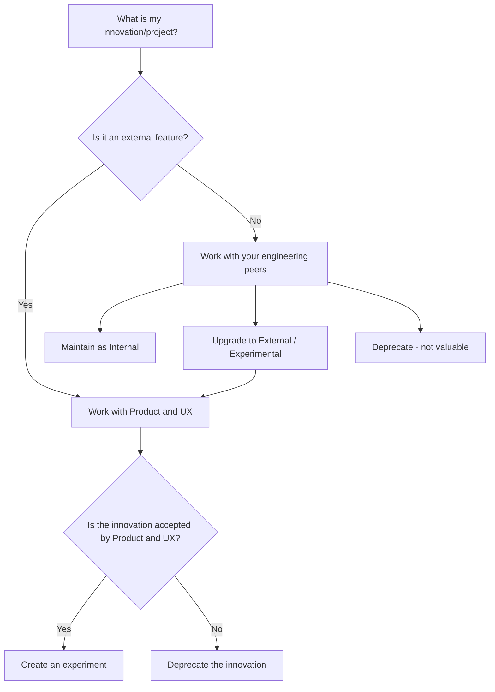

This guide serves as a comprehensive handbook for GitLab team members (engineers, product managers, and designers) who want to create innovations (proofs-of-concept) and share them internally—and eventually, with the public—in a transparent and collaborative way.

## Alignment with GitLab's Strategy

Innovation at GitLab is important: It is a core component of our long-term strategic vision outlined in the [Company Strategy](../company/strategy.md). Our approach of "seed then nurture" ensures that early proofs-of-concepts can evolve into mature features that drive both user adoption and business growth.

This iterative and collaborative guide directly supports GitLab's three-year strategy by bridging short-term proofs-of-concepts with long-range planning. As innovations are refined and scaled, they reinforce our strategic priorities and allow us to adapt dynamically to evolving market trends.

## Table of Contents

1. [Overview](#overview)

1. [Internal vs External Innovations](#internal-vs-external-innovations)

1. [Process: Creating and Managing an Innovation](#process-creating-and-managing-an-innovation)

1. [Sharing Your Innovation](#sharing-your-innovation)

1. [Additional Resources](#additional-resources)

## Overview

Creating an innovation at GitLab means exploring new ideas and building prototypes to create new products or improve our existing products and processes. This guide outlines the steps you should follow, from ideation to sharing feedback, in both internal and external settings. An innovation can be a new feature, feature improvement, innovative use of GitLab feature to show unknown use cases, a new organizational tool, or anything that helps the success of GitLab.

- **Innovation (Proof-of-Concept, or POC):** A prototype created to validate a new idea or potential product feature.

- **Epic Tracking:** We use GitLab Epics to consolidate all tasks and issues related to the innovation under a single board (specifically the "[Innovation at GitLab](https://gitlab.com/groups/gitlab-org/-/epic_boards/2069774?label_name[]=innovation)" board) for transparency and visibility.

> **Note:** Innovations are not yet [*Experiments*](https://docs.gitlab.com/policy/development_stages_support/#experiment) - however, this guide will help your innovation become an experiment if applicable. When an innovation demonstrates success through monitoring metrics and positive feedback, it can be promoted to a full product feature through collaboration with our product organization.

**Good to Know:** The power of POCs lies in their simplicity and ability to quickly demonstrate value. Keep your POCs small and focused:

- Start with the minimum implementation needed to demonstrate the concept.
- Focus on proving technical feasibility and value proposition before full implementation. It's okay to simulate or stub certain components that are known to be technically feasible.
- Examples might include: a new prompt with example outputs, a basic UI mockup, or a simple dataset demonstration.

Remember: The goal is to validate ideas and demonstrate value quickly, not to build a complete feature.

## Internal vs External Innovations

Innovations can be either internal or external. The goal for external innovations is to move your Proof-of-Concept to an [experimental](https://docs.gitlab.com/policy/development_stages_support/#experiment) feature, while internal innovations are focused on improving GitLab's internal operations and team efficiency.

Here is a flowchart outlining the process:

> **Note:** Consult your manager if you're unsure which path your innovation should take.

### Internal Innovations

Internal innovations focus on developing tools, processes, and systems that improve GitLab's internal operations and team efficiency. These innovations:

- Are primarily designed for GitLab team members rather than external customers
- Focus on improving internal workflows, automation, or tooling
- May not require extensive Product or UX involvement in the early stages
- Follow the internal innovation process outlined in this guide

> **Note:** Internal innovations, or components of internal innovations, can sometimes evolve into external features when they demonstrate value that could benefit GitLab customers. In this case, DRIs should initiate collaboration with Product and UX teams and follow the [external innovation](#external-innovations) process outlined in this guide.

### External Innovations

External innovations are focused on developing new features or enhancements for the GitLab product that will directly impact customers. These innovations:

- Are intended to become part of the GitLab product offering
- Directly impact customer experience or user interface
- Should have early collaboration with Product and UX teams
- Should align with product roadmaps and strategic initiatives

> **Important Note:** All external innovations must be clearly labeled with "Proof-of-Concept" or similar.

## Process: Creating and Managing an Innovation

## Step 1: Create a Proposal and Get Approval of Your Manager

1. Create a concise abstract that includes:
    1. Your core idea and vision
    1. The specific problem you're addressing
    1. The anticipated business value and impact with example use cases
    1. Key hypotheses you plan to validate in the timebox
    1. Timeboxed goals with clear targets
    1. Estimated time investment required
1. Be sure to consult your manager before investing time into an idea. Your manager may surface that this work is not well-aligned or is a lower priority compared to other initiatives. Formalize your pitch in a SPIKE issue and obtain explicit manager approval before investing significant time, then work with your manager to identify optimal timing for this timeboxed exploration
1. Consider any cost implications with the innovation, such as infrastructure cost, license cost, and maintenance cost to the best of your knowledge.
1. Additionally, work with your Manager on identifying any other subject-matter-experts that may be attempting to solve the same problem.

### Step 2: Initiate an Epic

- **Create a GitLab Epic:** Start by creating an Epic on the "[Innovation at GitLab](https://gitlab.com/groups/gitlab-org/-/epic_boards/2069774?label_name[]=innovation)" board. This will be the central hub for tracking all aspects of your innovation.

### Step 3: Start work on the POC and create the Associated Issues

After the creation of the Epic you can in parallel start the actual work on the POC and the creation of the issues. Use the POC work to fill the information on the following sections.

Within the Epic, create the following issues:

1. **Overview:** This should be a high-level summary of the innovation detailing the purpose, expected business value, and a resource list for more information. This can also be in the Epic Description section. Your epic overview section should include the following:
    - **Base Properties**: all innovations should have the following:
      - **A DRI (Directly Responsible Individual):** for each innovation (and if moved to experimental, the DRI for the experiment). This person should be responsible for the cleanup of the innovation so that does not go stale.
      - **Why Now?** or **Problem to Solve?** - this should include the business case for the innovation. This should help everyone to understand the problem the POC is solving.
      - **Dependencies or Implications:** Any dependencies or implications for other product areas or teams.
      - **Timeline:** What will mark this innovation as "complete"?
      - **Cost:** What are the cost implications of this feature? Are there any infrastructure related costs? Expected maintenance cost?
    - **External Innovation:** If the innovation is intended for an external feature, include the following:
      - **Stage and Group:** Identify the stage and group this functionality would eventually be maintained and owned by - be sure to tag the Product Manager for that group.
      - **Alignment with Product Roadmap and Strategic Initiatives:** If possible, include a section on how this feature aligns with the Product Roadmap and Strategic Initiatives.
      - **Security and Privacy:** Security and Privacy considerations - has this been reviewed by the Security Team?
      - **Differentiation Plan:** If applicable, describe how your innovation will be differentiated (visually, or otherwise) from standard product features, including:
        - Which visual differentiation approach you'll use (UI badge, experimental mode, feature flags, etc.).
        - How users will opt-in to see or use the innovation.
        - Any documentation or disclaimers that will accompany the innovation.

2. **POC (Proof-of-Concept) or Demo:** This issue should contain:

    - A concise explanation (could be a text, a video, an image, etc.) of the Why of the idea, story behind the vision, potential business value and demonstrating the POC.

    - Links to relevant repositories and code branches.

    - Step-by-step instructions to set up the POC environment, if applicable.

3. **Feedback:** Document both internal feedback from GitLab team members and, when applicable, external user feedback. 

4. **Documentation (Optional):** A detailed breakdown of the innovation's internals, including diagrams, code snippets, and technical explanations. 
    - This can serve as a "how it was made" guide. 
    - Since POCs are typically small and often involve stubbed parts, be sure to outline implementation dependencies.
    - If possible, explain how your POC can be extended. 

5. **Monitoring (Optional):** This issue should help users understand how your innovation is performing. You can use this issue to provide metrics and monitoring details for the innovation, such as links to dashboards or performance metrics. If monitoring data is confidential or sensitive, ensure the issue is handled accordingly.

### Step 4: Consider Confidentiality

- **Public by Default:** In alignment with GitLab's [Public by Default](../values/_index.md#public-by-default) value, innovations should be public from the start if possible. This promotes:
  - Enhanced trust and transparency with our community
  - Potential community collaboration opportunities

- **Review Confidentiality Guidelines:** Before making your innovation public, review the [Confidentiality Levels](../communication/confidentiality-levels.md#not-public) guidelines to determine if your innovation contains any sensitive information that should not be public, such as:
  - Potentially patentable innovations (consult with Legal Team)
  - Strategic initiatives that require temporary confidentiality

- **Innovation Disclaimer:** When sharing innovations publicly, include the following disclaimer at the top of your epic:

  > This page contains information related to unofficial products, features, and functionality. It is important to note that the information presented is for informational purposes only. Please do not rely on this information for purchasing or planning purposes. The development, release, and timing of any products, features, or functionality may be subject to change or delay and remain at the sole discretion of GitLab Inc.

- **When in Doubt:** If uncertain about the confidentiality requirements of your innovation, consult with your manager. It's better to start confidential and transition to public than to inadvertently disclose sensitive information.

> **Note:** If your innovation includes a video through the GitLab YouTube Unfiltered channel and your innovation is marked confidential, it's recommended to mark that video as private until the innovation is ready to be shared with the public.

## Sharing Your Innovation

Start with sharing your innovation with a limited, curated group of users (for example, by enabling a feature flag for that group). Ask the group members to share their feedback in the Feedback issue that you created earlier in the Epic above.

Once you have gathered initial feedback and validated the potential of your innovation, these communication steps will help you share your innovation with the larger organization:

1. **Get Internal Feedback:**

    - Get POC feedback from your Manager and Director+ in the Feedback issue created at [step 3](#step-3-start-work-on-the-poc-and-create-the-associated-issues):

      - If your innovation is [external](#external-innovations) facing, collect input from Product and UX peers.

      - If your innovation involves other product areas, lean into our [short toes](../values/_index.md#short-toes) value by involving the correct teams early on.

2. **Share Your Innovation!**

    - Post your innovation summary in the \#innovation channel to share it with the larger organization and begin cross-team conversations. Share it with any other relevant channel as well. 

    - Tag anyone relevant in your Epic's issue description.

3. **Cross-Team Collaboration:**

    - When your innovation extends beyond your team's domain, partner with relevant counterparts (engineering, UX, and product) to refine and handover the idea effectively.

4. **If Confidential, Transition The Epic to Public:**

    - In line with GitLab's [Public by Default](../values/_index.md#public-by-default) value, work with the corresponding Product and UX team to make your innovation public as soon as possible once you've validated its potential. If your innovation contains potentially patentable information, work with your manager and the Legal Team to see if it meets [patent requirements](../legal/patent-program.md#conditions-of-participation).

    - Ensure the transition aligns with GitLab's [Company Strategy](../company/strategy.md) and [Values](../values/), and collaborate with Product and UX when publicly communicating the innovation.
    
## Completing the Innovation process

Once the work on your innovation is done, it is important to close out the associated issues and epics and come to a decision on the path forward. This ensures that the GitLab issue tracker remains clean and easy to navigate.

An innovation can be closed out in a few ways:

- The innovation work came to a conclusion to not move forward
- The innovation is ready that a decision can be made to either be promoted to an product feature experiment, will be implemented (technical innovations) or for internal innovation will be kept longterm internally
  - For making this decision ping the PM or EM for the specific area and ask for making a clear decision and the Why behind the decision
- There are legal or security concerns that prevent the innovation from moving forward.

## Additional Resources

- **GitLab Engineering Handbook:** Refer to the [GitLab Engineering Handbook](../_index.md) for further context on engineering best practices and standards.

- **GitLab Values:** Understand more about our core principles in the [GitLab Values](../values/_index.md) page.

- **Company Strategy:** Learn how innovations fit within our larger [Company Strategy](../company/strategy.md).

- **Architecture Design Workflow:** Architectural innovation usually follows our [Architecture Design Workflow](./architecture/workflow/index.md)

---

This guide is intended to be a living document. As GitLab evolves and our approach to innovation grows, please update this guide with any new processes or recommendations.
