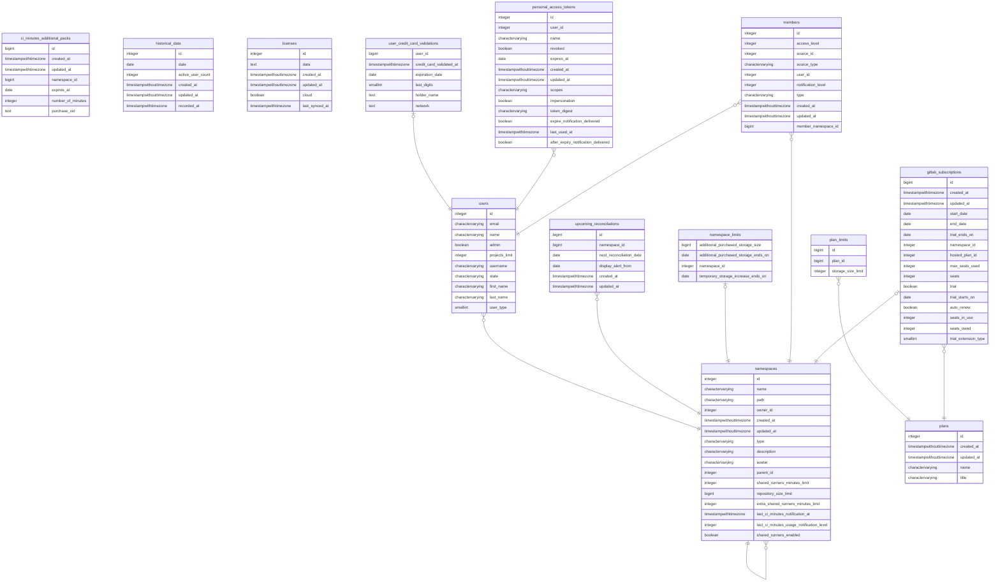

<link rel="stylesheet" type="text/css" href="/stylesheets/biztech.css" />

## Quote to Cash Entity Relationship Diagrams

### Zuora Billing

```mermaid
erDiagram
    Product ||..|{ ProductRatePlan : contains
    ProductRatePlan ||..|{ ProductRatePlanCharge : contains
    ProductRatePlanCharge ||..|{ ProductRatePlanChargeTier : contains
    Account ||..o{ Subscription : has
    Subscription ||..|{ RatePlan : has
    RatePlan ||..|{ RatePlanCharge : has
    RatePlanCharge ||..|{ RatePlanChargeTier : has
    ProductRatePlan ||..|{ RatePlan : "catalog trace"
    ProductRatePlanCharge ||..|{ RatePlanCharge : "catalog trace"
    Subscription ||..o{ Amendment : has
    Account ||..|{ Contact : has
    Account ||..o{ PaymentMethod : has
    Account ||..o{ PaymentMethodSnapshot : has
    PaymentMethod ||..|| PaymentMethodSnapshot : has
    Account ||..o{ Invoice : has
    Account ||..o{ Payment : has
    Invoice ||..|{ InvoiceItem : contains
    InvoiceItem ||..|| RatePlanCharge : "subscription trace"
    Invoice ||..o{ InvoicePayment : "payment trace"
    InvoicePayment ||..|| Payment : "payment trace"
    InvoiceItem ||..o{ TaxationItem : tax
    Account ||..o{ Refund : has
    Refund ||..|| PaymentMethodSnapshot : source
    Refund ||..o{ RefundInvoicePayment : "refund trace"
    RefundInvoicePayment ||..|| InvoicePayment : "refund trace"
    InvoiceItem ||..o| Amendment : source
    InvoiceItem ||..|| Subscription : "subscription trace"
    Account {
        varchar accountnumber
        varchar additionalemailaddresses
        boolean allowinvoiceedit
        boolean autopay
        decimal_22_9_ balance
        varchar batch
        varchar bcdsettingoption
        bigint billcycleday
        varchar-fk billtoid
        varchar communicationprofileid
        varchar-fk createdbyid
        timestampwithtimezone createddate
        decimal_22_9_ creditbalance
        varchar creditmemotemplateid
        varchar-fk crmid
        varchar currency
        varchar customerservicerepname
        varchar-fk debitmemotemplateid
        varchar-fk defaultpaymentmethodid
        varchar-pk id
        boolean invoicedeliveryprefsemail
        boolean invoicedeliveryprefsprint
        varchar invoicetemplateid
        date lastinvoicedate
        decimal_22_9_ mrr
        varchar name
        varchar notes
        varchar parentid
        varchar paymentgateway
        varchar paymentterm
        varchar purchaseordernumber
        varchar salesrepname
        varchar sequencesetid
        varchar-fk soldtoid
        varchar status
        varchar taxcompanycode
        varchar taxexemptcertificateid
        varchar taxexemptcertificatetype
        varchar taxexemptdescription
        date taxexempteffectivedate
        varchar taxexemptentityusecode
        date taxexemptexpirationdate
        varchar taxexemptissuingjurisdiction
        varchar taxexemptstatus
        decimal_22_9_ totaldebitmemobalance
        decimal_22_9_ totalinvoicebalance
        decimal_22_9_ unappliedbalance
        decimal_22_9_ unappliedcreditmemoamount
        varchar-fk updatedbyid
        timestampwithtimezone updateddate
        varchar vatid
        varchar accountcode__c
        varchar conversionrate__c
        date credithold__c
        varchar entity__c
        varchar excludefromeoastarterbronzeoffer__c
        varchar parent__c
        varchar porequired__c
        varchar portalnameurl__c
        varchar portalrequired__c
        varchar sfdc_sync__c
        varchar sspchannel__c
        varchar support_hold__c__c
    }
    Subscription {
        varchar-fk accountid
        boolean autorenew
        varchar-fk billtocontactid
        varchar-fk billtocontactsnapshotid
        date cancelleddate
        decimal_22_9_ cmrr
        date contractacceptancedate
        date contracteffectivedate
        varchar createdbyid
        timestampwithtimezone createddate
        varchar-fk creatoraccountid
        varchar creatorinvoiceownerid
        bigint currentterm
        varchar currenttermperiodtype
        varchar-pk id
        bigint initialterm
        varchar initialtermperiodtype
        varchar-fk invoiceownerid
        boolean isinvoiceseparate
        varchar name
        varchar notes
        timestampwithtimezone originalcreateddate
        varchar-fk originalid
        varchar paymentterm
        varchar-fk previoussubscriptionid
        varchar-fk rampid
        varchar renewalsetting
        bigint renewalterm
        varchar renewaltermperiodtype
        varchar revision
        date serviceactivationdate
        varchar status
        date subscriptionenddate
        date subscriptionstartdate
        varchar-fk subscriptionversionamendmentid
        date termenddate
        date termstartdate
        varchar termtype
        varchar-fk updatedbyid
        timestampwithtimezone updateddate
        bigint version
        varchar cpqbundlejsonid__qt
        date opportunityclosedate__qt
        varchar opportunityname__qt
        varchar quotebusinesstype__qt
        varchar quotenumber__qt
        varchar quotetype__qt
        varchar autorenew__c
        varchar churn__c__c
        varchar contractautorenew__c
        varchar contractoperationalmetrics__c
        varchar contractseatreconciliation__c
        varchar endcustomerdetails__c
        varchar eoastarterbronzeofferaccepted__c
        varchar exclude_from_renewal_report__c__c
        varchar excludefromanalysis__c
        varchar gitlabnamespaceid__c
        varchar gitlabnamespacename__c
        varchar multiyeardealsubscriptionlinkage__c
        varchar opportunityid__c
        varchar purchase_order__c
        varchar recurlyid__c
        varchar renewal_subscription__c__c
        varchar sfdcsync__c
        varchar turnonautorenew__c
        varchar turnoncloudlicensing__c
        varchar turnonoperationalmetrics__c
        varchar turnonseatreconciliation__c
    }
    Product{
        boolean allowfeaturechanges
        varchar category
        varchar-fk createdbyid
        timestampwithtimezone createddate
        varchar description
        date effectiveenddate
        date effectivestartdate
        varchar-pk id
        varchar name
        varchar sku
        varchar-fk updatedbyid
        timestampwithtimezone updateddate
    }
    ProductRatePlan{
        varchar-fk createdbyid
        timestampwithtimezone createddate
        varchar description
        date effectiveenddate
        date effectivestartdate
        varchar-pk id
        varchar name
        varchar-fk productid
        varchar-fk updatedbyid
        timestampwithtimezone updateddate
        varchar guidedselling__c
        varchar legacytieruidisplay__c
        varchar prpcategory__c
    }
    ProductRatePlanCharge{
        varchar accountingcode
        varchar-fk accountreceivableaccountingcodeid
        varchar-fk adjustmentliabilityaccountingcodeid
        varchar-fk adjustmentrevenueaccountingcodeid
        varchar applydiscountto
        bigint billcycleday
        varchar billcycletype
        varchar billingperiod
        varchar billingperiodalignment
        varchar billingtiming
        varchar chargemodel
        varchar chargetype
        varchar-fk contractassetaccountingcodeid
        varchar-fk contractliabilityaccountingcodeid
        varchar-fk contractrecognizedrevenueaccountingcodeid
        varchar-fk createdbyid
        timestampwithtimezone createddate
        decimal_22_9_ defaultquantity
        varchar deferredrevenueaccount
        varchar-fk deferredrevenueaccountingcodeid
        varchar description
        varchar-fk discountclassid
        varchar discountlevel
        varchar enddatecondition
        varchar-pk id
        decimal_22_9_ includedunits
        boolean legacyrevenuereporting
        varchar listpricebase
        decimal_22_9_ maxquantity
        decimal_22_9_ minquantity
        varchar name
        bigint numberofperiod
        varchar overagecalculationoption
        varchar overageunusedunitscreditoption
        varchar pricechangeoption
        decimal_22_9_ priceincreasepercentage
        varchar-fk productrateplanid
        varchar ratinggroup
        varchar recognizedrevenueaccount
        varchar-fk recognizedrevenueaccountingcodeid
        varchar revenuerecognitionrulename
        varchar revreccode
        varchar revrectriggercondition
        varchar smoothingmodel
        bigint specificbillingperiod
        boolean taxable
        varchar taxcode
        varchar taxmode
        varchar triggerevent
        varchar-fk unbilledreceivablesaccountingcodeid
        varchar uom
        varchar-fk updatedbyid
        timestampwithtimezone updateddate
        bigint uptoperiods
        varchar uptoperiodstype
        varchar usagerecordratingoption
        boolean usediscountspecificaccountingcode
        boolean usetenantdefaultforpricechange
        varchar weeklybillcycleday
        varchar allocationeligibleflag__c
        varchar bundleid__c
        varchar pobstratefier__c
        varchar sspeligibleflag__c
        varchar trueuprevenuetermmonths__c
    }
    ProductRatePlanChargeTier{
        boolean active
        varchar-fk createdbyid
        timestampwithtimezone createddate
        varchar currency
        decimal_22_9_ discountamount
        decimal_22_9_ discountpercentage
        decimal_22_9_ endingunit
        varchar-pk id
        decimal_22_9_ includedunits
        decimal_22_9_ overageprice
        decimal_22_9_ price
        varchar priceformat
        varchar-fk productrateplanchargeid
        decimal_22_9_ startingunit
        integer tier
        varchar-fk updatedbyid
        timestampwithtimezone updateddate
    }
    RatePlan {
        varchar-fk amendmentid
        varchar amendmenttype
        varchar-fk createdbyid
        timestampwithtimezone createddate
        varchar-pk id
        varchar name
        varchar-fk productrateplanid
        varchar-fk subscriptionid
        varchar-fk updatedbyid
        timestampwithtimezone updateddate
        date synctriggerupdate__c
    }
    RatePlanCharge {
        varchar accountingcode
        varchar-fk accountreceivableaccountingcodeid
        varchar applydiscountto
        bigint billcycleday
        varchar billcycletype
        varchar billingperiod
        varchar billingperiodalignment
        varchar billingtiming
        date chargedthroughdate
        varchar chargemodel
        varchar chargenumber
        varchar chargetype
        varchar-fk createdbyid
        timestampwithtimezone createddate
        varchar-fk deferredrevenueaccountingcodeid
        varchar description
        varchar discountlevel
        decimal_22_9_ dmrc
        decimal_22_9_ dtcv
        date effectiveenddate
        date effectivestartdate
        varchar enddatecondition
        varchar-pk id
        boolean islastsegment
        boolean isprocessed
        varchar listpricebase
        decimal_22_9_ mrr
        varchar name
        bigint numberofperiods
        varchar-fk originalid
        varchar overagecalculationoption
        varchar overageunusedunitscreditoption
        varchar pricechangeoption
        decimal_22_9_ priceincreasepercentage
        date processedthroughdate
        varchar-fk productrateplanchargeid
        decimal_22_9_ quantity
        varchar-fk rateplanid
        varchar ratinggroup
        varchar-fk recognizedrevenueaccountingcodeid
        varchar revenuerecognitionrulename
        varchar revreccode
        varchar revrectriggercondition
        integer segment
        bigint specificbillingperiod
        date specificenddate
        decimal_22_9_ tcv
        date triggerdate
        varchar triggerevent
        varchar uom
        varchar-fk updatedbyid
        timestampwithtimezone updateddate
        bigint uptoperiods
        varchar uptoperiodstype
        bigint version
        varchar weeklybillcycleday
        varchar psbundleid__c
        varchar rampdealid__c
        date synctriggerupdate__c
        varchar unbilledarflag__c
    }
    RatePlanChargeTier {
        varchar-fk createdbyid
        timestampwithtimezone createddate
        varchar currency
        decimal_22_9_ discountamount
        decimal_22_9_ discountpercentage
        decimal_22_9_ endingunit
        varchar-pk id
        decimal_22_9_ includedunits
        decimal_22_9_ overageprice
        decimal_22_9_ price
        varchar priceformat
        varchar-fk rateplanchargeid
        decimal_22_9_ startingunit
        bigint tier
        varchar-fk updatedbyid
        timestampwithtimezone updateddate
    }
    Amendment {
        boolean autorenew
        varchar code
        date contracteffectivedate
        varchar-fk createdbyid
        timestampwithtimezone createddate
        bigint currentterm
        varchar currenttermperiodtype
        date customeracceptancedate
        varchar description
        date effectivedate
        varchar-pk id
        varchar name
        varchar renewalsetting
        bigint renewalterm
        varchar renewaltermperiodtype
        date resumedate
        date serviceactivationdate
        date specificupdatedate
        varchar status
        varchar-fk subscriptionid
        date suspenddate
        date termstartdate
        varchar termtype
        varchar type
        varchar-fk updatedbyid
        timestampwithtimezone updateddate
    }
    Contact {
        varchar-fk accountid
        varchar address1
        varchar address2
        varchar city
        varchar country
        varchar county
        varchar-fk createdbyid
        timestampwithtimezone createddate
        varchar description
        varchar fax
        varchar firstname
        varchar homephone
        varchar-pk id
        varchar lastname
        varchar mobilephone
        varchar nickname
        varchar otherphone
        varchar otherphonetype
        varchar personalemail
        varchar postalcode
        varchar state
        varchar taxregion
        varchar-fk updatedbyid
        timestampwithtimezone updateddate
        varchar workemail
        varchar workphone
        varchar financeverifiedcontact__c
    }
    PaymentMethod {
        varchar-fk accountid
        varchar achabacode
        varchar achaccountname
        varchar achaccountnumbermask
        varchar achaccounttype
        varchar achaddress1
        varchar achaddress2
        varchar achbankname
        varchar achcity
        varchar achcountry
        varchar achpostalcode
        varchar achstate
        boolean active
        varchar bankbranchcode
        varchar bankcheckdigit
        varchar bankcity
        varchar bankcode
        varchar bankidentificationnumber
        varchar bankname
        varchar bankpostalcode
        varchar bankstreetname
        varchar bankstreetnumber
        varchar banktransferaccountname
        varchar banktransferaccountnumbermask
        varchar banktransferaccounttype
        varchar banktransfertype
        varchar businessidentificationcode
        varchar city
        varchar companyname
        varchar country
        varchar-fk createdbyid
        timestampwithtimezone createddate
        varchar creditcardaddress1
        varchar creditcardaddress2
        varchar creditcardcity
        varchar creditcardcountry
        integer creditcardexpirationmonth
        integer creditcardexpirationyear
        varchar creditcardholdername
        varchar creditcardmasknumber
        varchar creditcardpostalcode
        varchar creditcardstate
        varchar creditcardtype
        varchar devicesessionid
        varchar email
        varchar existingmandate
        varchar firstname
        varchar iban
        varchar-pk id
        varchar identitynumber
        varchar ipaddress
        boolean iscompany
        boolean issystem
        date lastfailedsaletransactiondate
        varchar lastname
        timestampwithtimezone lasttransactiondatetime
        varchar lasttransactionstatus
        date mandatecreationdate
        varchar mandateid
        varchar mandatereason
        varchar mandatereceived
        varchar mandatestatus
        date mandateupdatedate
        smallint maxconsecutivepaymentfailures
        varchar name
        integer numconsecutivefailures
        varchar paymentmethodstatus
        smallint paymentretrywindow
        varchar paypalbaid
        varchar paypalemail
        varchar paypalpreapprovalkey
        varchar paypaltype
        varchar phone
        varchar postalcode
        varchar secondtokenid
        varchar state
        varchar streetname
        varchar streetnumber
        varchar tokenid
        integer totalnumberoferrorpayments
        integer totalnumberofprocessedpayments
        varchar type
        varchar-fk updatedbyid
        timestampwithtimezone updateddate
        boolean usedefaultretryrule
    }
    Invoice {
        varchar-fk accountid
        decimal_22_9_ adjustmentamount
        decimal_22_9_ amount
        decimal_22_9_ amountwithouttax
        boolean autopay
        decimal_22_9_ balance
        varchar-fk billtocontactsnapshotid
        varchar comments
        varchar createdbyid
        timestampwithtimezone createddate
        decimal_22_9_ creditbalanceadjustmentamount
        date duedate
        varchar-pk id
        boolean includesonetime
        boolean includesrecurring
        boolean includesusage
        date invoicedate
        varchar invoicenumber
        timestampwithtimezone lastemailsentdate
        decimal_22_9_ paymentamount
        varchar postedby
        timestampwithtimezone posteddate
        decimal_22_9_ refundamount
        boolean reversed
        varchar soldtocontactsnapshotid
        varchar source
        varchar-fk sourceid
        varchar status
        date targetdate
        decimal_22_9_ taxamount
        decimal_22_9_ taxexemptamount
        varchar taxmessage
        varchar taxstatus
        varchar transferredtoaccounting
        varchar-fk updatedbyid
        timestampwithtimezone updateddate
        varchar vatlocalcurrencyamount__c
    }
    InvoiceItem {
        varchar-fk accountid
        varchar accountingcode
        varchar-fk accountreceivableaccountingcodeid
        varchar-fk adjustmentliabilityaccountingcodeid
        varchar-fk adjustmentrevenueaccountingcodeid
        varchar-fk amendmentid
        varchar-fk appliedtoinvoiceitemid
        decimal_22_9_ balance
        varchar-fk billtocontactid
        varchar-fk billtocontactsnapshotid
        decimal_22_9_ chargeamount
        timestampwithtimezone chargedate
        varchar chargename
        varchar-fk contractassetaccountingcodeid
        varchar-fk contractliabilityaccountingcodeid
        varchar-fk contractrecognizedrevenueaccountingcodeid
        varchar-fk createdbyid
        timestampwithtimezone createddate
        varchar-fk defaultpaymentmethodid
        varchar-fk deferredrevenueaccountingcodeid
        varchar description
        varchar-pk id
        varchar-fk invoiceid
        varchar-fk journalentryid
        varchar-fk parentaccountid
        varchar processingtype
        varchar-fk productid
        varchar-fk productrateplanchargeid
        varchar-fk productrateplanid
        decimal_22_9_ quantity
        varchar-fk rateplanchargeid
        varchar-fk rateplanid
        varchar-fk recognizedrevenueaccountingcodeid
        date revrecstartdate
        date serviceenddate
        date servicestartdate
        varchar sku
        varchar-fk soldtocontactid
        varchar-fk soldtocontactsnapshotid
        varchar-fk subscriptionid
        decimal_22_9_ taxamount
        varchar taxcode
        decimal_22_9_ taxexemptamount
        varchar taxmode
        varchar-fk unbilledreceivablesaccountingcodeid
        decimal_22_9_ unitprice
        varchar uom
        varchar-fk updatedbyid
        timestampwithtimezone updateddate
    }
    TaxationItem{
        varchar accountingcode
        varchar-fk accountreceivableaccountingcodeid
        decimal_22_9_ balance
        varchar-fk createdbyid
        timestampwithtimezone createddate
        decimal_22_9_ creditamount
        decimal_22_9_ exemptamount
        varchar-pk id
        varchar-fk invoiceitemid
        varchar-fk journalentryid
        varchar jurisdiction
        varchar locationcode
        varchar name
        decimal_22_9_ paymentamount
        varchar-fk salestaxpayableaccountingcodeid
        varchar-fk taxableitemsnapshotid
        decimal_22_9_ taxamount
        varchar taxcode
        varchar taxcodedescription
        date taxdate
        varchar taxmode
        decimal_22_9_ taxrate
        varchar taxratedescription
        varchar taxratetype
        varchar-fk updatedbyid
        timestampwithtimezone updateddate
    }
    PaymentMethodSnapshot {
        varchar-fk accountid
        varchar achabacode
        varchar achaccountname
        varchar achaccountnumbermask
        varchar achaccounttype
        varchar achbankname
        varchar bankbranchcode
        varchar bankcheckdigit
        varchar bankcity
        varchar bankcode
        varchar bankidentificationnumber
        varchar bankname
        varchar bankpostalcode
        varchar bankstreetname
        varchar bankstreetnumber
        varchar banktransferaccountname
        varchar banktransferaccountnumbermask
        varchar banktransferaccounttype
        varchar banktransfertype
        varchar businessidentificationcode
        varchar city
        varchar companyname
        varchar country
        timestampwithtimezone createddate
        varchar creditcardaddress1
        varchar creditcardaddress2
        varchar creditcardcity
        varchar creditcardcountry
        integer creditcardexpirationmonth
        integer creditcardexpirationyear
        varchar creditcardholdername
        varchar creditcardmasknumber
        varchar creditcardpostalcode
        varchar creditcardstate
        varchar creditcardtype
        varchar devicesessionid
        varchar email
        varchar existingmandate
        varchar firstname
        varchar iban
        varchar-pk id
        varchar identitynumber
        varchar ipaddress
        boolean iscompany
        date lastfailedsaletransactiondate
        varchar lastname
        timestampwithtimezone lasttransactiondatetime
        varchar lasttransactionstatus
        date mandatecreationdate
        varchar mandateid
        varchar mandatereason
        varchar mandatereceived
        varchar mandatestatus
        date mandateupdatedate
        smallint maxconsecutivepaymentfailures
        varchar name
        integer numconsecutivefailures
        varchar paymentmethodid
        varchar paymentmethodstatus
        smallint paymentretrywindow
        varchar paypalbaid
        varchar paypalemail
        varchar paypalpreapprovalkey
        varchar paypaltype
        varchar phone
        varchar postalcode
        varchar secondtokenid
        varchar state
        varchar streetname
        varchar streetnumber
        varchar tokenid
        integer totalnumberoferrorpayments
        integer totalnumberofprocessedpayments
        varchar type
        timestampwithtimezone updateddate
        boolean usedefaultretryrule
    }
    InvoicePayment {
        varchar-fk accountreceivableaccountingcodeid
        decimal_22_9_ amount
        varchar-fk cashaccountingcodeid
        varchar-fk createdbyid
        timestampwithtimezone createddate
        varchar-pk id
        varchar-fk invoiceid
        varchar-fk journalentryid
        varchar-fk paymentid
        decimal_22_9_ refundamount
        varchar-fk updatedbyid
        timestampwithtimezone updateddate
    }
    Payment {
        varchar-fk accountid
        varchar accountingcode
        decimal_22_9_ amount
        decimal_22_9_ appliedamount
        decimal_22_9_ appliedcreditbalanceamount
        varchar authtransactionid
        varchar bankidentificationnumber
        timestampwithtimezone cancelledon
        varchar comment
        varchar-fk createdbyid
        timestampwithtimezone createddate
        varchar currency
        date effectivedate
        varchar gateway
        varchar gatewayorderid
        varchar gatewayreconciliationreason
        varchar gatewayreconciliationstatus
        varchar gatewayresponse
        varchar gatewayresponsecode
        varchar gatewaystate
        varchar-pk id
        boolean isstandalone
        timestampwithtimezone markedforsubmissionon
        varchar paymentmethodid
        varchar-fk paymentmethodsnapshotid
        varchar paymentnumber
        varchar payoutid
        varchar referencedpaymentid
        varchar referenceid
        decimal_22_9_ refundamount
        varchar secondpaymentreferenceid
        timestampwithtimezone settledon
        varchar softdescriptor
        varchar softdescriptorphone
        varchar source
        varchar sourcename
        varchar status
        timestampwithtimezone submittedon
        varchar transactionsource
        varchar transferredtoaccounting
        varchar type
        decimal_22_9_ unappliedamount
        varchar updatedbyid
        timestampwithtimezone updateddate
    }
    Refund {
        varchar-fk accountid
        varchar accountingcode
        decimal_22_9_ amount
        varchar associatedtransactionnumber
        timestampwithtimezone cancelledon
        varchar comment
        varchar-fk createdbyid
        timestampwithtimezone createddate
        varchar gateway
        varchar gatewayreconciliationreason
        varchar gatewayreconciliationstatus
        varchar gatewayresponse
        varchar gatewayresponsecode
        varchar gatewaystate
        varchar-pk id
        timestampwithtimezone markedforsubmissionon
        varchar methodtype
        varchar-fk paymentmethodid
        varchar-fk paymentmethodsnapshotid
        varchar payoutid
        varchar reasoncode
        varchar referenceid
        date refunddate
        varchar refundnumber
        timestampwithtimezone refundtransactiontime
        varchar secondrefundreferenceid
        timestampwithtimezone settledon
        varchar softdescriptor
        varchar softdescriptorphone
        varchar sourcetype
        varchar status
        timestampwithtimezone submittedon
        varchar transferredtoaccounting
        varchar type
        varchar-fk updatedbyid
        timestampwithtimezone updateddate
    }
    RefundInvoicePayment {
        varchar-fk accountreceivableaccountingcodeid
        varchar-fk cashaccountingcodeid
        varchar-fk createdbyid
        timestampwithtimezone createddate
        varchar-pk id
        varchar-fk invoicepaymentid
        varchar-fk journalentryid
        decimal_22_9_ refundamount
        varchar-fk refundid
        varchar-fk updatedbyid
        timestampwithtimezone updateddate
    }
```

### CustomersDot (Customer Portal)

```mermaid
erDiagram
    cloud_activations {
        bigint id
        timestampwithouttimezone created_at
        timestampwithouttimezone updated_at
        bigint customer_id
        charactervarying activation_code
        charactervarying subscription_name
        boolean super_sonics_aware
    }

    coupons {
        bigint id
        charactervarying batch_id
        charactervarying code
        smallint status
    }

    customers {
        integer id
        charactervarying first_name
        charactervarying last_name
        timestampwithouttimezone created_at
        timestampwithouttimezone updated_at
        charactervarying email
        charactervarying encrypted_password
        charactervarying reset_password_token
        timestampwithouttimezone reset_password_sent_at
        timestampwithouttimezone remember_created_at
        integer sign_in_count
        timestampwithouttimezone current_sign_in_at
        timestampwithouttimezone last_sign_in_at
        inet current_sign_in_ip
        inet last_sign_in_ip
        charactervarying provider
        charactervarying uid
        charactervarying zuora_account_id
        charactervarying country
        charactervarying state
        charactervarying city
        charactervarying zip_code
        charactervarying vat_code
        charactervarying company
        charactervarying salesforce_account_id
        boolean billable
        charactervarying access_token
        charactervarying confirmation_token
        timestampwithouttimezone confirmed_at
        timestampwithouttimezone confirmation_sent_at
        charactervarying unconfirmed_email
        charactervarying address_1
        charactervarying address_2
        charactervarying company_size
        charactervarying authentication_token
        charactervarying phone_number
        boolean login_activated
    }

    instance_review_settings {
        integer id
        integer users_count_threshold
        timestampwithouttimezone created_at
        timestampwithouttimezone updated_at
    }

    instance_reviews {
        integer id
        charactervarying email
        charactervarying first_name
        charactervarying last_name
        charactervarying company
        charactervarying address
        charactervarying phone
        charactervarying version
        integer users_count
        integer groups_count
        integer projects_count
        integer issues_count
        integer merge_requests_count
        integer internal_pipelines_count
        integer external_pipelines_count
        integer labels_count
        integer milestones_count
        integer notes_count
        integer snippets_count
        charactervarying country
        charactervarying state
        charactervarying employee_range
        boolean communication_opted_in
    }

    admins {
        integer id
        charactervarying email
        charactervarying encrypted_password
        charactervarying reset_password_token
        timestampwithouttimezone reset_password_sent_at
        timestampwithouttimezone remember_created_at
        integer sign_in_count
        timestampwithouttimezone current_sign_in_at
        timestampwithouttimezone last_sign_in_at
        inet current_sign_in_ip
        inet last_sign_in_ip
        timestampwithouttimezone created_at
        timestampwithouttimezone updated_at
        charactervarying authentication_token
        boolean manage_admin
        charactervarying provider
        charactervarying uid
        smallint customer_access_level
        smallint license_access_level
    }

    licenses {
        bigint id
        uuid license_file_md5
        bigint customer_id
        bigint creator_id
        timestampwithtimezone created_at
        timestampwithtimezone updated_at
        timestampwithtimezone last_synced_at
        timestampwithtimezone next_sync_at
        integer users_count
        integer previous_users_count
        integer trueup_quantity
        date expires_at
        date starts_at
        date trueup_from
        date trueup_to
        boolean trial
        boolean cloud_licensing_enabled
        charactervarying plan_code
        charactervarying plan_name
        charactervarying zuora_subscription_id
        charactervarying email
        charactervarying name
        charactervarying company
        charactervarying zuora_subscription_name
        text notes
        text license_file
        timestampwithtimezone activated_at
        boolean auto_renew_enabled
        boolean seat_reconciliation_enabled
        boolean operational_metrics_enabled
        boolean reconciliation_completed
        boolean offline_cloud_licensing_enabled
    }

    local_records {
        bigint id
        timestampwithouttimezone created_at
        timestampwithouttimezone updated_at
        charactervarying name
        text csv
    }

    orders {
        integer id
        integer customer_id
        charactervarying product_rate_plan_id
        charactervarying subscription_id
        charactervarying subscription_name
        date start_date
        date end_date
        integer quantity
        timestampwithouttimezone created_at
        timestampwithouttimezone updated_at
        charactervarying gl_namespace_id
        charactervarying gl_namespace_name
        charactervarying amendment_type
        boolean trial
        timestampwithouttimezone last_extra_ci_minutes_sync_at
        charactervarying zuora_account_id
        timestampwithouttimezone increased_billing_rate_notified_at
        boolean reconciliation_accepted
        timestampwithouttimezone billing_rate_adjusted_at
        charactervarying billing_rate_last_action
        smallint trial_extension_type
        charactervarying source
    }

    trial_histories {
        integer id
        charactervarying gl_namespace_id
        date start_date
        date expired_on
        timestampwithouttimezone created_at
        timestampwithouttimezone updated_at
        charactervarying glm_source
        charactervarying glm_content
        charactervarying trial_entity
    }

    zuora_user_with_hosts {
        integer id
        charactervarying zuora_user_id
        charactervarying host
        timestampwithouttimezone created_at
        timestampwithouttimezone updated_at
    }

    self_managed_instance_activations {
        bigint id
        timestampwithouttimezone created_at
        timestampwithouttimezone updated_at
        timestampwithouttimezone activated_at
        bigint self_managed_instance_id
        bigint cloud_activation_id
    }

    self_managed_instances {
        bigint id
        timestampwithouttimezone created_at
        timestampwithouttimezone updated_at
        charactervarying instance_identifier
    }

    license_seat_links {
        bigint id
        timestampwithouttimezone created_at
        timestampwithouttimezone updated_at
        bigint order_id
        integer active_user_count
        integer max_historical_user_count
        integer license_user_count
        date license_starts_on
        charactervarying zuora_subscription_name
        charactervarying zuora_subscription_id
        timestampwithtimezone report_timestamp
        bigint license_id
        bigint self_managed_instance_activation_id
        charactervarying gitlab_version
        charactervarying hostname
        charactervarying instance_identifier
        uuid license_md5
    }

    reconciliations {
        bigint id
        integer order_id
        integer user_count
        timestampwithouttimezone reconcile_done_at
        timestampwithouttimezone created_at
        timestampwithouttimezone updated_at
        text error_message
        date reconcile_on
        smallint skip_reason
        timestampwithtimezone upcoming_email_sent_at
        timestampwithtimezone completed_email_sent_at
        numeric quoted_invoice_amount
        timestampwithtimezone quoted_invoice_at
    }

    leads {
        bigint id
        timestampwithtimezone created_at
        timestampwithtimezone updated_at
        date trial_start_date
        bigint namespace_id
        bigint user_id
        boolean opt_in
        boolean currently_in_trial
        boolean is_for_business_use
        charactervarying first_name
        charactervarying last_name
        charactervarying email
        charactervarying phone
        charactervarying company_name
        charactervarying employees_bucket
        charactervarying country
        charactervarying state
        charactervarying product_interaction
        charactervarying provider
        text comment_capture
        charactervarying glm_content
        charactervarying glm_source
        timestampwithtimezone sent_at
    }

    cloud_activations }o--|| customers : ""
    self_managed_instance_activations }o--|| cloud_activations : ""
    licenses }o--|| customers : ""
    orders }o--|| customers : ""
    licenses }o--|| admins : ""
    license_seat_links }o--|| licenses : ""
    license_seat_links }o--|| orders : ""
    reconciliations }o--|| orders : ""
    license_seat_links }o--|| self_managed_instance_activations : ""
    self_managed_instance_activations }o--|| self_managed_instances : ""
```



### GitLab


