## Overview

The Federal Risk and Authorization Management Program (FedRAMP) is a United States government-wide program that standardizes security requirements for the authorization and ongoing cybersecurity of cloud services in accordance with the [FedRAMP Authorization Act](https://www.congress.gov/117/bills/hr7776/BILLS-117hr7776enr.pdf#page=1055), [FISMA](https://www.congress.gov/bill/113th-congress/senate-bill/2521), and [OMB Circular A-130](https://www.cio.gov/policies-and-priorities/circular-a-130/). In short, Federal Agencies are required to procure FedRAMP-authorized cloud services, and cloud service providers are required to be FedRAMP authorized in order to sell to federal agencies and handle their data. [FedRAMP.gov](https://www.fedramp.gov/program-basics/) has more information about the program including the authorization process, the marketplace, and other helpful resources.

FedRAMP authorization has three levels (low, moderate, and high) based upon the sensitivity of the data that is stored, processed, or transmitted in the cloud service. These levels have varying degrees of controls (security requirements) that must be implemented. The controls are selected from [NIST 800-53](https://csrc.nist.gov/Projects/risk-management/sp800-53-controls/release-search#/controls?version=5.1).

## FedRAMP Authorization Process

GitLab is following the Agency Authorization process (as opposed to the Joint Authorization Board) which looks like this:

```mermaid
graph TD
    subgraph Continuous Monitoring Phase
        P(Post-Authorization) --> Q(Ongoing Continuous Monitoring Deliverables)
        P --> R(Annual Assessment)
    end
    
    subgraph Agency Authorization Phase
        I(Agency Review of Security Authorization Package) --> J(SAR Debrief)
        J -->|Remediation| K(Agency Final Review)
        K --> L(Agency Issues ATO)
        L --> M(FedRAMP PMO Review)
        M -->|Remediation| N(FedRAMP Marketplace Designation - Authorized)
    end

    subgraph Security Authorization Assessment Phase
        F[Prepare for Security Authorization Assessment] --> |Documentation Package|G(Security Authorization Assessment)
        G --> |"Security Assessment Report (SAR) and Plan of Action & Milestones (POA&M)"|H[Secrity Authorization Package Submission]
    end

    subgraph Pre-Authorization Phase
        B(Partnership Establishment) --> |Agency Sponsor|C(Authorization Planning)
        C --> D(Kickoff Meeting)
        D --> E(FedRAMP Marketplace Designation - In Process)
    end
```

A security assessment which results in an acceptable level of residual risk (as deemed by a sponsoring Agency and the FedRAMP Program Management Office) results in an Authorization to Operate (ATO). The results of this assessment and the ATO can subsequently be relied upon and reused by other Agencies/customers who want or need the FedRAMP-authorized cloud service, rather than having to repeat an assessment and authorization process for each customer.

## GitLab's FedRAMP initiative

GitLab is pursuing FedRAMP Moderate authorization for a new government community cloud Software-as-a-Service (SaaS) offering. A government community cloud is intended for use by U.S. federal, state, local, tribal, and territorial customers, in addition to federally funded research centers (FFRDCs), contractors or service providers working on behalf of the government, and lab entities.

FedRAMP is a top cross-functional initiative at GitLab and has a [working group](/handbook/company/working-groups/fedramp-execution/) that convenes at least monthly. The [Security Compliance (Dedicated Markets) team](/handbook/security/security-assurance/dedicated-compliance/) is responsible for translating and clarifying the FedRAMP requirements for the organization, providing advice and consultation, and ultimately achieving and maintaining compliance.

Unfortunately, GitLab cannot publicly share specific timelines or progress with key milestones at this time. Internal team members can learn more [here](https://internal.gitlab.com/handbook/engineering/fedramp-compliance/#-keeping-fedramp-safe).

## What are some of the FedRAMP requirements (security controls)?

FedRAMP Authorization is very challenging and requires prescriptive security controls to be implemented at the organizational, system, and process levels. Some of the several hundred requirements include:

- [FIPS 140-2 validated cryptography](https://csrc.nist.gov/projects/cryptographic-module-validation-program) for all data at rest and in transit (to/from/within) the system
- Vulnerability Scanning of all hosts, web applications, containers, and databases
- Remediation of all vulnerabilities within prescribed SLAs and a deviation request process
- Reporting of vulnerability posture, complete asset inventory, and significant changes to the system or product
- Timely application of security updates/patches
- Various product capabilities related to authentication and authorization, audit logging, and session handling
- Digitally signing software and integrity verification
- System configuration hardening
- Network security requirements and prescriptive architectures (can only connect to other FedRAMP authorized cloud services)
- DNSSEC, DMARC, SPF, and DKIM
- Key, certificate, and secrets management requirements
- Security event monitoring and incident response capabilities
- Disaster Recovery planning and testing procedures
- File integrity monitoring, intrusion and antimalware detection
- Supply chain risk management procedures
- Security training
- Personnel security and hiring practices
- Documentation package including a system security plan (hundreds of pages), supporting attachments, and detailed architecture / data flow diagrams

## How does FedRAMP compare to other security/compliance frameworks, attestations, or certifications?

FedRAMP has similarities with other security compliance "certifications" in that it requires implementation of a broad set of requirements across multiple security domains and requires an independent auditor to render an opinion on the design and operating effectiveness of the controls. However, the difference with FedRAMP is the prescriptiveness of the requirements, the documentation that must be maintained, and the role that the 3rd Party Assessment Organization (3PAO/auditor) and the FedRAMP Program Management Office plays.

Let's look at some examples: TO BE DEVELOPED

## How do FedRAMP authorized infrastructure-as-a-service (IaaS) providers fit in? Is it enough to host our system there?

SaaS offerings can inherit (partially or fully) some of the required controls from a FedRAMP authorized IaaS provider. These are typically limited to physical and environmental controls, physical media protection, and local maintenance controls. It is possible to transfer additional responsibility for control implementation by leveraging other managed services from the IaaS providers (such as database-as-a-service, serverless compute, managed security services, etc.) however even these will only partially fulfill the full set of requirements. The vast majority of the requirements must still be implemented by the SaaS provider and cannot be inherited.

## Who to contact

Please reach out to `@dedicated_compliance` in the `# sec-assurance` or `# wg_fedramp` channels on Slack for questions about the requirements or the process. For other questions, including product-specific matters, reach out to the `# wg_fedramp` channel or contact a member of the [US Public Sector Services product group](/handbook/product/categories/#us-public-sector-services-group).
