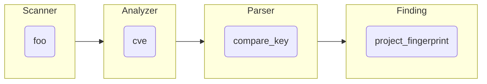
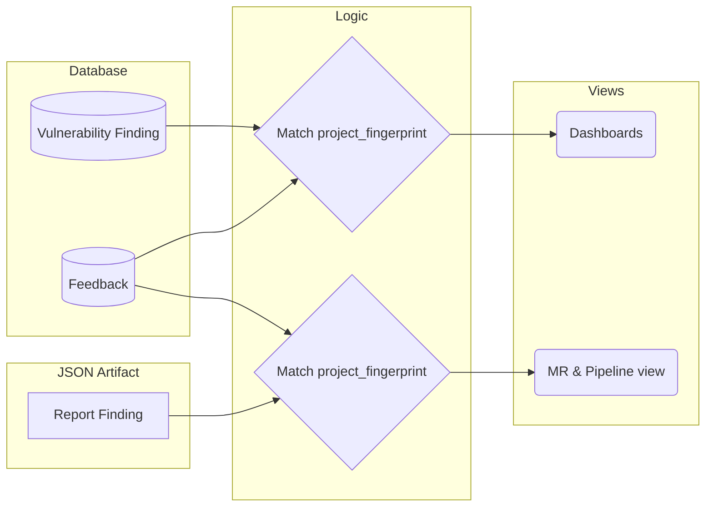

## Overview

Once a Finding is reported for a project, users can interact with it in multiple ways. One of them is called [Feedback](https://docs.gitlab.com/ee/user/application_security/terminology/#feedback) and allows the user to:

- dismiss the finding
- create an issue from the finding
- create an MR from the finding

These features are described in details in our [user documentation](https://docs.gitlab.com/ee/user/application_security/#interacting-with-the-vulnerabilities).

It has been called Feedback as the initial intent was to gather feedback from users about reported Findings and possibly leverage that to increase the signal to noise ratio.

## Challenges

One challenge with the Feedback is the reliability of its tracking.
Indeed, when a Finding is dismissed, we want to make sure it will stay dismissed in any subsequent scan that would report it.

Another one is that the Feedback feature is available on all views, for all branches.
This means, it must work with the [Vulnerability Findings](https://docs.gitlab.com/ee/user/application_security/terminology/#vulnerability-finding) (that are stored in the database) and the [Report Findings](https://docs.gitlab.com/ee/user/application_security/terminology/#report-finding) (that are NOT stored in the database).

## Implementation

NB: there is currently [a proposal to replace that implentation](https://gitlab.com/gitlab-org/gitlab/-/issues/205489).

The `Vulnerability::Feedback` AR model relies on a `project_fingerprint` attribute to match it with a Finding. This approach allows to:

1. have a stable identifier between scans to keep matching the feedback with the finding over time and over different branches
1. match feedback from any source (Database or JSON artifact) as this doesn't rely on DB only feature like foreign key.

Though, due to how we generate this fingerprint, #1 is not as stable as expected and is also not generated in a consistent way between the different analyzers.

This `project_fingerprint` is stored in the database for Vulnerability Finding records and dynamically generated when parsing Report Findings from JSON artifacts (for MR widget and Pipeline view).

The Feedback records are scoped at the project level as they are meant to be shared between all branches, hence the name "project" fingeprint.

Only one Feedback of a given type (`dismissal`, `issue` or `merge_request`) is allowed for a given `project_fingerprint` and report type.

Even if that fingperting data originates from the Scanner output, it is not given in that final form in the JSON artifact.

### How the `project_fingerprint` is generated

For each Finding, the Analyzer creates a `cve` property from proprietary data given by the Scanner and that may vary from one Scanner to another.
So unlike it's name, this property doesn't contain a CVE value anymore.
This legacy property was initially used for comparison and deduping of findings in the early stage of the security features, which was only based on CVE number at that time.
Then the property has been overloaded in an attempt to provide a value that will achieve both uniqueness and stability over time, and in a backward compatible way.
The `cve` property is part of the [Secure Report Format](https://docs.gitlab.com/ee/user/application_security/terminology/#secure-report-format).

When parsing the report in the rails application, this `cve` property is unmarshalled into [a `compare_key` attribute](https://gitlab.com/gitlab-org/gitlab/-/blob/0d013cc934887497874f2f1dc2411015e8575084/ee/lib/gitlab/ci/parsers/security/common.rb#L62) of the Finding object.

This `compare_key` is then [hashed into a SHA1](https://gitlab.com/gitlab-org/gitlab/-/blob/f2d2f348a3ee7a2621bfda6aabf27834fdc60706/ee/lib/gitlab/ci/reports/security/finding.rb#L70-72), which is [assigned to the `project_fingerprint` attribute](https://gitlab.com/gitlab-org/gitlab/-/blob/f2d2f348a3ee7a2621bfda6aabf27834fdc60706/ee/lib/gitlab/ci/reports/security/finding.rb#L37).

If the Finding is stored in the database, the `project_fingerprint` is saved there too [in the corresponding column](https://gitlab.com/gitlab-org/gitlab/-/blob/f2d2f348a3ee7a2621bfda6aabf27834fdc60706/db/structure.sql#L16365).

### How the `project_fingerprint` is used

When retrieving Findings, we can fetch associated Feedback by looking for the corresponding `project_fingerprint`, whatever the data source the Findings are comming from.

