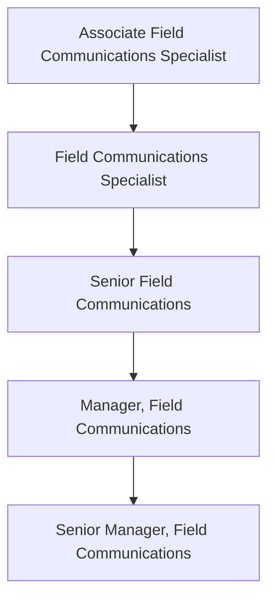

The Field Communications function is part of the Field Enablement team and is responsible for creating effective, timely, and easily consumable communications for the GitLab Field Team. The team's charter is to help GitLab's Field organization sell better, faster and smarter with communication programs that keep them better informed of organizational/business updates that impact their roles, as well as useful resources that will enable day-to-day work.

## Levels

### Field Communications Specialist

The Field Communications Specialist reports to the [Manager/Sr. Manager, Field Communications](/job-families/sales/field-communications/#manager-field-communications).

#### Field Communications Specialist Job Grade

The Field Communications Specialist is a grade [5](/handbook/total-rewards/compensation/compensation-calculator/#job-grades).

#### Field Communications Specialist Responsibilities

- Copywriting and editing support for major Field Communications programs including the monthly newsletter and GitLab monthly release
- Assist with the development of copy for Field announcements as a part of the Field Communications calendar
- Maintain Field Update Tickers with messaging gathered through the Field announcement process
- Provide insights and recommendations for process improvement to intermediate and senior Field Communications ICs
- Monitor key communication channels for two-way feedback (i.e. Slack) and escalate high-priority items to senior team members as needed
- Assist with the development of copy as well as provide logistical support for key in-person & virtual Field events such as GitLab Summit/Sales Kickoff and Quarterly Business Reviews.

#### Field Communications Specialist Requirements

- Experience in copywriting and editing
- Excellent communication (oral and written) and presentation skills
- Strong organizational abilities
- Ability to continuously meet deadlines and execute on multiple projects at once  
- Excellent team player and ability to effectively collaborate with others and action on guidance from senior team members
- Self-starter with strong problem solving abilities
- Working knowledge of Google docs; photo and video-editing software is an asset
- Willingness to learn new tools such as Staffbase (or a similar marketing/communications platform)
- You share our [values](/handbook/values/), and work in accordance with those values
- Ability to use GitLab in day to day responsibilities

### Field Communications Manager

The Field Communications Manager reports to the [Manager/Sr. Manager, Field Communications](/job-families/sales/field-communications/#manager-field-communications).

#### Field Communications Manager Job Grade

The Field Communications Manager is a grade [6](/handbook/total-rewards/compensation/compensation-calculator/#job-grades).

#### Field Communications Manager Responsibilities

- Extends that of the Field Communication Specialist responsibilities
- Maintain core communications programs including the monthly newsletter and weekly Update Tickers
- Support the Field Communications announcement calendar, working with DRIs across the business to triage and plan for updates
- Support senior team members where needed on company initiatives that impact the Field teams
- Champion efforts to improve Field Communications via GitLab’s [handbook-first approach to learning and development](/handbook/sales/field-operations/field-enablement/#handbook-first-approach-to-gitlab-learning-and-development-materials)
- Develop and implement a strategy for soliciting feedback from GitLab Field team members to inform communication priorities and requirements
- Assist in communication of strategies or messages from senior leadership as needed
- Take on additional projects and responsibilities as needed

#### Field Communications Manager Requirements

- BS/BA in communications or relevant field
- Experience in copywriting and editing
- Excellent communication (oral and written) and presentation skills
- Outstanding organizational and planning abilities
- Excellent team player and ability to effectively collaborate with others
- Strong project management skills and attention to detail needing minimal supervision
- Working knowledge of Google docs; photo and video-editing software is an asset
- Knowledge of the software development life cycle, DevOps, and/or open source software is preferred

- Proven experience developing and executing effective sales newsletters is a huge plus
- Experience with a marketing/communications platform (examples: Staffbase, Mailchimp) is preferred
- Experience in web design and content creation is a plus
- You share our [values](/handbook/values/), and work in accordance with those values
- Ability to use GitLab in day to day responsibilities

### Senior Field Communications Manager

The Senior Field Communications Manager reports to the [Manager/Sr. Manager, Field Communications](/job-families/sales/field-communications/#manager-field-communications).

#### Senior Field Communications Manager Job Grade

The Senior Field Communications Manager is a grade [7](/handbook/total-rewards/compensation/compensation-calculator/#job-grades).

#### Senior Field Communications Manager Responsibilities

- Extends that of the Field Communication Manager responsibilities
- Provide strategic communications advice to field leadership with change management, project management, and internal communications support for key revenue-impacting field initiatives
- Own the Field Communications announcement calendar, working with DRIs across the business to triage and plan for updates
- Foster strong partnerships with cross functional teams such as Field Enablement program managers, Product Marketing, and others for aligned content and communication delivery
- Lead the communication efforts for key field events including GitLab Summit/Sales Kickoff and Quarterly Business Reviews
- Develop and manage effective communication strategies that improve transparency and efficiency across the entire Field team
- Lead a Sales Advocacy program and standardize feedback collection and response to more efficiently bring visibility to team member questions and blockers
- Spearhead efforts to ensure field communications are aligned with expectations, rules, and industry/market regulations
- Iterate on current field communication channels to improve accessibility and adoption across the field organization

#### Senior Field Communications Manager Requirements

- BS/BA in communications or relevant field
- Experience in copywriting and editing
- Proven experience supporting effective communication strategies within a high-tech B2B sales environment
- Proven experience as a communications specialist, preferably with high-tech B2B sales audiences
- Change management experience (certification preferred)
- Ability to work with senior sales leadership on communications needs
- Impeccable communication (oral and written) and presentation skills
- Outstanding organizational and planning abilities
- Ability to maintain attention to detail, be an effective team player, meet project deadlines, and lead efforts across disciplines
- Ability to plan, maintain good judgment and execute on multiple projects simultaneously in an organized manner
- Strong project management skills and attention to detail needing minimal supervision
- Working knowledge of Google docs; photo and video-editing software is an asset
- Knowledge of the software development life cycle, DevOps, and/or open source software is preferred
- You share our [values](/handbook/values/), and work in accordance with those values
- Ability to use GitLab in day to day responsibilities

### Staff Field Communications Manager

The Staff Field Communications Manager reports to the [Sr. Manager, Field Communications](/job-families/sales/field-communications/#manager-field-communications).

#### Staff Field Communications Manager Job Grade

The Staff Field Communications Manager is a grade [8](/handbook/total-rewards/compensation/compensation-calculator/#job-grades) in the individual contributor track.

#### Staff Field Communications Manager Responsibilities

- Extends that of the Senior Field Communication Manager responsibilities
- Regularly share best practices and provide constructive coaching and feedback to other members of the team
- Operate as a consultant and subject matter expert to the Field organization, cross-functional leaders, and key stakeholders, globally
- Serve as change management and communication expert for large, cross-functional company projects and initiatives, developing communication plans that incorporate the GTM Enablement Framework and align cross-functional work and deliverables
- Build relationships with key internal business stakeholders and executives to keep Field Comms processes top-of-mind
- Lead the planning and execution of multi-channel communications plans supporting key field events including GitLab Summit/Sales Kick Off, President’s Club and Quarterly Business Reviews
- Coordinate and streamline operations and strategy-related updates to the Field team via the Revenue Strategy, Operations & Enablement Release process and other tactics
- Investigate new communication technologies that can help uplevel Field Comms programs

#### Staff Field Communications Manager Requirements

- Extends that of the Senior Field Communications Manager Specialist requirements
- Experience in internal and/or executive communications
- Sales or Field/Sales Operations experience is a plus
- Expert in copywriting and editing
- Proven experience developing and implementing effective communication strategies within a high-tech B2B sales environment
- Strong executive presence and experience working with executive teams on communication initiatives and proposals
- Experience with change management communication plans and content (change management certification preferred)
- Impeccable communication (oral and written) and presentation skills
- Experience writing, proofing and editing leadership emails, slide decks, video scripts, articles, talking points and change communication updates
- Excellent team player and ability to effectively collaborate with others
- Strong project management skills and attention to detail needing minimal supervision

## Performance Indicators

- [Field communication/newsletter open and click-through rates](/handbook/sales/field-communications/field-flash-newsletter/#measurement)
- Field Comms & Content Pulse Survey response rates
  - Results from benchmark questions related to the Field’s sentiment around feeling informed and enabled in their roles
- Feedback from key stakeholders, including CRO LT and Field Leaders/Managers
- Adoption metrics from sales asset management system, including recurring usage, average sessions and average time-in-platform
- ROI metrics from sales asset management system and successfully tying ROI insights to sales content
- Future performance indicators will include (but not be limited to) additional usage metrics, sales pitch tracking, pipeline generation, sales efficiency (time spent on comms) tracker and new hire productivity

## Career Ladder

### Hiring Process

Candidates for this position can expect the hiring process to follow the order below. Please keep in mind that candidates can be declined from the position at any stage of the process. To learn more about someone who may be conducting the interview, find their job title on our [team page](/handbook/company/team/).

- Qualified candidates will be invited to schedule a 30 minute [screening call](/handbook/hiring/interviewing/#screening-call) with one of our Global Recruiters.
- Next, candidates will meet with members of the [GitLab Field Operations team](/handbook/company/team/?department=field-operations),
- Then, candidates will meet with the Manager and/or Senior Manager of Field Communications,
- Finally, candidates will meet with the VP of Field Operations.

Additional details about our process can be found on our [hiring page](/handbook/hiring/).
