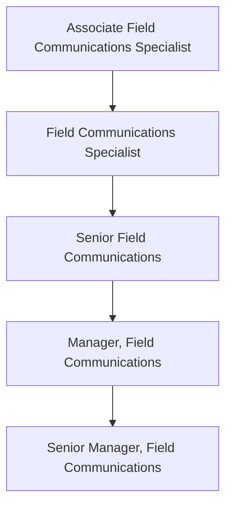

The Field Communications function is part of the Field Enablement team and is responsible for creating effective, timely, and easily consumable communications for the GitLab Field Team. The team's charter is to help GitLab's Field organization sell better, faster and smarter with communication programs that keep them better informed of organizational/business updates that impact their roles, as well as useful resources that will enable day-to-day work.

## Leadership Levels

### Manager, Field Communications

The Manager, Field Communications reports to the Sr. Manager, Field Communications (if applicable) or the [Senior Director, Field Enablement](/job-families/sales/director-of-field-enablement/#senior-director-field-enablement).

#### Manager, Field Communications Job Grade

The Manager, Field Communications is a grade [8](/handbook/total-rewards/compensation/compensation-calculator/#job-grades) in the manager track.

#### Manager, Field Communications Responsibilities

- Manage, coach, and develop Field Communications Specialist(s) responsible for managing and executing field communication tactics including QBRs, newsletters, videos, memos, presentations, and more
- Serve as change management and communication expert for large, cross-functional company projects and initiatives, developing communication plans and enablement materials
- Develop and manage effective communication strategies that improve transparency and efficiency across the entire Field team and with supporting functions
- Build relationships with key internal business stakeholders and executives to keep Field Comms processes top-of-mind
- Lead the planning and execution of multi-channel communications plans supporting key field events including Sales Kick Off, President’s Club and Quarterly Business Reviews
- Run Field Recognition programs, including the Quarterly Achiever’s Chat, collaborating with the CEO, CRO and FOPS team members to support
- Own the Field Communications Cadence, including synchronous All Hands meetings (planning, organizing and prepping executives) and asynchronous communication channels.
- Spearhead efforts to ensure field communications are aligned with expectations as well as industry-standard rules and regulations

#### Manager, Field Communications Requirements

- Extends that of the Senior Field Communications Manager requirements
- People management experience strongly preferred
- Sales or Field/Sales Operations experience is a plus
- Expert in copywriting and editing
- Proven experience developing and implementing effective communication strategies within a high-tech B2B sales environment
- Strong executive presence and experience working with executive teams on communication initiatives and proposals
- Experience with change management communication plans and content (change management certification preferred)
- Impeccable communication (oral and written) and presentation skills
- Experience writing, proofing and editing leadership emails, slide decks, video scripts, articles, talking points and change communication updates
- Excellent team player and ability to effectively collaborate with others
- Strong project management skills and attention to detail with the ability to execute on multiple projects simultaneously in an organized manner with minimal supervision

### Senior Manager, Field Communications

The Senior Manager, Field Communications reports to the [Senior Director, Field Enablement](/job-families/sales/director-of-field-enablement/#senior-director-field-enablement).

#### Senior Manager, Field Communications Job Grade

The Senior Manager, Field Communications is a grade [9](/handbook/total-rewards/compensation/compensation-calculator/#job-grades).

#### Senior Manager, Field Communications Responsibilities

- Manage, coach, and develop junior Field Communications and [Field Content](/job-families/sales/program-manager-field-enablement/) [Program Managers](/job-families/sales/program-manager-field-enablement/) team members.
- Collaborate and iterate directly with CRO and the CRO leadership team to provide strategic communications guidance for key revenue-impacting field initiatives
- Oversee the management and iteration of GitLab’s Sales content management system, ensuring CRO LT, Field leaders, and Field sellers, plus key stakeholders, are engaged and informed on the platform’s performance/ROI  
- Lead sales content and messaging initiatives that support proactive go-to-market activities as well as document internal sales processes for various customer segments and all routes to market
- Champion efforts to define, maintain, and improve communication and alignment between Go-To-Market functions including Field, Marketing and Product teams. Champion the adoption of the GTM Enablement Framework.
- Promote and oversee development and management of a cascading Field Comms strategy that begins with CRO LT and Field leaders.

#### Senior Manager, Field Communications Requirements

- Extends that of the Manager, Field Communications requirements
- People management experience required
- Sales or Field/Sales Operations experience is a plus
- Well-organized, hands-on, skilled at planning and time management
- Ability to drive consensus across a diverse set of stakeholders, including executive leadership in Field Organization, Marketing, Product, and other functions.
- Proactively proposes effective iterations to programs where efficiency gains are available and establishes solutions through creative methods
- Exceptional interpersonal and communication skills with ability to build strong trusted relationships
- Demonstrated ability to collaborate in a virtual and matrixed team environment across business areas to achieve common goals
- Adapts in a fast-paced, rapidly changing environment while accurately judging priorities and tracking all initiatives, projects, and details

## Performance Indicators

- [Field communication/newsletter open and click-through rates](/handbook/sales/field-communications/field-flash-newsletter/#measurement)
- Field Comms & Content Pulse Survey response rates
  - Results from benchmark questions related to the Field’s sentiment around feeling informed and enabled in their roles
- Feedback from key stakeholders, including CRO LT and Field Leaders/Managers
- Adoption metrics from sales asset management system, including recurring usage, average sessions and average time-in-platform
- ROI metrics from sales asset management system and successfully tying ROI insights to sales content
- Future performance indicators will include (but not be limited to) additional usage metrics, sales pitch tracking, pipeline generation, sales efficiency (time spent on comms) tracker and new hire productivity

## Career Ladder

### Hiring Process

Candidates for this position can expect the hiring process to follow the order below. Please keep in mind that candidates can be declined from the position at any stage of the process. To learn more about someone who may be conducting the interview, find their job title on our [team page](/handbook/company/team/).

- Qualified candidates will be invited to schedule a 30 minute [screening call](/handbook/hiring/interviewing/#screening-call) with one of our Global Recruiters.
- Next, candidates will meet with members of the [GitLab Field Operations team](/handbook/company/team/?department=field-operations),
- Then, candidates will meet with the Manager and/or Senior Manager of Field Communications,
- Finally, candidates will meet with the VP of Field Operations.

Additional details about our process can be found on our [hiring page](/handbook/hiring/).
