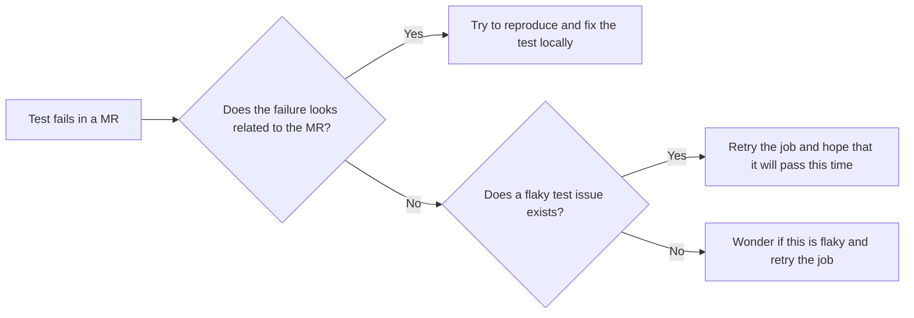

---

title: "Flaky tests management and processes"
---

## Introduction

A flaky test is an unreliable test that occasionally fails but passes eventually if you retry it enough times.
In a test suite, flaky tests are inevitable, so our goal should be to limit their negative impact as soon as possible.

Out of all the factors that affects master pipeline stability, flaky tests contribute to at least 30% of master pipeline failures each month.

## Current state and assumptions

| Current state | Assumptions |
| ------------- | ----------- |
| `master` success rate [was at 89% for March 2024](/handbook/engineering/infrastructure/performance-indicators/#master-pipeline-stability) | We don't know exactly what would be the success rate without any flaky tests, but we assume we could attain 99% |
| [5200+ `~"failure::flaky-test"` issues](https://10az.online.tableau.com/#/site/gitlab/views/DRAFTFlakytestissues/FlakyTests?:iid=1) out of a total of [260,040 tests as of 2024-03-01](https://gitlab-org.gitlab.io/rspec_profiling_stats/#overall_time) | It means [we identified 1.99% of tests as being flaky](https://docs.gitlab.com/ee/development/testing_guide/flaky_tests.html#automatic-retries-and-flaky-tests-detection). [GitHub identified that 25% of their tests were flaky at some point](https://github.blog/2020-12-16-reducing-flaky-builds-by-18x/#how-far-weve-come), our reality is probably in between. |
| [Coverage is currently at 98.42%](https://gitlab-org.gitlab.io/gitlab/coverage-ruby/#_AllFiles) | Even if we'd removed the 5200 flaky tests, we don't expect the coverage to go down meaningfully. |
| ["Average Retry Count"](https://10az.online.tableau.com/#/site/gitlab/views/DRAFTFlakytestissues/FlakyTests?:iid=1) per pipeline is currently at 0.015, it means given [RSpec jobs' current average duration of 23 minutes](https://10az.online.tableau.com/#/site/gitlab/views/DRAFTEP-JobsDurations/EP-JobsDurations?:iid=2), this results in an additional `0.015 * 23 = 0.345` minutes on average per pipeline, not including the idle time between the job failing and the time it is retried. [Explanation provided by Albert](https://gitlab.com/gitlab-org/quality/team-tasks/-/issues/874#note_575599680). | Given we have approximately [91k pipelines per month](https://gitlab.com/gitlab-org/gitlab/-/pipelines/charts), that means flaky tests are wasting 31,395 CI minutes per month. Given our private runners cost us $0.0845 / minute, this means flaky tests are wasting at minimum $2,653 per month of CI minutes. This doesn't take in account the engineers' time wasted. |

### Manual flow to detect flaky tests

When a flaky test fails in an MR, the author might follow the following flow:

## Why is flaky tests management important?

Flaky tests negatively impact several teams and areas:

| Impacted department/team | Impacted area | Impact description | Impact quantification |
| --------------- | ------------- | ------------------ | --------------------- |
| Development department | MR & deployment cycle time | Wasted time (by forcing people to look at the failures and retry them manually if needed) | A lot of wasted time for all our engineers |
| Infrastructure department | CI compute resources | Wasted money | At least $2,653 worth of wasted CI compute time per month |
| Delivery team & Quality department | Deployment cycle time | Distraction from actual CI failures & regressions, leading to slower detection of those | TBD |

## Flaky tests management process

We started an experiment to [automatically open merge requests for very flaky tests](https://gitlab.com/gitlab-org/gitlab/-/merge_requests/147137) to improve overall pipeline stability and duration.
To ensure that our product quality is not negatively affected due to test coverage reduction, the following process should be followed:

1. Groups are responsible for reviewing their [test-quarantining merge requests](https://gitlab.com/gitlab-org/gitlab/-/merge_requests?label_name=quarantine).
   These merge requests are meant to start a discussion on whether a test is useful or not.
   In case a test is impacting `master`' stability heavily, the Engineering Productivity team can merge these merge requests even without a review from their responsible group.
   The group should still review the merge request and start a discussion about the quarantined test's next step.
2. Once a test is quarantined, its associated issue will be reported in [weekly group reports](https://gitlab.com/gitlab-org/quality/triage-reports/-/issues/?sort=updated_desc&state=opened&label_name%5B%5D=triage%20report&in=TITLE&search=triage%20report%20for&first_page_size=20).
    Groups can also list all of their [flaky tests](https://gitlab.com/gitlab-org/gitlab/-/issues/?state=opened&label_name%5B%5D=failure%3A%3Aflaky-test&label_name%5B%5D=group%3A%3Axxx) and their [quarantined tests](https://gitlab.com/gitlab-org/gitlab/-/issues/?state=opened&label_name%5B%5D=group%3A%3Axxx&label_name%5B%5D=quarantine) (replace `group::xxx` in the issues list).
3. The number of quarantined test cases per group is also available as [a dashboard](https://10az.online.tableau.com/#/site/gitlab/views/DRAFTFlakytestissues/MonthlyFlakyTestIssues).
4. Groups are responsible for ensuring stability and coverage of their own tests, by [getting flaky tests back to running](https://docs.gitlab.com/ee/development/testing_guide/flaky_tests.html#how-to-reproduce-a-flaky-test-locally) or removing them.

You can leave any feedback about this process in the [dedicated issue](https://gitlab.com/gitlab-org/quality/engineering-productivity/team/-/issues/447).

### Goals

- Increase `master` stability to a solid 95% success rate without manual action
- Improve productivity - MR merge time - [lower "Average Retry Count"](https://10az.online.tableau.com/#/site/gitlab/views/DRAFTFlakytestissues/FlakyTests?:iid=1)
- Remove doubts on whether `master` is broken or not
- Reduce the need to retry a failing job by default
- Define acceptable thresholds for action like quarantining/focus on refactoring
- Step towards unlocking [Merge train](https://gitlab.com/gitlab-org/quality/quality-engineering/team-tasks/-/issues/195)

### Flaky tests management in end-to-end tests

The end-to-end tests follow a separate process of automatically quarantining flaky tests as [outlined here](/handbook/engineering/infrastructure/test-platform/blocking-tests/#managing-test-failures).

## Additional resources

- [Flaky tests technical documentation](https://docs.gitlab.com/ee/development/testing_guide/flaky_tests.html)
- [Measure and act on flaky specs](https://gitlab.com/groups/gitlab-org/-/epics/8789)
- [Flaky tests dashboard](https://10az.online.tableau.com/#/site/gitlab/workbooks/2283052/views)
