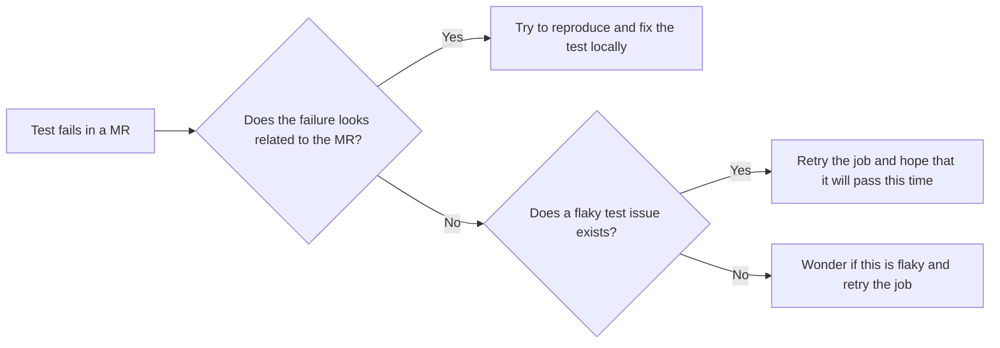

## Introduction

A flaky test is an unreliable test that occasionally fails but passes eventually if you retry it enough times. Flaky tests can be a result of brittle tests, unstable test infrastructure, or an unstable application. We should try to identify the cause and remove the instability to improve quality and build trust in test results. 

### Manual flow to detect flaky tests

When a flaky test fails in an MR, the author might follow the following flow:

## Why is flaky tests management important?

- Flaky tests undermine test results, leading to engineers disregarding test failures as flaky.
- Manual retries to try to get flaky tests to pass, and the effort needed to investigate flaky tests as failures are a significant waste of time.
- Managing flaky tests by quickly fixing the cause or removing the test from the test suite allows test time and costs to be used where they add value. 

## Flaky tests management process

We started an experiment to [automatically open merge requests for very flaky tests](https://gitlab.com/gitlab-org/gitlab/-/merge_requests/147137) to improve overall pipeline stability and duration.
To ensure that our product quality is not negatively affected due to test coverage reduction, the following process should be followed:

1. Groups are responsible for reviewing their [test-quarantining merge requests](https://gitlab.com/gitlab-org/gitlab/-/merge_requests?label_name=quarantine).
   These merge requests are meant to start a discussion on whether a test is useful or not.
   In case a test is impacting `master`' stability heavily, the Engineering Productivity team can merge these merge requests even without a review from their responsible group.
   The group should still review the merge request and start a discussion about the quarantined test's next step.
2. Once a test is quarantined, its associated issue will be reported in [weekly group reports](https://gitlab.com/gitlab-org/quality/triage-reports/-/issues/?sort=updated_desc&state=opened&label_name%5B%5D=triage%20report&in=TITLE&search=triage%20report%20for&first_page_size=20).
    Groups can also list all of their [flaky tests](https://gitlab.com/gitlab-org/gitlab/-/issues/?state=opened&label_name%5B%5D=failure%3A%3Aflaky-test&label_name%5B%5D=group%3A%3Axxx) and their [quarantined tests](https://gitlab.com/gitlab-org/gitlab/-/issues/?state=opened&label_name%5B%5D=group%3A%3Axxx&label_name%5B%5D=quarantine) (replace `group::xxx` in the issues list).
3. The number of quarantined test cases per group is also available as [a dashboard](https://10az.online.tableau.com/#/site/gitlab/views/DRAFTFlakytestissues/MonthlyFlakyTestIssues).
4. Groups are responsible for ensuring stability and coverage of their own tests, by [getting flaky tests back to running](https://docs.gitlab.com/ee/development/testing_guide/flaky_tests.html#how-to-reproduce-a-flaky-test-locally) or removing them.

You can leave any feedback about this process in the [dedicated issue](https://gitlab.com/gitlab-org/quality/engineering-productivity/team/-/issues/447).

### Goals

- Increase `master` stability to a solid 95% success rate without manual action
- Improve productivity - MR merge time - [lower "Average Retry Count"](https://10az.online.tableau.com/#/site/gitlab/views/DRAFTFlakytestissues/FlakyTests?:iid=1)
- Remove doubts on whether `master` is broken or not
- Reduce the need to retry a failing job by default
- Define acceptable thresholds for action like quarantining/focus on refactoring
- Step towards unlocking [Merge train](https://gitlab.com/gitlab-org/quality/quality-engineering/team-tasks/-/issues/195)

## Additional resources

- [Flaky tests technical documentation](https://docs.gitlab.com/ee/development/testing_guide/flaky_tests.html)
- [Measure and act on flaky specs](https://gitlab.com/groups/gitlab-org/-/epics/8789)
- [Flaky tests dashboard](https://10az.online.tableau.com/#/site/gitlab/workbooks/2283052/views)
