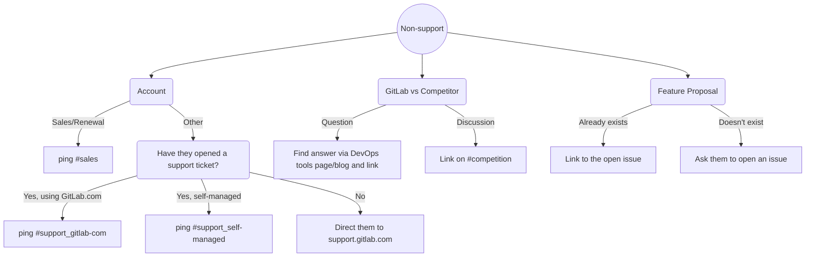
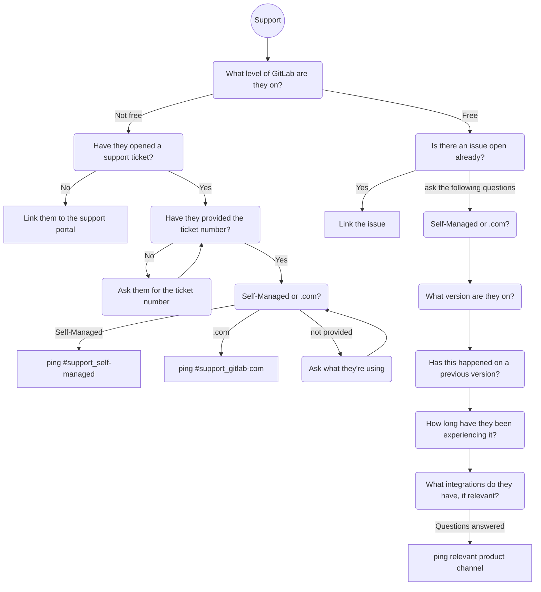

---

title: "Forum workflow"
---


## Users

### Registration and Login

Wider community members can register for an account on the [community forum](https://forum.gitlab.com/) by using the `Sign up` button and choosing their preferred method (email, oauth, etc.).

For GitLab team members it is recommended to use the `with GitLab` oauth method. This will authenticate against GitLab.com as oauth provider, prefill the profile being created, and later serve as oauth login. This method also grants additional permissions, see the administration section for [users](#users) below. Alternatively, manual sign-up using the `gitlab.com` address and setting up 2FA will work as well.

### Code of Conduct and FAQ

Our [Community Code of Conduct](https://about.gitlab.com/community/contribute/code-of-conduct/) applies to the forum platform. When in doubt, [flag posts](https://meta.discourse.org/t/what-are-flags-and-how-do-they-work/32783) which violate the Code of Conduct or are inappropriate in other ways (spam, advertising, etc.). Moderators can review the posts and take action while the posts are hidden from public viewing.

Discourse provides a general [FAQ](https://forum.gitlab.com/faq) for users.

### How to respond in the GitLab Forum

1. Visit the [forum](https://forum.gitlab.com/) and navigate into the categories. Alternatively, use [New](https://forum.gitlab.com/new), [Latest](https://forum.gitlab.com/latest) and [Unread](https://forum.gitlab.com/unread) search filters.
2. Write a response if you can, or involve a team member for assistance on the issue if you don't know how to engage or proceed. Troubleshooting questions and asking for details counts as a reply! Don't feel like you have to answer fully in one go.

Consider using some of the following resources to help get answers to questions:

- Search the forum for related topics - you may find a community member who has already solved something similar. You can loop them into the conversation or point the user to a thread that might be helpful
- Search [GitLab's documentation](https://docs.gitlab.com) for helpful information to aid in troubleshooting

### Working alongside the wider community

In the GitLab Community Forum, most tech support and troubleshooting assistance comes from community members volunteering their time and knowledge to help others.

If you see a community member volunteering their time to help another community member, give their reply a :heart: to show appreciation for their contribution.

### Flagging Inappropriate Content

If any GitLab team member sees a forum post that is inappropriate, abusive, spam, or a violation of our code of conduct, please flag the post by clicking the flag icon. The post is automatically hidden from public viewing and added to the [moderation](#moderation) queue for review. If the flagging action requires more context or immediate actions, contact [admins](https://forum.gitlab.com/about) in the [#developer-relations](https://gitlab.slack.com/archives/C0R04UMT9) Slack channel.

If immediate action to hide or redact private information is required, flag the post and then ping one of the [admins](https://forum.gitlab.com/about) in the [#developer-relations](https://gitlab.slack.com/archives/C0R04UMT9) Slack channel.

## Best Practices

- Always be courteous and generous, especially when a user is new to the forum. You can recognize new users (and dormant users) by the blue, temporary banner at the top of their posts.
- Add a welcome message when replying to new users. It could be as simple as "Hi, and welcome to the forum! :smile:" at the start of your post.
- Use the like button (the heart icon) as much as you can, to thank users for their input and to inspire other users to do the same.
- Use the solution checkbox button as much as you can, to indicate to others when a forum topic has an answer.
- Thank users publicly for providing answers to questions, especially when they are not in the GitLab Staff group.

## Moderation

The moderation privileges should only be used to pin topics or make (global) announcements. [Moderators](https://forum.gitlab.com/g/moderators) share different responsibilities, and categories. If you need help or guidance, please reach out in the `#developer-relations` Slack channel.

### Reviews

Discourse implements an intelligent spam prevention system, which leads to users and posts behind hold for review. The same workflow applies when users flag a post manually. Items for review are indicated with a red count in the upper right menu, and can be access directly with the [Review](https://forum.gitlab.com/review?sort_order=score) section.

- Topics unrelated to GitLab, DevOps, etc. and text with many external URLs often is spam.
  - Take action with `Delete User > Delete and Block User`. This also deletes the post.
- There are bots which copy the body text of another topic or reply, and create their own new topic with a new URL. Discourse detects them as `New user typed their first post suspiciously fast, suspected bot or spammer behavior.`
  - Take action with `Delete User > Delete and Block User`.
- False positives
  - Short replies such as `Me too.`
  - A copy-pasted question from a different platform.
  - A user without posts but a profile picture and a personal biography/website
  - Suggested action: Approve the posts/users.
- A post was flagged as CoC violation.
  - Review the post. When in doubt, ask in `#coc-violations` in Slack.
  - `Edit` the post and follow the [Code of Conduct Templates](/handbook/marketing/developer-relations/workflows-tools/code-of-conduct-enforcement/#templates) to replace the text.

#### User Review Tips

When the user account looks suspicious, these tips can help with verification:

- Search the user avatar picture to verify it is not a stock photo. [TinEye](https://tineye.com/) provides a reverse image search.
- Compare username, real name, GitLab username (when provided), email address, biography for human input.
  - Bots and spam users often add URLs and text to their biography.
  - Different used names may indicate a fake profile.
- With admin permissions:
  - On the user profile, open the admin interface. Inspect the user profile's IP address with the Discourse built-in Whois lookup including geo location. When in doubt, use a search engine with `whois <IP address>` and also verify the ASN and its ISP. Sometimes a google search unveils them belonging to a fraud friendly environment, or other insightful details.

### Moderator Specific Permissions

[Click this link to view the Moderator Quick Start guide.](https://forum.gitlab.com/t/read-me-moderator-quick-start-guide/39564)

This guide explains Moderator permissions, expectations, and best practices.

#### Moderator Specific Non-Technical Contributions

- Welcome new members
- Check forum threads for an existing answer: if there is an answer already, consider liking it or marking as solved
- Reassign categories on the forum
- Add or create appropriate tags
- Look in the forum for answers that may have already been supplied in an existing thread
- Look in the Support Zendesk instance for answers that may have already been supplied in a ticket from Support
- Ask the poster initial troubleshooting questions like screenshots, error messages, etc.

#### General Moderator Best Practices

- Leave all interactions and replies open-ended. We want our forum users to feel like they can always come back and pick up the conversation.
- [Consider gifting swag](/handbook/marketing/developer-relations/contributor-success/community-appreciation/) to forum users that contribute a lot or in a really exceptional way! Do this via a DM/private message.

#### Moderator Only Access

Below is a list of actions only forum Moderators can take in the Discourse platform. For this reason, at this time only GitLab Staff members are granted Moderator status.

##### Marking accepted solutions

Mark a response as an "accepted solution" in a situation where a single reply effectively answers or resolves a forum thread. Only the original poster and moderators have the ability to mark an answer in a forum thread. Please do this freely! It helps with SEO, and it helps our users know what questions have been answered.

**Instructions**

Click the ellipsis in the small grey toolbar on the post > click the checkbox.

##### Editing topics and posts

Sometimes users will accidentally post private information like license or API keys, emails addresses, etc. Publicly identifiable information needs to be redacted from the forum. You can also use this tool to redact inappropriate language or other Code of Conduct violations.

**Instructions**

If you need to edit a user’s post for whatever reason, please private message the user in the forum letting them know that you have done so, and the reason why.

Click the ellipsis in the small grey toolbar on the post > click the pencil icon.

**Instructions For Sending a Private Message**

1. Click the user’s avatar icon, user card will appear
2. Click the `message` button on the user card to draft private message

The edit history diff is only visible to moderators.

##### Viewing email addresses

For the sake of anonymity, only Forum Moderators can see the email address associated with a forum user’s account.

**Instructions*

1. Click the user’s avatar icon, user card will appear
2. Click the avatar icon on the user card to navigate to the user’s profile
3. Click the `show` button in the user’s profile

##### Drafting in/using the private Staff Category

This is not exclusive to Moderators, but you can use the Staff Category to draft new knowledge share articles, initiatives, whatever you need! You will notice the little lock symbol next to private categories.

##### Deleting topics and posts

We do not delete topics and posts in the forum, mainly due to the fact that this action can destroy trust. There are always exceptions to this rule - a good example is when spam posts sneak in. If you feel something needs to be deleted, you can always reach out to [admins](https://forum.gitlab.com/about) in private or in the [#developer-relations](https://gitlab.slack.com/archives/C0R04UMT9) Slack channel and we can talk it through!

**Instructions**

Click the ellipsis in the small grey toolbar on the post > click the trash can icon.

##### Moving Posts To a New Thread

It’s not uncommon that moderators will feel the need to move new posts out of old threads, or move posts to their own topic altogether. Please move new posts out of old topics when users try to bring topics a year or older back to life.

**Instructions**

1. Click wrench icon on right side of UI
2. Click `select post` in dropdown
3. Choose either `select+below` or `select` depending on how much of the conversation you want to move
4. Choose `move` to Fill out the popover accordingly
5. Click `move to new topic`

## Workflow

### Moderator and Admin Workflow

**How and when to edit forum posts.**

Generally, we do not edit other peoples' posts. If we see something that can be improved, we should reach out to them privately to ask them to change it. This helps us build trust with our community and with the GitLab team, since it shows them that they have the creative freedom and autonomy to post what they like on our forum.

That being said, there are instances when moderators can edit posts directly. Here are some examples and how to do it:

- Violation of GitLab's [Code of Business Conduct & Ethics](/handbook/legal/gitlab-code-of-business-conduct-and-ethics/) and [Events Code of Conduct](/handbook/company/culture/ecoc/) (Ex. redacting swear words, if they are unable or unwilling to edit it themselves)
- Redact private information (Ex. license keys, account info, email addresses, etc.)
- Editing can be achieved via the grey pencil icon in the post toolbar (... > pencil)

**How and when to mark a solution in a thread.**

- When there is a clear answer to the topic and/or question
- Marking the solution can be done via the grey checkbox icon in the post toolbar (... > checkbox)

**How and when to delete a forum post or topic.**

- Please do not delete other's posts. When necessary, message the user first, and let them have a chance to delete it themselves
- Deleting content for any reason is a breach of trust, which is something we are working hard to build in our forum community. If you feel like a post needs to be deleted, please reach out to an Admin, so the situation can be discussed.

Follow the relevant workflow depending on the question:





### Forum Community Response Workflow

[Community response situations](/handbook/marketing/developer-relations/developer-advocacy/community-response/#forum-topic-preparation) include preparing a forum topic as a draft in the [Internal](https://forum.gitlab.com/c/internal/) category.

Team members need to sign-up for a [forum account](/handbook/marketing/developer-relations/workflows-tools/forum/#registration-and-login) in order to create a topic. The Internal category allows team members review and edit the draft together without it being available to the public.

After a forum topic is created in the Internal category, team members have the ability to edit the title, tags, description, post timestamp, and category.

- To edit the title, category, or tags of the topic, click the pencil icon on the top.
- To edit the description, use the pencil icon at the bottom of the topic next to 'Reply'. Note that the pencil icon may be collapsed within the ellipsis menu.
- Editing a topic description only is available for [trust level 4](/handbook/marketing/developer-relations/workflows-tools/forum/#user-trust-levels) and moderators. Ask an administrator to update the [team member trust level](/handbook/marketing/developer-relations/workflows-tools/forum/#team-member-trust-level) if necessary.

A sandbox topic to test editing is available [here (internal)](https://forum.gitlab.com/t/draft-announcement-sandbox-test-for-everyone/71974).

#### Forum Banner Announcements

Steps for bannering on Discourse:

1. Download design component to your computer
2. In Discourse navigate to Admin Panel > Customize > Themes > Top Navbar
3. Under uploads, click the `Add+` button
4. Add your design
5. Click `Edit CSS/HTML`
6. Add mini banner CSS:

   ```css
   .mini-banner__image {
     height: 60.5px;
     width: 720px;
     background-image: url($mini-banner);
     background-size: 100% 100%;
     margin: 0 auto;
   }
   ```

7. Click `After Header and add this div to make CSS work`

   ```html
   <div class="main-banner">
     <a href="https://forum.gitlab.com">
       <div class="main-banner__image"></div>
     </a>

     <a href="https://forum.gitlab.com/t/ci-cd-minutes-for-free-tier/40241" target="__blank">
       <div class="mini-banner__image"></div>
     </a>
   </div>
   ```

8. Slight modifications may be needed depending on the size of the image

## Administration

### Discourse Platform

The Discourse instance `forum.gitlab.com` is operated by the Discourse team on [their SaaS platform](https://www.discourse.org/pricing). The Discourse platform was started as self-hosted instance in 2015, and later [migrated to Discourse SaaS in February 2020](https://gitlab.com/groups/gitlab-com/gl-infra/-/epics/139). The domain is managed by the GitLab infrastructure team.

Updates and important security fixes are applied by the Discourse team. Technical owners can reach out to their support team. For business organization and subscription updates, please open [a confidential issue in the Developer Advocate Meta Project](https://gitlab.com/gitlab-com/marketing/developer-relations/developer-advocacy/developer-advocacy-meta/-/issues).

In October 2021, the Discourse forum exceeded 1 million monthly page views. More metric reports can be created using the [Admin dashboard](https://forum.gitlab.com/admin).

#### User Trust Levels

Discourse uses [trust levels](https://meta.discourse.org/t/trust-level-permissions-table-inc-moderator-roles/224824) to grant more trust permissions to users as they evolve on using and engaging on the forum platform. This trust system also helps to keep spam users away, ensuring a safe place to discuss and help each other.

- New users start at level 0, and can only post a few topics and replies, and need to engage by reading topics to earn trust level 1.
- Trust level 1 grants the permission to send DMs, upload images, flag posts, etc. as basic user.
- Members with trust level 2 have spent time on the forum, helped users with responses, receive and give likes, and read more about GitLab topics.
- Trust level 3 as a regular user means becoming a GitLab community evangelist with visiting often, leading the path with helpful responses, engaging with likes and feeling energized.
- Leaders with trust level 4 have earned their trust by staff team member nomination, helping with questions, engaging with likes, flagging posts to moderators, lending a hand to new users, and overall collaborate closely with GitLab team members.

##### Nomination for Trust Level 4

Please open a [new issue in the Developer Advocate Meta Project](https://gitlab.com/gitlab-com/marketing/developer-relations/developer-advocacy/developer-advocacy-meta/-/issues) and share the user profile URL and a detailed reason why they should be promoted to trust level 4. Assign the issue to technical owners using this quick action: `/assign @dnsmichi @sugaroverflow`. Administrators will review and reach out to nominated community members.

##### Team Member Trust Level

GitLab team members who signup using oauth, will automatically be added to the `gitlab-team` group, granting [trust level 3](/handbook/marketing/developer-relations/workflows-tools/forum/#user-trust-levels). This group does not trigger any @-mention notifications in forum posts.

Administrators can promote team members to trust level 4 manually, for example when needed for [community response workflows](/handbook/marketing/developer-relations/workflows-tools/forum/#forum-community-response-workflow).

#### Categories

The [forum categories](https://forum.gitlab.com/categories) allow to group posts by sections and topics. Users can also subscribe to category notifications. The top-level categories are inspired by the DevSecOps lifecycle, common questions about GitLab features, and community activities.

Categories are also shown in a dropdown when users follow the `New topic` action on the forum landing page. We try to keep the category list short and concise.

There are two categories serving a special purpose, they must not be removed:

- [Internal](https://forum.gitlab.com/c/internal/) is required for the [community response workflow](/handbook/marketing/developer-relations/workflows-tools/forum/#forum-community-response-workflow)
- [Staff](https://forum.gitlab.com/c/staff/) is used by Discourse to manage site content and permissions (example: [FAQ](https://forum.gitlab.com/faq).

For requesting a new category, please review the following steps:

1. Do you want to filter specific topics, or subscribe to notifications? If yes, please consider using [tags](#tags) instead.
1. New categories should fit as subcategory into the existing top-level categories. We try to avoid bigger layout changes to avoid breaking contributor workflows.
1. Create a [new issue in the Developer Advocate Meta Project](https://gitlab.com/gitlab-com/marketing/developer-relations/developer-advocacy/developer-advocacy-meta/-/issues) to discuss, and add details about forum DRIs, expected topic count, and impact. Assign the issue to technical owners using this quick action: `/assign @dnsmichi @sugaroverflow`.

##### Category Topic Templates

Discourse supports [category topic templates](https://meta.discourse.org/t/topic-templates-for-categories-and-other-alternatives/38295), similar to GitLab description templates in issues/epics/MRs. Templates are used to guide users in providing all details for  questions (configuration, steps to reproduce, versions, etc.) which enables forum contributors to help more efficiently. The categories focus on support ("How to use GitLab", etc.), community engagement and programs, GitLab University. A general catch-all category guides users to select specific categories as default template.

Administrators can edit each category, and navigate into `Templates` to modify the templates. Sub categories require a copy of the top-level templates, ensuring that all categories use templates by default. In the past, we had users specifically selecting categories without templates, creating new topics in the wrong place.

All templates are persisted in the [discourse-assets Git repository](https://gitlab.com/gitlab-da/projects/discourse-assets/-/tree/main/category_templates?ref_type=heads), and provide templates for the top level categories.

Steps to update a category topic template:

1. Navigate into the category settings, and choose `Templates`.
1. Edit the template and preview the changes.
1. Save the template and test to create a new topic in the category.
1. Persist the changes in the [discourse-assets Git repository](https://gitlab.com/gitlab-da/projects/discourse-assets/-/tree/main/category_templates?ref_type=heads).

#### Tags

Users can add tags to topics; higher trust levels also allow tag creation. Users can filter topics by tag, and subscribe to tag notifications too. This helps with specific workflows for docs and blog teams.

The tag group [`feedback`](https://forum.gitlab.com/tag_groups/6) includes the following tags:

- [`docs-feedback`](https://forum.gitlab.com/tag/docs-feedback) is used by the technical writing team to invite for docs.gitlab.com feedback.
- [`blog-feedback`](https://forum.gitlab.com/tag/blog-feedback) is embedded on the GitLab blog footer as CTA for feedback.

#### Settings

Administrators can modify the [Discourse settings](https://forum.gitlab.com/admin/site_settings/category/all_results). Please open a [new issue in the Developer Advocate Meta Project](https://gitlab.com/gitlab-com/marketing/developer-relations/developer-advocacy/developer-advocacy-meta/-/issues) to suggest, discuss and document changes. Note that plugins are installed by contacting Discourse Support.

The `Only show overridden` checkbox can be helpful to see modified settings. The most notable changes are documented below.

- Required: Title, site description, contact email, company name
- Branding: logo, favicon, etc.
- Basic setup: allow user locale, ga universal tracking code, top menu, category colors, fixed category positions, enable whispers, short title
- Login: GH login, oauth2 enabled (GitLab oauth via [discourse-oauth2-basic](https://meta.discourse.org/t/discourse-oauth2-basic-support/33879))
- Users: reversed usernames, hide suspension reasons, use email for username and name suggestions
- Posting: min post/topic title length, do not allow uncategorized topics, post edit time limit, do not show edit history to public, max reply history, newuser max replies/mentions per topic, newuser max links/embedded media/max attachments
- Email: alternative reply by email addresses
- Files: authorized extensions, do not download remote images to local, purge deleted uploads grace period days
- Security: Allow moderators to manage categories and groups, allowed iframes
- Spam: Hide post sensitivity, newuser spam host threshold, max new accounts per registration ip
- Rate Limits: rate limit new user create post
- User Preferences: Enable mailing list mode
- Plugins: allow solved on all topics, assign allowed on groups, data explorer enabled

#### User Admin

Admins can search for users, and verify the profiles when reviewing the moderation queue.

The groups are also managed in this section. Next to the default groups for trust levels and staff, custom groups have been created.

#### Badges

Discourse uses a gamification system where users can earn badges from forum activity, likes, and engaging with replies. The [disco bot tutorial](https://forum.gitlab.com/t/community-first-steps-explore-discourse-with-discobot/) starts automatically for newly signed up users by sending them a direct message.

The [trust levels](https://blog.discourse.org/2018/06/understanding-discourse-trust-levels/) also grant more forum permissions, and help prevent spam by limiting new users to a limited set to interactions.

[Forum Spelunker](https://forum.gitlab.com/badges/104/forum-spelunker) is a custom badge which was granted to everyone helping answer and solve old forum topics in May 2020.

#### Customizations

Requires an administrative login. Open an issue with mockup design before changing the design.

- [Themes](https://forum.gitlab.com/admin/customize/themes/2): Top navbar menu navigation
- [Colors](https://forum.gitlab.com/admin/customize/colors/1)
- [User Fields](https://forum.gitlab.com/admin/customize/user_fields) asked during user registration: `GitLab Username`

Workflow for applying customizations:

1. Create a [new issue in the Developer Advocate Meta Project](https://gitlab.com/gitlab-com/marketing/developer-relations/developer-advocacy/developer-advocacy-meta/-/issues) to propose changes, including design mockups, screenshots, etc.
1. Apply the changes to the custom theme, colors, etc.
1. Persist the changes for the custom theme in the [discourse-assets](https://gitlab.com/gitlab-da/projects/discourse-assets) project.

#### API

Used by integrations, such as the [GitLab Blog Bot](/handbook/marketing/developer-relations/workflows-tools/zapier/#gitlab-blog-forum-bot).

#### Plugins

The Discourse subscription plan includes many [plugins](https://forum.gitlab.com/admin/plugins) by default. The most common workflows are questions with answers, allowing to select one as solution, solving the topic (discourse-solved plugin).

### General Administration Workflow

Most administrative tasks will be done from the [Discourse Admin Dashboard](https://forum.gitlab.com/admin). The dashboard provides metrics and dashboards for page views, user engagements, and community health stats.

Create a [new issue in the Developer Advocate Meta Project](https://gitlab.com/gitlab-com/marketing/developer-relations/developer-advocacy/developer-advocacy-meta/-/issues) to document changes in settings, handle abusive behavior and other administrative tasks.

The [Logs section](https://forum.gitlab.com/admin/logs/staff_action_logs) provides an audit log of all actions.

### How to Grant Admin Permissions

To add an Admin:

1. Go to the [list of forum users](https://forum.gitlab.com/admin/users/list/active)
1. Use the search box to find the user you want to grant admin permissions to
1. Click on the user to modify their profile
1. Scroll down to the `Permissions` section
1. Click on the `Grant Admin` button
1. An e-mail confirmation will be sent to the Admin that granted the permission (i.e. you). Go to your inbox and click on the link to confirm granting Admin permission to the user
1. If all went well, the `Permissions` > `Admin?` section on the user's profile admin should read `Yes`

Note: we would like to reserve only two or three Staff spots for forum Admins within our existing 15 total Staff spots.

### How to Grant Moderator Permissions

If you want to add an Moderator:

1. Go to the [list of forum users](https://forum.gitlab.com/admin/users/list/active)
1. Use the search box to find the user you want to grant moderator permissions to
1. Click on the user to modify their profile
1. Scroll down to the `Permissions` section
1. Click on the `Grant Moderation` button
1. Immediately the `Permissions` > `Admin?` section on the user's profile admin should read `Yes`

Note: we only have 15 Staff spots available with our current Discourse subscription. Please check with an [Admin](https://forum.gitlab.com/about) if you want to grant, or want to receive, moderator status.

### Deprovisioning

As a provisioner, follow these steps to deprovision a GitLab team member who is being offboarded:

#### Revoke permissions and disable user

1. Go to the [list of forum users](https://forum.gitlab.com/admin/users/list/active)
1. Use the search box to find the user you want to grant moderator permissions to
1. Click on the user to modify their profile
1. Reset trust level to 0 (new user)
1. Revoke moderator or admin permissions (if applicable)
1. Remove custom staff title (if applicable)
1. Remove from the `gitlab-team` group
1. If user account is authenticated with GitLab or uses a gitlab.com email address, suspend user.

#### Revoke permissions and keep account

If the team member wants to keep their account as a wider community member, follow these steps:

1. Go to the [list of forum users](https://forum.gitlab.com/admin/users/list/active)
1. Use the search box to find the user you want to grant moderator permissions to
1. Click on the user to modify their profile
1. Ask them to change the email address to their private email.
1. Navigate to their user profile and select the `Admin` button on the right.
1. Verify that `Primary Email / Secondary Emails` do not contain a `@gitlab.com` email address.
1. Revoke Admin (if they were admins)
1. Revoke Moderator
1. Remove from all groups
1. Trust Level: `2: member`

## GitLab Forum Strategy

Engagement drives engagement, so the more the GitLab team engages with our wider community, the more they are likely to engage with us, and with others. By setting the example of providing thorough answers, we can build our forum up as a place of knowledge share and collaboration. [See the Forum's 2020 strategy slide deck for more](https://docs.google.com/presentation/d/1PiNlxFImSIO8kz9TfWMZ6GLGd9fYefILpC6LS3w3lJE/edit#slide=id.p).

### Connect with us via Slack

Join [#developer-relations](https://gitlab.slack.com/archives/C0R04UMT9).
