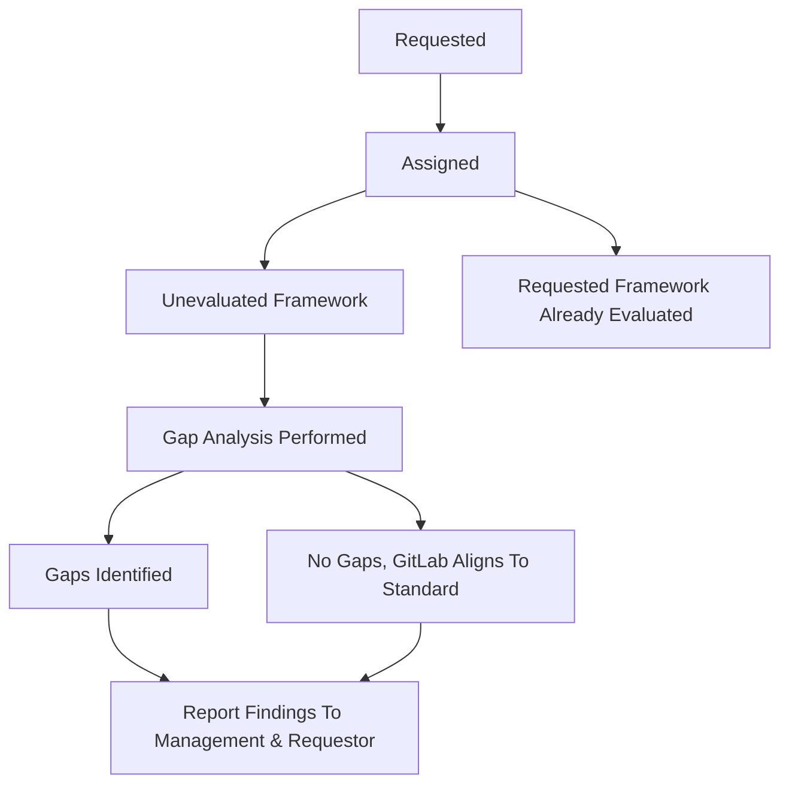

## Purpose

A gap analysis as it relates to security compliance refers to an in-depth review that helps organizations determine the difference between the current state of their information security and a given security standard (SOC 2 Type 2 Availability Criteria, ISO 27018, BSIMM, etc.) they might want to adopt or align against. The outcome of completing gap analysis procedures is a report to management:

1. What, if any, gaps exist between GitLab's current state and that new standard
1. A recommendation for whether or not to pursue that new standard
1. The impact of not pursuing that new standard
1. The impact if that new standard is pursued

## Scope

The scope of gap analysis procedures performed by the Security Compliance team are limited to information security and compliance related regulatory standards and frameworks.

## Roles and Responsibilities

| Role | Responsibility|
| ---- | ------ |
| Gap Analysis Owner | The individual Security Compliance team member responsible for being the gap analysis DRI through the analysis lifecycle, performing the gap analysis, and mapping/formalizing controls to address the identified gaps. |
| Gap Analysis Requestor | The individual GitLab team member who requests the performance of a gap analysis. Any GitLab team member can request a gap analysis from the Security Compliance team. |
| Gap Analysis Program DRI | Responsible for regular reviews of program health and stakeholder report delivery |

## Gap Analysis Phases Overview

## Procedure

The following phases walk through the gap analysis lifecycle.

### Gap Analysis Requested

Gap analysis requests can be submitted to the Security Compliance team by any GitLab team member. In order to submit a gap analysis request, [submit an issue to the Gap Analysis Project](https://gitlab.com/gitlab-com/gl-security/security-assurance/team-commercial-compliance/gap-analysis/-/issues/new?issuable_template=GapAnalysisRequest) utilizing the 'GapAnalysisRequest' Issue Template. The Security Compliance team will review all submitted Gap Analysis requests and begin the process of prioritizing the gap analysis. If the requested framework has already been assessed, the Gap Analysis Owner will notify the Gap Analysis Requestor and provide them the relevant details over the performed gap analysis. Once the gap analysis request has been reviewed and prioritized, the Gap Analysis DRI will notify the requestor in the submitted request issue of their request status in the overall gap analysis queue.

### Performing The Gap Analysis

Once the gap analysis request has been received, a member of the Security Compliance team will utilize [ZenGRC]() to manage/perform the gap analysis which involves identifying control gaps, mapping existing controls to the requested frameworks requirements, and evaluating the mapped/created controls for their design and operating effectiveness via the [Control Assessment Guide](https://gitlab.com/gitlab-com/gl-security/security-assurance/security-compliance-commercial-and-dedicated/gcf/-/blob/main/runbooks/assessment_testing_manual.md). Refer to this [Gap Analysis Runbook](https://gitlab.com/gitlab-com/gl-security/security-assurance/team-commercial-compliance/gap-analysis/-/blob/main/runbooks/Gap_Assessment_Manual.md) for further details over how the Security Compliance team performs a gap analysis.

### Reporting Gap Analysis Results

Once the gap analysis has been completed and all relevant gaps identified, the Gap Analysis Owner will create a [Gap Analysis Audit Report](https://docs.google.com/presentation/d/1XB8cVvE7weZZuXSaXuX-dlcsyd0bRnI10pG1m7WJEJY/edit#slide=id.p1) outlining the results of the analysis, the identified gaps/observations, and the recommendations for observation closing and new policy/procedure/control formalization. Once the Gap Analysis Audit Report has been reviewed and approved by the Security Compliance Manager and Director of Security Assurance, the Gap Analysis Owner will begin the process of assigning the identified observations in existing controls that map to the assessed framework to relevant stakeholders for remediation via the [Observation Intake and Management](https://gitlab.com/gitlab-com/gl-security/security-assurance/security-compliance-commercial-and-dedicated/observation-management/-/blob/master/runbooks/1_Observation%20Intake%20and%20Management.md) procedure as well as begin the process of formalizing any new policies/procedures/controls that close the identified gaps. Additionally, it is possible that during the performance of the gap analysis, it is determined that GitLab is already aligned with the standard/framework that is being assessed. In such cases, this will be reported in the [Gap Analysis Audit Report](https://docs.google.com/presentation/d/1XB8cVvE7weZZuXSaXuX-dlcsyd0bRnI10pG1m7WJEJY/edit#slide=id.p1) which will be made available to management and the gap analysis requestor.

## SLA/Prioritization

Gap analysis requests will be prioritized by the Gap Analysis Program DRI with assistance from Security Compliance leadership within 2 weeks of receipt. Factors such as external requirements, internal initiatives, pre-existing obligations, required deliverables and level of importance based on customer feedback will be utilized in prioritization. Each gap analysis will be assigned a priority level of 1, 2, 3, or 4. Priority levels with their associated completion SLA's can be found below. Stated SLA's include time from prioritization of the gap analysis request to the time the final gap analysis audit report is completed.

| Priority Level | Completion SLA|
| ---- | ------ |
| Priority 1 | The gap analysis is of the highest priority to meet short term requirements/requests. SLA for completion: 1-3 months|
| Priority 2 | The gap analysis is not an immediate requirement but is of high importance. SLA for completion: 3-9 months |
| Priority 3 | The gap analysis is of moderate importance and should be completed within the current fiscal year. SLA for completion: 9-12 months|
| Priority 4 | The gap analysis would be considered a "nice to have" but is currently of low significance/impact. SLA for completion: 12-24 months or when the gap analysis request is next in the queue. |

## References

- [GCF Contol Lifecycle]()
- [GitLab's Security Compliance Controls]()

## Contact

If you have any questions or feedback about the security compliance gap analysis process please [contact the GitLab security compliance team](#).

<a href="" class="btn bg-primary text-white btn-lg">Return to the Field Security Homepage</a>
