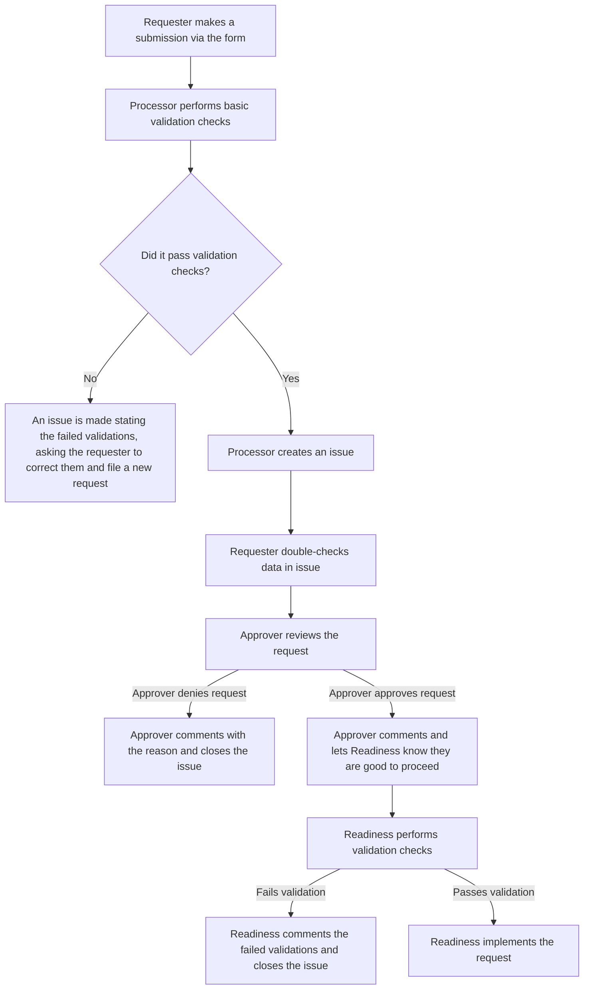

<sup>*Introduced via [support-team-meta#2408](https://gitlab.com/gitlab-com/support/support-team-meta/-/issues/2408)*</sup>

This document focuses solely on the workflows and policies for Gratis Support
requests. If you are looking for a more in-depth description, please review
the [Support handbook page on requesting gratis support](/handbook/support/gratis-support/).

## Overall process flowchart



### Prospects

**NOTE**: This was formerly called Priority Prospect requests

#### Prospects - Validation checks

Before anything can be implemented, please perform the following validation
checks:

- [ ] There are not 30 current Gratis Support entries within
      [the spreadsheet](https://docs.google.com/spreadsheets/d/11p3aBj1LTr-ngk1wxoMlae-UvJ3bOTuQHd48so2ZcXU/edit?usp=sharing)
  - [Validation failed response](#maximum-number-of-gratis-support-requests-reached)
- [ ] Approval has been granted by someone within leadership
  - [Validation failed response](#approval-not-granted-after-one-week)
- [ ] This customer has not utilized Gratis Support previously (see
      [this spreadsheet](https://docs.google.com/spreadsheets/d/1TdMbce83HqSA04mfamqcY7DurNbRs_sqdD68udU0Frw/edit?usp=sharing)
      to confirm)
  - [Validation failed response](#has-utilized-gratis-support-previously)
- [ ] The SFDC account in question has a type of `Prospect`
  - [Validation failed response](#sfdc-account-is-not-a-prospect)
- [ ] The SFDC opportunity is not in a closed state
  - [Validation failed response](#sfdc-opportunity-provided-is-closed)
- [ ] A detailed justification has been provided
  - [Validation failed response](#justification-provided-is-lacking-detail-or-substance)

If all checks are passed, proceed to the next step. If any of them have failed,
utilize the
[Failed validation check responses](#failed-validation-check-responses) to
comment on the issue.

#### Prospects - Zendesk checks

Due to the specific nature in which these are setup, we need to ensure there are
not previous tickets in the way of our setup.

Start by ensuring the listed support contact does not have any existing,
non-closed tickets. If you do find existing tickets, they need to be closed
completely before we can proceed. Review the ticket to determine if this is an
acceptable task. If you determine it is not, post the ticket in the issue with
the message:

> We are seeing the user requested in this issue has non-closed tickets:
>
> - LIST
> - OF
> - TICKETS
>
> These would need to be completely closed before we could proceed. Please speak
> with the user to confirm we can close the ticket(s) (this is required to
> proceed). Once you have done so, please reply back letting us know they have
> been informed.

You can close a ticket via the API, with a curl request such as:

```bash
curl -ss https://gitlab.zendesk.com/api/v2/tickets/TICKET_ID \
   -H "Content-Type: application/json" \
   -u support-ops@gitlab.com/token:YOUR_ZD_ADMIN_TOKEN \
   -X PUT \
   -d '{"ticket": {"status": "closed"}}'
```

Replacing:

- `TICKET_ID` with the ticket's ID
- `YOUR_ZD_ADMIN_TOKEN` with your admin Zendesk API token

#### Prospects - Organization setup

After doing so, you then need to create the organization in Zendesk. Do this by
hovering over the `+ Add` button at the top-left of Zendesk and then clicking
`Organization`. This will cause a pop-up modal to appear. In the modal, set the
`Name` to `PP: NAME_OF_SFDC_ACCOUNT` (replacing `NAME_OF_SFDC_ACCOUNT` with the
exact name from the Salesforce account). **The domains field should *always* be
empty**.

With that created, you need to edit some of the organization fields:

| Field                  | Value                        |
|------------------------|------------------------------|
| Salesforce ID          | PRIORITY PROSPECT            |
| SFDC Short ID          | PRIORITY PROSPECT            |
| GitLab Plan            | See below                    |
| ARR                    | 0                            |
| Account Owner          | The requester from the issue |
| Account Type           | Prospect                     |
| Manual Support Upgrade | Check this box               |
| Expiration Date        | 30 days from setup           |
| Not in SFDC            | Check this box               |

For `GitLab Plan`, you need to review the opportunity to determine if this is
a gitlab.com or Self-Managed opportunity. If you cannot determine it, please ask
the requester on the issue to clarify that.

If it is gitlab.com, use `Prospect Dotcom`. If it is Self-Managed, use
`Prospect SM`.

After setting up the organization, you need to add the support contacts from the
issue to the organization.

#### Prospects - Update the spreadsheet

See
[Updating the current Gratis Support spreadsheet](#updating-the-current-gratis-support-spreadsheet)
for more info.

#### Prospects - Setup a reminder

See [Setting up a reminder](#setting-up-a-reminder) for more info.

#### Prospects - Updating the issue

Once all of the above is done, you can update and close out the issue. Comment
with the following:

> This has been setup at this time. It is set to expire `DATE`.
>
> Please ensure you inform the customer who will be filing tickets (the email
> given via the form) of the following:
>
> - All gitlab,com related tickets should be submitted via
>   [this form](https://support.gitlab.com/hc/en-us/requests/new?ticket_form_id=334447&tf_360005241679=saas_prospect_customer)
>   unless it is specifically about gitlab,com Account related matters
> - All gitlab,com Account related matters should be submitted via
>   [this form](https://support.gitlab.com/hc/en-us/requests/new?ticket_form_id=360000803379&tf_360005241679=saas_prospect_customer)
> - All Self-Managed related tickets should be submitted via
>   [this form](https://support.gitlab.com/hc/en-us/requests/new?ticket_form_id=426148&tf_360005182220=sm_prospect_customer)
> - Every ticket should ensure the "Tell us about your GitLab subscription"
>   field uses the value "Sales Assisted Trial". Any other one could cause
>   routing issues for them. This above links automatically populate that when
>   used.
> - All tickets must be filed using the contact email provided in the request.
>   Any others will be rejected by the system (and the ticket closed).
>
> /label ~"SupportOps::Completed"
>
> /spend TIME
>
> /close

Replacing:

- `DATE` with the date of expiration (30 days from today)
- `TIME` with the time spent working the issue

#### Prospects - Expiration

When the expiration date of the Gratis Support is reached, please do the
following:

1. Close out any open tickets the organization currently has.
1. Unassociate the users on the organization.
1. Uncheck the box on the organization for `Manual Support Upgrade`
1. Add `Expired` to the beginning of the organization's name, followed by a
   space
1. Add `FORMER` to the beginning of the organization's `Salesforce ID`, followed
   by a space
1. Add `FORMER` to the beginning of the organization's `SFDC Short ID`, followed
   by a space

After doing so, you need to
[update the previous Gratis Support spreadsheet](#updating-the-previous-gratis-support-spreadsheet)
for tracking purposes.

### Migration Offerings

#### Migration offerings - Validation checks

Before anything can be implemented, please perform the following validation
checks:

- [ ] There are not 30 current Gratis Support entries within
      [the spreadsheet](https://docs.google.com/spreadsheets/d/11p3aBj1LTr-ngk1wxoMlae-UvJ3bOTuQHd48so2ZcXU/edit?usp=sharing)
  - [Validation failed response](#maximum-number-of-gratis-support-requests-reached)
- [ ] Approval has been granted by someone within leadership
  - [Validation failed response](#approval-not-granted-after-one-week)
- [ ] This customer has not utilized Gratis Support previously (see
      [this spreadsheet](https://docs.google.com/spreadsheets/d/1TdMbce83HqSA04mfamqcY7DurNbRs_sqdD68udU0Frw/edit?usp=sharing)
      to confirm)
  - [Validation failed response](#has-utilized-gratis-support-previously)
- [ ] The SFDC account in question has a type of `Customer`
  - [Validation failed response](#sfdc-account-is-not-a-customer)
- [ ] A detailed justification has been provided
  - [Validation failed response](#justification-provided-is-lacking-detail-or-substance)

If all checks are passed, proceed to the next step. If any of them have failed,
utilize the
[Failed validation check responses](#failed-validation-check-responses) to
comment on the issue.

#### Migration offerings - Zendesk checks

The only thing you need to check in Zendesk for this type of request is that an
organization exists and has an active subscription on it. If it does, you are
good to proceed. If not, please ping a Support Readiness Manager or Support
Readiness Director to discuss it further.

#### Migration offerings - Organization setup

These are setup utilizing an organization note. To ensure efficiency and quick
results, we utilize a Support Operations organization note (that is, one managed
directly in Zendesk).

Locate the organization in question and add the following into the `Notes`
section of the organization (if something is already present in the field,
append the following):

> This customer is in the process of migrating from one product offering to
> another. To ensure that during this process their support tickets are given an
> SLA so that Support Engineers will work on them, you will need to modify the
> tags on the ticket by removing the starting product's tag and adding the
> ending product's tag.
>
> Migration information:
>
> - Starting product: INITIAL_OFFERING
> - Ending product: ENDING_OFFERING
> - Self-managed tag(s): SM_TAG
> - gitlab.com tag(s): DOTCOM_TAG
>
> When you see this note in a ticket and you are the first to work that ticket,
> please remove the unneeded SLA tag and add the needed tag based on the subject
> matter of the ticket.
>
> For more information, please see ISSUE_LINK

Be sure to replace the ALL-CAPS tokens with the appropriate values, as described
in this table:

| Term              | Description                                    | Possible values                  |
|-------------------|------------------------------------------------|----------------------------------|
| INITIAL_OFFERING  | The product from which they are migrating      | `SM`, `DotCom`                   |
| ENDING_OFFERING   | The product to which they are migrating        | `SM`, `DotCom`                   |
| SM_TAG            | The self-managed tag the organization is using | `starter`, `premium`, `ultimate` |
| DOTCOM_TAG        | The gitlab.com tag the organization is using   | `bronze`, `silver`, `gold`       |
| ISSUE_LINK        | The issue you are working                      |                                  |

The information needed for the above values should be determined from the issue
filed for the request.

#### Migration offerings - Update the spreadsheet

See
[Updating the current Gratis Support spreadsheet](#updating-the-current-gratis-support-spreadsheet)
for more info.

#### Migration offerings - Setup a reminder

See [Setting up a reminder](#setting-up-a-reminder) for more info.

#### Migration offerings - Updating the issue

Once all of the above is done, you can update and close out the issue. Comment
with the following:

> This has been setup at this time. It is set to expire `DATE`.
>
> /label ~"SupportOps::Completed"
>
> /spend TIME
>
> /close

Replacing:

- `DATE` with the date of expiration (30 days from today)
- `TIME` with the time spent working the issue

#### Migration offerings - Expiration

When the expiration date of the Gratis Support is reached, please do the
following:

1. Remove the organization note added via
   [Migration offerings - Updating the issue](#migration-offerings---organization-setup)

After doing so, you need to
[update the previous Gratis Support spreadsheet](#updating-the-previous-gratis-support-spreadsheet)
for tracking purposes.

### Upgrade Offerings

#### Upgrade offerings - Validation checks

Before anything can be implemented, please perform the following validation
checks:

- [ ] There are not 30 current Gratis Support entries within
      [the spreadsheet](https://docs.google.com/spreadsheets/d/11p3aBj1LTr-ngk1wxoMlae-UvJ3bOTuQHd48so2ZcXU/edit?usp=sharing)
  - [Validation failed response](#maximum-number-of-gratis-support-requests-reached)
- [ ] Approval has been granted by someone within leadership
  - [Validation failed response](#approval-not-granted-after-one-week)
- [ ] This customer has not utilized Gratis Support previously (see
      [this spreadsheet](https://docs.google.com/spreadsheets/d/1TdMbce83HqSA04mfamqcY7DurNbRs_sqdD68udU0Frw/edit?usp=sharing)
      to confirm)
  - [Validation failed response](#has-utilized-gratis-support-previously)
- [ ] The SFDC account in question has a type of `Customer`
  - [Validation failed response](#sfdc-account-is-not-a-customer)
- [ ] The SFDC opportunity is not in a closed state
  - [Validation failed response](#sfdc-opportunity-provided-is-closed)
- [ ] A detailed justification has been provided
  - [Validation failed response](#justification-provided-is-lacking-detail-or-substance)

If all checks are passed, proceed to the next step. If any of them have failed,
utilize the
[Failed validation check responses](#failed-validation-check-responses) to
comment on the issue.

#### Upgrade offerings - Zendesk checks

The only thing you need to check in Zendesk for this type of request is that an
organization exists and has an active subscription on it. If it does, you are
good to proceed. If not, please ping a Support Readiness Manager or Support
Readiness Director to discuss it further.

#### Upgrade offerings - Organization setup

These are setup utilizing an organization note. To ensure efficiency and quick
results, we utilize a Support Operations organization note (that is, one managed
directly in Zendesk).

Locate the organization in question and add the following into the `Notes`
section of the organization (if something is already present in the field,
append the following):

> This customer is in the process of trialing a higher tiered product offering.
> During this time, please provide them the level of support equated to that of
> a TRIALING_PLAN customer.
>
> For more information, please see ISSUE_LINK

Be sure to replace the ALL-CAPS tokens with the appropriate values, as described
in this table:

| Term           | Description                              | Possible values       |
|----------------|------------------------------------------|-----------------------|
| TRIALING_PLAN  | The product from which they are trialing | `Premium`, `Ultimate` |
| ISSUE_LINK     | The issue you are working                |                       |

The information needed for the above value should be determined from the issue
filed for the request.

#### Upgrade offerings - Update the spreadsheet

See
[Updating the current Gratis Support spreadsheet](#updating-the-current-gratis-support-spreadsheet)
for more info.

#### Upgrade offerings - Setup a reminder

See [Setting up a reminder](#setting-up-a-reminder) for more info.

#### Upgrade offerings - Updating the issue

Once all of the above is done, you can update and close out the issue. Comment
with the following:

> This has been setup at this time. It is set to expire `DATE`.
>
> /label ~"SupportOps::Completed"
>
> /spend TIME
>
> /close

Replacing:

- `DATE` with the date of expiration (30 days from today)
- `TIME` with the time spent working the issue

#### Upgrade offerings - Expiration

When the expiration date of the Gratis Support is reached, please do the
following:

1. Remove the organization note added via
   [Upgrade offerings - Updating the issue](#upgrade-offerings---organization-setup)

After doing so, you need to
[update the previous Gratis Support spreadsheet](#updating-the-previous-gratis-support-spreadsheet)
for tracking purposes.

### Former Customers

#### Former Customers - Validation checks

Before anything can be implemented, please perform the following validation
checks:

- [ ] There are not 30 current Gratis Support entries within
      [the spreadsheet](https://docs.google.com/spreadsheets/d/11p3aBj1LTr-ngk1wxoMlae-UvJ3bOTuQHd48so2ZcXU/edit?usp=sharing)
  - [Validation failed response](#maximum-number-of-gratis-support-requests-reached)
- [ ] Approval has been granted by someone within leadership
  - [Validation failed response](#approval-not-granted-after-one-week)
- [ ] This customer has not utilized Gratis Support previously (see
      [this spreadsheet](https://docs.google.com/spreadsheets/d/1TdMbce83HqSA04mfamqcY7DurNbRs_sqdD68udU0Frw/edit?usp=sharing)
      to confirm)
  - [Validation failed response](#has-utilized-gratis-support-previously)
- [ ] The SFDC account in question has a type of `Former Customer`
  - [Validation failed response](#sfdc-account-is-not-a-former-customer)
- [ ] The SFDC opportunity is not in a closed state
  - [Validation failed response](#sfdc-opportunity-provided-is-closed)
- [ ] A detailed justification has been provided
  - [Validation failed response](#justification-provided-is-lacking-detail-or-substance)

If all checks are passed, proceed to the next step. If any of them have failed,
utilize the
[Failed validation check responses](#failed-validation-check-responses) to
comment on the issue.

#### Former Customers - Zendesk checks

The only thing you need to check in Zendesk for this type of request is that an
organization exists and does not have an active subscription on it. If this is
true, you are good to proceed. If not, please ping a Support Readiness Manager
or Support Readiness Director to discuss it further.

#### Former Customers - Organization setup

Perhaps just tick the manual support upgrade box?

These are setup utilizing an organization note and checking a box on the
organization. To ensure efficiency and quick results, we utilize a Support
Operations organization note (that is, one managed directly in Zendesk).

Locate the organization in question and add the following into the `Notes`
section of the organization (if something is already present in the field,
append the following):

> This former customer is in the process of trialing a product offering to come
> back to us. During this time, please provide them the level of support equated
> to that of a TRIALING_PLAN customer.
>
> For more information, please see ISSUE_LINK

Be sure to replace the ALL-CAPS tokens with the appropriate values, as described
in this table:

| Term           | Description                              | Possible values       |
|----------------|------------------------------------------|-----------------------|
| TRIALING_PLAN  | The product from which they are trialing | `Premium`, `Ultimate` |
| ISSUE_LINK     | The issue you are working                |                       |

The information needed for the above value should be determined from the issue
filed for the request.

After doing that, ensure you check the box `Manual Support Upgrade` on the
organization.

#### Former Customers - Update the spreadsheet

See
[Updating the current Gratis Support spreadsheet](#updating-the-current-gratis-support-spreadsheet)
for more info.

#### Former Customers - Setup a reminder

See [Setting up a reminder](#setting-up-a-reminder) for more info.

#### Former Customers - Updating the issue

Once all of the above is done, you can update and close out the issue. Comment
with the following:

> This has been setup at this time. It is set to expire `DATE`.
>
> /label ~"SupportOps::Completed"
>
> /spend TIME
>
> /close

Replacing:

- `DATE` with the date of expiration (30 days from today)
- `TIME` with the time spent working the issue

#### Former Customers - Expiration

When the expiration date of the Gratis Support is reached, please do the
following:

1. Remove the organization note added via
   [Former Customers - Organization setup](#former-customers---organization-setup)
1. Uncheck the box `Manual Support Upgrade` on the organization.

After doing so, you need to
[update the previous Gratis Support spreadsheet](#updating-the-previous-gratis-support-spreadsheet)
for tracking purposes.

### Extensions

#### Extensions - Validation checks

Before anything can be implemented, please perform the following validation
checks:

- [ ] The previous issue given was an approved and implemented request
  - [Validation failed response](#previous-issue-invalid)
- [ ] Approval has been granted by someone within leadership
  - [Validation failed response](#approval-not-granted-after-one-week)
- [ ] A detailed justification has been provided
  - [Validation failed response](#justification-provided-is-lacking-detail-or-substance)
- [ ] The previous Gratis Support requerst has not expired as of yet
  - [Validation failed response](#gratis-support-already-expired)
- [ ] There are not already two extensions for this request
  - [Validation failed response](#maximum-extensions-used)

If all checks are passed, proceed to the next step. If any of them have failed,
utilize the
[Failed validation check responses](#failed-validation-check-responses) to
comment on the issue.

#### Extensions - Setup

When a request for an extension comes in, the work needed is simplified a good
bit. Review the workflow for the previous issue's request type and follow that
for the setup. Likely the only actions needed are to update the date used on the
previous setup.

#### Extensions - Update the spreadsheet

See
[Updating the current Gratis Support spreadsheet](#updating-the-current-gratis-support-spreadsheet)
for more info.

#### Extensions - Setup a reminder

See [Setting up a reminder](#setting-up-a-reminder) for more info.

#### Extensions - Expiration

Review the workflow for the previous issue's request type and follow that for
the expiration.

## Gratis Support Request for a Support Leadership approved situation

Due to the "other" style nature of these, there is not a set process we can
really follow for these. For these types of requests, please assign them to a
Support Readiness Manager or Support Readiness Director to work.

### Updating the Current Gratis Support spreadsheet

Regardless of the request type, you will need to update the
[Current Gratis Support](https://docs.google.com/spreadsheets/d/11p3aBj1LTr-ngk1wxoMlae-UvJ3bOTuQHd48so2ZcXU/edit?usp=sharing)
spreadsheet.

#### For new requests

When working a new request (i.e. not an Extension), you will do the following:

- Populate column B with the request type (based off the issue)
- Populate column C with the following:
  - `=hyperlink("SFDC_ACCOUNT_LINK", "SFDC_ACCOUNT_ID")`
  - SFDC_ACCOUNT_LINK is the URL of the SFDC account, using the 18 digit account
    ID
  - SFDC_ACCOUNT_ID the 18 digit account ID
- Populate column D with the following:
  - `=hyperlink("ZD_ORG_LINK", "SFDC_ACCOUNT_NAME")`
  - ZD_ORG_LINK is the URL to the organization in Zendesk
  - SFDC_ACCOUNT_NAME is the account's name in SFDC
- Populate column E with the following:
  - `=hyperlink("SFDC_OPP_LINK", "SFDC_OPP_ID")`
  - SFDC_OPP_LINK is the URL of the SFDC opportunity
  - SFDC_OPP_ID is the opportunity ID (last part of the URL)
- Populate column F with the following:
  - `=hyperlink("REQUEST_ISSUE_LINK", "APPROVER")`
  - REQUEST_ISSUE_LINK is the issue you are working
  - APPROVER is the name of the member of leadership who approved the request
- Populate column G with today's date, in the format of YYYY-MM-DD (ISO format)

If your request contains none of the fields, please leave the column blank.

Regardless of the request type, the sheet will calculate the Expires date for
you.

#### For extensions

For extensions, you will do the following:

- Populate column J with the following if this is the *first* extension:
  - `=hyperlink("REQUEST_ISSUE_LINK", "APPROVER")`
  - REQUEST_ISSUE_LINK is the issue you are working
  - APPROVER is the name of the member of leadership who approved the request
  - Populate column L with the following if this is the *second* extension:
    - `=hyperlink("REQUEST_ISSUE_LINK", "APPROVER")`
    - REQUEST_ISSUE_LINK is the issue you are working
    - APPROVER is the name of the member of leadership who approved the request

The sheet will calculate the Expires date for you.

#### For expirations

When one expires, you merely need to clear out the line from the spreadsheet.
Highlight columns B to G and hit the delete key on your keyboard.

If columns J or L is populated, click the cell in question and hit the delete
key on your keyboard.

**NOTE**: To *not* delete the row itself.

## Updating the Previous Gratis Support spreadsheet

**NOTE**: If you do not have access to the spreadsheet, please ping Jason Colyer
in the #support_operations channel within slack.

When a request expires, you need to update the
[Previous Gratis Support](https://docs.google.com/spreadsheets/d/1TdMbce83HqSA04mfamqcY7DurNbRs_sqdD68udU0Frw/edit?usp=sharing)
spreadsheet.

To do this, you will do the following:

- Populate column A with the request type (based off the issue)
- Populate column B with the following:
  - `SFDC_ACCOUNT_NAME`
  - SFDC_ACCOUNT_NAME is the account's name in SFDC
- Populate column C with the following:
  - `=hyperlink("SFDC_ACCOUNT_LINK", "SFDC_ACCOUNT_ID")`
  - SFDC_ACCOUNT_LINK is the URL of the SFDC account, using the 18 digit account
    ID
  - SFDC_ACCOUNT_ID the 18 digit account ID
- Populate column D with the number of tickets that were opened when using this
  request. This can be tricky to determine. Do your best in determining this.
- Populate column E with either `Y` or `N`, depending on if the reason for the
  request was achieved. If you are unsure here, ping a Support Readiness Manager
  or a Support Readiness Director for assistance. Example:
  - If the opportunity provided in the issue has become `Closed - Won`, the
    value would be `Y`
- Populate column F with the ARR earned from the Gratis Support request. If the
  value of column E is `N` or if there is no opportunity, the value is 0.
- Populate column G with the proposed ARR from the original request. If there is
  no opportunity, the value of this is 0.
- Populate column H with the Month and Year the status expired. As an example,
  if the status expired 2099-12-31, the value would be December 2099.

## Setting up a reminder

This is really dependent on your personal workflows, but the objective is to
ensure *anyone who works these issues* is notified when action is needed. As
long as what you do accomplishes that, you are golden.

Jason's preferred method for this is as follows:

1. Go into Slack
1. Navigate to the #spt_readiness-lounge channel
1. Type `/remind #spt_readiness-lounge Expire ISSUE_LINK on YYYY-MM-DD` into
   Slack
   - Replacing ISSUE_LINK with the issue you are working
   - Replacing YYYY-MM-DD with the date of expiration

### Failed validation check responses

Utilize these to comment on a request when a validation check has failed.

#### Maximum number of gratis support requests reached

> I am seeing we are currently at 30 gratis support entries. As such, we are not
> able to set any more up until one of the current ones expires or is canceled.
> Please speak with Sales leadership regarding this matter.
>
> Once others have expired or been canceled, you can file a new issue to
> potentially get your account added for gratis support.
>
> As such, we are not able to proceed and will close out this issue.
>
> /label ~"SupportOps::Blocked"
>
> /cc @lyle
>
> /close

#### SFDC account is not a prospect

> I am seeing the SFDC account in question for this request does not have an
> account type of `Prospect`. Because of technical limitations in the
> relationship between SFDC accounts and Zendesk organizations, we are not
> able to setup priority prospect status on accounts unless their SFDC account
> is listed as `Prospect`.
>
> As such, we will not be able to proceed on this request and will now close
> the issue.
>
> You might want to reach out in #support_leadership to speak to a support manager
> bout other options that may be able to be used for this account.
>
> /label ~"SupportOps::Blocked"
>
> /close

#### SFDC account is not a customer

> I am seeing the SFDC account in question for this request does not have an
> account type of `Customer`. Because of technical limitations in the
> relationship between SFDC accounts and Zendesk organizations, we are not
> able to setup a Migration offerring status on accounts unless their SFDC
> account is listed as `Customer`.
>
> As such, we will not be able to proceed on this request and will now close
> the issue.
>
> You might want to reach out in #support_leadership to speak to a support manager
> bout other options that may be able to be used for this account.
>
> /label ~"SupportOps::Blocked"
>
> /close

#### SFDC account is not a former customer

> I am seeing the SFDC account in question for this request does not have an
> account type of `Former Customer`. Because of technical limitations in the
> relationship between SFDC accounts and Zendesk organizations, we are not
> able to setup a Gratis Support status on accounts unless their SFDC account is
> listed as `Former Customer`.
>
> As such, we will not be able to proceed on this request and will now close
> the issue.
>
> You might want to reach out in #support_leadership to speak to a support manager
> bout other options that may be able to be used for this account.
>
> /label ~"SupportOps::Blocked"
>
> /close

#### Has utilized Gratis Support previously

> We are seeing this account has used Gratis Support in the past. As such,
> they would not qualify to be have Gratis Support once again. As such, we are
> not able to proceed and will close out this issue.
>
> /label ~"SupportOps::Blocked"
>
> /close

#### Approval not granted after one week

> I am seeing this has not yet been approved by a member of Sales leadership.
> We cannot proceed without that being obtained. Please have a member of Sales
> leadership approve this request **with a comment** so we can proceed.
>
> Should approval not be granted within 48 hours, this issue will be closed.
>
> /label ~"SupportOps::Blocked"
>
> /due in 48 hours

#### SFDC opportunity provided is closed

> I am seeing the SFDC opportunity provided is in a closed state. We cannot
> proceed on these requests using a closed opportunity. Please file a new
> request with an *open* SFDC opportunity so we can proceed from there.
>
> /label ~"SupportOps::Blocked"
>
> /close

#### Justification provided is lacking detail or substance

> We are seeing the justification provided would not satisfy the needs for
> Gratis Support in its current form. Can you please clarify further on why this
> opportunity requires Gratis Support?
>
> Please note if no more detailed are provided within 48 hours, this issue will
> be closed out and a new request will have to be filed.
>
> /label ~"SupportOps::Blocked"
>
> /due in 48 hours

#### Previous issue invalid

> I am seeing the previous Gratis Support issue provided is not valid for an
> extension. Please file a new request with an *open* SFDC opportunity so we can
> proceed from there.
>
> /label ~"SupportOps::Blocked"
>
> /close

#### Gratis Support already expired

> We are seeing the Gratis Support status for this customer has already expired
> and cannot be extended at this time.
>
> You might want to reach out in #support_leadership to speak to a support manager
> bout other options that may be able to be used for this account.
>
> /label ~"SupportOps::Blocked"
>
> /close

### Maximum extensions used

> We are seeing the Gratis Support status for this customer has already utilized
> the maximum number of extensions. As such, the status cannot be extended any
> further. As we cannot proceed on this issue, we will be closing it out.
>
> /label ~"SupportOps::Blocked"
>
> /close
