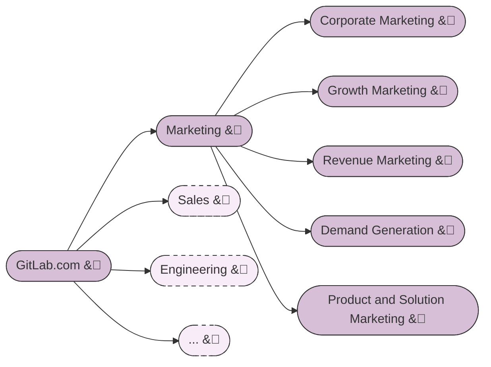



## Background

GitLab helps to organize teams and work through a hierarchy of [Groups](https://docs.gitlab.com/ee/user/group/) and [Projects](https://docs.gitlab.com/ee/user/project/).

### Key things to know

Groups can contain other groups ([subgroups](https://docs.gitlab.com/ee/user/group/subgroups/index.html)) and projects.

Groups and Projects are both similar and fundamentally different, which can be confusing when using GitLab

| Feature | Groups | Projects | Comments |
|---|---|---|---|
| Epics | X |  | Collection of related sub epics and issues in a strategic theme |
| Roadmaps | X |  |  Graphical view of epics over time |
| Milestones | X | X |  Burndown charts of a time boxed period |
| Issue Insights | X | X | Analytical view of issues and merge requests |
| Labels | X | X | Flexible ability to tag issues, epics and Merge Requests |
| Issue **Lists** | X | X | Lists of all issues, enables bulk updates |
| Issue **Boards** |X | X | Visual boards of issues grouped in lists |
| Issues |  | X | An item of work, a deliverable, a request, a discussion |
| Repositories |  | X | A set of files that are under version control |
| Merge Requests |  | X | The discussion/management of change to files under version control |
| CI Pipelines |  | X |  Automation of build and test of files / code that is being changed |

Graphically, this illustrates the difference between groups and projects:

### Known limitations

1. Epics can only be created at the group level, not at the project level.

## Guidelines

### Marketing GitLab Structure

In Marketing, we have diverse teams, where some need to develop demos and code, and others need to manage complex projects such as campaigns and large events.  In order to support a variety of activities, we are using Sub-Groups to provide flexibility enable the teams to have an area to work and be productive.

### Marketing Sub Groups and Projects

- In order to **work and manage issues**, there must be at **LEAST one** project under EACH of the Marketing SubGroups.

```mermaid
graph LR
    A(["Marketing &#128101;"]):::GRP
  A --> B(["Corporate Marketing &#128101;"]):::GRP
  A --> C(["Growth Marketing &#128101;"]):::GRP
  A --> D(["Revenue Marketing &#128101;"]):::GRP
  A --> E(["Demand Generation &#128101;"]):::GRP
  A --> F(["Product and Solution Marketing &#128101;"]):::GRP
  B --> BA("Corporate Events &#9881;"):::PRJ
  B --> BB("Developer Relations &#9881;"):::PRJ
  B --> BC("Corporate Communications &#9881;"):::PRJ
  B --> BD("Developer Relations &#9881;"):::PRJ
  B --> BE("All-Remote &#9881;"):::PRJ
  C --> CA("Global Content &#9881;"):::PRJ
  C --> CB("Inbound Marketing &#9881;"):::PRJ
  C --> CC("Brand & Digital Design &#9881;"):::PRJ
  D --> DA("Sales Development &#9881;"):::PRJ
  D --> DB("Field Marketing &#9881;"):::PRJ
  D --> DC("Account Based Marketing &#9881;"):::PRJ
  D --> DD("Marketing Operations &#9881;"):::PRJ
  E --> EA("Marketing Programs &#9881;"):::PRJ
  E --> EB("Digital Marketing &#9881;"):::PRJ
  E --> EC("Partner & Channel Marketing &#9881;"):::PRJ
  F --> FA("Product Marketing &#9881;"):::PRJ
  F --> FB("Technical Marketing &#9881;"):::PRJ
  F --> FC("Market Research and Customer Insights &#9881;"):::PRJ
  F --> FD("Competitive Intelligence &#9881;"):::PRJ

classDef GRP fill:#D8BFD8, stroke: #333
classDef PRJ fill:#c4d3d9, stroke: #333
```

```mermaid
graph LR
  subgraph legend["Legend"]
    GG(["Group &#128101;"]):::GRP -.- PP("Project &#9881;"):::PRJ
  end
classDef GRP fill:#D8BFD8, stroke: #333
classDef PRJ fill:#c4d3d9, stroke: #333
style legend fill:#FBFBF2, stroke: #b0b0a9
```

- As needed, the marketing teams can create additional **SubGroups** and **projects** to organize and manage their work.
  - For example of a Marketing SubGroups such as under the `Corporate Marketing` group
    - Contribute group and
    - Contribute-Workshops group
    - Tech. Evangelism group
    - **both subgroups have projects and support management of corporate events.**

```mermaid
graph LR
  A(["Marketing &#128101;"]):::GRP
  A --> B(["Corporate Marketing &#128101;"]):::GRP
  B --> BA("Corporate Marketing &#9881;"):::PRJ
  B --> BB(["Contribute &#128101;"]):::GRP
  B --> BC(["Contribute Workshops &#128101;"]):::GRP
  B --> BD(["Tech Evangelism &#128101;"]):::GRP

classDef GRP fill:#D8BFD8, stroke: #333
classDef PRJ fill:#c4d3d9, stroke: #333
```

