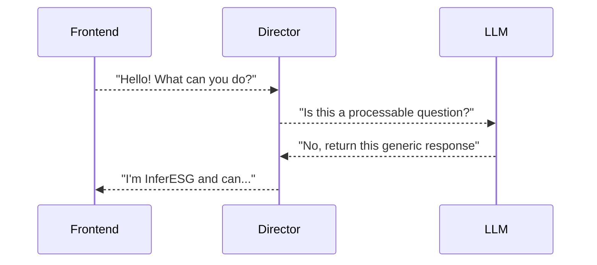
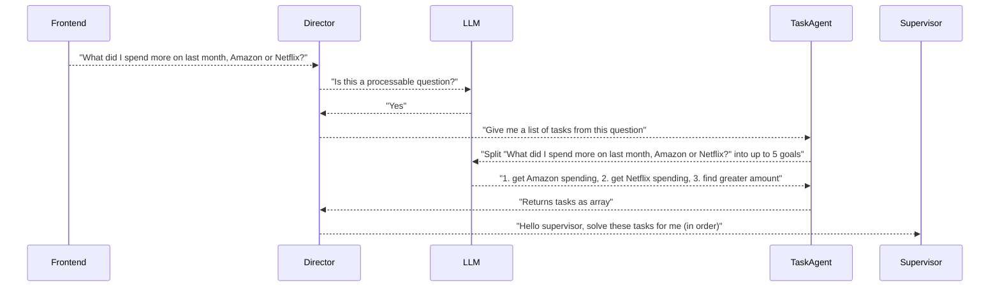
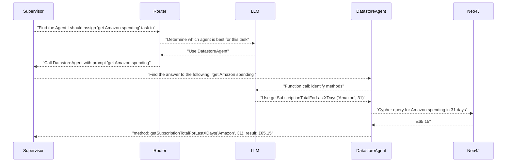
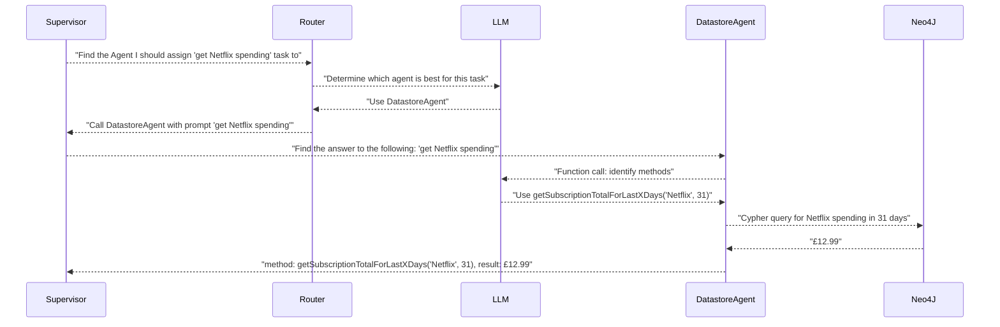
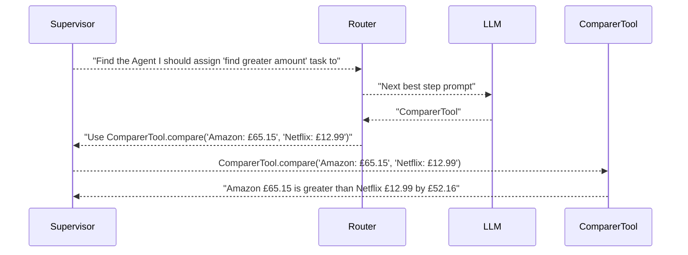
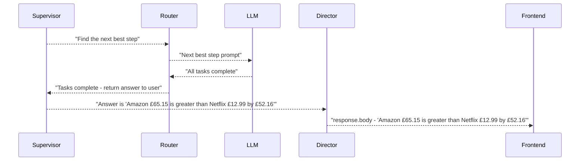

# Sequence diagrams of the happy flow

## "Hello! What can you do?"

I am a user who is asking about the bots capabilities

### Find tasks from question

## "What did I spend more on last month, Amazon or Netflix?"

I am a user who wants to know if last month I spent more on my Netflix subscription than my Amazon one

### Find tasks from question

### Solve step 1. get Amazon spending

### Solve step 2. get Netflix spending

### Solve step 3. find greater amount

### Verify we are done

