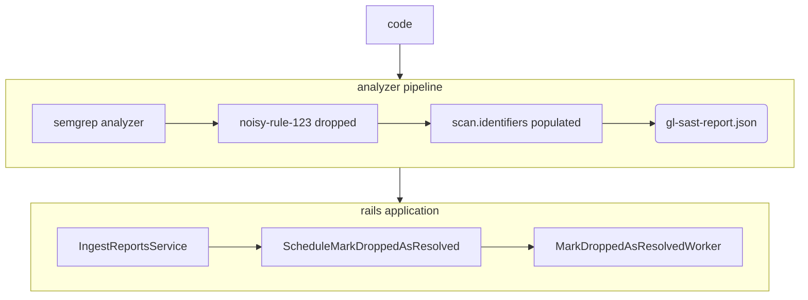

---

title: "How to monitor and respond to issues with SAST Automatic Vulnerability Resolution?"
---

### When to use this runbook?

This runbook is intended to be used when there is a service degaradation in relation to the SAST Automatic Vulnerability Resolution feature. Such degradation can be identified by monitoring the following:

* [Sidekiq Error Rate](https://dashboards.gitlab.net/goto/st2S69zIg?orgId=1) (in the [Static Analysis group dashboard](https://dashboards.gitlab.net/d/stage-groups-static_analysis/stage-groups-static-analysis-group-dashboard?orgId=1)) with `Vulnerabilities::MarkDroppedAsResolvedWorker` selected.
* Sidekiq execution [Apdex](https://dashboards.gitlab.net/goto/MlCAe9kIg?orgId=1) and [Error Ratio](https://dashboards.gitlab.net/goto/6VQT6rzIR?orgId=1) panels from the [Static Analysis error budget](https://dashboards.gitlab.net/d/stage-groups-detail-static_analysis/stage-groups-static-analysis-group-error-budget-detail?orgId=1).

### SAST Automatic Vulnerability Resolution

The [SAST Automatic Vulnerability Resolution](https://docs.gitlab.com/ee/user/application_security/sast/#automatic-vulnerability-resolution) feature is built to, as the name implies, automatically resolve vulnerabilities tied to [SAST rules](https://gitlab.com/gitlab-org/security-products/sast-rules) that have been disabled or removed.

The feature depends on a number of building blocks:

* [Schema definition in security-report-schemas](#schema-definition-in-security-report-schemas).
* [SARIF module in `analyzers/report` package](#sarif-module-in-analyzersreport-package).
* [Processing dropped identifier within Rails application](#dropped-identifier-processing-within-rails-application).

#### Schema definition in security-report-schemas

Reports generated by security analyzer scans have their JSON schemas defined in [security-report-schemas](https://gitlab.com/gitlab-org/security-products/security-report-schemas) repository. Automatic vulnerability resolution depends on a certain schema field (i.e. [`primary_identifiers`](https://gitlab.com/gitlab-org/security-products/security-report-schemas/-/blob/3b3b76e83722a97181f52f473a80f2f5713591e6/src/security-report-format.json#L134-140)) which is part of [`security-report-format`](https://gitlab.com/gitlab-org/security-products/security-report-schemas/-/blob/master/src/security-report-format.json?ref_type=heads), the latter being the parent schema for all other security reports' schema, including [`sast-report-format`](https://gitlab.com/gitlab-org/security-products/security-report-schemas/-/blob/master/src/sast-report-format.json?ref_type=heads).

#### SARIF module in `analyzers/report` package

The `primary_identifiers` field contains an exhaustive list of all identifiers for which the analyzer scan (as opposed to identifiers detected), so a report may have zero vulnerabilities but `scan.primary_identifiers` contain a full list. The list is generated while transforming a [SARIF](https://sarifweb.azurewebsites.net/) file into a SAST security report in the [`sarif.go` module](https://gitlab.com/gitlab-org/security-products/analyzers/report/-/blob/ab86ee260f289d204e705ff1ed39c8c6f334b8d5/sarif.go#L170) under [`analyzers/report`](https://gitlab.com/gitlab-org/security-products/analyzers/report) package.

#### Dropped identifier processing within Rails application

While [ingesting a security report](https://docs.gitlab.com/ee/development/sec/security_report_ingestion_overview.html) within the `gitlab-org/gitlab` application, the [`IngestReportsService`](https://gitlab.com/gitlab-org/gitlab/-/blob/master/ee/app/services/security/ingestion/ingest_reports_service.rb) iterates through [scan primary identifiers](https://docs.gitlab.com/ee/development/integrations/secure.html#scan-primary-identifiers) and executes [`ScheduleMarkDroppedAsResolvedService`](https://gitlab.com/gitlab-org/gitlab/-/blob/master/ee/app/services/security/ingestion/schedule_mark_dropped_as_resolved_service.rb) for each scan type, which in turn schedules [`MarkDroppedAsResolvedWorker`](https://gitlab.com/gitlab-org/gitlab/-/blob/master/ee/app/workers/vulnerabilities/mark_dropped_as_resolved_worker.rb). The worker loops through all vulnerabilities with identifiers matching the disabled or dropped identifiers (i.e no longer present in latest scan).

Below is a diagram showing the complete flow of automatic vulnerability resolution feature.

#### Monitoring

To monitor automatic vulnerability resolution, there are two primary sources of information: [sentry.io](https://new-sentry.gitlab.net/organizations/gitlab/issues/?project=3&query=is%3Aunresolved+MarkDroppedAsResolvedWorker&referrer=issue-list&statsPeriod=24h) which lists any errors occurring in [`MarkDroppedAsResolvedWorker`](https://gitlab.com/gitlab-org/gitlab/-/blob/master/ee/app/workers/vulnerabilities/mark_dropped_as_resolved_worker.rb) class for the last 24 hours, and [SAST Engineering](https://log.gprd.gitlab.net/app/dashboards#/view/1eebd010-9a73-11ec-9dd2-93d354bef8e7) dashboard on Kibana, which includes a number of panels monitoring certain works and showing the volume of uploaded reports. Please see below for a list of panels of interest and a brief description of each.

##### SAST Report Uploads

Displays the 90th percentile of file size of security reports uploaded, per 30 minutes. This is useful to see how big (or small) security reports that have been uploaded over a certain amount of time.

##### SAST Failing Workers Distribution

Shows the distribution of SAST-related `sidekiq` workers failing over a period of time.

##### Vulnerabilities::MarkDroppedAsResolvedWorker Execution Time

Displays the 75th and 95th percentiles of the worker's execution time.

##### Vulnerabilities::MarkDroppedAsResolvedWorker Job Status

Shows the count of job executions, split by job status, per hour. This is useful to gauge the amount of failing, deduplicated, or successful executions over a certain amount of time.

##### Top Projects for MarkDroppedAsResolvedWorker Executions

Shows the top projects listed by the count of their worker executions. This can be useful to see if a certain customer is experiencing an issue.

##### Logs

Additionally, you may want to check the following two saved searches in [production logs](https://gitlab.com/gitlab-com/runbooks/-/blob/master/docs/logging/README.md#production-gitlabcom):

* [Vulnerabilities::MarkDroppedAsResolvedWorker – Total Executions](https://log.gprd.gitlab.net/app/discover#/view/90af2000-3561-11ee-bd28-d5868e2560c1).
* [Vulnerabilities::MarkDroppedAsResolvedWorker – Executions with DB Writes](https://log.gprd.gitlab.net/app/discover#/view/8f08a680-3562-11ee-bfa6-bb3e7da18467).

#### What to do if something goes wrong?

1. Start by looking at the monitoring section above. Check if `MarkDroppedAsResolvedWorker` has any failures.
1. Look at the [logs](#logs), and see if the issue is possibly due to a query [timing out](#possible-checks) while executing a database write operation (e.g. trying to resolve a huge number of findings).
1. Consider [turning automatic vulnerability resolution off](#how-to-turn-automatic-vulnerability-resolution-off).

#### Possible Checks

* If there's an increase in error rates in relation to automatic vulnerability resolution, there's a possiblity it could be related to this [timeout issue](https://gitlab.com/gitlab-org/gitlab/-/issues/417046) when a very high number of vulnerability findings are being resolved.

#### How to turn automatic vulnerability resolution off?

The presence of `primary_identifiers` is [required](https://gitlab.com/gitlab-org/gitlab/-/blob/9d85d9449da19a26d073c5eab49e7b9f128e4650/ee/app/services/security/ingestion/schedule_mark_dropped_as_resolved_service.rb#L43) for report ingestion and automatic vulnerability resolution. If automatic vulnerability resolution is not working as expected, consider stopping automatic resolution by ensuring scans do not have `primary_identifiers` included in the generated reports. To do so, consider one of the following options:

1. Update `sarif.go` module to revert the change introduced in this [merge request](https://gitlab.com/gitlab-org/security-products/analyzers/report/-/merge_requests/39).
2. Update `ScheduleMarkDroppedAsResolvedService#dropped_identifiers` method to [return early](https://gitlab.com/gitlab-org/gitlab/-/blob/9d85d9449da19a26d073c5eab49e7b9f128e4650/ee/app/services/security/ingestion/schedule_mark_dropped_as_resolved_service.rb#L43) regardless of the existence of `primary_identifiers`.
