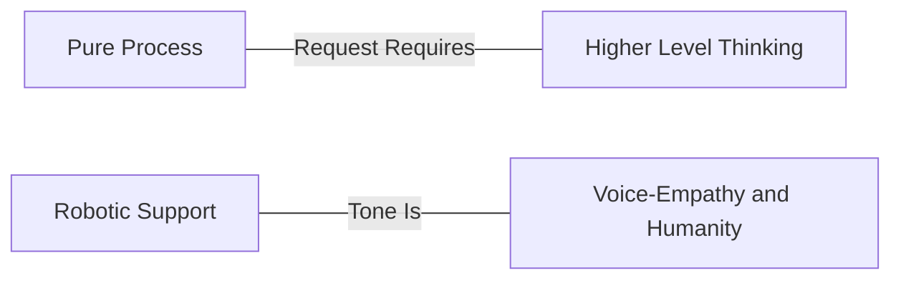

## How to respond to a ticket

### Smart Humans Provide Smart Support

We aim to hire smart people, and let them be smart. This means we try to offer sensible guidelines that will help, but avoid "scripts" or rigidity. Speak in your natural voice as you would to a peer at a conference. Obviously avoid unprofessional language, but you'll want to match the customer's tone. There is often a desire to "unify" by everyone speaking in a robotic tone:

> "Thank you for contacting support. We can help you with this. It looks like you are asking for help with resetting your password…"

This dehumanizes us and we lose our best asset: *Support from a human.* When you speak more naturally it anchors that we are also real people and not "support minds as a service:"

> "Ah, sorry to hear that you lost your password. I've issued a password reset and you are good to go. In the future, you can use this link:
>
> <link>
>
> Let us know if there is anything else we can help with. "

### We Aren't a Cannery (but we sometimes use canned goods)

At GitLab, we consider the elements of our responses carefully. If you find yourself
wanting to use canned responses, or are saying the same things over and over, it's
probably an opportunity to improve our process. That is, instead of creating a text
expander asking for logs, take a step back. Is there something earlier in the
experience of opening a support ticket that we could do to reduce the need for repetitive text?
There are times when it's appropriate to use formal language and canned replies,
but those will be rare. Whenever we can we push towards empathy and humanity and automate and preload the process.

Consider this spectrum:

Be empowered: at GitLab Support we want humans with agency, not agents. If something feels broken, ask.
If something feels inefficient, fix it. Everyone can *and should* contribute.

### The Sandwich Method

When it comes to actually answering tickets, the sandwich method is a great 3 point
guideline that will help you elevate your responses. A great customer reply will
contain the following 3 things:

- What you need from them.
- Present a premise or hypothesis which explains your thoughts on why the requested items will help.
- An offer to continue helping.

For example, a customer might ask:

> " My GitLab server appears to be slowing down. Can you help me?"

An *okay* response is:

> " Please send us over your production logs and we can use that to troubleshoot some more. "

Notice we asked for what we needed, and we'll be able to help. Let's make it great using the sandwich method:

> "It will be helpful to get as many logs as possible during the slowness to help us isolate the problem. You can find them in /var/log/gitlab (This is our ask)
>
> Usually when we see slowness, it's isolated to a specific part of the application. Can you help us narrow down the issue by outlining when you see things slow down? (This is our premise for them to reinforce our expertise.)
>
> Once you send these over and help us understand how you are getting to the slow state we'll be happy to help you dive in some more." (This is us reassuring them we'll help.)

We've asked for what we need early. Emphasize the ask *early*, so they can start thinking
on it and if they stop reading right there, they didn't miss the ask. We've given
a hypothesis which is something for them to chew on and understand our vantage.
We don't want to *serve* our customers, we want to *partner* with them. This is
one way for them to see us as a peer vs. "support minds as a service."

We then make sure to let them know *we are still here* and will be when they come back.

There will be times where you might need to add more or even apologize for something,
but this method should be applicable to the majority of tickets and help us deliver excellence.

### Two modes of operation: the Characterization Mode and the Hypothesis testing mode

We can think of working through tickets as alternating between two modes of operation: The Characterization Mode (CM) and the Hypothesis Testing mode (HT).

In the characterization mode, we're working to establish basic facts about what the user is trying to do, what is effectively happening, and information about context and state that might be relevant. We can construe a ticket as a puzzle as a useful metaphor, and look to elaborate its contradictions. This also might serve as a baseline for reproducing steps and for a potential bug report.

We can be transparent that we're working to characterize the user's issue. When in this operation mode, we can ask:

- What the user is trying to do
- Why the user is trying to do it
- How the system is effectively behaving
- How the user thinks the system should behave
- State and context information that might be influencing the behavior we are seeing

The second mode of operation is the Hypothesis Testing mode. This is the creative step where we can behave like scientists and theorize about what might be going on the user's side.

We also can be transparent that we're in the hypothesis testing mode. When doing so, we can clarify:

- What the hypothesis is
- How it accounts for the behavior
- How it accounts for other facts that were already established
- How it doesn't account for some facts
- How can we test it
- Whether the test involves any risk

It is interesting to note that the hypothesis test feeds back into the characterization mode, as we're establishing new facts about the user's scenario with the test.

You can come up with multiple theories and corresponding tests in a single response. In fact, doing so might help make explicit the structure of the operation modes described above. The facts established in the characterization step would be common to all theories. The possibilities described in a single theory, however, might not apply to others, so it is important to keep them separate.

The idea for this was taken from [Jeff Anderson's talk](https://www.youtube.com/watch?v=DK1ew1HpmeY&t=127s).

### Improving the Customer Experience Through Ticket Deflection

"Ticket deflection" can sound like a way to weasel out of work, but in reality it's about improving the customer experience.
Customers don't *want* to write into support. They'd much rather not have the problem in the first place.
Failing that, they'd like to solve the problem themselves. If they can't do that, **then** they want a technically skilled
individual to help them solve their problem.

There are 4 primary tools of ticket deflection:

- Excellent Product
- Statement of Support
- Documentation
- Technical Excellence

In essence, at the end of every ticket, there should be a link to documentation, an issue, a merge request, or our statement of support.

#### Excellent Product

Having an excellent product is the first line of deflection - a product that is free of defects
and works as expected will reduce the number of support cases organically.

Support plays a vital role in surfacing issues that our users encounter while using GitLab
by:

- [reporting bugs](/handbook/support/workflows/working-with-issues/#creating-issues)
- [tagging issues](/handbook/support/workflows/working-with-issues/#adding-labels)
- [participating in issues](/handbook/support/workflows/working-with-issues/#adding-comments-on-existing-issues)
- [surfacing feedback](/handbook/support/workflows/feedbacks_and_complaints/#product-feedback)
- [fixing issues by submitting an MR](https://about.gitlab.com/community/contribute/)

#### Statement of Support

The [Statement of Support](https://about.gitlab.com/support/statement-of-support/) describes the areas covered by Support and the areas
we can't promise to cover. This is a tool to set expecations for customers as well as to help the
support team to make sure we're supporting what we're experts in. You can read more about the
philosophy behind it in [the blog post where we introduced the Statement of Support](https://about.gitlab.com/blog/2018/12/20/introducing-our-statement-of-support/).

As a member of the Support Team at GitLab you should be:

- familiar with the content of the Statement of Support
- comfortable explaining to customers when something is out of scope
- cognizant of when you're intentionally going out of scope and conscious of articulating to the customer that you're doing so "as a courtesy"

##### Is it in scope?

**Greg's [razor](https://en.wikipedia.org/wiki/Philosophical_razor)** is a simple question that will help you determine what is in the scope of support.

> Is it in the [docs](https://docs.gitlab.com)?

If yes, we support it.

If it's not in our docs, the first step before any customer uses it in production should be to get it in the docs.

#### Documentation

By taking a [docs-first](https://docs.gitlab.com/development/documentation/styleguide/#docs-first-methodology) approach to answering, we can ensure that the documentation remains a highly useful [single source of truth](https://docs.gitlab.com/development/documentation/styleguide/#documentation-is-the-single-source-of-truth-ssot). By building up a corpus of documentation informed by real-world problems, we help GitLab customers find the answers or solutions they need before they come into the queues.

**Always respond with a link to the docs. If docs content is missing, create it and link the customer to the MR. If you are working on a ticket that is about to breach, you can clear the breach with a response, and immediately follow up with the MR. Remember: go slow, to go fast.**

#### Technical Excellence

The best way to improve the customer experience is by being knowledgeable about our product.
You should coordinate with your manager to develop an intentional learning plan that builds on your strengths or broadens your knowledge.
You should also freely ask questions, pair with others and demonstrate a posture of vulnerability that invites others to follow.

Whatever you learn, make sure that you're constantly bubbling it up and broadcasting it:

- When learning: (re)write the docs.
- When troubleshooting: use the docs.
- If something is missing: update the docs.

#### Highlighting docs and handbook links on our support portal

At times, we might want to highlight a GitLab document or a handbook article on our support portal page. We have the facilities to create a redirect article in Zendesk and associate certain keywords with this link (while pointing to the relevant doc or handbook link). During the creation of a support ticket, this article will pop up if the keywords mentioned above are used in the ticket subject, allowing the customer to see the answer to their question before submitting the support ticket.

Currently we are curating the list of articles and redirects, so you need to reach out to Support-Ops or the managers to iterate on the (list of) articles.

### Openly share your mistakes and learn from them

We are all human and while we all strive to ensure our interactions with customers
are 100% correct, the truth is that we are bound to make mistakes from time to
time. This can create a stressful or anxious situation if you provided a customer
with the wrong advice, or you were unaware of a particular aspect of a ticket that
was pointed out to you later on for example.

Regardless of the situation, if you make a mistake, take ownership of it and learn
from it. Remember our [transparency](/handbook/values/#transparency) value.
While the immediate situation might be less than desirable, once you resolve the
situation it can be very empowering. If you don't know how to resolve the situation,
don't be afraid to ask for help, everyone is here to assist. When you follow up
with the customer, be sincere and do explain to them that you made a mistake and
provide them with the correct information.

Once the situation is resolved, take time to reflect on your actions and what you
could do next time to mitigate that situation from happening again.

If you feel that is something the wider support team can learn from, please share
your experience in your regional support team meeting and/or in the
[Support Week in Review (SWIR)](/handbook/support/#support-week-in-review).
If appropriate, ensure that you make a merge request to our Support documentation as well.
By sharing your experiences, others can contribute to other methods on how they might have dealt
with your situation and it also makes them aware, so they are less likely to repeat
that same mistake themselves.
