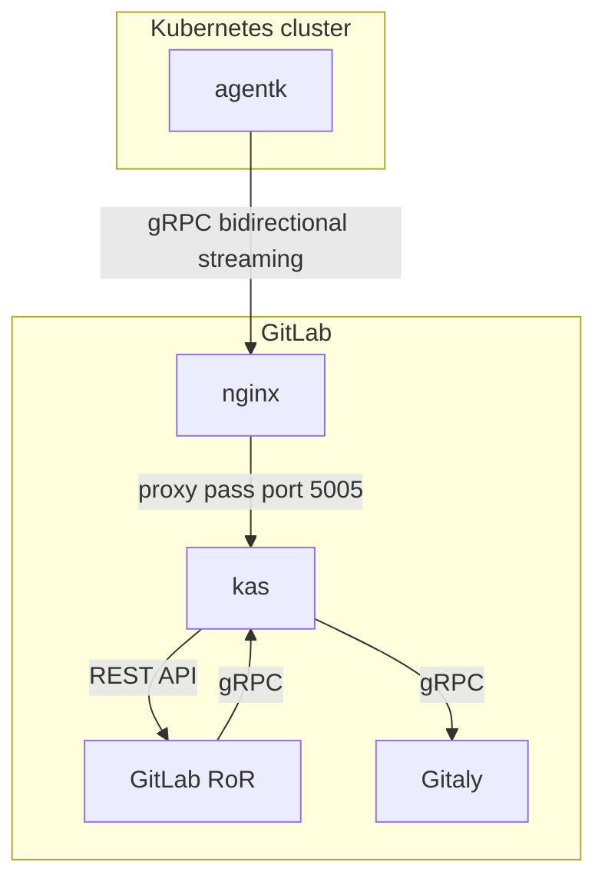
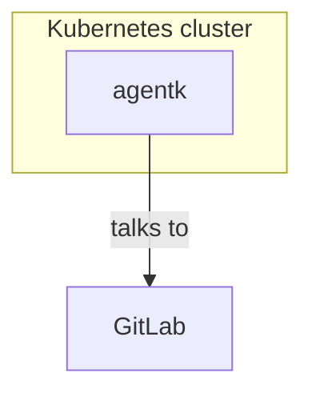

## TL;DR

In very, very short conclusion:

Threat modeling should and can be done at almost any point in the development process, but really you should start it early in the process. You should take some "what-could-possibly-go-wrong" or attacker mentality and apply it to your feature.

For the impatient let's have the maybe shortest possible threat modeling guide:

- Draw a diagram of your feature and point out:
  - Where does untrusted input come from?
  - Where are zones of different trust levels and where are the trust boundaries between those?
- Take an attackers perspective and assume worst cases to define the threats.
  - Try to order by most likely and impactful threats first.
- Document the threats and map them back to your feature. Create follow-up issues with directly responsible individuals and due dates.

## What is Threat Modeling

Let's keep it short and simple here by just taking the initial sentence from our [Threat Modeling handbook](_index.md) page:

> Threat modeling is the process of taking established or new procedures, and then assessing it for potential risks.

This is maybe the most high-level and abstract description of threat modeling, now let's put it to some practical use. We take **something**, an established or new process, really this might be anything. Like our own [assessment-tool](https://gitlab.com/gitlab-com/people-group/peopleops-eng/assessment-tool/-/blob/master/threat-model.md), a [stand-alone GitLab instance](https://gitlab.com/gitlab-com/gl-security/security-research/gitlab-standalone-instance/-/tree/master#gitlab-standalone-instance) or maybe a [new piece of infrastructure](https://gitlab.com/gitlab-com/gl-security/product-security/appsec/appsec-reviews/-/issues/79) (internal link).

For the rest of this HowTo let's call the **thing** we're doing a threat model for a **feature** because for GitLab most of the threat modeling which should be done would be on features of the product or features of the infrastructure of our SaaS offering.

What a threat model does, it let's you take apart and decompose the feature you're looking at **so that you can**, in some more or less formalized way, **identify** and describe **threats** towards the feature and its components. This description so far sounds really formal and might not help you to actually come up with a threat model, just take it as a vague baseline of what (**identify threats**) should be achieved and let's now see how we can get there.

The [formal framework that GitLab uses is called PASTA](_index.md). This guide helps apply the PASTA principals in a lightweight manner to maximize their impact when followed by any GitLab team member.

## When and where to start

You might wonder: "When should I start to do some threat modeling on the feature I'm planning to implement?". It's really not obvious but luckily it's never too late and never too early to create a threat model for any given feature which is currently being developed or used. Also, like everything in security, it's more of a process than a fixed, eternal state. A threat model needs to be adopted and refined if the feature changes or even if the feature stays the same but it's being used in a different context or environment. So yes, this is some kind of "extra" work in a sense that a proper threat model just doesn't create itself. But those extra steps will pay off soon enough by yielding more insights about the "*what could possibly go wrong*" moments which are also known as **threats**. Even tough it's never too late it will pay off even more if you start the process early and keep the threat model up to date for any additions and changes to the feature. This is also due to the fact that the fixing of insecure design decisions might be rather complex and even [disruptive](https://gitlab.com/gitlab-com/gl-infra/delivery/-/issues/1518)(internal link).

## Tools: 🔨and🧠

Most threat modeling frameworks rely on some diagrams to be drawn and there's a lot of quite heavy tooling around this. Such tools would take some data flow diagram (DFD) and automatically map certain threats to certain components based on what they are. This can be really useful in some cases, but at GitLab we need some more flexibility as the features we're looking at often would not really fit well into the strict schematics of e.g. [STRIDE](https://en.wikipedia.org/wiki/STRIDE_(security)) based threat modeling and thus the output might not yield much meaningful threats.

### Drawing diagrams

For diagrams there are almost endless possibilities, for easy and integrated usage within GitLab it'd be recommended to use one of our [supported diagram tools](https://docs.gitlab.com/ee/user/markdown.html#diagrams-and-flowcharts). But really to keep it flexible and accurate you can use whatever diagramming tool you're comfortable with. It should just deliver an accurate diagram of the feature. For instance this mermaid diagram of our [Kubernetes Agent](https://docs.gitlab.com/ee/user/clusters/agent/) is completely sufficient as a start. It shows all involved components in their interaction at a level which is still understandable and meaningful.

If we'd keep it too simple like:

It'd still not be wrong but we wouldn't be able to deduce too many detailed threats from this.

### Trust and boundaries

One notable component which typically does not come with your typical architecture diagram is a **trust boundary**. A trust boundary is also not depicted explicitly in the Kubernetes Agent diagram, but we can deduce it. A trust boundary is separating parts in the diagram which have different levels of trust. In the Kubernetes Agent case we can see this clearly, the Kubernetes cluster can be anywhere and be controlled by anyone, it's not really trustworthy. The GitLab controlled components however are controlled by GitLab, therefore very much trusted. So in conclusion we have a **trust boundary** between those two parts of the diagram. This now is the part where the actual threats come into play. The threats typically manifest at those trust boundaries. A first threat which might come to mind when just looking at this trust boundary:

- The communication between `agentk` and `kas` might be unencrypted

This is a very simple and generic thing to consider, still a legit concern and a first step for a threat model.

### Finding the threats

For covering more of the threat ground we need to shift a bit the perspective towards a "worst-case" or "what could possibly go wrong" attitude, this generally helps a lot to find more threat scenarios. In the very formalized `STRIDE` approach the actual threat classes are:

- `S`poofing
  - Impersonating something or someone else
- `T`ampering
  - Modifying data or code
- `R`epudiation
  - Claiming to have not performed an action
- `I`nformation disclosure
  - Exposing information to someone not authorized to see it
- `D`enial of Service
  - Deny or degrade service to users
- `E`levation of Privilege
  - Gain capabilities without proper authorization

Hence the name `STRIDE`. While we do not use the formal STRIDE framework, we can use these threat classes to get an idea on what should be considered to define the concrete threats in our model.

So spoofing in the Kubernetes Agent example might manifest in one `agentk` being able to impersonate another. The example from above "The communication between `agentk` and `kas` might be unencrypted" would for instance fit in the information disclosure threat class. It's not a matter of thinking about every possible single thing which might go wrong here. One could easily come up with an overwhelming amount of potential and rather obscure threats, but that might be very distracting and we would miss the point of the threat model. We primarily want to aim for those threats which seem likely to occur and those which are really impactful when they occur.

### Consider both .com and self-managed

Make sure to think a bit out of the box: a certain feature might work well on `GitLab.com` but cause trouble and outages in some self-managed environment which is set up quite differently than our SaaS platform. This can be a threat as well and it's caused due to some environmental change for our feature. This in conclusion means that we should always consider the environment our feature is being used in. That environment might change over time or in different deployment scenarios, and it might not always be friendly and trusted in the first place.

## What's next?

Once the initial steps have been done and we have a first set of well thought out threats we can now use this list during development of our feature to mitigate what we've deemed to be the threats and worst case scenarios.

### Documenting the Threat Model

The [Stable Counterpart](/handbook/security/product-security/application-security/stable-counterparts) should document the threat model and the results. The threat model will be added to [the AppSec Threat Models repository](https://gitlab.com/gitlab-com/gl-security/product-security/appsec/threat-models)(internal link). This also includes templates for threat modeling that anyone can use in issues or epics.

### Ensure Ownership of Threats

Consider creating an issue with a living description which summarises the threat model each time its updated, and links off to issues for each threat, like so:

| Threat                                                       | Comments                                                     | Test / Issue                                                        |
| ------------------------------------------------------------ | ------------------------------------------------------------ | ------------------------------------------------------------ |
| Unencrypted communication between `agentk` and `kas`         |                                                              | ✅ grpc communication is done over TLS encrypted Websockets (see #123) |
| `agentk` might be able to impersonate another cluster's `agentk` |                                                              | Issue #124 to review authorization                                   |
| Attacks on `gitaly` level                                    | `agentk` has indirect access to `gitaly` via `kas`, this might be abused for injections or [IDOR](https://en.wikipedia.org/wiki/Insecure_direct_object_reference) attacks | Issue #125 - check data flows from `agentk` towards `gitaly`        |

Each threat should have an Issue created where a proposal to avoid, prevent, detect, or recover from the threat is discussed by the team. These issues should have an Assignee and a Milestone or Due Date. Initially the Assignee should be the Project Manager, who will prioritise and re-assign the issue as appropriate. The Stable Counterpart's role is to help create that proposal, to help the team understand and address the issue, and to review how the threat is mitigated pre-merge.

Also remember to consider making these issues public if they are not describing a currently implemented risk; issues that discuss how to improve upon the security posture of an implementation can be made [public by default](/handbook/communication/confidentiality-levels/#internal).

### Iterating

A threat model is never really done. The team should be familiar with the threat model and request another App Sec Review or an update to the threat model when new features or changes arise. The Stable Counterpart should work closely with the team to also identify when a new threat model is needed.

### Do It Yourself

Much of the language in this guide describes how Application Security Stable Counterparts should threat model with teams, but that doesn't have to be the case! Security is everyone's responsibility and **you** can threat model too! Reach out to `#sec-appsec` on Slack if you need help.
