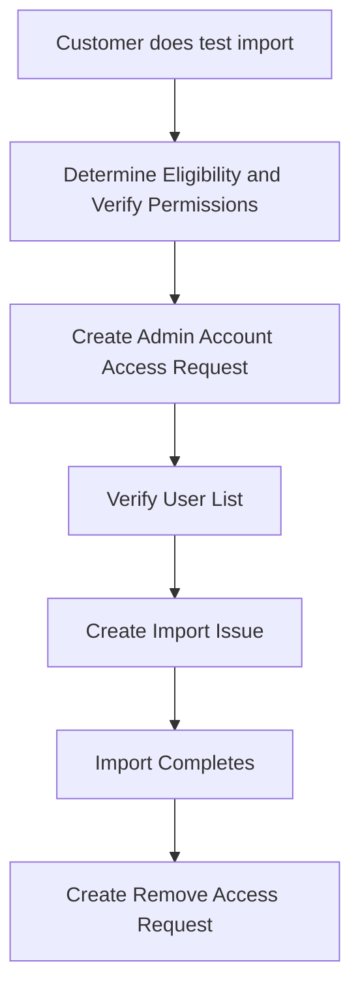

## Reminder

The process has changed significantly, removing the previously used infra import process. Please carefully read the criteria and what Support can do.

## Project Exports

If a customer is having issues with exporting a project, troubleshoot as normal, including:

1. Ask user to attempt both UI and API.
1. Gather necessary information to search logs. See [Kibana Import Error]() section on tips.
1. Find relevant issue and comment, or create one if needed, with Kibana/Sentry links.

Once an issue is created or commented on, you may use the [`Support::SaaS::Gitlab.com::Export::Offer one time` macro](https://gitlab.com/gitlab-com/support/zendesk-global/macros/-/blob/master/active/Support/SaaS/GitLab.com/Export/Offer%20one%20time.md?ref_type=heads) to offer a one-time export attempt.

If the customer accepts the offer, did the export succeed (they got an email, or there is a "Download export" button) but there an error downloading it? Example: [gitlab#330833](https://gitlab.com/gitlab-org/gitlab/-/issues/330833).

1. If yes, open [an infra export request](https://gitlab.com/gitlab-com/gl-infra/infrastructure/-/issues/new?issuable_template=Project%20Export.md) and fill in all relevant information. This skips the Support console attempt. Can be done within 30 days of the project export.
1. If not (or when in doubt), [open an export request in the internal requests tracker](https://gitlab.com/gitlab-com/support/internal-requests/-/issues/new?issuable_template=GitLab.com%20Console%20Export%20Request).
1. If at any time **an infra export request is opened**, please ensure you add the "infradev" label is added to the relevant GitLab bug issue.

For convenience, two additional macros are available after an export attempt is made:

- [`Support::SaaS::Gitlab.com::Export::Completed - Successful`](https://gitlab.com/gitlab-com/support/zendesk-global/macros/-/blob/master/active/Support/SaaS/GitLab.com/Export/Complete%20-%20Successful.md?ref_type=heads)
- [`Support::SaaS::Gitlab.com::Export::Completed - Failed`](https://gitlab.com/gitlab-com/support/zendesk-global/macros/-/blob/master/active/Support/SaaS/GitLab.com/Export/Complete%20-%20Failed.md?ref_type=heads)

## Project Import Overview

This workflow is meant to provide guidance on when GitLab Team members might offer to import projects on behalf of customers as a courtesy, and the process for doing the imports. Due to the shifting nature of what issues might be relevant, the specifics of this workflow may change. Overall though, the import process should follow the flow outlined below.



## Stage 1: Determine Eligibility

When a request to import a project on behalf of a customer is received, we first need to determine if the request fits the criteria.

If the customer requires that only a couple projects or less be imported **and** those projects have a reasonable number of users within them, we can do it. If the request is complex or there are many projects that need importing, the requester should be referred to [Professional Services](https://about.gitlab.com/services/migration/) instead.

Once you've determined that GitLab Support is able to process the import, proceed with verifying the [Baseline Eligibility](#baseline-eligibility) of all of the projects to be imported or determine that the requestor is approved because they meet the criteria of a [Pre-Approved Case](#pre-approved-cases).

### Baseline Eligibility

1. The import method is a GitLab project export file.
1. The requestor is an existing **customer**.
1. The import was attempted and **succeeded**.
1. The target location is a group on GitLab.com, not a personal namespace. If this isn't the case, we can advise the user on how to create a group if needed.
1. The target group is not empty.
1. The import fits under one of the pre-approved cases.

### Pre-Approved Cases

At this time there are no pre-approved cases.

The previously pre-approved case on user mapping is now covered by [direct transfers](https://docs.gitlab.com/ee/user/group/import/#migrate-groups-by-direct-transfer-recommended).

#### Other Cases

If you're unsure of whether we should perform an import for a specific requester, get input via the #support_leadership Slack channel or an [internal issue](https://gitlab.com/gitlab-com/support/internal-requests/-/issues/new). If a manager approves, proceed with the import.

## Stage 2: Offering Import & Preparation

You can use the [`Support::SaaS::Gitlab.com::Import::Offer Import (Users Mapped)`](https://gitlab.com/gitlab-com/support/zendesk-global/macros/-/blob/master/active/Support/SaaS/GitLab.com/Import/Offer%20Import%20(Users%20Mapped).md?ref_type=heads) Zendesk macro and then follow the next sections in sequence.

### Timing and scheduling ahead

When customers request a specific time period for the imports to be done, they should *always* do a test import for each project and make note of how long it takes. It can be approximate, but should give everyone a clear idea of whether it's reasonable to be done within the given time period. Remember that additional time is required to do any pre or post import work.

Note that lead time is required for the access request and possibly to find an engineer to do the work, so we recommend at least 2 business days.

### 1. Create Admin Account Access Request

1. Open an issue using the [Single Person Access Request](https://gitlab.com/gitlab-com/team-member-epics/access-requests/-/issues/new?issuable_template=Individual_Bulk_Access_Request) template and fill it out using the notes below.
1. In a comment on the issue, tag your manager requesting their approval.
1. Ensure it follows the process for admin account provisioning (has the `admin-access` label, you've asked for approval from `@gitlab-com/gl-infra/managers`).
1. If the account is not provisioned within a couple of days before the scheduled date,
tag `@it-ops-team` in the [#it_help](https://gitlab.slack.com/archives/CK4EQH50E) Slack channel with a link to the request to ensure quick provisioning as soon as you receive a manager's approval.

In the access request, enter the following in the **Person Details** section, replacing `group` in `group-import` with the top-level group path:

```plain
- Admin user customer import with username: `group-import-admin`
- Set email to: `group-import-admin@gitlab.com`
- Ticket: <TICKET LINK>
- Import request: <ISSUE LINK>

**Note:** This is part of the [project import process](/handbook/support/workflows/importing_projects) for customers.
```

Then, enter the following for the **Access Request** section, replacing `group` with the top-level group path:

```plain
- [ ] GitLab.com | Type: `admin` | Please create, confirm, and enable 2FA for this user.
    - [ ] Confirm user
    - [ ] Enable 2FA
    - [ ] Add user as `Owner` in `group`
    - Justification: customer import following [project import process](/handbook/support/workflows/importing_projects)
```

### 2. Verify User List

The customer should send you a copy of the project export ahead of their chosen import time (if scheduled) so that there is ample time to do the next section and for the customer to verify the list and correct any errors.

1. In your admin account, generate a Personal Access Token with an expiration date and the scope `api` enabled. The token is used for the next step.
1. In your terminal use [DCEF](https://gitlab.com/gitlab-com/support/toolbox/dcef) to pull a report that contains a list of user **primary** email addresses that are unique to the export file and ones that are unique to just the requestor's GitLab.com group.
1. Examine the `User emails unique to export file:` section of the results and ensure that all email addresses listed are on the requestor's company domain, meaning no users have an email address on a generic domain such as Gmail.com.

**If issues within the list are found:**

1. Reply to the requestor with the [`Support::SaaS::Gitlab.com::Import::Verify User List (Problem Found)`](https://gitlab.com/search?utf8=%E2%9C%93&group_id=2573624&project_id=17008590&scope=&search_code=true&snippets=false&repository_ref=master&nav_source=navbar&search=id%3A+360043607299) Zendesk macro, which will ask them to resolve the issues we found and send us a new project export once that's done. Once they have, repeat the [2. Verify User List](#2-verify-user-list) section.

**If no issues within the list are found:**

1. Send the resulting list of users not in GitLab.com to the customer to confirm using the [`Support::SaaS::Gitlab.com::Import::Verify User List (Looks Good)`](https://gitlab.com/gitlab-com/support/zendesk-global/macros/-/blob/master/active/Support/SaaS/GitLab.com/Import/Verify%20User%20List%20(Looks%20Good).md?ref_type=heads) Zendesk macro and await their reply. Once they reply and confirm that all email addresses that were found only in the export file are from employees no longer with the company, this section is complete.

>**NOTE:** For these users, items will be mapped to the admin account, then the [Ghost User](https://docs.gitlab.com/ee/user/profile/account/delete_account.html#associated-records) once the admin account is deleted.

### 3. Create the Import Request

1. [Open an issue with the Project Admin template](https://gitlab.com/gitlab-com/support/internal-requests/-/issues/new?issuable_template=project_admin_import) and fill in  all available information.
1. Add date/time with timezone (30 minutes later than expected time of receiving the import is recommended).
    - If there is no scheduled time, use 2 business days from date of receipt with "anytime" for time.
1. Add the issue link as an internal note to the Zendesk ticket.

## Stage 3: Import

For scheduled imports, once we receive a link to the latest file, update the issue with the link to the project and let the assignee know they can begin the import process.

### Check Project Export

If the import is to be done ASAP and no *new* project export file is provided, this section is not required.

1. Unpack the project export file into a folder: `tar -zxvf filename.tar.gz -C project_export`.
1. Perform one last [Verify User List](#2-verify-user-list) check to ensure no changes have been made.
1. If the customer shared a one-time download link, create a folder in [the ticket attachment folder](https://drive.google.com/drive/folders/1RpCb_li2RTYsE8GnVFExCux3QpZ2i0TD) and upload the export. Use the link to this version for the import issue.
1. Delete any local copies of the export.

## Stage 4: Cleanup

After the import has completed successfully, perform the following steps.

1. Ensure the export file is deleted, or remind the customer to delete theirs in your next response.
1. Use the [`Support::SaaS::Gitlab.com::Import::Complete - Customer to Verify`](https://gitlab.com/gitlab-com/support/zendesk-global/macros/-/blob/master/active/Support/SaaS/GitLab.com/Import/Complete%20-%20Customer%20to%20Verify.md?ref_type=heads) Zendesk macro to let the customer know that the import has completed and that they should double check that everything is in order.
1. After the customer confirms that everything looks okay, open an issue using the [Access Change Request](https://gitlab.com/gitlab-com/team-member-epics/access-requests/-/issues/new?issuable_template=Access_Change_Request) template to request that the admin account used for the import be deleted.
1. Close the internal issue.

## Zendesk Macros & Resources

### Macros

- [`Support::SaaS::Gitlab.com::Import::Offer Import (Users Mapped)`](https://gitlab.com/gitlab-com/support/zendesk-global/macros/-/blob/master/active/Support/SaaS/GitLab.com/Import/Offer%20Import%20(Users%20Mapped).md?ref_type=heads)
- [`Support::SaaS::Gitlab.com::Import::Verify User List (Looks Good)`](https://gitlab.com/gitlab-com/support/zendesk-global/macros/-/blob/master/active/Support/SaaS/GitLab.com/Import/Verify%20User%20List%20(Looks%20Good).md?ref_type=heads)
- [`Support::SaaS::Gitlab.com::Import::Verify User List (Problem Found)`](https://gitlab.com/gitlab-com/support/zendesk-global/macros/-/blob/master/active/Support/SaaS/GitLab.com/Import/Verify%20User%20List%20(Problem%20Found).md?ref_type=heads)
- [`Support::SaaS::Import::Complete - Customer to Verify`](https://gitlab.com/gitlab-com/support/zendesk-global/macros/-/blob/master/active/Support/SaaS/GitLab.com/Import/Complete%20-%20Customer%20to%20Verify.md?ref_type=heads)

### Resources

[Time And Date](https://www.timeanddate.com/worldclock/converter.html?iso=20200615T220000&p1=1440) can be used to convert timezones to UTC, useful for when imports are scheduled for a future time.
