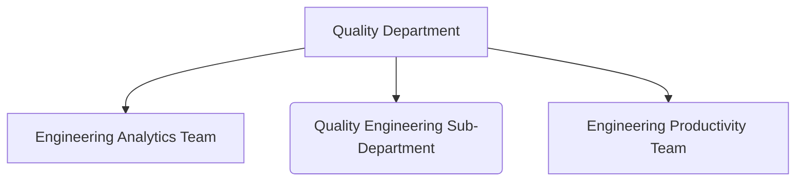

## Vision

Our vision is to be a world-class Infrastructure & Tools department that enables GitLab to meet & exceed our customers’ needs.

We:

1. Build critical infrastructure, metrics & tools that enable GitLab Engineering & Product teams to do their best work efficiently and ship high-quality & reliable products to our customers.
1. Are customer focused. We have an ambitious drive to attain high availability & reliability for SaaS platforms and self-managed customers.
1. Provide and maintain best practice tools and methodologies that create a platform for engineering teams to do their work productively.
1. Enable GitLab Engineering & Product teams to run services effectively using our tools, to meet business needs & SLOs.

## Direction

Direction is set within the [Infrastructure](/handbook/engineering/infrastructure/#direction), and the [Quality](/handbook/engineering/quality/#fy23-direction) direction pages. With the ongoing consolidation of the departments, separate direction pages will become obsolete.

## Working with us

With the consolidation of previously separate departments (Infrastructure, Quality), we are in the process of also consolidating previously separate handbook pages:

- [Infrastructure](/handbook/engineering/infrastructure/)
- [Quality](/handbook/engineering/quality/)

We welcome contributions, and if you find an opportunity to consolidate information, please submit a Merge Request!

## Engaging with the Infrastructure teams

Two distinct groups are responsible for infrastructure at GitLab:

- [**Platforms**](/handbook/engineering/infrastructure/platforms/), responsible for software delivery, scaling and operations of single and multi tenant GitLab SaaS
- [**Reliability**](/handbook/engineering/infrastructure/team/reliability/), which operate all user-facing GitLab.com services.

To create an issue, or find how to engage with the related teams you can use the links below:

- [Delivery](https://gitlab.com/gitlab-com/gl-infra/delivery/-/issues/new) - Follow [directions how to reach us urgently](/handbook/engineering/infrastructure/team/delivery/#reaching-our-team)
- [Reliability](https://gitlab.com/gitlab-com/gl-infra/reliability/-/issues/new?issuable_template=default)
  - You can [read more about how reliability triages issues here.](/handbook/engineering/infrastructure/team/reliability/issues.html#issue-board)
- [Scalability](/handbook/engineering/infrastructure/team/scalability/#working-with-us)
- [GitLab Dedicated](/handbook/engineering/infrastructure/team/gitlab-dedicated/#working-with-us)

## Engaging with the Quality teams

## Communication

In addition to GitLab's [communication guidelines](/handbook/communication) and [engineering communication](/handbook/engineering/#communication), we communicate and collaborate actively across GitLab in the following venues:

- [Meetings](#meetings)
- [Key Review](#key-review)
- [Group Conversations](#group-conversations)

## Meetings

GitLab is an all-remote, timezone distributed company as such we optimize for asynchronous communication. While some topics benefit from a real-time discussion, we should always evaluate meetings to ensure they are valuable. We follow the [guidance for all-remote meetings](/handbook/company/culture/all-remote/meetings/), including starting and ending on time - or earlier.

[Infrastructure](https://calendar.google.com/calendar?cid=Z2l0bGFiLmNvbV9vamk2ZGtpMWZyYzhnOHFxOWZldXUxanRkMEBncm91cC5jYWxlbmRhci5nb29nbGUuY29t) and [Quality](https://calendar.google.com/calendar/u/0?cid=Y19qcm92dGttZWVjMWlpMG8zcmY4cThwbWxia0Bncm91cC5jYWxlbmRhci5nb29nbGUuY29t) team calendars are shared with the company.

A well prepared meeting:

1. *must* have a Google Doc agenda attached to the invite, organized by date, and with edit rights open to GitLab. This allows participants to prepare before the start of each meeting, and take notes druing the meeting.
1. *must* [start on time](/handbook/company/culture/all-remote/meetings/#3-start-on-time-end-on-time)
1. *can* have a read-only, and discussion section. Read-only section does not get verbalized, but the questions around read-only items can be asked in the discussion section
1. *can* have multiple topics.
1. *can* be deliberately be scheduled to occur twice to better include all global participants. This is considered to be the *same* meeting, just held at different times.

The following cross-functional meetings are regularly scheduled:

|**Topics**|**Meeting**|**Participants**|**Cadence**|
|Incident Review and followup|[Incident Review](https://docs.google.com/document/d/1jrX-Z2NJrNjBBcywY7emQKwaKRqVAlDRdGG0Krk76ys/) (internal only)|All Engineering|Tues|
|SaaS Availability & Reliability work prioritization| [SaaS Availaiblity weekly standup](https://docs.google.com/document/d/1j_9P8QlvaFO-XFoZTKZQsLUpm1wA2Vyf_Y83-9lX9tg/edit#) (internal only)|All Engineering|Tues|
|Performance Indicator Review|[Infrastructure Key Meeting](https://docs.google.com/document/d/1YYWwdu2dw-ooXXQGW3PddA0TOvwoSvVHmNN3BNoLE2U/edit) (internal only)|Eng VP Staff, Finance & Exec leadership|Monthly|
|Group Conversation|[Group Conversation](https://docs.google.com/document/d/1zELoftrommhRdnEOAocE6jea6w7KngUDjTUQBlMCNAU/edit?usp=sharing) (internal only)|All Company|Quarterly|
|Practical exercises to improve team capabilities|[Firedrills](https://docs.google.com/document/d/1kF5tKJi7Ksztl-kzCEztmJhqsDhtaDCwDz1SRiMSNHI/edit#heading=h.jn3bvj0u28a) (internal only)|All Infra|Weds|
|Discussions for Oncall Handover & Newsletter|[Oncall Handover](https://gitlab.com/gitlab-com/gl-infra/infrastructure/-/issues?label_name%5B%5D=Reliability-Team-Newsletter)|Ending & Starting EOC| Tues|
|Quality all-hands meeting | Quality Department Bi-Weekly | Quality |Every other Wed/Thur|
|Quality team demo's and discussion| [Quality Test Architecture & Coffee](https://youtube.com/playlist?list=PL05JrBw4t0KqqL3Vw3_5Uv9cxSOdPNhoY) | Quality |Every other Wed/Thur |
|Reliability oncall handover meetings, newsletter discussion | [Team Newsletter issues](https://gitlab.com/gitlab-com/gl-infra/reliability-reports/-/issues) | Reliability | Weekly |
|Anything for Reliability Leadership | Reliability [Ask me Anything](/handbook/communication/ask-me-anything/) | Reliability (anyone is welcome) | Monthly (last Wednesday) |

## OKR

Department level view of [OKR](/handbook/company/okrs/) and scoring is on our [Infrastructure & Quality OKR page](/handbook/engineering/infrastructure-quality/okrs/)

Each sub-department has different guidance on OKR:

- [Reliability](/handbook/engineering/infrastructure/team/reliability/#okrs)
- [Platforms](/handbook/engineering/infrastructure/platforms/#okr)
- [Test Platform](/handbook/engineering/infrastructure/test-platform/#okrs)
- [Engineering Productivity](/handbook/engineering/infrastructure/engineering-productivity/#okrs)
- [Engineering Analytics](/handbook/engineering/quality/engineering-analytics/#okrs)

## Key Review

[Key Review meetings](/handbook/company/key-review/) provide the department leadership an opportunity to inform the executive team of our [performance indicator](#performance-indicators) progress, results on OKRs, and updates on any [Cross-functional Key Initiatives](/handbook/company/working-groups/#top-cross-functional-initiatives) which we are leading.

Key Review meetings are facilitated and led by the currently responsible VP, with Directors being the backup DRIs.

## Group Conversations

[Group Conversation meetings](/handbook/company/group-conversations/) take the information from the Key Review (plus any additional topics) and present this to an audience that is all of GitLab, and for Infrastructure, is a Public livestream.

Coordination of Infrastructure-Quality Group Conversation materials and facilitation of the discussion is a rotating role among the managers within the department.

Group Conversation DRI [Schedule](/handbook/company/group-conversations/#current-schedule)

Quick checklist for the host (time order):

1. Make the GC slides (copy from a prior presentation) ~ 10 days before the GC
1. [Watch how to stream on youtube](/handbook/marketing/marketing-operations/youtube/#livestream-with-zoom)
1. Do a test stream on youtube.
1. Review the [handbook instructions for Group Conversation Meeting Leaders](/handbook/company/group-conversations/#for-meeting-leaders) and follow the required process.
1. 20 minutes before - open up Zoom and check for any updates.

|**GC Date**|**DRI**|
| 2023-04-26 | Platforms EM |
| 2023-07-25 | Reliability EM |
| 2023-11-09 | Quality Engineering EM |
| 2024-01-24 | Engineering Productivity EM |
|TBD| Engineering Analytics EM|
|TBD| Platforms EM |
|TBD| Reliability EM |
|TBD| Quality EM |
|TBD| Engineering Productivity EM |
|TBD| Engineering Analytics EM |

Historical preparation for Quality sub-department is in [the issue tracker](https://gitlab.com/gitlab-org/quality/team-tasks/-/issues?label_name%5B%5D=group-conversation) with a `group-conversation` label.

## Performance Indicators

- [Performance Indicators](/handbook/engineering/infrastructure-quality/performance-indicators/)

## Common Links
