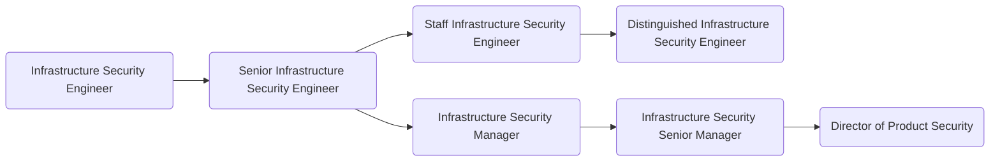

As members of GitLab's [Product Security sub department](/handbook/security/product-security/), the [Infrastructure Security](/handbook/security/product-security/infrastructure-security/) engineers own security initiatives related to security of GitLab.com. They are Infrastructure's stable counterparts in the Security department, and as such work with various Infrastructure and Security teams to identify and mitigate security issues, vulnerabilities, and misconfigurations by applying their in-depth knowledge of operating systems, infrastructure, and cloud providers. They work very closely with the Security Incident Response Team and share their findings in a proactive manner. Successful Security Engineers thrive in high-stress environments and can think like both an attacker and defender, engage with and mentor more junior Security Engineers, and can help come up with proactive and preventative security measures to keep GitLab and its user’s data safe in an ever changing threat landscape.

## Responsibilities

- Be a stable counterpart for the Infrastructure department
- Ownership of efforts related to the securing of GitLab's SaaS infrastructure
- Ownership of vulnerability management and patching policies
- Play a key role in the security incident response process

## Requirements

- Ability to use GitLab
- Demonstrated experience in cloud security, systems security, or site-reliability engineering
- Demonstrated experience with incident response
- Substantial knowledge of the Linux operating system
- Demonstrated experience with running systems at scale
- Proficiency to communicate over a text-based medium (Slack, GitLab Issues, Email) and can succinctly document technical details
- Share our [values](/handbook/values/), and work in accordance with those values

## Levels

### Infrastructure Security Engineer (Intermediate)

This position reports to the [Manager, Infrastructure Security](#manager-infrastructure-security).

#### Infrastructure Security Engineer (Intermediate) Job Grade

The Infrastructure Security Engineer is a [grade 6](/handbook/total-rewards/compensation/compensation-calculator/#gitlab-job-grades).

#### Infrastructure Security Engineer (Intermediate) Responsibilities

- Be a stable counterpart for the Infrastructure department
- Identify and help mitigate security issues, misconfigurations, and vulnerabilities related to GitLab’s cloud, container and Kubernetes infrastructure
- Implement new, and update existing security measures for the protection of GitLab.com infrastructure
- Utilize log ingestion platform for security analytics and identification of tactics, techniques and patterns of attackers
- Contribute to creation of runbooks
- Contribute to the production and tuning of detection rules

#### Infrastructure Security Engineer (Intermediate) Requirements

- A minimum of 2 years experience working in site-reliability engineering, cloud security, or system engineering
- A minimum of 1 year experience working with incident response
- Good written and verbal communication skills
- Experience using log analysis platforms such as Splunk, ELK, BigQuery, etc
- Experience with Google Cloud Platform (preferred) or Amazon Web Services
- Experience with one or more programming languages (Python and either Ruby, Go, or PHP)
- Experience with orchestration technologies such as Chef, Puppet or Ansible
- Working experience with Kubernetes and Docker
- Technical knowledge of systems in a multi-tenant, cloud environment
- Experience with infrastructure-as-code

### Senior Infrastructure Security Engineer

This position reports to the [Manager, Infrastructure Security](#manager-infrastructure-security).

#### Senior Infrastructure Security Engineer Job Grade

The Senior Infrastructure Security Engineer is a [grade 7](/handbook/total-rewards/compensation/compensation-calculator/#gitlab-job-grades).

#### Senior Infrastructure Security Engineer Responsibilities

- Extends Infrastructure Security Engineer responsibilities, plus;
- Ownership of vulnerability management and patching policies
- Develop, evangelise, and monitor the adoption of sound cloud security practices
- Mentor other members of the Infrastructure Security and Security Incident Response Team
- Perform root cause analysis (RCA) and incident reviews
- Develop new, and review/update existing security-related configurations of GitLab’s infrastructure
- Identify new, and ensure availability of existing GitLab.com data sources and logs that are being used by various GitLab Security teams
- Ownership and management of preventative security measures and services related to GitLab.com, i.e. WAF, GCP’s Security Command Center

#### Senior Infrastructure Security Engineer Requirements

- A minimum of 5 years experience working in site-reliability engineering, cloud security, or system engineering
- A minimum of 2 years experience working with incident response
- Excellent written and verbal communication skills
- Capability to build working relationships with key stakeholders
- Substantial knowledge of the Linux operating system and common OS hardening practices
- Experience with infrastructure vulnerability scanning, vulnerability management and patching practices
- Experience with logging systems and log analysis

### Staff Infrastructure Security Engineer

This position reports to the [Manager, Infrastructure Security](#manager-infrastructure-security).

#### Staff Infrastructure Security Engineer Job Grade

The Staff Infrastructure Security Engineer is a [grade 8](/handbook/total-rewards/compensation/compensation-calculator/#gitlab-job-grades).

#### Staff Infrastructure Security Engineer Responsibilities

- Extends Senior Infrastructure Security Engineer responsibilities, plus;
- Identify inconsistencies in logs and work with Product to standardise them
- Lead the design, evaluation, implementation and deployment of new security technologies
- Ownership and delivery on complex projects
- Ownership of Security Department's dedicated cloud environment

#### Staff Infrastructure Security Engineer Requirements

- A minimum of 7 years experience working in site-reliability engineering, cloud security, or system engineering
- Profound knowledge of the Linux operating system and common OS hardening practices
- Experience with secure network design, firewalls, authentication and authorization systems

### Manager, Infrastructure Security

This position reports to the [Senior Manager, Infrastructure Security](#senior-manager-infrastructure-security).

#### Manager,  Infrastructure Security Job Grade

The  Infrastructure Security Manager is a [grade 8](/handbook/total-rewards/compensation/compensation-calculator/#gitlab-job-grades).

#### Manager, Infrastructure Security Responsibilities

- Hire a world class team of security engineers to work on their team
- Help their team grow their skills and experience
- Provide input on security architecture, issues, and features
- Hold regular 1:1's with all members of their team
- Create a sense of psychological safety on their team
- Be your team's role model in terms of positive thinking, de-escalating conflict, and taking time off
- Identify the need to, and drive the implementation of security-related technical and process improvements
- Author project plans for security initiatives
- Draft and successfully deliver on quarterly OKRs
- Train team members to screen candidates and conduct engineering interviews
- Build a substantial, collaborative partnership with Legal, Infrastructure, Development and Product departments
- Assume the role of an Incident Manager during larger security events

#### Manager, Infrastructure Security Requirements

- Proven track record as an experienced member of Security Operations or Incident Response teams - either as an Individual Contributor or as a Manager
- Experience with leading Security or security-focused Site Reliability teams
- Experience with working at a SaaS, or product company
- Excellent written and verbal communication skills, especially experience with executive-level communications
- Capability to make concrete progress in the face of ambiguity and imperfect knowledge
- Being comfortable with often not being in control of their time (because security events don't care about anyone's plans)
- Being comfortable with very frequent context switching
- Willingness to be part of the Security Manager On-Call rotation
- Robust understanding of security issues, mitigations, and a solid grasp of the current global threat landscape
- Experience with the role of an incident manager during medium and large scale security events
- First hand experience with major cloud providers - GCP, AWS, Azure, Digital Ocean
- Alignment with Manager responsibilities as outlined in [Leadership at GitLab](/handbook/company/structure/#management-group)

### Senior Manager, Infrastructure Security

This role reports to the [Director of Product Security](/job-families/security/security-leadership/#director-security-engineering).

#### Senior Manager, Infrastructure Security Job Grade

The Infrastructure Security Team Senior Manager is a [grade 9](/handbook/total-rewards/compensation/compensation-calculator/#gitlab-job-grades).

#### Senior Manager, Infrastructure Security Responsibilities

- Extends Manager, Infrastructure Security responsibilities, plus;
- Provide tactical oversight of the teams' daily efforts
- Maintain vision for the teams' immediate and near-term future
- Develop and maintain teams' KPIs
- Be your teams' role model in terms of positive thinking, de-escalating conflict, and taking time off
- Help teams prioritise efforts and ensure they align with the overall direction of the company
- Draft and successfully deliver on quarterly OKRs
- Train team members to screen candidates and conduct managerial interviews
- Build a substantial, collaborative partnership with your peers in the Legal, Infrastructure, IT, Development and Product departments

#### Senior Manager, Infrastructure Security Requirements

- Experience with leading people managers
- Experience with leading Security or security-focused Site Reliability teams
- Experience with working at a SaaS, or product company
- Excellent written and verbal communication skills, especially experience with executive-level communications
- Capability to make concrete progress in the face of ambiguity and imperfect knowledge
- Being comfortable with rapid context switching
- Willingness to be part of the Security Escalation On-Call rotation
- Robust understanding of security issues, mitigations, and a solid grasp of the current global threat landscape
- Experience with the role of an incident manager during large scale security events
- Familiarity with major cloud providers - GCP, AWS, Azure, Digital Ocean
- Alignment with Manager responsibilities as outlined in [Leadership at GitLab](/handbook/company/structure/#management-group).

## Performance Indicators

- Support the organisation by [ensuring that the Security Engineer On-Call meets SLAs](/handbook/security/performance-indicators/#sirt-former-security-operations-page-volume).

### Career Ladder

For details on the Security organisation leadership roles, to include the Product Security Director and VP of Security, see the Security Leadership page.

## Hiring Process

Candidates for this position can expect the hiring process to follow the order below. Please keep in mind that candidates can be declined from the position at any stage of the process.

- Qualified candidates will be invited to schedule a 30 minute [screening call](/handbook/hiring/interviewing/#screening-call) with one of our Global Recruiters.
- Next, candidates will be invited to schedule an interview with Security Incident Response Team Manager
- Candidates will then be invited to schedule an interview with a Site Reliability Engineer & a Security Engineer from our Security Incident Response Team
- Candidates will then be invited to schedule an interview with VP of Security
- Successful candidates will subsequently be made an offer via email

Additional details about our process can be found on our [hiring page](/handbook/hiring/).
