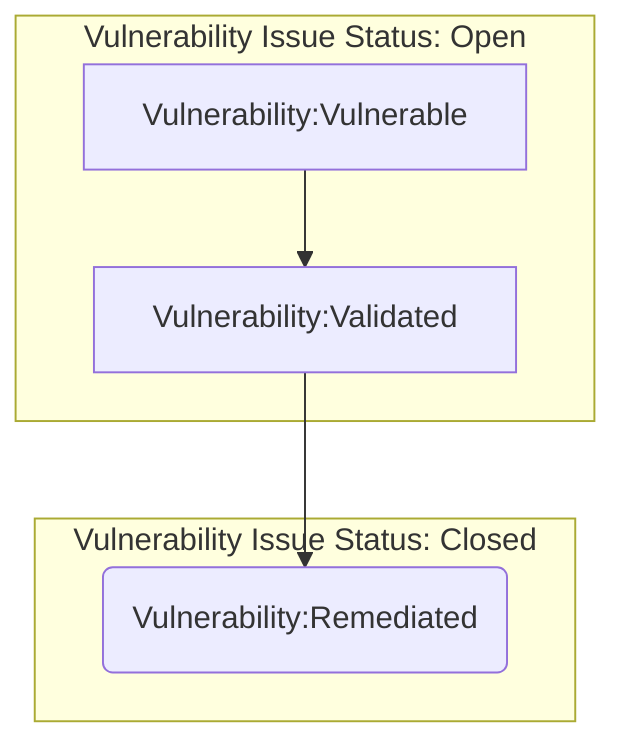
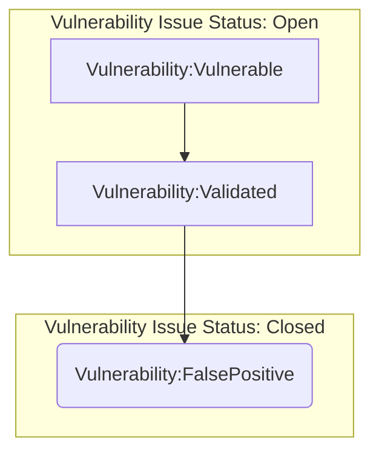
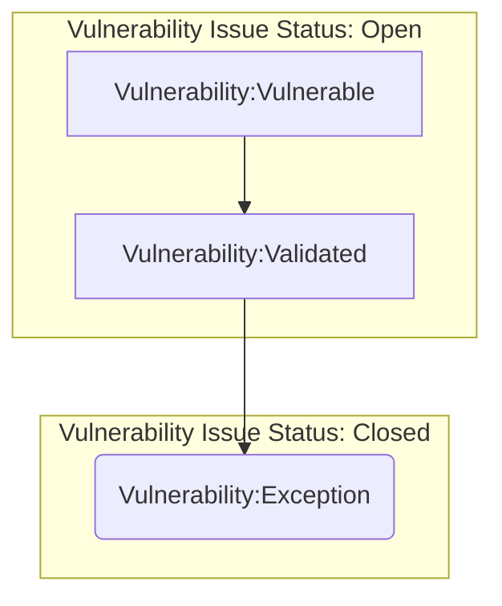
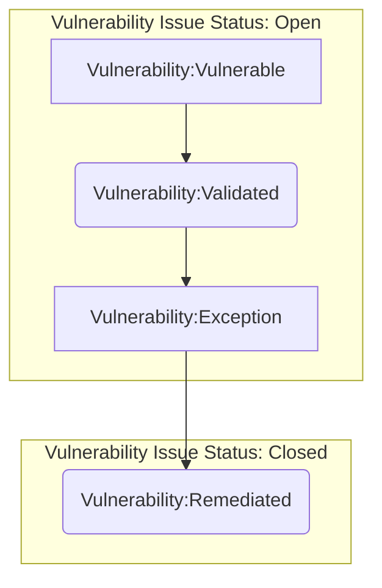
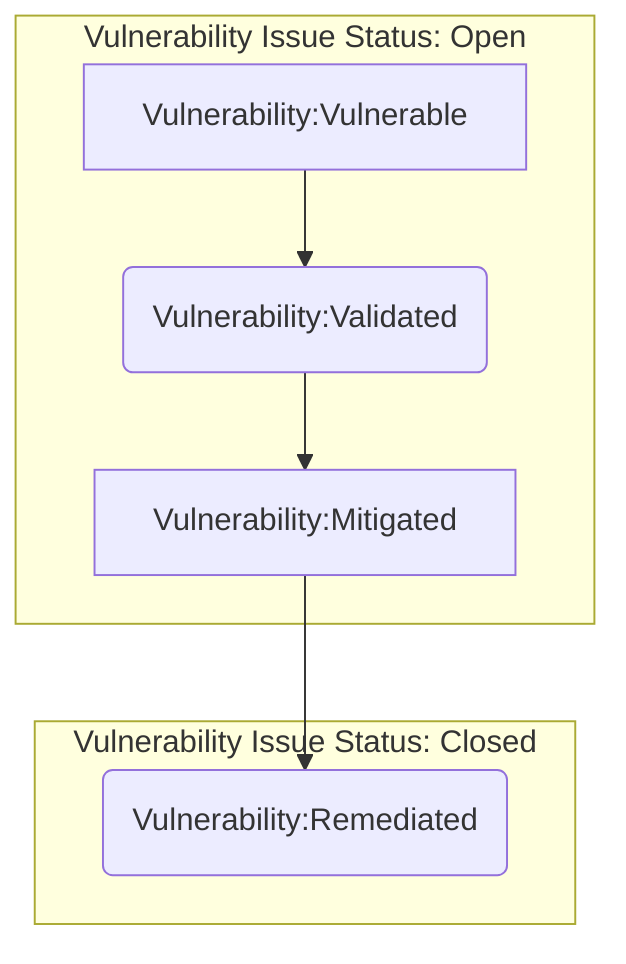

This procedure applies to vulnerabilities identified in GitLab Production infrastructure and ensures implmentation of the [Vulnerability Management Standard](/handbook/security/product-security/vulnerability-management). This procedure is designed to provide insight into our environments, promote healthy patch management among other preventative best-practices, and remediate risk; all with the end goal to better secure our environments and our product.

## Scope

Security and Infrastructure partnered to come up with a scope that would make sure all of our critical environments and systems were covered during deployment. The following environments are currently `in-scope` for GitLab.com and GitLab Dedicated production:

| Environment  | Project/Account        | Production  | Deployed |
| :---         | :----                  | :---        | :---     |
| GCP          | gitlab-production      | yes         | yes      |
| GCP          | gitlab-ops             | yes         | yes      |
| GCP          | gs-production          | yes         | yes      |
| GCP          | env-zero               | yes         | yes      |
| GCP          | gemnasium-production   | yes         | yes      |
| GCP          | service-prod           | yes         | yes      |
| GCP          | gitlab-ci              | limited     | yes      |
| AWS          | gitlab-com             | yes         | yes      |
| Azure        | GitLab                 | yes         | no       |

>Note: If you believe a system you are responsible for should be included in the vulnerability management process, please [contact](/handbook/security/product-security/vulnerability-management#contact) the Security Vulnerability Management Team.

With these environments scoped out and Wiz connectors ready, we can begin the vulnerability management process. Keep in mind that vulnerability management is a feedback loop - vulnerability detection provides the vulnerability data which is analyzed and ingested to mitigate and remediate found vulnerabilities. Feedback from this process feeds into preventative initiatives that further secure our environments.

Application layer vulnerabilities are our of scope and managed via the [Application Vulnerability Management Procedure](/handbook/security/product-security/application-security/vulnerability-management).

## Roles & Responsibilities

| Role | Responsibility |
| -----| -------------|
| Vulnerability Management Team | Responsible for implementing and maintaining this Vulnerability Management Procedure |
| Infrastructure |  Responsible for remediating vulnerabilites according to procedure |
| Security Leadership |  Responsible for making final determination on risk acceptance (exceptions) |

## Procedure

Currently, we break down vulnerability management into the following steps:

### 1. Vulnerability detection

This step is where we run detection workloads against our environments to identify vulnerabilities. Once the connector is configured, workloads run on regular cadences that meet or exceed our compliance framework requirements. **The vulnerability remediation [SLA timeframes](/handbook/security/product-security/vulnerability-management#remediation-slas) begin as soon as a vulnerability is discovered by a workload**

### 2. Ingestion/Auto Triage

Vulnerability findings are pulled from Wiz.io into VulnMapper utilising the `wiz.io provider`, this provider provides a degree of normalisation and stores vulenrability findings within it's local DB for toher providers to consume.

The `gitlab-provider` in VulnMapper does the heavy lifting between VulnMapper and GitLab. It raises both a vulnerability and linked vulnerability tracking issue, performs auto triaging and state syncing.
Note: Vulnerability creation is ready, but disabled due to Current GitLab GraphQL constraints.

[vulnerabilities and tracking issues project](https://gitlab.com/gitlab-com/gl-security/security-operations/infrastructure-security/projects/infrastructure-vulnerability-management/)

Vulnerability remediation issues should be tagged with the `vulnerability` type label. These leverage GitLab's [scoped label capability](https://docs.gitlab.com/ee/user/project/labels.html#scoped-labels). The following labels exist to track the vulnerability remediation workflow:

- `~vulnerability::vulnerable`: This label identifies that the vulnerability has been opened, but not validated and is considered impactful to our environments per the assigned priority label. With this label a vulnerability issue should not be closed.
- `~vulnerability::validated`: This label identifies that the vulnerability has been validated as legitimate and is scheduled for mitigation or remediation. With this label a vulnerability issue should not be closed.
- `~vulnerability::falsepositive`: This label identifies that the vulnerability has been validated as a false positive and is no longer impactful to our environments. With this label a vulnerability issue can be closed.
- `~vulnerability::exception`: This label identifies that the vulnerability has been validated as legitimate and has an approved exception issue to account for a business need. In extreme circumstances, a vulnerability issue can be closed with an exception.
- `~vulnerability::mitigated`: This label identifies that the vulnerability has been validated and triaged. The impact has been reduced through compensating controls, but not remediated (it is still actively identified on vulnerability scans). With this label a vulnerability issue should not be closed.
- `~vulnerability::remediated`: This label identifies that the vulnerability has been remediated and the remediation has been validated. With this label a vulnerability issue can be closed.

We also add the `VM` label to all Vulnerability issues to scope the issues in the [Vulnerability Management issue board](https://gitlab.com/gitlab-com/gl-security/security-operations/sirt/infrastructure-vulnerability-management/-/boards/1573615).

### 3. Validation

Validation is an important part of vulnerability management. This is where we investigate to ensure that the vulnerability being reported has properly been identified.

Vulnerabilities can sometimes be identified during a workload, but are not actually on the system. This can happen for a number of reasons, but most commonly is the result of misflagged ports or services. These are classified as false positives and would go through the [process to be closed as a false positive](/handbook/security/product-security/vulnerability-management#closed-as-false-positive).

### 4. Remediation

Remediation is the part of the process in which a validated vulnerability is fixed. The remediation process would be tracked in the corresponding [tracking issue raised here](https://gitlab.com/gitlab-com/gl-security/security-operations/infrastructure-security/projects/infrastructure-vulnerability-management/). SLAs are in place to help prioritize vulnerability based on severity. **The [vulnerability remediation SLA timeframes](https://gitlab.com/-/ide/project/gitlab-com/www-gitlab-com/edit/master/-/sites/handbook/source/handbook/security/product-security/vulnerability-management/index.html.md?_gl=1%2a1gibb41%2a_ga%2aMTQ0NzQ5OTk5NS4xNjU0MTI3MTUz%2a_ga_ENFH3X7M5Y%2aMTY2ODUyMTA2My4yOTguMS4xNjY4NTIxOTc3LjAuMC4w#L216) begin as soon as a vulnerability is detected by a workload.** Once a vulnerability is remediated, Wiz.io will mark the vulnerability as resolved, this will flow thourgh the normal ingestion path and be synced into GitLab.

We've implementing an escalation path for remediation issues in the [Infrastructure issue tracker](https://gitlab.com/gitlab-com/gl-infra/infrastructure/issues) that automatically tags the VM DRI and backup when remediation issues are approaching/past [SLAs](/handbook/security/product-security/vulnerability-management#remediation-slas).

For improved tracking of remediation issues, we are using GitLab Epics. The [remediation epic](https://gitlab.com/groups/gitlab-com/gl-security/security-operations/sirt/-/epics/1) includes monthly subepics that track remediation progress for that month. If remediation SLAs do not require a vulnerability to be remediated in a month, it will be rolled over into the following subepic until remediated or its due date passes.

### Vulnerability Issue Workflows

There are several ways a vulnerability issue can be closed - below are some common vulnerability workflows using the `vulnerability` labels as reference:

#### Closed as Remediated

The most common workflow is to close a vulnerability issue as `Remediated`. This means that a vulnerability has been validated and remediation has taken place. Below is the workflow:

#### Closed as False Positive

A vulnerability must always be validated - but sometimes the validation can prove that a vulnerability is a false positive. Below is the workflow:

#### Closed as Exception

Sometimes issues arise that would otherwise prevent a vulnerability from being remediated or mitigated. While commonly, these would result in an open `Exception` vulnerability issue status, there are unique cases where an issue can be closed as an exception. Below is the workflow:

#### Open as Exception

Closed issue via the `Exception` process are very rare. Generally, an exception is a non-permanent way to assume risk on a vulnerability due to extenuating circumstances in which remediation can not take place within the required SLAs. Below is the described the workflow:

#### Open as Mitigated

Another common workflow is when a vulnerability is validated and a fix is scheduled for some time in the future (within the SLA). If we're able to, we will put mitigation in place in the interim to reduce the risk from the vulnerability. Below is the described workflow:

### 6. Feedback

The last step is for the Vulnerability Management Team, Security Incident Response Team and Infrastructure to determine what we can learn from each vulnerability remediated. This may be an improvement on the vulnerability management process itself or establishing preventive mechanisms for a repetitive vulnerability type. This feedback will be documented in the vulnerability issue and could result in additional issues being opened.

As stated above, this process is a cyclical loop. Vulnerability detections are recurring, providing new vulnerability data that feed new vulnerability remediation and exception issues which then help update/escalate open issues/processes.

### Vulnerability detection workload Schedule

Vulnerability detection workloads occur on a less than daily basis in our [scoped environments](/handbook/security/product-security/vulnerability-management#the-vulnerability-management-process). There is no configured schedule and this should be considered as continious detection.

{}
For more information, please visit the `#g_security_vulnmgmt_notifications` channel on Slack where there are links to reference documentation.
{}

## Exceptions

Refer to [Vulnerability Management Standard Risk Acceptance (Exceptions)]()

## References

- [Vulnerability Management Team](/handbook/security/product-security/vulnerability-management/)
- [Vulnerability Management Standard]()
- [Application Vulnerability Management Procedure](/handbook/security/product-security/application-security/vulnerability-management)
