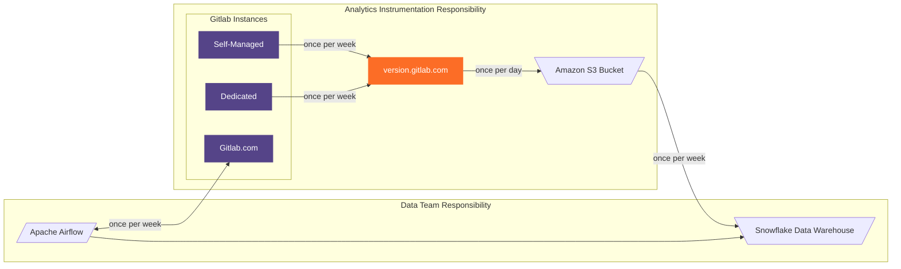
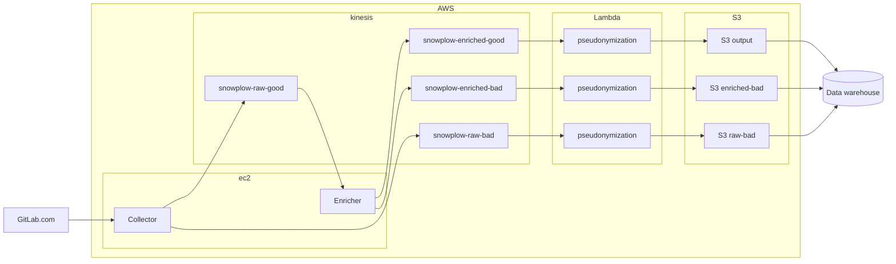

## Service Ping

Our [documentation](https://docs.gitlab.com/ee/development/internal_analytics/service_ping/) provides an overview of the purpose of Service Ping.

There are five distinct systems involved in the process of gathering the Service Ping.
The three systems managed by the Analytics Instrumentation team are:

- The GitLab instance that generates and sends the Service Ping payload
- [version.gitlab.com](https://gitlab.com/gitlab-org/gitlab-services/version.gitlab.com) which receives and stores the Service Ping payload
- An AWS S3 bucket into which version.gitlab.com extracts Service Ping payloads

The two systems managed by the Data team are:

- Snowflake the data warehouse which makes the Service Ping payloads accessible
- Airflow, which is used specifically to gather the Service Ping from GitLab.com which is the only instance that does not send the Service Ping automatically due to the volume of data.

## Snowplow

Snowplow events are fired from GitLab SaaS and other projects, such as [customers.gitlab.com](https://gitlab.com/gitlab-org/customers-gitlab-com) and the [AI gateway](https://gitlab.com/gitlab-org/modelops/applied-ml/code-suggestions/ai-assist), to go through an AWS pipeline managed by GitLab.

Self-Managed instances [can be configured](https://docs.gitlab.com/ee/development/internal_analytics/internal_event_instrumentation/local_setup_and_debugging.html#remote-event-collector) to report to a custom Snowplow collector if desired which will not be managed by GitLab.

### Event flow in the AWS pipeline

Every event goes through a collector, enricher, and pseudonymization lambda. The event is then dumped to S3 storage where it can be picked up by the Snowflake data warehouse.

Deploying and managing the infrastructure is automated using Terraform in the current [Terraform repository](https://gitlab.com/gitlab-com/gl-infra/config-mgmt/-/tree/master/environments/aws-snowplow).

See [Snowplow technology 101](https://github.com/snowplow/snowplow/#snowplow-technology-101) for Snowplow's own documentation and an overview how collectors and enrichers work.

### Pseudonymization

In contrast to a typical Snowplow pipeline, after enrichment, GitLab Snowplow events go through a [pseudonymization service](https://gitlab.com/gitlab-org/analytics-section/analytics-instrumentation/snowplow-pseudonymization) in the form of an AWS Lambda service before they are stored in S3 storage.

#### Why events need to be pseudonymized

GitLab is bound by its [obligations to community](/handbook/product/product-processes/analytics-instrumentation-guide/service-usage-data-commitment/)
and by [legal regulations](/handbook/legal/privacy/customer-product-usage-information/) to protect the privacy of its users.

GitLab must provide valuable insights for business decisions, and there is a need for a better understanding of different users' behavior patterns.
The pseudonymization process helps you find a compromise between these two requirements.

Pseudonymization processes personally identifiable information inside a Snowplow event in an irreversible fashion
maintaining dcheterministic output for given input, while masking any relation to that input.

#### How events are pseudonymized

Pseudonymization uses an allowlist that provides privacy by default. Therefore, each
attribute received as part of a Snowplow event is pseudonymized unless the attribute
is an allowed exception.

Pseudonymization is done using the HMAC-SHA256 keyed hash algorithm.
Attributes are combined with a secret salt to replace each identifiable information with a pseudonym.

### S3 bucket data lake to Snowflake

See [Data team's Snowplow Overview](/handbook/enterprise-data/platform/snowplow/) for further details how data is ingested into our Snowflake data warehouse.
