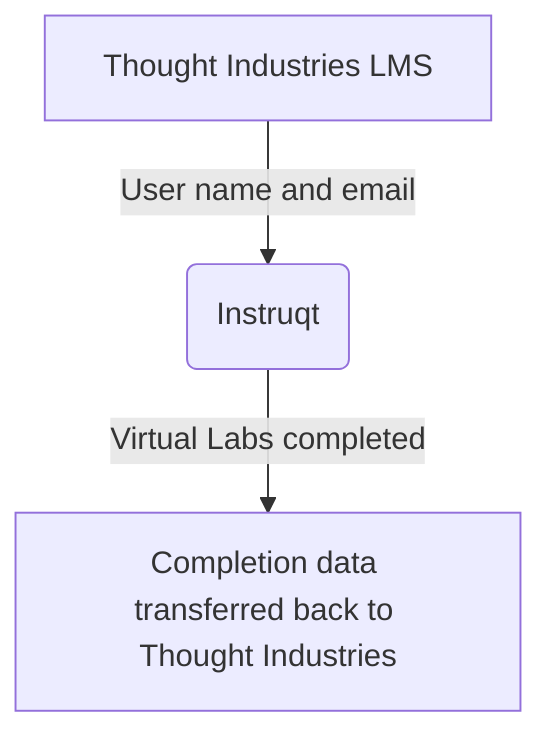

The Tech Stack single source of truth is the [Tech Stack YAML](https://gitlab.com/gitlab-com/www-gitlab-com/-/blob/master/data/tech_stack.yml) and contains more detail about this app.

{}

### Implementation

The Instruqt implementation for GitLab is still underway and has not been full implemented.

### System Diagram

The Instruqt Implementation is a SaaS app and is integrated with the [Thought Industries LMS](https://gitlab.com/gitlab-com/www-gitlab-com/-/blob/master/data/tech_stack.yml?_gl=1%2anrxy62%2a_ga%2aNjk5OTc1OTcxLjE2NTg3ODM3ODE.%2a_ga_ENFH3X7M5Y%2aMTY3NDE0NTMxNC4xNDQuMS4xNjc0MTQ3ODY5LjAuMC4w)

### Data Model

The Data Model is not available and Instruqt is a closed system.

### Integrations

The Instruqt Implementation is a SaaS app and is integrated with the [Thought Industries LMS](https://gitlab.com/gitlab-com/www-gitlab-com/-/blob/master/data/tech_stack.yml?_gl=1%2anrxy62%2a_ga%2aNjk5OTc1OTcxLjE2NTg3ODM3ODE.%2a_ga_ENFH3X7M5Y%2aMTY3NDE0NTMxNC4xNDQuMS4xNjc0MTQ3ODY5LjAuMC4w)

### Key Reports / Dashboards

All Dashboards and Reports are a part of system itself. No separate Sisense reports are available or planned.

### Support Guides and Step by Step Articles

The [Instruqt Support page](https://docs.instruqt.com/) offers a docs website with full articles on processes and step by step guides on using the system.
