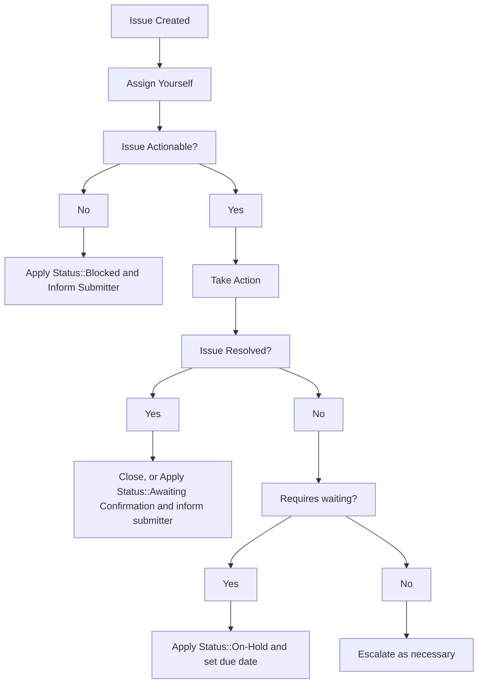

**NOTE:** If you are a GitLab team member who wants to file an internal request, please see the [Support Internal Requests handbook page](/handbook/support/internal-support/).

**NOTE:** For internal requests relating to licenses and subscriptions, please refer to the [relevant license and subscription workflow](/handbook/support/license-and-renewals/workflows/), or [CustomersDot console workflow](/handbook/support/license-and-renewals/workflows/customersdot/customer_console/).

## Overview

This document details the various templates and workflows that should be followed in order to properly handle GitLab.com related requests that Support receives in the [internal-requests](https://gitlab.com/gitlab-com/support/internal-requests/-/issues) issue tracker.

Internal requests can and should be addressed by any GitLab Support team member who is able to resolve the request.

Those who are at least 50% SaaS focused and have a GitLab.com administrator account should subscribe to and handle any issue that is an [Admin Escalation](https://gitlab.com/gitlab-com/support/internal-requests/-/labels?subscribed=&search=admin+escalation).

Internal requests are typically created by other team members who are not within the Support organization, but you can always create an internal request to track work being done, especially in cases where the request originates internally (and there is no ZenDesk ticket to track).

At the very least, you should subscribe to the following labels:

- [Admin Escalation](https://gitlab.com/gitlab-com/support/internal-requests/-/labels?subscribed=&search=admin+escalation)
- [Dotcom Escalation Weekly Report](https://gitlab.com/gitlab-com/support/internal-requests/-/labels?subscribed=&search=dewr)

You may want to consider subscribing to [Platform::SaaS](https://gitlab.com/gitlab-com/support/internal-requests/-/labels?subscribed=&search=platform+saas) but be aware this will be noisier.

By subscribing to the labels, you'll receive notifications on when a request is created. You should try to work them into your regular workflow, ensuring that you are assigning it to yourself like a customer ticket if you decide to take it.

If you are interested in servicing internal requests that require console access, consider speaking with your manager about completing the [GitLab.com Console module](https://gitlab.com/gitlab-com/support/support-training/-/blob/main/.gitlab/issue_templates/GitLab-com%20Console.md).

## General Workflow



## Activate Trial Runners

For sales assisted trials, only we can override the credit card validation requirement for a namespace. See [Internal Requests > SaaS Trial Related > Change an existing SaaS trial plan](/handbook/support/internal-support/#internal-requests) for instructions on how to perform this task.

## GitLab.com Trial Change Request

Sales team members will typically open this on behalf of their prospects in order to extend an active trial. You can follow the [L&R Workflow for Extending Trials](/handbook/support/license-and-renewals/workflows/saas/trials_and_plan_change#extending-trials).

## Ask for Support as a Solution Architect

Solution Architects should use the [Support Super form](https://support-super-form-gitlab-com-support-support-op-651f22e90ce6d7.gitlab.io/) only when support is needed during **pre-sales** (for example: a POV exercise, or a potential new deal with an existing customer). This form is an internal request, which means the work takes place between the SA and the engineer. Customers can not collaborate on these tickets. In any other cases, SAs should advise the customer to open a support ticket themselves, for clear and efficient communication.

## Inactive Namespace Request

GitLab Team Members can no longer submit inactive namespace / namesquatting requests for their own use. See: [support-team-meta#5170](https://gitlab.com/gitlab-com/support/support-team-meta/-/issues/5170)

Customers can submit a support ticket. See [Name Squatting Policy](/handbook/support/workflows/namesquatting_policy/).

## Contact Request

GitLab team members should use [the Contact Request template](https://gitlab.com/gitlab-com/support/internal-requests/-/issues/new?issuable_template=Contact%20Request) to request Support to contact a user on their behalf.

Usually, these are assigned to [CMOC](/handbook/support/internal-support/#regarding-gitlab-support-plans-and-namespaces), but can also be completed by anyone with admin-level access to GitLab.com. `Admin Escalation` label is applied and everyone with admin access is supposed to be subscribed and working on such issues.

See the [Sending notices workflow](/handbook/support/workflows/sending_notices) for complete instructions on how to contact users.

## Repo Size Limit Increases

At times, users require an increase to the size limit of their repository as a workaround for a bug issue or due to having inadvertently reached the limit.  There are two different limits in place, 10GiB for free and 500GiB for paid namespaces.  In both cases, we should work with the users to reduce their usage as soon as possible.  Free users should be encouraged to purchase additional storage packs, while paid customers should be directed to speak with their account managers for next steps.

In both cases, the limit can be temporarily increased:

1. Open an issue in the **[internal-requests](https://gitlab.com/gitlab-com/support/internal-requests/issues)** issue tracker using the `Repo Size Limit` issue template.
    - If you do not have GitLab.com admin access, add the `Admin escalation` label. If needed, post in the `#support_gitlab-com` Slack channel for attention on it.
1. If a request is for a free user namespace or to work around a bug issue:
    - Set the expectation for free users that this is very time limited, just enough to allow them to reduce usage or purchase additional storage packs
      - Set a due date for reverting: 1-2 days for free users
      - up to 1 week from the current date for bug encounters
    - If a longer exception time is required, add the `Manager Approval::Required`, and post in the `#support_leadership` channel to request approval.
    - Use current size + small buffer (2-5 GB) for the exception size.
    - Make sure to comment on (or create) a bug issue to help future users and prevent further tickets.
1. If a request is for a paid namespace:
    - For system stability reasons, we should encourage them to reduce usage as soon as possible
      - At this time, it is not possible to purchase additional storage beyond the [fixed project limit](https://docs.gitlab.com/user/storage_usage_quotas/#fixed-project-limit)
    - Inform their account management team if they aren’t already involved, and reach out to  `#support_licensing-subscription` if you need any assistance in locating or communicating with the account managers
    - Set a due date for reverting, up to 1 week from current date, but loop in `#support_leadership` if longer will be necessary
1. Apply the `Status::On Hold` label and set the due date to when it should be reverted.
1. Using your GitLab.com admin account navigate to the project in question while appending **/edit** to the URL. For example, if the project in question is located at `https://gitlab.com/group/subgroup/project/` you would navigate to `https://gitlab.com/group/subgroup/project/edit`.
1. Enter a new value in the **Repository size limit (MB)** field.
1. Click **Save changes**.
1. On the specified due date, revert the size limit back to the default by removing the value.

## Pipeline Quota Reset

See [internal wiki page](https://gitlab.com/gitlab-com/support/internal-requests/-/wikis/Procedures/Pipeline-Quota-Reset).

## GitLab.com Console Escalation

Templates available for requesting an engineer with GitLab.com console access to take action:

1. [Console Export Request](https://gitlab.com/gitlab-com/support/internal-requests/-/issues/new?description_template=GitLab.com%20Console%20Export%20Request) for creating a project export with the console.
1. [Console Escalation](https://gitlab.com/gitlab-com/support/internal-requests/-/issues/new?description_template=GitLab.com%20Console%20Escalation) for running commands in the rails console.

Before submitting a console escalation request, ensure that you perform [Account Ownership Verification](/handbook/support/workflows/account_verification) workflow for the following types of customer request:

1. To extract and release information.
1. To make changes to account(s).

This ensures that the request is coming from an authorized contact. Console escalation requests for internal investigation do not require account verification. See Support Team Meta [#5276](https://gitlab.com/gitlab-com/support/support-team-meta/-/issues/5276#reasoning) on the discussion.

Common issues include the following when the UI and API methods are not working:

- Deletion of projects, groups, cluster integrations, container registry images, etc.
- User account confirmation retrigger
- [Project export](https://gitlab.com/gitlab-com/support/internal-requests/-/blob/master/.gitlab/issue_templates/GitLab.com%20Console%20Export%20Request.md)

Rarely, console escalations will also be used to workaround lack of a feature where Support can complete actions that would be unavailable or onerously time-consuming to customers. When actions cannot be done via the UI or API, engineers should ensure that a feature request exists to have it in the product. Consider tagging the appropriate Product Manager for prioritization.

Console escalation requests can also serve a purpose when further information (unavailable through the UI or API) is needed to understand the root cause of a problem. For example, searching for unverified secondary email until [gitlab#367823](https://gitlab.com/gitlab-org/gitlab/-/issues/367823) is resolved. This may be because we are not sufficiently logging in Kibana/Sentry, we're unable to replicate an issue, or the creation of an issue may not be the appropriate action needed to resolve a customer problem. Collaborate with console enabled engineers and product teams to solve these types of problems.

Any request requiring assistance from infrastructure teams, please see the [SaaS Platforms Request for Help](https://gitlab.com/gitlab-com/saas-platforms/saas-platforms-request-for-help) issue tracker and [SaaS Platforms Getting Assistance](../../engineering/infrastructure/getting-assistance/) page.

### Response time and escalating the request

Support engineers with console training and access are subscribed to the "Console Escalation::GitLab.com" label, and one of them should respond within 1 business day.
If you need to reach out to the group, you can do so by [mentioning the console group](https://gitlab.com/groups/gitlab-com/support/dotcom/console/-/group_members?with_inherited_permissions=exclude).
Please note that there is a [read-write group](https://gitlab.com/groups/gitlab-com/support/dotcom/console/write/-/group_members?with_inherited_permissions=exclude) for requests that require write access.
If it's urgent, please ping the specific team members who are working based on timezone in the `#support_gitlab-com` Slack channel.
If none are available, please engage infra SRE on-call and notify the Support Manager on-call for awareness.

### Fulfilling console requests

Engineers with console access should search for similar previous requests, look for the relevant function in the code, or work with another engineer to resolve each request.
You can filter requests by "Read::Only" or "Read::Write" labels.
Common or custom functions can be found in the [support runbooks](https://gitlab.com/gitlab-com/support/runbooks/).

For update, create, and delete actions, it's essential to carefully review the request and think about the impact of these actions. Remember, update and delete actions can be risky. When writing custom commands or scripts, it's crucial to calibrate them based on the potential risks and the situation's specifics. You should always get another set of eyes on your code to confirm what you want to achieve. Customer data loss is not an acceptable tradeoff for expediency.

If you're not completely sure about the specifics of the script or commands, test them out in your test instance first. And if needed, get feedback from developers who know that area of codebase before using them in the production console. This approach helps reduce risks when doing console tasks in production. For any scripts that are originating from the support team and are not already in a runbook or approved by development teams, please reach out to a manager or staff support engineer for review and approval.

## CI Catalog Badge requests

[CI Catalog Badge requests](https://gitlab.com/gitlab-com/support/internal-requests/-/issues/new?issuable_template=CI%20Catalog%20Badge%20Request) are to be actioned by a Support Stable Counterpart for Pipeline Authoring. These requests are used to give certain organizations a "Partner badge" in the CI catalog on GitLab.com. They require a GitLab.com administrator account to execute the [verifiedNamespaceCreate](https://docs.gitlab.com/api/graphql/reference/#mutationverifiednamespacecreate) GraphQL mutation.

1. Open [GraphiQL](https://gitlab.com/-/graphql-explorer) with your GitLab.com administrator account
1. In the following query, replace `root-level-group` with the namespace and verification level (`GITLAB_PARTNER_MAINTAINED`, `VERIFIED_CREATOR_MAINTAINED`) provided in the internal request:

   ```graphql
   mutation {
     verifiedNamespaceCreate(input: { namespacePath: "root-level-group",
       verificationLevel: GITLAB_PARTNER_MAINTAINED
       }) {
       errors
     }
   }
   ```

1. Execute the query via GraphiQL
   - In case of an error, reach out in [#g_pipeline-authoring](https://gitlab.enterprise.slack.com/archives/C019R5JD44E) for assistance
1. When closing the internal request as actioned on, ping the requester to let them know the badge was applied
