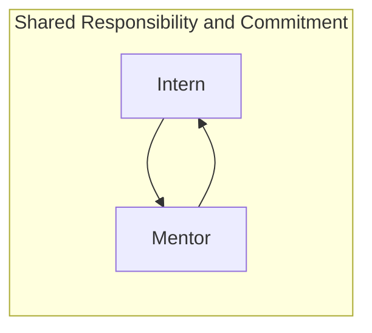

---

## <i id="biz-tech-icons" class="far fa-paper-plane"></i>Introduction

Welcome to the **Data Team Internship Program** page. The Program is launching in 2022 and we are excited to help interested GitLab team members experience life in the fast-paced, results-oriented, and rapidly-evolving world of Data!

- **Slack Channel**: `#data`
- **[Internship for Learning](/handbook/people-group/learning-and-development/internship-for-learning/)**
- **[Data Onboarding Issue](https://gitlab.com/gitlab-data/analytics/-/blob/master/.gitlab/issue_templates/Team%3A%20Data%20Onboarding.md)**

## <i class="far fa-newspaper" id="biz-tech-icons"></i> The 2022 Data Team Internship Program

The initial focus of the 2022 Program will be **Data Internship for Learning**, following the [GitLab Internship for Learning Program](/handbook/people-group/learning-and-development/internship-for-learning/) and focused on supporting career development for existing GitLab Team Members. Later in 2022 we will evaluate extending the program to support non-GitLab Team Members and traditional undergraduate internships.

### How Does Data Internship For Learning Work?

The Data Internship for Learning follows [GitLab Internship for Learning Program](/handbook/people-group/learning-and-development/internship-for-learning/) guidelines. In addition, given the rapid growth of the Data Team, we seek to partner every Intern with a current [individual contributor](/handbook/engineering/development/dev/training/ic-to-manager/) Data Team member who is interested in exploring their own career development towards a [Leadership](/handbook/people-group/learning-and-development/new-to-leadership/#new-to-leadership-and-management) role, such as a Team Lead specialization or [Data Management](/job-families/finance/manager-data/) role. In this model, both team members share a commitment to support each other's success.

At launch in January 2022, **Data Internship for Learning** will be structured as follows:

- Follows the [GitLab Internship for Learning Program](/handbook/people-group/learning-and-development/internship-for-learning/)
- Open to only current GitLab Team Members
- Intern time allocation should range from 25%-50%, with a 3-month commitment
- Data Team Mentor time allocation should range from 15-25%, with a 3-month commitment

### How Do I Get Started?

Follow the [GitLab Internship for Learning Program](/handbook/people-group/learning-and-development/internship-for-learning/) instructions.

### Criteria For Creating A Data Team Internship

Requests to create a Data Team Intern position will be evaluated on the following criteria:

1. Team Size, Maturity, and Need
     - How established is the team the intern will be joining? Is this an established team with processes, roles, a roadmap, and backlog?
     - Will the team be able to take on an intern without risking a decrease in velocity?
     - Would the team benefit from an intern to support a more senior member's career development, to introduce new perspectives, or to accelerate the roadmap in one or more areas?
     - Does the team have a roadmap containing low weight issues with few dependencies suitable for an intern?
1. Mentor Commitment
     - Do the mentors have previous experience mentoring interns or junior engineers? Previous experience is a nice-to-have, but not a must-have.
     - Are the mentors interested in Leadership development?
     - Can the mentor commit to a 3-month engagement, including regular meetings and progress reviews? Are there potentially extended out-of-office periods that would affect the internship experience?
1. Intern Commitment
     - Can the intern commit to a 3-month engagement, including regular meetings and progress reviews? Are there potentially extended out-of-office periods that would affect the internship experience?

If the answer to these questions is **YES**, there is a great chance the internship is a fit for all team members.

### Data Team Internship KPIs

The following KPIs are guidelines we plan to use for the internship. These may be adjusted by the mentor/intern prior to the start of the internship with approval from the team manager.

1. Successful Data Team Onboarding within 30 Calendar Days
1. Monthly Progress Report and Feedback issue
1. Final CSAT Score of 4 or higher on a 5 point scale
1. Number of Data Project MRs successfully Merged > 5
1. Number of Data Team Handbook MRs successfully Merged > 5

### What Does A Data Team Intern Do?

An internship gives you insight into a [Data Team role](/handbook/enterprise-data/organization/#data-roles-and-career-development) by providing you opportunities to learn and contribute to GitLab results. You will be fully integrated into the team through Data Onboarding and be assigned **real** projects that contribute to Quarterly Objectives and the [Data Team Roadmap](https://internal.gitlab.com/handbook/enterprise-data/direction/). In the GitLab Data Team we believe in full end-to-end ownership of the work we do, ranging from requirements gathering all the way to production deployment and operations. During your internship you will be assigned a Senior team member as a mentor-manager, who will help you to navigate in daily tasks.  Examples of your tasks will include:

- Requirements gathering
- Extraction of data from various sources to support project's objective
- Analysing and visualising data to develop new insights
- Collaboration with stakeholders (including explaining technical concepts with non-technical language)
- Working in GitLab to manage projects (via epics and issues)
- Writing new source code and merging the code through a Merge Request

## Data Team Internship for Learning Positions

### Analytics Engineering Internship for Learning

#### Openings

| Quarter | Openings | Filled | Remaining Openings |
| :---: | :---:  | :---: | :---: |
| [FY23Q1](https://gitlab.com/groups/gitlab-data/-/epics/499) | 1 | 1 | 0 |
| [FY23Q2](https://gitlab.com/groups/gitlab-data/-/epics/427) | 2 | 2 | 0 |
| FY23Q3 | TBD | TBD | TBD |
| FY23Q4 | TBD | TBD | TBD |

#### Requirements

- Familiarity with and Interest in the [Analytics Engineering](/job-families/marketing/enterprise-data/analytics-engineer/) job family
- BS or MS in data-related fields (statistics, computer science, engineering), but self-learners are also welcome to apply
- Positive and solution-oriented mindset
- Comfort working in a highly agile, intensely iterative environment
- Self-motivated and self-managing, with task organizational skills
- Working knowledge of SQL
- Basic knowledge of dashboard tools (we use Tableau)
- At least 1 completed demoable data project (Non-commercial projects done in a spare time also count, as do school projects)
- Nice to have
  - Understanding of software industry
  - Prior experience in a Data Role
  - Experience designing and managing projects
  - Working knowledge of Python (we use Jupyter notebooks to analyse and visualise data)

### Data Science Internship for Learning

#### Openings

| Quarter | Openings | Filled | Remaining Openings |
| :---: | :---:  | :---: | :---: |
| [FY23Q1](https://gitlab.com/groups/gitlab-data/-/epics/499) | 2 | 2 | 0 |
| [FY23Q2](https://gitlab.com/groups/gitlab-data/-/epics/427) | 2 | 2 | 0 |
| FY23Q3 | 2 | 2 | 0 |
| FY23Q4 | 3 | 3 | 0 |
| FY24Q1 | 1 | 1 | 0 |
| FY24Q2 | 1 | 1 | 0 |
| FY24Q3 | 2 | 0 | 2 |

#### Requirements

- Familiarity with and Interest in the [Data Science](/job-families/finance/data-science/) job family
- BS or MS in data-related fields (statistics, computer science, engineering), but self-learners are also welcome to apply
- Working knowledge of SQL
- Working knowledge of Python (we use Jupyter notebooks to analyse and visualise data)
- Basic knowledge of dashboard tools (we use Sisense)
- Understanding of basic statistics concepts. if you need a refresher, this [Coursera Stanford](https://www.coursera.org/learn/stanford-statistics) course is a great resource
- Understanding of machine learning algorithms including decision trees, gradient and regression models
- Ability to communicate in English, including concise writing that summarises your work
- Ability to work asynchronously - as a fully-remote company we have team members all around a globe with differing working hours
- At least 1 completed data science project (Non-commercial projects done in a spare time also count, as do school projects)
- Being proactive in a work you do, but also not afraid to ask questions
- Nice to have
  - Understanding of CRISP-DM framework
  - Understanding of software industry

### Data Platform Team Internship for Learning

#### Openings

| Quarter | Openings | Filled | Remaining Openings |
| :---: | :---:  | :---: | :---: |
| FY23Q1 | 0 | 0 | 0 |
| [FY23Q2](https://gitlab.com/groups/gitlab-data/-/epics/427) | 0 | 0 | 0 |
| FY23Q3 | 0 | 0 | 0 |
| FY23Q4 | 1 | 1 | 0 |
| FY24Q1 | 0 | 0 | 0 |
| FY24Q2 | 0 | 0 | 0 |
| FY24Q3 | 0 | 0 | 0 |
| FY24Q4 | TBD | TBD | TBD |

#### Requirements

- Familiarity with and Interest in the [Data Engineering](/job-families/marketing/enterprise-data/data-engineer/) job family
- BS or MS in data-related fields (statistics, computer science, engineering), but self-learners are also welcome to apply
- Positive and solution-oriented mindset
- Comfort working in a highly agile, intensely iterative environment
- Self-motivated and self-managing, with task organizational skills
- Working knowledge of SQL
- Nice to have
  - Understanding of software industry
  - Prior experience in a Data Role
  - Experience designing and managing projects

### Data Analyst Internship for Learning

#### Openings

No openings at this time.
