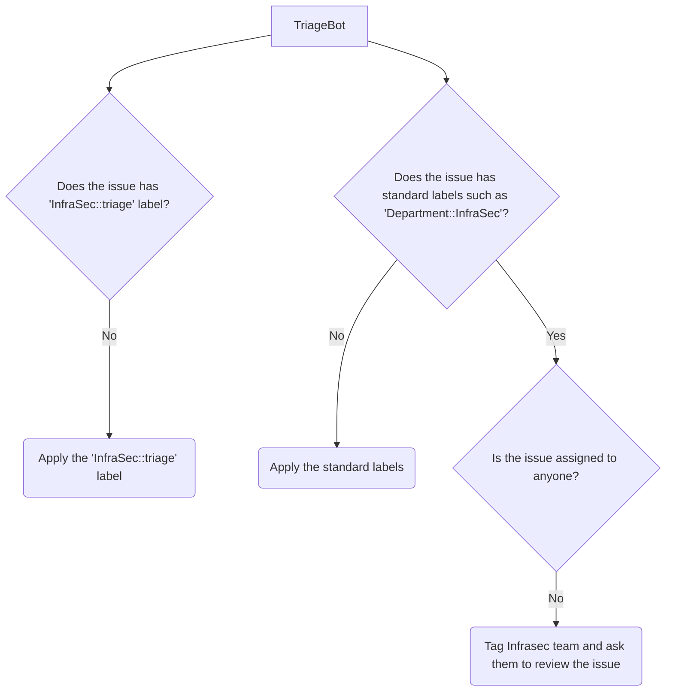
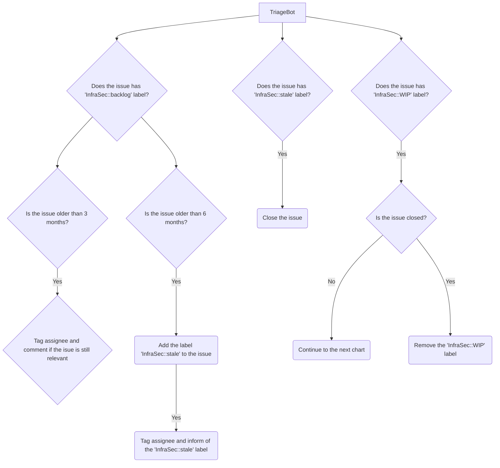
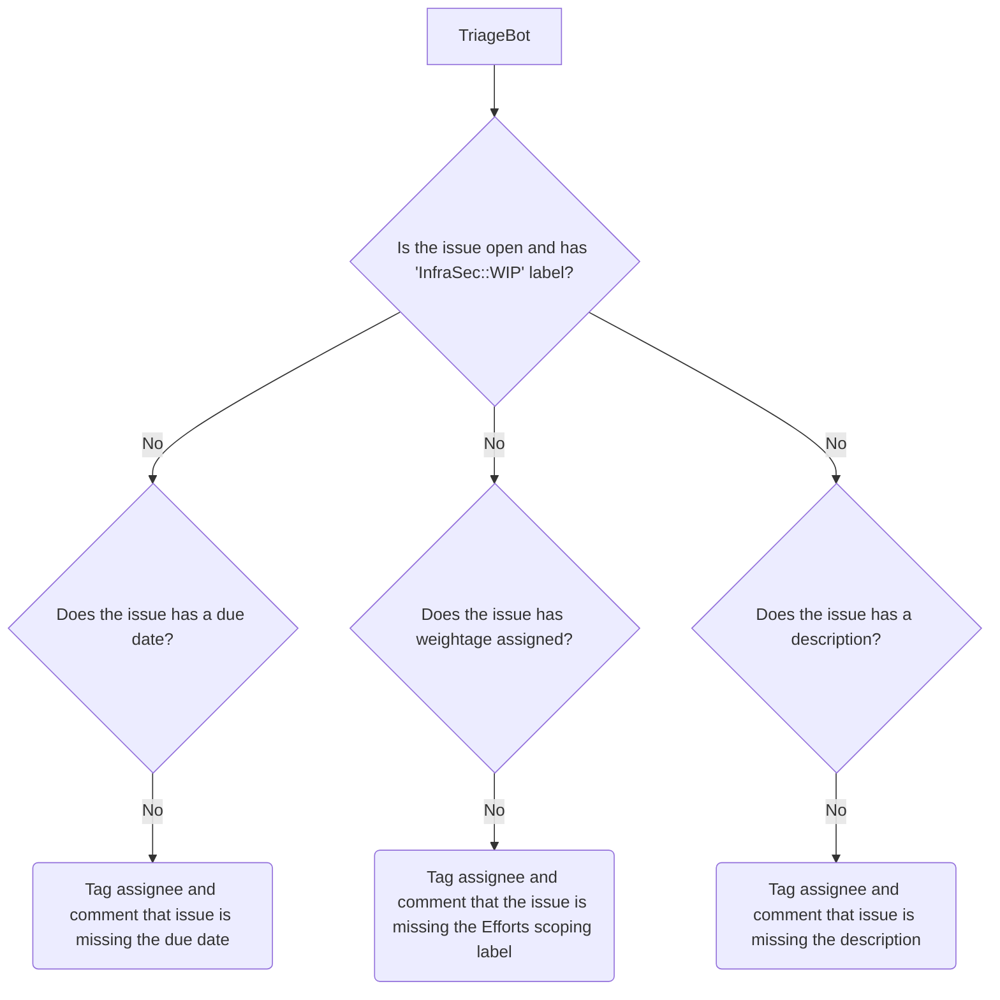

Managing issues—from creation to closure—is a fundamental process that ensures they are addressed systematically. The issue lifecycle typically begins when a team member or stakeholder creates an issue, detailing the problem, enhancement, or task to be completed. The issue progresses through various stages, including triage and in-progress, before being resolved or closed. This workflow allows for transparent tracking of work, accountability among team members, and a structured approach to delivering solutions. Each stage is crucial to ensuring that issues are handled efficiently, fostering collaboration and addressing all concerns on time.

## Issue Stages

### Stage 1: Issue Creation

The first step is to ensure it is properly categorized for review by the InfraSec team.

- Initially, standard labels like `Department::InfraSec` are applied if they are not already present to indicate that the issue pertains to the Infrastructure Security team.
- After the above step, the label `InfraSec::triage` is applied to the issue. This label signals to the InfraSec team that the issue requires their attention and triage.
- During the triage process, the InfraSec team assesses the issue's priority, scope, and impact on the infrastructure.
- Based on this assessment, the issue is either moved to the `InfraSec::backlog` for future consideration or marked as "InfraSec::prioritised" if it requires immediate action.
- This structured approach ensures that issues are addressed according to their urgency and business impact.

### Stage 2: Working on Issues

- Once an issue has been marked as `InfraSec::prioritised` during triage, it moves into the second stage, where the InfraSec team begins actively working on it.
- At this point, the issue is updated with the label `InfraSec::WIP`, signaling that the team has started addressing the problem or task.
- The team also estimates the effort required to resolve the issue. This is done by applying an effort estimation label, such as `InfraSecWork::Large`, to indicate the size and complexity of the work involved. For more information, refer to [Infrastructure Security - Capacity Indicators and Workflows](../metrics/capacity/#effort-classification).
- This estimation helps with setting realistic timelines and aligning expectations.

### Stage 3: Backlog Checks

- In this stage, the InfraSec team regularly reviews issues in the `InfraSec::backlog` to ensure they remain relevant and necessary.
- If an issue has been in the backlog for more than 6 months without any progress or it is no longer relevant, it is reviewed for potential closure. The issue is tagged as `InfraSec::stale`, and the triage bot will close it if it is not closed.
- If an issue has already been marked as `InfraSec::prioritised` or moved to the `InfraSec::WIP` stage in Stage 2, this stage is automatically skipped, as the issue is actively being worked on.
- This step helps maintain a clean backlog and focus on issues that are still pertinent to the team's objectives.

### Stage 4: Issue Closure

- In the final stage, after the InfraSec team has completed work on an issue and met the defined success criteria, the issue is prepared for closure.
- The team first removes the `InfraSec::WIP` label, indicating the work has been completed.
- After verifying that all success criteria and objectives have been achieved, the issue is then officially closed.
- This stage ensures that the work has been successfully completed and documented, marking the conclusion of the issue's lifecycle.

## Handling issues using TriageBot

This might look like a very complex workflow, but we have a friendly bot that helps you set the right labels. The InfraSec team utilizes the [GitLab Triage Bot](/handbook/support/readiness/operations/docs/gitlab/triage_bot/) to automate the initial handling of security-related issues. By leveraging this bot, issues are automatically categorized, labeled, and assigned according to predefined criteria, ensuring efficient prioritization and management throughout the issue lifecycle.

Configuration of the bot for InfraSec use-cases is available [here](https://gitlab.com/gitlab-com/gl-security/product-security/infrastructure-security/automation/infrasec-triage-bot/-/tree/main).

### When an issue is created

### Issue closure check

### WIP Issue checks

