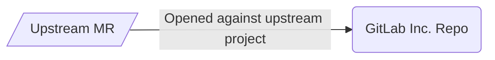

Contributions from the JiHu team will follow two methods depending on whether they have JiHu proprietary changes or not.

- Upstream method - start with a merge request in the GitLab Inc. repository.
- Proprietary and upstream method - start with a merge request with all changes against the GitLab JiHu project and a merge request with all non-proprietary changes against the upstream project.

To identify contributions from JiHu, the `~"JiHu contribution"` label is automatically applied to all upstream contributions coming from the JiHu team. To ensure the label is accurately applied, the `gitlab-jh` team must keep the direct members of [`gitlab-jh/jh-team`](https://gitlab.com/groups/gitlab-jh/jh-team/-/group_members?with_inherited_permissions=exclude) updated with current team members.

JiHu enablement efficiency age and review metrics are publicly accessible in this [dashboard](https://app.periscopedata.com/shared/f7af38e3-0cea-4219-a5d3-6f6b25f10244?).

The [Engineering Productivity](/handbook/engineering/infrastructure/engineering-productivity/) team is the DRI for JiHu Engineering enablement efficiency tooling and metrics.

### Guidelines for upstream contributions

Contributions that do not involve JiHu proprietary content will be opened against the upstream project.

### Upstream feature contribution guidelines

For large initiatives, ones that take multiple MRs or have broad-range implications, upstream feature contributions are more efficient and predictable when there's joint upfront planning. In order to set up both teams for success they should follow these guidelines:

1. **At least one milestone prior to the milestone where implementation starts** - JiHu team creates an upstream feature planning issue that provides an overview of the feature scope in English, intended uses, and iterative implementation plan. JiHu will ask the relevant team's PM, Product Designer and EM for feedback on the issue and implementation plan.
   - The relevant GitLab product group will provide feedback on the feature, the relevant iterative implementation plan and provide feedback to JiHu.
1. **During implementation start** - JiHu team will author MRs following the implementation plan and upstream guidelines below. The review will be done based on the agreement in the feature planing issue.

Example upstream planning issue: TBD

#### Guidelines for iterative contributions

Bigger product feature contributions should follow GitLab
[iteration strategies](/handbook/product/product-processes/#iteration-strategies).

[Iteration training](/handbook/engineering/development/onboarding/manager/#iteration-training) is available to coach on GitLab's value of iteration. This can be helpful to understand the expectations of GitLab product teams for feature iteration.

Not every features can follow the same strategy, but the first strategy we
try should be [crafting the minimal viable change](/handbook/product/product-processes/#crafting-an-mvc), and for creating
merge requests, always try to [keep merge requests small](/handbook/engineering/workflow/iteration/#how-to-keep-a-merge-request-small).

In the above guidelines to keep merge requests small, we mentioned:

- Horizontal slicing
- Vertical slicing

Given JiHu upstream contributions cannot easily slice horizontally due to lacking
developer permissions, always try to slice vertically first, that is,
reduce the scope of the feature. Only consider slicing horizontally if
it cannot be smaller, while it's still too large to fit inside a single
merge request.

Here are some examples for how we break down a feature in multiple iterations,
both horizontally and vertically:

| Feature | Merge requests (not an exhaustive list) | Slicing |
| --- | --- | --- |
| [GitLab Insights](https://gitlab.com/groups/gitlab-org/-/epics/725) | <ul><li>[Introduce the Gitlab::Insights framework](https://gitlab.com/gitlab-org/gitlab/-/merge_requests/9912)</li><li>[Introduce the Insights controllers](https://gitlab.com/gitlab-org/gitlab/-/merge_requests/9776)</li><li>[Insights frontend](https://gitlab.com/gitlab-org/gitlab/-/merge_requests/9856)</li><li>[Move to supporting multiple charts per page for Insights](https://gitlab.com/gitlab-org/gitlab/-/merge_requests/10516)</li></ul> | Mixture with both. Horizontally for the base and vertically on top of it |
| [Filter search results by state](https://gitlab.com/groups/gitlab-org/-/epics/4293) | <ul><li>[Search UI add issue scope results filtering by state](https://gitlab.com/gitlab-org/gitlab/-/merge_requests/39881)</li><li>[Add issues/merge_requests filtering by state for search API](https://gitlab.com/gitlab-org/gitlab/-/merge_requests/41989)</li></ul> | Vertically that each merge request shipped a standalone feature |

### Guidelines for proprietary and upstream contributions

Contributions in projects that have proprietary and upstream contributions will use the following guidelines to have a streamlined review.

1. The JiHu Engineering team will open two MRs:
   1. JiHu MR with all changes against the default branch in [JiHu project](https://jihulab.com/gitlab-cn/gitlab).
   1. GitLab Inc MR with all non-`jh/` changes against the default branch in [GitLab Inc project](https://gitlab.com/gitlab-org/gitlab).
1. The GitLab Inc MR will be reviewed by the GitLab Inc team members. Reviewers should follow the [guidelines for reviewing JiHu (JH) Edition related merge requests](https://docs.gitlab.com/ee/development/jh_features_review.html).
1. After merging, the updates will be mirrored to JiHu project via pull mirroring and synchronized via [code sync](https://jihulab.com/gitlab-cn/code-sync), merging into the default branch [`main-jh`](https://jihulab.com/gitlab-cn/gitlab/-/commits/main-jh) in the JiHu project.
1. The JiHu Engineering team will remove all non-`jh/` changes from the JiHu MR.
1. The JiHu Engineering team will review and merge the JiHu MR in the JiHu project.
1. A scheduled pipeline every 2 hours will run in [compliance-verification](https://gitlab.com/gitlab-org/gitlab-jh-mirrors/compliance-verification) against the [JiHu project pulling mirror](https://gitlab.com/gitlab-org/gitlab-jh-mirrors/gitlab) to verify that there are no code difference outside of `jh/` directory beside [agreed difference for `package.json` and `yarn.lock`](https://gitlab.com/gitlab-jh/gitlab-jh-enablement/-/issues/170#note_892043256).

### JiHu contribution identification

Contributions from [JiHu team members](https://gitlab.com/groups/gitlab-jh/jh-team/-/group_members?with_inherited_permissions=exclude) are labeled with `JiHu contribution` label via:

- [Event driven automation](https://gitlab.com/gitlab-org/quality/triage-ops/-/blob/master/triage/processor/jihu_contribution.rb)
- [Scheduled automation](https://gitlab.com/gitlab-org/quality/triage-ops/-/blob/master/policies/stages/hygiene/label-jihu-contribution.yml) as backup.

### Merge request review process

1. JiHu author submits upstream merge request in draft
1. JiHu author's manager is mentioned in the merge request description
1. JiHu team will conduct a peer-review
1. Once JiHu team peer review is complete. JiHu R&D manager or maintainer will add `LGTM` or `Looks good` comment in the MR.
1. Merge request is then set to 'ready' state by JiHu team.
1. JiHu author will request a review using `@gitlab-bot request_review` to identify and work on merging the MR with a merge request coach
1. The MR goes through our documented review process which includes:
    1. [Code review by domain experts](#what-approvals-are-required)
    1. Review from owners of specific code files. JiHu merge request author is responsible to mention team members from list of require approvals in the MR Approvals widget. Currently for the following area:
        1. Authentication related code
    1. [GitLab Security Review](#security-review-workflow-for-jihu-contributions), which will be triggered automatically.

#### What approvals are required

Upstream merge requests require the same level of review and approval as all merge requests including:

- [Regular code review](https://docs.gitlab.com/ee/development/code_review.html)
- [Security review]()
- [Database migration review]() when applicable

Upstream merge requests may require additional [specific team reviews](https://docs.gitlab.com/ee/development/code_review.html#approval-guidelines) based on changed files. High impact code is identified with [CODEOWNERS](https://gitlab.com/gitlab-org/gitlab/-/blob/master/.gitlab/CODEOWNERS) rules and required approvals for specific files. For example, if the merge request includes changes related to authentication or authorization, it must be approved by a [Manage:Authentication and Authorization team member](/handbook/company/team/)

#### What to review

- Do not review changes inside `jh/`:
  - If the specific change is only needed for JiHu, it should go into `jh/`
  directory in the JiHu project repository.
- Changes outside of `jh/` directory. Some examples include:
  - Features which can be added to CE/EE.
  - Refactoring which can make CE/EE code more clean or more modular.
  - Changes for prepending the classes/modules should be reviewed based on
    [JH features based on CE or EE features](https://docs.gitlab.com/ee/development/jh_features_review.html#jh-features-based-on-ce-or-ee-features).
  - Database migrations related changes should be reviewed following
    [database migration review process]().

#### Merge request review escalation

Please refer to our [guidelines](https://docs.google.com/document/d/1zEiPBZ1D90LJdxBJDl45B4N-umqtR0VGt3803OgHjMo/edit?usp=sharing).

### Release certification process

The Application Security team performs a certification of each release that includes JiHu contributions. Please see [this documentation]() for more information about this process.

Certification issues containing a report can be found in the [issue tracker](https://gitlab.com/gitlab-org/jh-upstream-report/-/issues/) of the [jh-upstream-report repository](https://gitlab.com/gitlab-org/jh-upstream-report).
