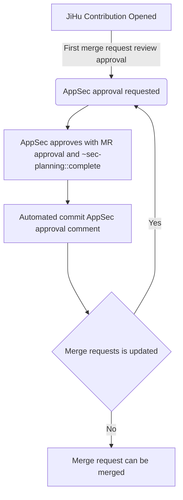

### Security review process for JiHu contributions

In order to make sure that a release with JiHu contributions can be certified, members of the AppSec team
need to perform a security review of any JiHu contribution and explicitly approve them.  The JiHu team will be contributing code to
[a number of repositories]().
These contributions will be [auto labeled]() with the `JiHu contribution` label.

### Who can perform a security review of a JiHu contribution

Any member of the AppSec or Federal AppSec team is eligible to perform a security review of a JiHu contribution.

### When to request a review

An automated comment pings the AppSec team after the MR receives its first approval. Team members do not need to manually @-mention AppSec.

### Determining who will perform a security review of a JiHu contribution

When the AppSec team is pinged on a JiHu contribution, it will typically be first seen by
the AppSec engineer on [Triage (mentions and issues) Rotation](/handbook/security/product-security/application-security/runbooks/triage-rotation.html). This person should:

1. Ping the stable counterpart for the [relevant part of the codebase](/handbook/product/categories/#devops-stages) and ask them to perform the review
    - If the change is small or easy to review, the AppSec engineer on triage can do the review themselves and `@-mention` the stable counterpart for visibility
1. If the stable counterpart is unavailable or unassigned, the AppSec engineer on Triage Rotation can perform the review
1. Alternatively, they can ask that someone else review it by linking to the MR in the `#sec-appsec` Slack channel and asking for a reviewer to volunteer

### Security review workflow for JiHu contributions

When performing the security review of a JiHu contribution, the reviewer needs to:

1. Perform a security review of the merge request
    - Make any comments or ask any clarifications necessary to complete the review
    - Look to make sure that the code does not introduce any new vulnerabilities
1. If the merge request looks acceptable:
    - Make a comment that uses the `/approve` quick action
    - Approval will be confirmed with an [automated approval comment](https://gitlab.com/gitlab-org/gitlab/-/merge_requests/84626#note_906357637)
1. If the merge request does not look acceptable at this time, and/or introduces new vulnerabilities, and/or the AppSec team is waiting on answers from the engineer:
    - Apply the `sec-planning::pending followup` label
    - If possible, work with the creator to make it secure. Follow the steps above once it looks acceptable
    - If inherently unacceptable or a wider discussion is needed, express any concerns and work with the creator and the relevant product and engineering teams to move forward

#### Security final commit approval

AppSec approvals are revoked when subsequent changes are added to the merge requests and requires a re-review from AppSec before merging. The process is as follows:

1. `~sec-planning::complete` will be revoked when the MR is updated (additional commits or rebase) and the original AppSec approver will have a [request](https://gitlab.com/gitlab-org/gitlab/-/merge_requests/84626#note_906360435) to re-review and approve.
1. Use [the "Compare Versions" feature](https://docs.gitlab.com/ee/user/project/merge_requests/versions.html#selecting-a-version) to see what changed between the AppSec-approved version and the latest version. The automated approval comment contains the approved version's SHA hash.
1. Use the [suggested quick action](https://gitlab.com/gitlab-org/gitlab/-/merge_requests/84626#note_906360435) to unapprove and re-approve after re-reviewing.

Merging of `gitlab-org/gitlab` `~JiHu contribution` MRs is blocked if the `~sec-planning::complete` label is missing from the merge request, since the `verify-approvals` job will fail.
