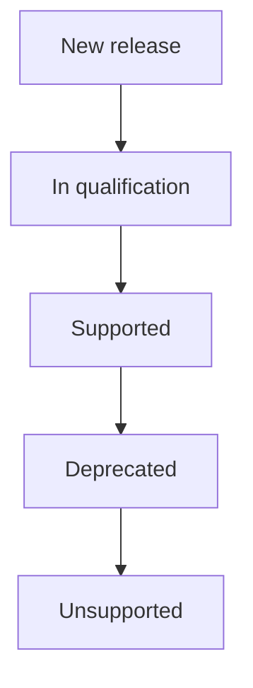

The Distribution team's support policy for various Kubernetes and OpenShift
releases for the GitLab Helm chart and Operator.

## Definitions

Definitions for terms used in this policy.

### Kubernetes release

An official minor number release of Kubernetes. Releases can be found at
<https://kubernetes.io/releases/>. Kubernetes has official releases 3 times a year
roughly 4 months apart which are supported with bug fixes and security patches
for 1 year.

### OpenShift release

An official minor number release of OpenShift. Releases can be found at
<https://access.redhat.com/support/policy/updates/openshift>. OpenShift has
official releases 3 times a year roughly 4 months apart which are supported with
bug fixes and security patches for 1 year.

OpenShift is based on Kubernetes and is functionally very similar. Unless
otherwise stated, we treat them as identical for this document.

### Supported Kubernetes release

A Kubernetes release that is officially supported by GitLab.

### Deprecated Kubernetes release

A Kubernetes release that was previously supported by GitLab and
for which we still run minimal testing in our CI/CD environment. For example,
with `kubeval`, `kubeconform`, or other similar tools. GitLab will likely work
on this Kubernetes release, although some features may not.

### Qualifying Kubernetes release

A qualifying release is a release that we are testing (with possible porting
work) and are adding to our end-to-end E2E testing in our CI/CD system. After a
release is qualified, it then becomes an officially supported release. Over
time, it will then proceed to a deprecated release.

### Unsupported Kubernetes release

An unsupported release is either:

- A new release that has not yet been qualified.
- A previously-supported or deprecated release that is known to be broken.

## Constraints

We have several constraints that limit the Kubernetes and OpenShift releases
that we can support, either officially or as deprecated releases.

### Kubectl

Version `1.X.Y` of `kubectl` (where `X` is the Kubernetes minor version and `Y`
is the Kubernetes patch level) is only supported on Kubernetes cluster versions
`1.X-1` to `1.X+1`.

### API support

Operator relies on backwards compatibility for the Kubernetes API. Kubernetes
guarantees backwards compatibility for `N-3` versions, so this constraint is
less of an issue than for `kubectl` support.

### Kubernetes release schedule

Kubernetes releases 3 times a year with roughly 4 months between releases. Each
Kubernetes release is supported for 12 months.

### GitLab qualification

The work involved in creating a new cluster to support a new release and
adding CI/CD support for it is significant. There is also work in adapting API
changes in GitLab Chart and Operator. It takes roughly 3 months to qualify
GitLab on a new Kubernetes release.

### Cloud provider and Kubernetes flavor release schedules

Various Cloud providers that provide Kubernetes. We will test on only two, GKE
and EKS, because of resource constraints and with the understanding that testing
on these providers will likely allow us to extrapolate support on other
providers running the same Kubernetes releases.

OpenShift is a Kubernetes flavor often run on on-premises infrastructure. There
is enough demand and enough idiosyncrasies for OpenShift that we test, qualify,
and support it similarly to the cloud providers.

#### Google Kubernetes Engine (GKE)

GKE is a Kubernetes cloud provider.

GKE supports each release in their Kubernetes release cycle for 14 months. These
releases roughly correspond to the Kubernetes release cycle with some lag due to
the need for GKE to qualify the release. There are generally 4-5 releases
available in the rapid and regular channels with the oldest versions no longer
getting patch release or security fixes. The stable channel does not have the
newest Kubernetes minor version release so it generally has 4 versions with the
oldest no longer receiving maintenance.

See [GKE release schedule]( https://cloud.google.com/kubernetes-engine/docs/release-schedule) for
details.

#### Elastic Kubernetes Service (EKS)

EKS is a Kubernetes cloud provider.

EKS follows the Kubernetes release schedule like GKE and Openshift. Each release
is supported for 14 months.

See [EKS version](https://docs.aws.amazon.com/eks/latest/userguide/kubernetes-versions.html)
for details.

#### Azure Kubernetes Service (AKS)

AKS is a Kubernetes cloud provider.

AKS follows the Kubernetes release schedule like GKE and Openshift. Each release is supported for 12 months. The latest AKS release usually lags one release behind the latest Kubernetes release.

See [AKS Kubernetes release calendar](https://learn.microsoft.com/en-us/azure/aks/supported-kubernetes-versions)
for details.

#### OpenShift

OpenShift is a Kubernetes flavor.

Openshift supports each release in their release cycle for 12-18 months. Like
GKE, their releases are roughly 4 months apart and roughly correspond to the
Kubernetes release cycle. The latest OpenShift release usually lags two releases behind the latest Kubernetes release.

See [Openshift versioning](https://access.redhat.com/support/policy/updates/openshift) for
details.

### GKE auto-upgrades

GKE will auto-upgrade clusters that are out of support.

## Kubernetes and OpenShift release support policy

The distribution team's support policy for GitLab Helm chart and Operator on
Kubernetes and OpenShift releases.

### Officially-supported releases

GitLab supports a moving subset of all releases of Kubernetes and OpenShift as
new versions are released and old versions are no longer supported by the
corresponding providers.

#### Kubernetes officially supported releases

GitLab will officially support three minor releases of Kubernetes: `N`, `N-1`,
and `N-2`. `N` is either:

- The latest released minor version of Kubernetes, if we have finished
  qualifying it.
- The next most recent version, if we have not finished or started qualifying
  the most recent version.

We use the term `N+1` for the next upcoming release that may or may not yet be
under qualification. GitLab will officially support three minor releases of
Kubernetes -- `N`, `N-1`, and `N-2`. `N` is either the latest released minor
version of Kubernetes (if we have finished qualifying it) or the next most
recent version (if we have not finished or started qualifying the most recent
version).  We use the term `N+1` for the next upcoming release that may or may
not yet be under qualification. For example, if the current releases available
are `1.28`, `1.27`, `1.26`, `1.25`and we have not qualified release `1.28`, then
`N` would be `1.27` and we would officially support releases `1.25`, `1.26`, and
`1.27` as shown in this table.

| Release | Reference  | Supported |
|---------|------------|-----------|
| 1.28    | `N+1`      |  No       |
| 1.27    | `N`        | Yes       |
| 1.26    | `N-1`      | Yes       |
| 1.25    | `N-2`      | Yes       |

Once `1.28` is qualified, `1.29` becomes `N+1` and we add `1.28` to the
list of officially supported releases. The latest existing supported release
(`1.25`) becomes deprecated (or possibly unsupported).

| Release | Reference | Supported |
|---------|-----------|-----------|
| 1.29    | `N+1`     | No        |
| 1.28    | `N`       | Yes       |
| 1.27    | `N-1`     | Yes       |
| 1.26    | `N-2`     | Yes       |
| 1.25    | N/A       | Deprecated |

#### Officially-supported OpenShift releases

GitLab will officially support four minor releases of OpenShift -- `N`, `N-1`,
and `N-2` and `N-3`. Like Kubernetes, `N` is either:

- The latest released minor version of OpenShift, if we have finished qualifying
  it.
- The next most recent version, if we have not finished or started qualifying
  the most recent version.

Again, we use the term `N+1` for the next upcoming release that may or may not
yet be under qualification. For example, if the current releases available are
`4.14`, `4.13`, `4.12`, `4.11` and we have not qualified release `4.15`, then
`N` would be `4.14` and we would officially support releases `4.14`, `4.13`,
`4.12`, and `4.11` as shown in this table.

| Release | Reference | Supported |
|---------|-----------|-----------|
| 4.15    | `N+1`     | No        |
| 4.14    | `N`       | Yes       |
| 4.13    | `N-1`     | Yes       |
| 4.12    | `N-2`     | Yes       |
| 4.11    | `N-2`     | Yes       |

### Deprecated releases

We will accept community contributions to fix issues in deprecated releases as
long as those fixes do not break supported versions. We may also provide
unofficial support for these releases as time and resources allow.

Note that GitLab does not strictly follow the Kubernetes project deprecation
schedule.

### Kubernetes release support life-cycle

A Kubernetes release goes through the following distribution Kubernetes release
support life-cycle:

#### New release

A new Kubernetes release that has not yet started qualification for GitLab
support.

#### In qualification

The GitLab distribution team has started qualification of a new release.
Qualification includes:

- Conforming to API changes where needed
- Provisioning infrastructure
- Adding CI/CD pipeline
- Adding E2E tests

A complete list of qualification tasks can be found at [Kubernetes release qualification issue template](https://gitlab.com/gitlab-org/distribution/team-tasks/-/blob/master/.gitlab/issue_templates/Kubernetes-support.md?ref_type=heads)

#### Supported

Qualification is complete.

#### Deprecated

A previously supported release can become deprecated for the following reasons:

- The Kubernetes release reaches end-of-life.
- It is the oldest supported release and we have more than three supported
  releases.

Deprecated releases are supported as a best effort as time and resources allowed
by the Distribution team. Releases continue as deprecated as long as they
continue to pass `kubeval`, `kubeconform`, or other validation tool testing in
our CI system and have no known breaking issues. We will consider community
contributions as long as these changes do not break support for officially
supported and newer deprecated releases.

#### Unsupported

A release becomes unsupported for the following reasons:

- The release is deprecated and known to be broken (usually because it no longer
  passes our validation tests).
- The release has been end-of-life for more than one year.

### New Kubernetes release support timeline

Newer (`N+1`) Kubernetes releases will be supported within 3 months of
their release.

### Kubernetes patch level

We assume that GitLab is backwards and forwards-compatible with patch-level
releases of a given Kubernetes minor-level release. That is, if we qualify
Kubernetes release `1.N.3`, then we can assume qualification for all releases of
`1.N.x`.

### Architectures

Kubernetes can run on several physical architectures. GitLab supports a subset of
these architectures due to resource constraints.

#### x86-64

Our base architecture is x86-64. We support this architecture for all
supported Kubernetes releases.

#### arm64

We do not currently do E2E testing on ARM64. We should add this test on at least
one Kubernetes release before making ARM64 officially supported.

### `kubectl` version

Where practical, the latest GitLab Helm charts should ship with `N-1` version of
`kubectl`. This will allow us to officially support both `N` and `N-2`
Kubernetes release.

### CI/CD testing requirements

#### End-to-End (E2E) testing

The `N` Kubernetes release gets E2E testing for both x86-64 and ARM64
(when we decide to support it). E2E testing is currently done using our current
charts and operator pipelines with the `review__<cluster_version>`,
`review_specs_<cluster_version>` (charts only), and `qa_<cluster_version>` jobs.

#### Smoke testing

We do smoke testing for our `N`, `N-1`, and `N-2` Kubernetes releases. Smoke
testing is done in our pipelines with the `review_vcluster_<cluster_version>`
jobs. This test deploys the GitLab Helm chart or Operator to a [virtual cluster](https://www.vcluster.com/).

#### Validation testing

Validation testing is done using
[`kubeconform`](https://github.com/yannh/kubeconform) or a similar validation
tool. GitLab chart pipelines runs `kubconform` in the `Validate
<cluster_version>` jobs.

GitLab Operator does not currently have a validation test that we can use for
this purpose. We will add a corresponding validation test for deprecated
releases once we stop doing E2E testing for all releases.

#### Deprecated release testing

Deprecated releases are tested for regressions using validation testing. As new
releases are qualified, a new validation test job is created. Supporting
deprecated release then consist of not removing older versions of the validation
testing jobs. Once a validation test job breaks due to some incompatibility, we
either fix the incompatibility if [the deprecation policy](#deprecated) allows,
or remove that release from the list making it an unsupported Kubernetes
release.

### Public-facing documentation

We document supported and deprecated Kubernetes releases in tables at:

- [GitLab chart](https://docs.gitlab.com/charts/installation/cloud/index.html#supported-kubernetes-releases)
- [GitLab Operator](https://docs.gitlab.com/operator/installation.html#cluster)

These tables are updated every time we change the list of our supported and/or
deprecated releases for both GitLab Helm chart and Operator.

### New release process

The process used to add support for a new release and to deprecate older releases is detailed in the [issue template](https://gitlab.com/gitlab-org/distribution/team-tasks/-/blob/master/.gitlab/issue_templates/Kubernetes-support.md).
