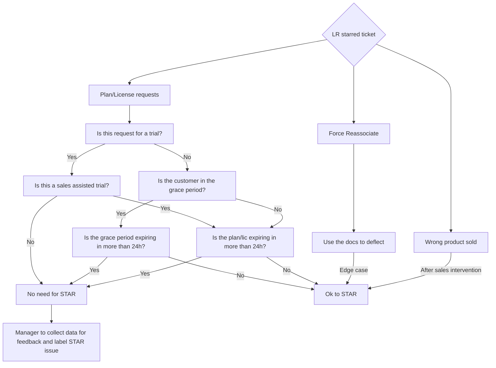

## How to move urgent L&R starred tickets forward

### Self-Managed

**NOTE:** Under no circumstances are Support Managers allowed to create brand-new licenses as a response to a [starred ticket](/handbook/support/internal-support/support-ticket-attention-requests). Any non-trial license must be handled by the L&R team.

1. Is the request for a license extension, grace period extension, temporary license, temporary key, or trial license? These all have the same next-step:
    - This needs a [trial license generation](/handbook/support/license-and-renewals/workflows/self-managed/trials).
1. Is the license or activation code not working, or is an error encountered when uploading the license? Is the issue about delays in renewals or payment processing?
    - **Always try to get the L&R team to assist first.**
    - If the team is not available, check if the *non-trial* license is *within* the grace period, or if the *trial* license is *close to* the expiry date. If there is 24h+ remaining, there is no need to escalate the ticket.
    - Always use your judgement to mitigate or prevent emergencies.
    - If it is an emergency, unblock the customer by following these steps:
      1. To investigate the problem, the L&R team needs a screenshot of `Admin -> Dashboard` from the group; check the ticket to see if it has already been provided, or request the customer to provide it. This must be done before creating a trial license.
      1. After you get the screenshot, you can [create a trial license](/handbook/support/license-and-renewals/workflows/self-managed/trials).
      1. If the customer is getting errors when activating a license, request that the customer submit a ticket if the haven't done so already.
1. Does the starred ticket state the customer did not receive their license? Was it sent to someone who is no longer at the company? Do they need to change the contact details of their license? Is the request to send or forward a license to a different contact/email?
    - See [Sending licenses to a different email address](/handbook/support/license-and-renewals/workflows/self-managed/sending_license_to_different_email) for more information.
    - **WARNING:** We do not send licenses to different emails, with the exception of trial licenses.

### SaaS

1. Is the request for a trial extension, or grace period extension?
    - Use the [`Manage GitLab Plan and Trials`](/handbook/support/license-and-renewals/workflows/customersdot/mechanizer#update-gitlab-subscription-or-customer-trial) option in the Zendesk Mechanizer App.
    - This option [extends an active or expired trial](/handbook/support/license-and-renewals/workflows/saas/trials_and_plan_change#extending-trials) in the namespace. But it cannot start a new trial.
    - The mechanizer will fail if the namespace has never had a trial. However, you can use a [subscription to create a trial](/handbook/support/license-and-renewals/workflows/saas/trials_and_plan_change#extending-trials) and extend it as needed.
1. Is the customer's (paid) group unexpectedly on a Free plan?
    - **Always try to get the L&R team to assist first.**
    - NOTE: In some cases, the customer can first try to [associate their (new) subscription with their namespace](/handbook/support/license-and-renewals/workflows/saas/associate_subscription_and_namespace#customer-self-serve-associating-the-subscription-and-namespace).
    - If it is an emergency, use the [`Manage GitLab Plan and Trials`](/handbook/support/license-and-renewals/workflows/customersdot/mechanizer#update-gitlab-subscription-or-customer-trial) option in the Zendesk Mechanizer App.
    to temporarily set the namespace on another trial at the desired plan level.
    - NOTE: The Mechanizer will fail if the namespace has never had a trial. However, you can use a [subscription to create a trial](/handbook/support/license-and-renewals/workflows/saas/trials_and_plan_change#extending-trials) and extend it as needed.

## How to decide the validity of a starred L&R ticket

Subscription- and license-related tickets starred during your [manager on-call shift](/handbook/support/workflows/support_manager-on-call) can be evaluated using the following flow chart diagram.

For general STAR handling, see our [Support Ticket Attention Requests handbook page](/handbook/support/internal-support/support-ticket-attention-requests).

## Edge cases

An edge case is any situation in which the process has been followed and the system does not produce the expected results. Examples:

- A customer is trying to [link their purchase to their account](https://docs.gitlab.com/subscriptions/), but after following the process, the system produces an error.
- The web page or system needed to complete the process is down.
- The owner is not available.
