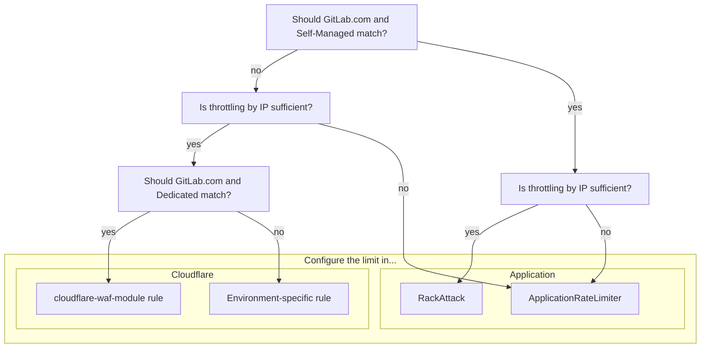

## Overview

GitLab environments require a multi-layered approach to rate limiting to effectively protect services and resources.
Each layer provides distinct advantages and serves as a complementary control in a comprehensive defense in depth strategy to protect our platform.

Follow this guide when introducing or managing limits.

## Where to configure the limit

Use the following diagram to determine where the limit should be configured,
then follow the corresponding guidance for the appropriate configuration method.



{}
This document is currently focused on inbound limits on HTTP traffic,
and may be expanded in the future to account for internal limits between services.
{}

## Considerations

Rate limits should be enabled by default. If this is not the case, then this process should be followed for the following cases:

- Introducing new rate limits
- Lowering existing rate limits
- Re-enabling disabled rate limits
- Increasing rate limits

## Process

{}
In cases of incident remediation, see [Rate Limiting Runbooks](https://gitlab.com/gitlab-com/runbooks/-/tree/master/docs/rate-limiting).
{}

1. Determine if a rate limit already exists 
   - Is there an Application limit for this already? What about Cloudflare? 
   - Is it possible an existing limit could be adjusted (higher or lower)?
   - See [Rate Limiting: Limits](/handbook/engineering/infrastructure/rate-limiting/#limits) for where these limits are configured.
1. Compare proposed limit with existing limits
   - Will customers be negatively impacted by introducing this limit?
   - Are there risks to our platform if we don't introduce these limits?
1. Where possible, enable in [`log`](https://developers.cloudflare.com/firewall/cf-firewall-rules/actions/) or [`track`](https://docs.gitlab.com/administration/settings/user_and_ip_rate_limits/#try-out-throttling-settings-before-enforcing-them) mode first
   - It should be left in this mode for at least one week to understand weekly traffic patterns.
   - This will allow you to gauge potential impact.
   - Use observability tooling (Cloudflare dashboard, logs, metrics) to analyze impact.
1. Produce evidence for the proposed limit
   - Why have you selected the value you have?
   - Using the findings from the previous step to support your proposal.
   - Are there any knock on effects to customers or backend systems we need to consider?
1. Determine a rollout plan
   - Will you use brownouts (temporarily introduce for short periods of time)?
   - If an Application Limit: will you use feature flags?
1. Inform relevant stakeholders of the change
   - Consider informing [#customer_success](https://gitlab.enterprise.slack.com/archives/C5D346V08), [#support_gitlab-com](https://gitlab.enterprise.slack.com/archives/C4XFU81LG), and [#security](https://gitlab.enterprise.slack.com/archives/C248YCNCW).
   - Make sure they have access to documentation, and relevant information to help customers who contact them regarding the limit.
1. Communicate with customers
   - Announce the rate limits on the GitLab blog, see example for [Projects, Groups, and Users APIs](https://about.gitlab.com/blog/2024/05/14/rate-limitations-announced-for-projects-groups-and-users-apis/).
   - If an Application Limit: Document this change in the next release post.
   - Raise a contact request by following the [Support: Contacting Customers](/handbook/support/internal-support/#contacting-users-about-gitlab-incidents-or-changes) workflow.
     - Notify of the change, and time frames where possible.
     - Provide guidance on any available remedies, workarounds, or best practices to help mitigate the impact.
1. Document the limits on docs.gitlab.com
   - Make sure the limit is documented, and if it's configurable, what the default is.
   - Note: This may not always be possible for Cloudflare limits.
1. Follow the [Change Management](/handbook/engineering/infrastructure/change-management/) process
   - Any change to rate limits is considered a `Criticality 2` change, as they have the potential to disrupt traffic flow.
   - This requires approval from `@gitlab-org/saas-platforms/inframanagers`

## Cloudflare

Enforcing limits at the edge network before traffic reaches the underlying GitLab infrastructure enables us to block malicious traffic before it consumes backend resources, protecting us against large-scale volumetric attacks. This is however limited in the configuration options we can use to limit on - primarily IP address, though there are a few other options.

1. Cloudflare rate limits are managed with Terraform, for GitLab.com through the [`cloudflare-waf-rules` module](https://gitlab.com/gitlab-com/gl-infra/terraform-modules/cloudflare/cloudflare-waf-rules). Rules added to this module will affect all other services using this module (currently GitLab Dedicated).
2. When creating a new rule, it is advised to instantiate it with `action = "log"` to analyze impact.
3. After ensuring the rate limit performs as expected, the rule can be set to `action = "block"` in Terraform.

### GitLab Dedicated

Rate limits needed for only GitLab Dedicated Tenants (not GitLab.com) will need to be added to Terraform in [Instrumentor](https://gitlab.com/gitlab-com/gl-infra/terraform-modules/cloudflare/cloudflare-waf-rules). For further assistance please open an issue in the [Dedicated Tracker](https://gitlab.com/gitlab-com/gl-infra/gitlab-dedicated/team/-/issues) or [#g_dedicated_team](https://gitlab.enterprise.slack.com/archives/C025LECQY0M) on Slack (internal link).

## Application

Enforcing limits in the application level within GitLab itself enable us to be more opinionated, as they are more context aware (understanding GitLab-specific resources) that provide us more granular control over specific features, and supports the ability to apply business logic and user/project-based dimensions to limiting decisions. New Application Rate Limits are configured in the GitLab application code, and should be introduced following the guide in [Product Processes](/handbook/product/product-processes/#introducing-application-limits).

For information about rate limits that are currently configured within a GitLab instance, see the [Rate Limits](https://docs.gitlab.com/security/rate_limits/) docs. For information about rate limits specifically configured to the GitLab.com instance, see [Rate Limits on GitLab.com](https://docs.gitlab.com/user/gitlab_com/#rate-limits-on-gitlabcom).

### Rate limits in RackAttack

GitLab utilises RackAttack as middleware to throttle Rack requests. Most application-level rate limiting is managed with RackAttack. For instructions for configuring already existing rate limits, see the [User and IP Rate Limits](https://docs.gitlab.com/administration/settings/user_and_ip_rate_limits/) docs.

New rate limits can be configured by extending `Gitlab::RackAttack` and `Gitlab::RackAttack::Request`. Instructions for this can be found in the [GitLab Development Docs](https://docs.gitlab.com/development/application_limits/#implement-rate-limits-using-rackattack).

{}
For new limits on GitLab.com, it is recommended to enable these in ["Dry Run" (log) mode first](https://docs.gitlab.com/administration/settings/user_and_ip_rate_limits/#try-out-throttling-settings-before-enforcing-them). Instructions for this can be found in [Runbooks](https://gitlab.com/gitlab-com/runbooks/-/tree/master/docs/rate-limiting#application-rackattack).
{}

You can read more information about rate limits specific to GitLab.com, alongside RackAttack configuration documentation in runbooks.

### Rate limits in ApplicationRateLimiter

The GitLab application has simple rate limit logic that can be used to throttle certain actions which is used when we need more flexibility than what Rack Attack can provide, since it can throttle at the controller or API level. These rate limits are configured in [`application_rate_limiter.rb`](https://gitlab.com/gitlab-org/gitlab/-/blob/master/lib/gitlab/application_rate_limiter.rb). The scope is up to the individual limit implementation and can be any ActiveRecord object or combination of multiple. It is commonly per-user or per-project (or both), but it can be anything, for example the RawController limits by project and path. Currently there is no way to bypass limits created in the ApplicationRateLimiter.

New rate limits may be created in the ApplicationRateLimiter by following the guide in [GitLab docs](/handbook/product/product-processes/#introducing-application-limits).

## Identifying Potentially Impacted Customers

There are several dimensions you can use when identifying impacted customers.

<table>
<tr>
<th>

**Cloudflare**
</th>
<td>

- IP
- Project ID (from URL)

</td>
</tr>
<tr>
<th>

**RackAttack**
</th>
<td>

- Username
- IP

</td>
</tr>
<tr>
<th>

**ApplicationRateLimiter**
</th>
<td>

- Username
- IP
- Project

</td>
</tr>
</table>

Monitoring and metrics around rate limits on GitLab.com are most easily accessed on the [Rate Limiting Dashboard](https://dashboards.gitlab.net/d/rate-limiting-rate-limiting_overview/rate-limiting3a-rate-limiting3a-overview?orgId=1&from=now-6h&to=now&timezone=browser) (internal link).

### Using the Project ID to identify a customer namespace

If you have access to the project ID for requests identified as potentially hitting rate limits,
there are two methods to attribute these to a namespace:

1. Using the API with an admin token

   ```shell
   curl gitlab.com/api/v4/projects/:id
   ```

1. Using a production Rails console

   ```ruby
   [ gprd ] production> p = Project.find(PROJECT_ID)
   => #<Project id:REDACTED redacted/redacted>>
   [ gprd ] production> p.full_path
   => "redacted/redacted"
   ```

## Requesting Further Assistance

If you require further assistance, please open a [Production Engineering::Foundations](https://gitlab.com/gitlab-com/gl-infra/production-engineering/-/issues/new?issuable_template=request-foundations) request issue.
