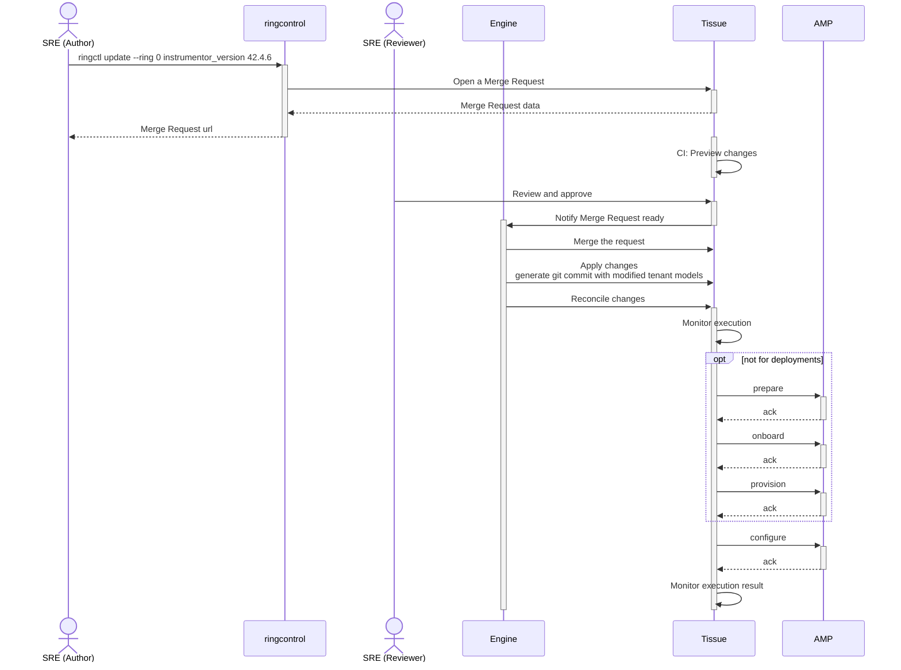



We must ensure the correct sequencing of "changes" in our Cells environments: deployments, configuration changes, and regular merge requests should all be sequenced correctly and applied sequentially. A priority system should exist to accelerate critical changes. Later on, this system should also be able to propagate changes between rings. Merge requests and pipelines alone cannot enforce those properties; they could be building blocks of our solution, but there is a need for a coordinator engine.

## Introduction

### Key Terms

- [Deployment](deployments.md) - The process of installing the GitLab application and its components into our infrastructure.
- Configuration changes - Changing a field of the tenant model. When the field is `prerelease_version` we call it a deployment.
- Changes - A deployment, a configuration change, and a merge request targeting the tissue project.

### Problem

Our deployment engine originated as a fork of the Dedicated switchboard_uat, and it's based on GitLab CI pipelines. The original design of switchboard_uat allows engineers to edit tenant models in merge requests and let the CI engine identify the affected tenant of each merge request to trigger a deployment when merged. The rate of changes is very low, and each merge request affects a single tenant.

In the described situation, the pipeline ordering with the `resource_group` feature is more than adequate to avoid deployment collisions.

In the Cells project, we estimate 6-10 deployments a day, plus configuration changes and other merge requests for the project. While release-tools coordinate deployments without overlapping, the same isn't true for the other two types of changes.

Without tools to automate this task, consider 10 Cells (target for Cells 1.0) and a total of 10 daily changes of any type. We are looking at 100 individual file changes per day. Even if bundled changes in a single merge request per ring, for a total of 10 merge requests, those 100 file changes will still generate merge conflict that should be resolved manually.

Given the nature of the infrastructure stack of the project, bundling a configuration change with a deployment may have dire consequences on that cell.

Moreover, each change applies to an entire ring, and working with regular merge requests may result in new cells getting out of sync as they were not known when the merge request was created.

Finally, as soon as we introduce another ring (phase set C: phase 10), we will need a way to apply the same change without creating a new merge request that will affect the tenant models in another ring. Having a single merge request tracking a change from Ring 0 outward greatly reduces the amount of toil and improves our ability to track the progress of each change.

### Goals

This blueprint aims to define high-level operation principles for the Cells project infrastructure, focusing on the properties of the desired solution and the UX for the engineers operating it.

Defining implementation details is out of the scope of this document, as well as optimizing the four Instrumentor stages (prepare, onboard, provision, configure).

## Proposal

The proposed solution for this problem is based on two key concepts:

1. Humans cannot merge changes in `tissue`. They need mandatory approval from a bot that is responsible for merging the changes.
2. `ringctl` generated merge requests will not include the changes to the tenant model but a representation of the requested command line parameters so that the automation could apply the exact change at the right time, targeting all the existing tenants, and later adapt that same request for the other rings.

In certain aspects, this is similar to the [`atlantis`](https://www.runatlantis.io/) tool that is already familiar to our SREs.

The following sequence diagram depicts a simple change request to upgrade the instrumentor version.

### Authoring changes

1. This workflow begins with an SRE invoking `ringctl` asking to upgrade a value of all the tenant models in ring 0.
1. The tool generated a merge request on `tissue` with a representation of the desired change.
1. The CI for the merge request generates a preview of the desired changes based on the current state of the main branch. The modified tenant models should be validated using the existing `tenctl` feature.
1. The merge request should be assigned for review by another SRE.
1. When the merge request is approved, the engine will put it in its queue.
1. When it's time to process the changes, the tool will merge the request.
1. It will apply the described changes to the current tenant models.
1. It will trigger a reconcile pipeline running the AMP cluster's necessary stages.

While the above diagram focuses on a tenant model change, the same process could be applied for regular merge requests where we want to change other files in the repository, like the pipeline Yaml files.

### Dealing with incidents

A fully automated infrastructure is paramount for the Cells project. However, when a single cell misbehaves, we must investigate and mitigate its impact on our customers. We need a way to remove the cell from the regular automation cycle.

Introducing the concept of a quarantine ring, we can temporarily move a tenant file to that ring to prevent any automation from applying changes to this faulty cell. Using break glass operations and targeted tissue pipeline, it will be possible to drive the incident resolution process until the cell is ready to be reintroduced to its original ring.

## Additional material

- We explored the idea of a [kubernete operator](https://gitlab.com/nolith/ringctl-operator), a [private recorded demo](https://www.youtube.com/watch?v=55glecMYD7k&t=1m) is available. As part of this effort, we realized that we want to focus on human interaction first. The ergonomics of operating the system are more important than the implementation details of the engine itself.
- Why we are doing this now: [Start Release Engineering at the Beginning](https://sre.google/sre-book/release-engineering/#start-release-engineering-at-the-beginning-8ksKtxCm) Google SRE Book.
- Properties of a [safe configuration change application](https://sre.google/workbook/configuration-design/#safe-configuration-change-application), Configuration Design and Best Practices by Google.
- [Impact on the current work](https://gitlab.com/gitlab-com/gl-infra/production-engineering/-/issues/25601#note_1996861638) due to the lack of a sequencing engine to apply changes.
