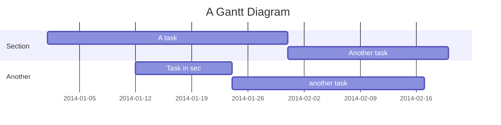
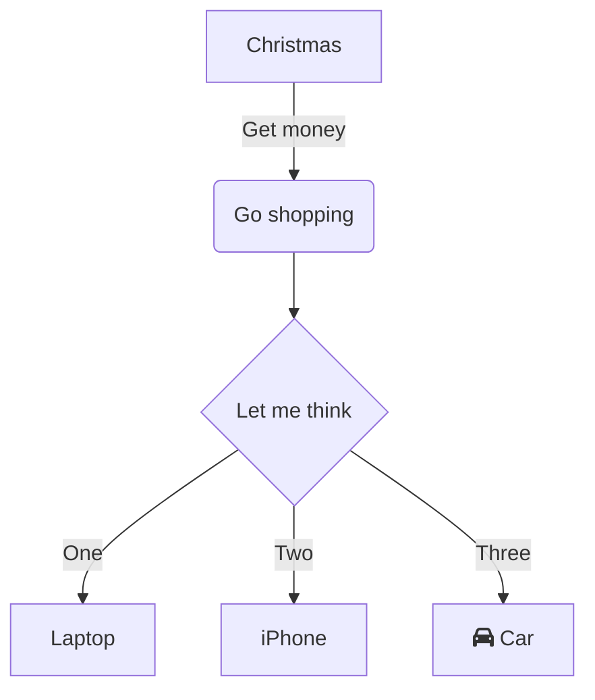
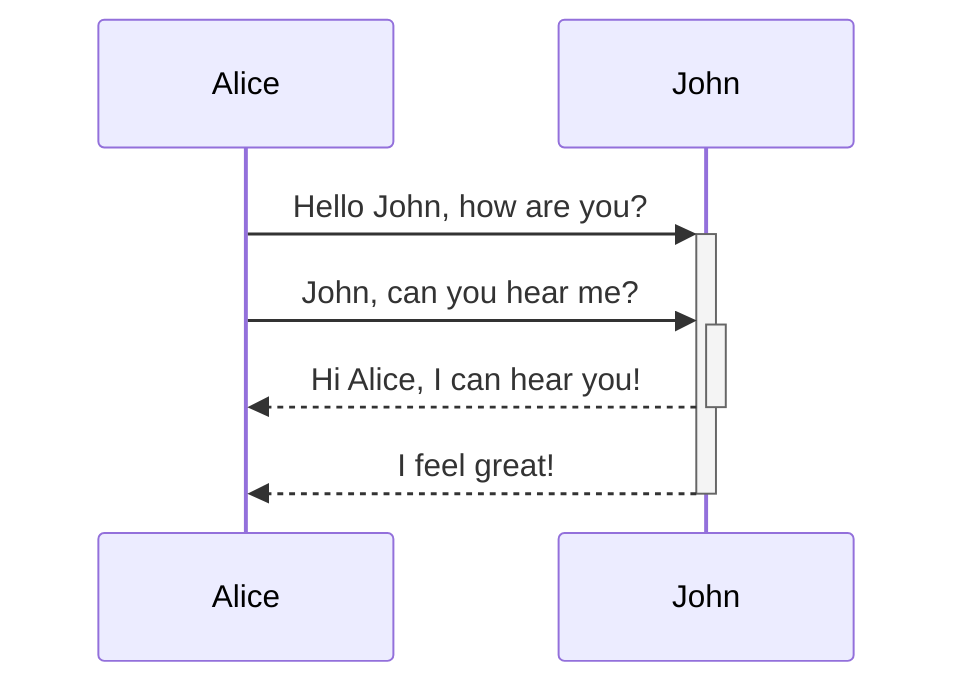

## Mermaid diagrams

For the main Mermaid documentation please refer to the [Tools and Tips page](/handbook/tools-and-tips/#using-mermaid).

This page is intended to help out with some advanced layout options for Mermaid diagrams such as creating diagrams that are wider than the handbook main content area.

### Gantt

<details>
<summary markdown="span">Code</summary>

```md
gantt
    title A Gantt Diagram
    dateFormat  YYYY-MM-DD
    section Section
    A task           :a1, 2014-01-01, 30d
    Another task     :after a1  , 20d
    section Another
    Task in sec      :2014-01-12  , 12d
    another task      : 24d
```

</details>



### Flowchart (centered)

<details>
<summary markdown="span">Code</summary>

```md
graph TD
    A[Christmas] -->|Get money| B(Go shopping)
    B --> C{Let me think}
    C -->|One| D[Laptop]
    C -->|Two| E[iPhone]
    C -->|Three| F[fa:fa-car Car]
```

</details>



### Sequence Diagram (right aligned)

<details>
<summary markdown="span">Code</summary>

```md
sequenceDiagram
    Alice->>+John: Hello John, how are you?
    Alice->>+John: John, can you hear me?
    John-->>-Alice: Hi Alice, I can hear you!
    John-->>-Alice: I feel great!
```

</details>



### Gantt (wide scrollable)

<details>
<summary markdown="span">Code</summary>

```md
gantt
    title A Gantt Diagram
    dateFormat  YYYY-MM-DD
    section Section
    A task           :a1, 2014-01-01, 30d
    Another task     :after a1  , 20d
    section Another
    Task in sec      :2014-01-12  , 12d
    another task      : 24d
```

</details>


